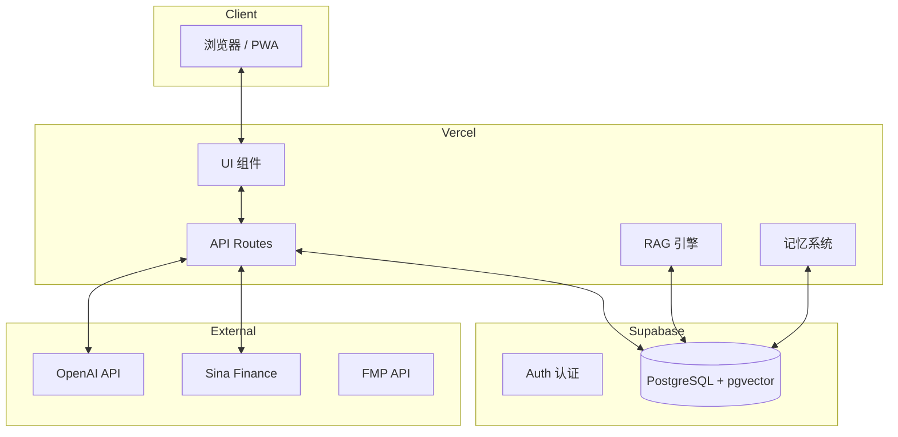

# 伴投 Budvest V1.0 产品架构图 (Cloud-Native)

> 投教为主 + 心理陪伴 - 面向小白/女性用户的智能投资助手 (PWA)

---

## 技术栈概览

| 类型 | 技术 | 说明 |
|------|------|------|
| **前端** | Next.js 15 (App Router) | React 框架, PWA 支持 |
| **语言** | TypeScript | 类型安全 |
| **样式** | TailwindCSS | 实用优先 CSS |
| **数据库** | Supabase (PostgreSQL + pgvector) | 云托管，内置 Auth |
| **缓存** | Upstash Redis (可选) | AI 响应缓存 |
| **数据源** | Sina Finance (A股), FMP (美股) | 按需调用 |
| **AI** | OpenAI GPT-4o-mini | RAG + 长期记忆 |
| **部署** | Vercel | 自动 CI/CD |

---

## 系统架构



---

## 目录结构 (V1.0)

```
budvest/
├── app/
│   ├── api/
│   │   ├── chat/           # AI 对话 API
│   │   ├── market/
│   │   │   └── a-stock/   # A 股数据 (替代 Python)
│   │   └── portfolio/     # 投资组合
│   ├── dashboard/
│   ├── chat/
│   └── ...
├── components/
├── lib/
│   ├── supabase.ts        # Supabase 客户端 ✨新
│   ├── rag.ts             # RAG (Supabase 版) ✨更新
│   ├── memory.ts          # 记忆 (Supabase 版) ✨更新
│   └── ...
├── supabase/
│   ├── migrations/        # 数据库迁移
│   └── schema.sql         # 完整 Schema ✨新
└── public/
```

---

## 核心模块

### 1. 数据层 (Supabase)

- **PostgreSQL**: 用户数据、持仓、对话历史
- **pgvector**: RAG 向量检索，性能提升 5 倍
- **Auth**: 内置用户认证 (可选启用)

### 2. 市场数据

- **A 股**: `app/api/market/a-stock/[symbol]` (Edge Function)
- **美股**: FMP API (现有逻辑)
- **缓存**: 5 分钟自动缓存

### 3. AI 系统

- **RAG**: 50+ 条投教知识 + 大师语录
- **记忆**: 用户画像 + 情绪模式 + 学习进度
- **成本优化**: 缓存 + Token 限制

---

## 快速开始

### 1. 配置 Supabase

```bash
# 登录并链接项目
supabase login
supabase link --project-ref <your-project-ref>

# 在 Supabase SQL Editor 运行 schema.sql
```

### 2. 配置环境变量

复制 `.env.local.example` 到 `.env.local`:

```bash
NEXT_PUBLIC_SUPABASE_URL=...
NEXT_PUBLIC_SUPABASE_ANON_KEY=...
OPENAI_API_KEY=...
```

### 3. 启动开发

```bash
npm install
npm run dev
```

---

## 部署

```bash
# 部署到 Vercel
vercel --prod
```

**月成本估算**: $20-50 (主要是 OpenAI)

---

*更新时间: 2026年1月*
