# BudVest (伴投) 产品需求文档
## PRD v2.0 - 完整整合版

**文档状态**: MVP定稿 - 研发可执行版  
**最后更新**: 2026年1月18日  
**版本历史**: v1.2 + 用户流程详解 v1.0 → v2.0（完整整合版）  
**目标上线**: 微信小程序  
**开发周期**: 4-5周  
**维护者**: 产品团队

---

## 快速导航

**Part 1: 产品定义**
- [1. 核心目标](#1-核心目标)
- [2. 用户画像](#2-用户画像)
- [3. MVP功能清单](#3-mvp功能清单)

**Part 2: 用户流程设计**
- [4. 全流程概览](#4-全流程概览)
- [5. 登录注册流程](#5-登录注册流程)
- [6. 用户输入流程](#6-用户输入流程)
- [7. AI对话流程](#7-ai对话流程)
- [8. 复盘记录流程](#8-复盘记录流程)
- [9. 游客转化流程](#9-游客转化流程)

**Part 3: 页面与交互设计**
- [10. 页面详细设计](#10-页面详细设计)
- [11. 交互规范](#11-交互规范)
- [12. 状态机定义](#12-状态机定义)

**Part 4: 技术实现**
- [13. API接口契约](#13-api接口契约)
- [14. 数据库设计](#14-数据库设计)
- [15. Agent设计](#15-agent设计)
- [16. 异常处理规范](#16-异常处理规范)
- [17. 离线支持方案](#17-离线支持方案)
- [18. 数据安全与隐私](#18-数据安全与隐私)

**Part 5: 运营与交付**
- [19. 埋点设计](#19-埋点设计)
- [20. 技术架构](#20-技术架构)
- [21. 开发里程碑](#21-开发里程碑)
- [22. 验收标准](#22-验收标准)
- [23. 应急回滚方案](#23-应急回滚方案)

---

# Part 1: 产品定义

---

## 1. 核心目标

### 1.1 一句话愿景

> **一个在市场波动时，帮助投资者识别情绪、复盘行为、避免冲动决策的 AI 心理陪伴产品。**

### 1.2 产品Slogan

🌿 **让每一次心理波动都被温柔接住**

### 1.3 产品边界（不可动摇原则）

| 我们做 ✅ | 我们不做 ❌ |
|---------|---------|
| 情绪识别与命名 | 荐股/买卖建议 |
| 心理风险提示 | 预测涨跌 |
| 行为复盘引导 | 替用户做决策 |
| 情绪教练陪伴 | 模拟交易 |
| 决策延迟缓冲 | 收益承诺 |
| 熔断冷静机制 | 自动交易 |

### 1.4 核心设计理念

```
我们不是在帮用户赚更多钱，
而是在帮用户少做一次让自己后悔的决定。
```

---

## 2. 用户画像

### 2.1 核心用户（MVP种子用户）

| 特征 | 描述 |
|------|------|
| **投资经验** | 0-3年新手投资者 |
| **典型行为** | 追涨杀跌、拿不住票、卖完就涨买完就跌后强烈后悔 |
| **核心痛点** | 不缺信息，缺情绪稳定 + 自我认知 |
| **心理特征** | 控制不住自己，而非看不懂市场 |

### 2.2 非目标用户（明确排除）

- 高频/职业交易员
- 只想要"直接告诉我买什么"的用户
- 对心理/复盘无兴趣的纯投机用户

### 2.3 用户情绪模式（核心追踪）

我们需要追踪的四个核心情绪及其表现：

| 情绪 | Emoji | 表现 | 风险行为 | AI策略 |
|------|-------|------|--------|--------|
| 贪婪 | 🤑 | 兴奋、看好、怕踏空 | 追涨、重仓、过度交易 | 降温、提示回调风险 |
| 恐惧 | 😨 | 焦虑、不安、我慌了 | 恐慌卖出、止损过早 | 安抚、放长视角 |
| 平静 | 🙂 | 理性、冷静、想复盘 | （最优状态）自信过度 | 保护、小心警惕性不足 |
| 焦虑 | 😣 | 纠结、反复、气死了 | 频繁查看、改变计划 | 引导、建立决策框架 |

---

## 3. MVP功能清单

### 3.1 功能优先级矩阵

| ID | 功能模块 | 优先级 | 功能点 | MVP范围 |
|----|---------|--------|--------|---------|
| 1.0 | 用户系统 | **P0** | 微信静默登录 + 游客模式 | openid登录，游客UUID |
| 1.1 | Onboarding | **P0** | 初心设定 + 心理锚点 | 投资目标选择 + 添加关注资产 |
| 2.1 | 资金展示 | **P0** | 资产数字展示 | 纯数字，存钱罐动效P1 |
| 2.2 | 情绪记录 | **P0** | 每日心情打卡 | Emoji单选，当天可改次日锁定 |
| 2.3 | 情绪筹码 | **P0** | 快捷情绪入口 | 4个情绪筹码触发对话 |
| 2.4 | 交互入口 | **P0** | 快速陪伴对话 | 文字输入，语音P1 |
| 3.0 | 持仓管理 | **P0** | 手动维护持仓 | 手动输入代码+数量+成本 |
| 3.1 | 实时价格 | **P0** | 价格刷新 | API获取实时价格 |
| 4.0 | 对话策略 | **P0** | 策略追问与锁定 | 信仰模式/纪律模式 |
| 4.1 | 熔断机制 | **P0** | 情绪熔断保护 | 连续负面5轮触发冷静 |
| 5.0 | 复盘功能 | **P0** | 对话后复盘 | 三步复盘表单 + 情绪绑定 |
| 5.1 | 徽章系统 | P1 | 成就激励 | 意志力/冷静/坚持徽章 |
| 2.5 | 市场数据 | P1 | 恐慌贪婪指数 | 后续版本 |
| 2.6 | 每日总结 | P1 | 智能复盘生成 | 后续版本 |

### 3.2 MVP功能边界确认

| 功能 | MVP做 | MVP不做 |
|------|--------|---------|
| 登录 | 微信openid静默登录 + 游客UUID | 昵称头像授权、手机号登录 |
| Onboarding | 初心设定 + 心理锚点(最多3个) | 完整问卷、详细风险测评 |
| 打卡 | Emoji单选，当天可改，次日锁定 | 多选、情绪强度滑块 |
| 对话 | 文字输入、3个Agent、上下文传递、策略锁定 | 语音输入、自定义Agent |
| 熔断 | 30秒冷静期 + 深呼吸动画 | 更长冷静期、专业心理干预 |
| 持仓 | 手动输入代码+数量+成本 | 股票搜索、券商导入、自动同步 |
| 价格 | API刷新实时价格、缓存显示 | 历史K线、技术指标、预警 |
| 复盘 | 三步表单 + AI生成总结 | AI自动生成日记、每周周报 |
| 历史 | 保留15天对话，永久复盘 | 永久保存对话、导出PDF |
| 网络 | 离线队列存储 | 完整的P2P同步 |

---

# Part 2: 用户流程设计

---

## 4. 全流程概览

### 4.1 用户旅程地图

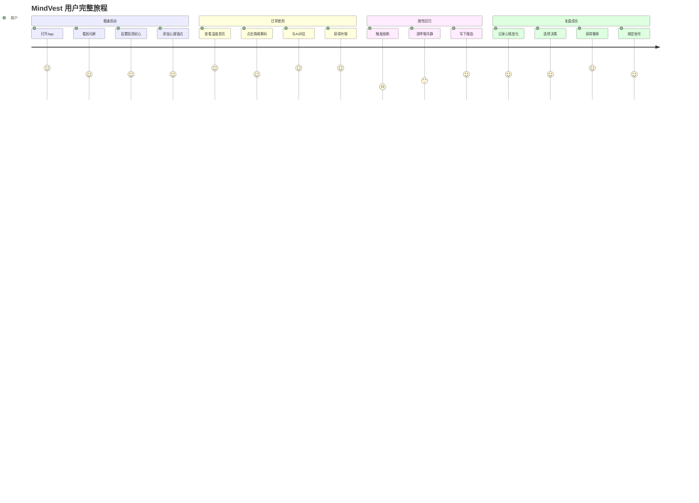
```mermaid
journey
    title MindVest 用户完整旅程
    section 极速启动
      打开App: 5: 用户
      看到闪屏: 4: 用户
      设置投资初心: 4: 用户
      添加心理锚点: 4: 用户
    section 日常使用
      查看温度首页: 5: 用户
      点击情绪筹码: 4: 用户
      与AI对话: 5: 用户
      获得共情: 5: 用户
    section 理性回归
      触发熔断: 2: 用户
      深呼吸冷静: 3: 用户
      写下理由: 4: 用户
    section 复盘成长
      记录心情变化: 4: 用户
      选择决策: 4: 用户
      获得徽章: 5: 用户
      绑定账号: 4: 用户
```

### 4.2 四阶段状态流转

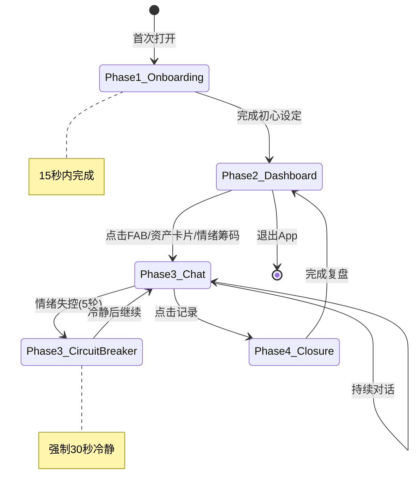
```mermaid
stateDiagram-v2
    [*] --> Phase1_Onboarding: 首次打开
    Phase1_Onboarding --> Phase2_Dashboard: 完成初心设定
    Phase2_Dashboard --> Phase3_Chat: 点击FAB/资产卡片/情绪筹码
    Phase3_Chat --> Phase3_Chat: 持续对话
    Phase3_Chat --> Phase3_CircuitBreaker: 情绪失控(5轮)
    Phase3_CircuitBreaker --> Phase3_Chat: 冷静后继续
    Phase3_Chat --> Phase4_Closure: 点击记录
    Phase4_Closure --> Phase2_Dashboard: 完成复盘
    Phase2_Dashboard --> [*]: 退出App

    note right of Phase1_Onboarding: 15秒内完成
    note right of Phase3_CircuitBreaker: 强制30秒冷静
```

### 4.3 整体流程图

```
[首次打开App]
    ↓
[检查localStorage] ← 有device_id直接进入首页
    ↓ (无device_id)
[展示情感闪屏] → [2-3秒自动跳转]
    ↓
[初心设定页] → 选择投资目标
    ↓
[心理锚点页] → 添加关注资产(0-3个)
    ↓
[首页] ← 核心枢纽
    ├─→ [打卡情绪] → [展示心理洞察] → [触发对话引导]
    ├─→ [点击情绪筹码] → [镜像共情] → [策略追问] → [策略锁定对话]
    ├─→ [进入对话] → [选择Agent] → [多轮聊天] → [AI回复]
    │                                             ↓
    │                                      [情绪监测]
    │                                         ↓
    │                              [连续5轮负面?] ─是→ [触发熔断]
    │                                  ↓否                ↓
    │                              [对话结束?]      [30秒冷静期]
    │                                  ↓是               ↓
    │                              [复盘引导弹窗] ←───────┘
    │                                  ↓
    ├─→ [查看资产] → [添加/编辑/删除持仓] → [刷新行情]
    │
    └─→ [我的] → [风险测试] → [复盘历史] → [绑定手机] → [设置]
```

---

## 5. 登录注册流程

### 5.1 游客模式启动流程

**设计原则**: 零门槛体验，15秒内从陌生人变为契约伙伴

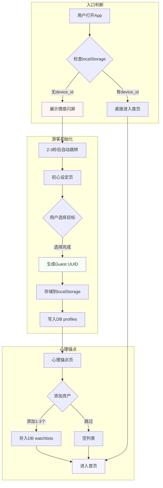
```mermaid
flowchart TD
    subgraph 入口判断
        A[用户打开App] --> B{检查localStorage}
        B -->|有device_id| C[直接进入首页]
        B -->|无device_id| D[展示情感闪屏]
    end

    subgraph 游客初始化
        D --> E[2-3秒后自动跳转]
        E --> F[初心设定页]
        F --> G{用户选择目标}
        G -->|选择完成| H[生成Guest UUID]
        H --> I[存储到localStorage]
        I --> J[写入DB profiles]
    end

    subgraph 心理锚点
        J --> K[心理锚点页]
        K --> L{添加资产}
        L -->|添加1-3个| M[存入DB watchlists]
        L -->|跳过| N[空列表]
        M --> O[进入首页]
        N --> O
    end

    C --> O

    style D fill:#fff5f5
    style H fill:#f5fff5
    style O fill:#f5f5ff
```

### 5.2 微信静默登录流程

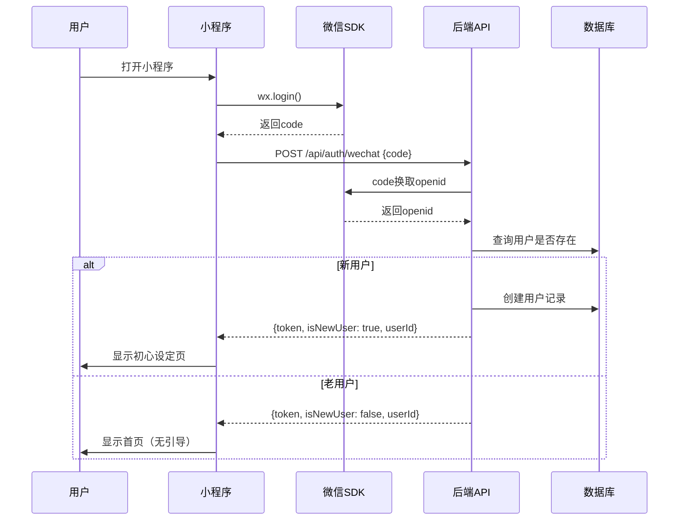
```mermaid
sequenceDiagram
    participant U as 用户
    participant MP as 小程序
    participant WX as 微信SDK
    participant API as 后端API
    participant DB as 数据库

    U->>MP: 打开小程序
    MP->>WX: wx.login()
    WX-->>MP: 返回code
    MP->>API: POST /api/auth/wechat {code}
    API->>WX: code换取openid
    WX-->>API: 返回openid
    API->>DB: 查询用户是否存在
    
    alt 新用户
        API->>DB: 创建用户记录
        API-->>MP: {token, isNewUser: true, userId}
        MP->>U: 显示初心设定页
    else 老用户
        API-->>MP: {token, isNewUser: false, userId}
        MP->>U: 显示首页（无引导）
    end
```

### 5.3 新手引导蒙层

```
┌────────────────────────────────────────┐
│           新手引导蒙层                  │
│                                        │
│   ┌────────────────────────────────┐   │
│   │  👋 欢迎来到 BudVest           │   │
│   │                                │   │
│   │  这里不会告诉你买什么卖什么，    │   │
│   │  但会在你冲动的时候              │   │
│   │  帮你踩一脚刹车。               │   │
│   │                                │   │
│   │  ┌─ ─ ─ ─ ─ ─ ─ ─ ─ ─ ─ ─┐   │   │
│   │  ┆  1️⃣ 每日记录你的情绪    ┆   │   │
│   │  ┆  2️⃣ 和AI教练聊聊心情    ┆   │   │
│   │  ┆  3️⃣ 复盘避免重蹈覆辙    ┆   │   │
│   │  └─ ─ ─ ─ ─ ─ ─ ─ ─ ─ ─ ─┘   │   │
│   │                                │   │
│   │         [开始使用]              │   │
│   └────────────────────────────────┘   │
│                                        │
│         点击任意位置关闭               │
└────────────────────────────────────────┘
```

### 5.4 登录步骤详解表

| 步骤ID | 界面 | 用户操作 | 系统逻辑 | 数据变更 |
|--------|------|---------|---------|---------|
| A-01 | 闪屏 | 无 (观看) | 检查 `localStorage.device_id` | 无 |
| A-02 | 闪屏 | 无 (等待) | 计时 2-3 秒 | 无 |
| A-03 | 初心设定 | 多选目标 | 验证至少选 1 项 | 暂存内存 |
| A-04 | 初心设定 | 点击"下一步" | 生成 UUID，调用 API | `profiles.insert()` |
| A-05 | 心理锚点 | 输入代码 | 搜索建议，验证代码 | 暂存内存 |
| A-06 | 心理锚点 | 点击"完成" | 批量写入 | `watchlists.insert()` |

### 5.5 边界条件处理

| 场景 | 处理方式 |
|------|---------|
| 网络断开时完成初心设定 | 本地暂存，恢复后同步 |
| 输入无效股票代码 | 提示"未找到该资产" |
| 添加超过3个资产 | 禁用添加按钮，提示"最多3个" |
| 中途退出App | 下次打开从闪屏重新开始 |
| 清除浏览器数据 | 视为新用户，重新初始化 |
| Token过期 | 自动重新静默登录 |

---

## 6. 用户输入流程

### 6.1 投资初心输入流程

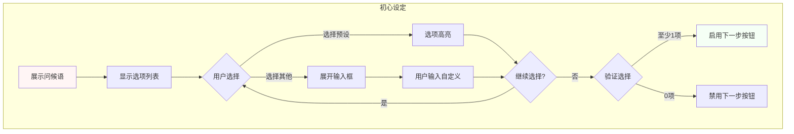
```mermaid
flowchart TD
    subgraph 初心设定
        A[展示问候语] --> B[显示选项列表]
        B --> C{用户选择}
        C -->|选择预设| D[选项高亮]
        C -->|选择其他| E[展开输入框]
        D --> F{继续选择?}
        E --> G[用户输入自定义]
        G --> F
        F -->|是| C
        F -->|否| H{验证选择}
        H -->|至少1项| I[启用下一步按钮]
        H -->|0项| J[禁用下一步按钮]
    end

    style A fill:#fff5f5
    style I fill:#f5fff5
```

### 6.2 投资目标选项设计

| 选项ID | 显示文本 | 存储值 | 图标 | 说明 |
|--------|---------|-------|------|------|
| G01 | 做时间的朋友 | `long_term` | 🌱 | 长线投资者 |
| G02 | 捕捉市场机会 | `short_term` | ⚡️ | 短线交易者 |
| G03 | 其他 | `custom:{text}` | ✏️ | 自定义输入 |

### 6.3 心理锚点输入流程

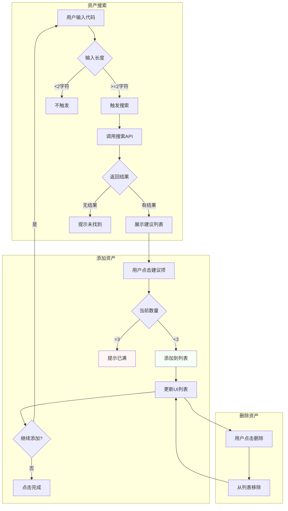
```mermaid
flowchart TD
    subgraph 资产搜索
        A[用户输入代码] --> B{输入长度}
        B -->|>=2字符| C[触发搜索]
        B -->|<2字符| D[不触发]
        C --> E[调用搜索API]
        E --> F{返回结果}
        F -->|有结果| G[展示建议列表]
        F -->|无结果| H[提示未找到]
    end

    subgraph 添加资产
        G --> I[用户点击建议项]
        I --> J{当前数量}
        J -->|<3| K[添加到列表]
        J -->|=3| L[提示已满]
        K --> M[更新UI列表]
        M --> N{继续添加?}
        N -->|是| A
        N -->|否| O[点击完成]
    end

    subgraph 删除资产
        M --> P[用户点击删除]
        P --> Q[从列表移除]
        Q --> M
    end

    style K fill:#f5fff5
    style L fill:#fff5f5
```

### 6.4 股票代码识别规则

| 市场 | 代码格式 | 示例 | 识别规则 |
|------|---------|------|---------|
| A股-沪市 | 6位数字，6开头 | 600519 | `/^6\d{5}$/` |
| A股-深市 | 6位数字，0/3开头 | 000001, 300750 | `/^[03]\d{5}$/` |
| A股-北交所 | 6位数字，8开头 | 830799 | `/^8\d{5}$/` |
| 美股 | 1-5位字母 | NVDA, AAPL | `/^[A-Z]{1,5}$/` |
| 港股 | 5位数字 | 00700 | `/^\d{5}$/` |

### 6.5 搜索建议UI设计

```
┌────────────────────────────────┐
│  🔍 输入代码或名称...           │
├────────────────────────────────┤
│  ┌──────────────────────────┐  │
│  │ NVDA                     │  │
│  │ 英伟达 · NASDAQ · $890   │  │
│  └──────────────────────────┘  │
│  ┌──────────────────────────┐  │
│  │ 600519                   │  │
│  │ 贵州茅台 · 沪A · ¥1650   │  │
│  └──────────────────────────┘  │
└────────────────────────────────┘
```

---

## 7. AI对话流程

### 7.1 对话触发入口

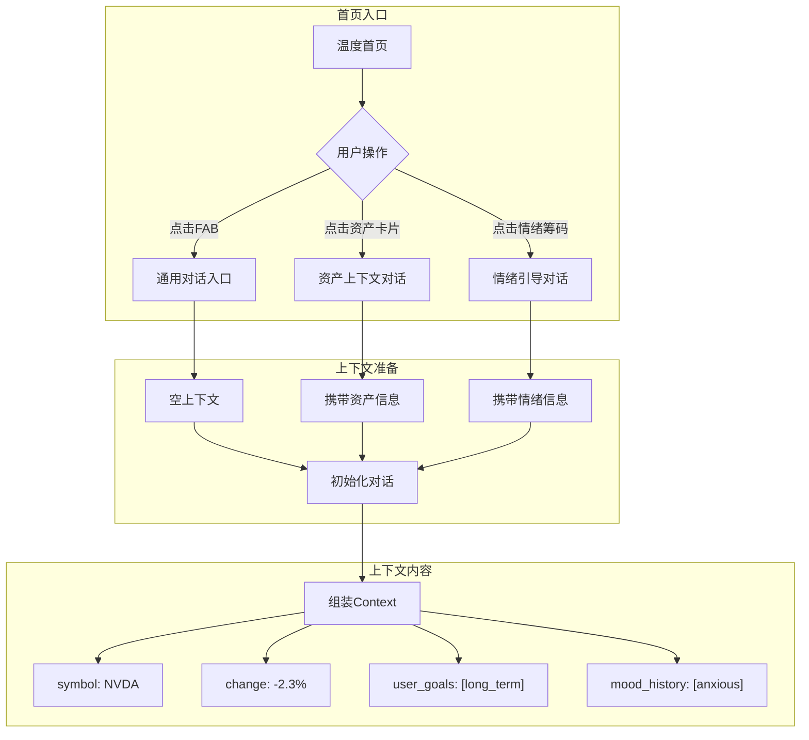
```mermaid
flowchart TD
    subgraph 首页入口
        A[温度首页] --> B{用户操作}
        B -->|点击FAB| C[通用对话入口]
        B -->|点击资产卡片| D[资产上下文对话]
        B -->|点击情绪筹码| E[情绪引导对话]
    end

    subgraph 上下文准备
        C --> F[空上下文]
        D --> G[携带资产信息]
        E --> H[携带情绪信息]
        F --> I[初始化对话]
        G --> I
        H --> I
    end

    subgraph 上下文内容
        I --> J[组装Context]
        J --> K["symbol: NVDA"]
        J --> L["change: -2.3%"]
        J --> M["user_goals: [long_term]"]
        J --> N["mood_history: [anxious]"]
    end
```

### 7.2 情绪筹码对话流程

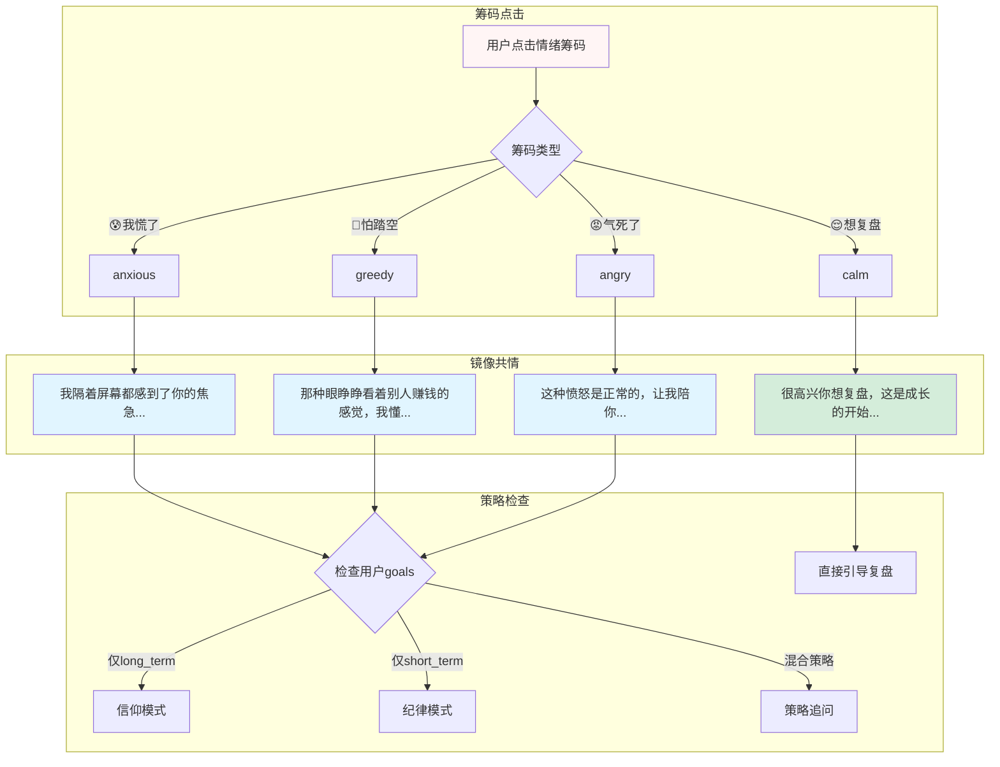
```mermaid
flowchart TD
    subgraph 筹码点击
        A[用户点击情绪筹码] --> B{筹码类型}
        B -->|😰我慌了| C1[anxious]
        B -->|🤑怕踏空| C2[greedy]
        B -->|😡气死了| C3[angry]
        B -->|😌想复盘| C4[calm]
    end

    subgraph 镜像共情
        C1 --> D1["我隔着屏幕都感到了你的焦急..."]
        C2 --> D2["那种眼睁睁看着别人赚钱的感觉，我懂..."]
        C3 --> D3["这种愤怒是正常的，让我陪你..."]
        C4 --> D4["很高兴你想复盘，这是成长的开始..."]
    end

    subgraph 策略检查
        D1 --> E{检查用户goals}
        D2 --> E
        D3 --> E
        D4 --> F[直接引导复盘]
        E -->|仅long_term| G[信仰模式]
        E -->|仅short_term| H[纪律模式]
        E -->|混合策略| I[策略追问]
    end

    style A fill:#fff5f5
    style D1 fill:#e1f5ff
    style D2 fill:#e1f5ff
    style D3 fill:#e1f5ff
    style D4 fill:#d4edda
```

### 7.3 策略追问与锁定流程

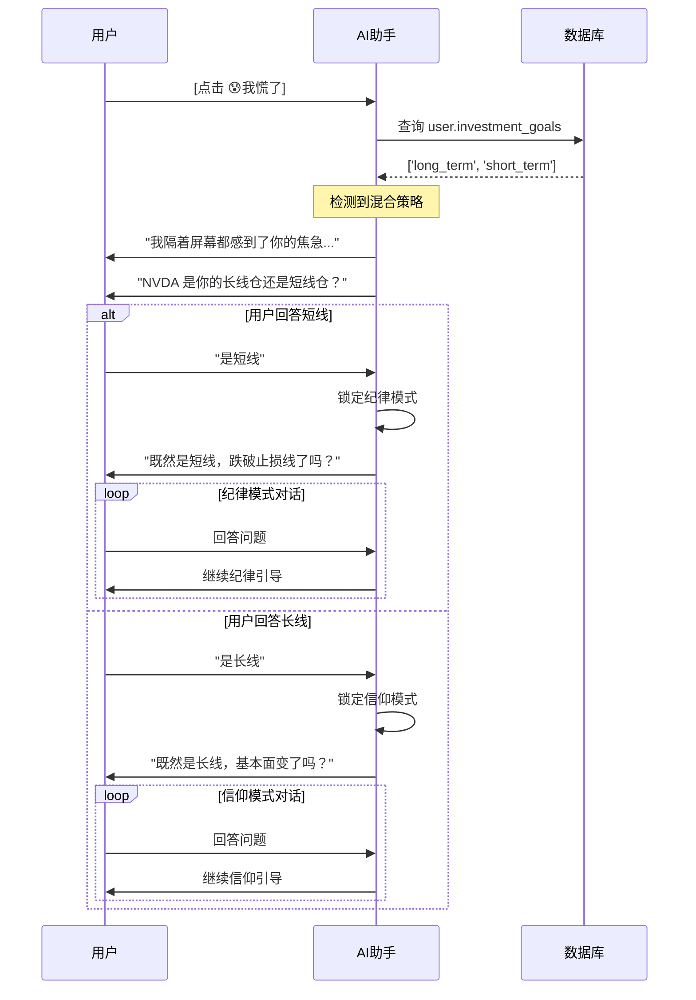
```mermaid
sequenceDiagram
    participant U as 用户
    participant AI as AI助手
    participant DB as 数据库

    U->>AI: [点击 😰我慌了]
    AI->>DB: 查询 user.investment_goals
    DB-->>AI: ['long_term', 'short_term']

    Note over AI: 检测到混合策略

    AI->>U: "我隔着屏幕都感到了你的焦急..."
    AI->>U: "NVDA 是你的长线仓还是短线仓？"

    alt 用户回答短线
        U->>AI: "是短线"
        AI->>AI: 锁定纪律模式
        AI->>U: "既然是短线，跌破止损线了吗？"

        loop 纪律模式对话
            U->>AI: 回答问题
            AI->>U: 继续纪律引导
        end
    else 用户回答长线
        U->>AI: "是长线"
        AI->>AI: 锁定信仰模式
        AI->>U: "既然是长线，基本面变了吗？"

        loop 信仰模式对话
            U->>AI: 回答问题
            AI->>U: 继续信仰引导
        end
    end
```

### 7.4 对话模式详解

#### 7.4.1 纪律模式 (短线)

| 阶段 | AI提问 | 目的 |
|------|-------|------|
| 1. 止损检查 | "跌破止损线了吗？止损线设在哪里？" | 确认是否触发止损 |
| 2. 止盈检查 | "距离止盈目标还有多远？" | 确认盈利空间 |
| 3. 纪律提醒 | "你当初买入的理由还成立吗？" | 回顾交易逻辑 |
| 4. 行动引导 | "如果触发止损，你打算怎么做？" | 引导理性决策 |

#### 7.4.2 信仰模式 (长线)

| 阶段 | AI提问 | 目的 |
|------|-------|------|
| 1. 基本面检查 | "公司的基本面变了吗？" | 聚焦价值而非价格 |
| 2. 初心回顾 | "当初买入的理由是什么？" | 回顾投资逻辑 |
| 3. 情绪分离 | "市场波动≠公司价值变化" | 分离情绪和事实 |
| 4. 长期视角 | "3年后回看今天，这个价格重要吗？" | 建立长期视角 |

### 7.5 完整对话流程

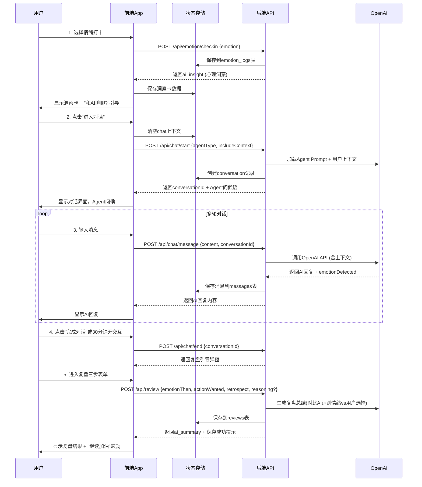
```mermaid
sequenceDiagram
    participant User as 用户
    participant App as 前端App
    participant Store as 状态存储
    participant API as 后端API
    participant AI as OpenAI

    User->>App: 1. 选择情绪打卡
    App->>API: POST /api/emotion/checkin {emotion}
    API->>Store: 保存到emotion_logs表
    API-->>App: 返回ai_insight (心理洞察)
    App->>Store: 保存洞察卡数据
    
    App->>User: 显示洞察卡 + "和AI聊聊?"引导
    
    User->>App: 2. 点击"进入对话"
    App->>Store: 清空chat上下文
    App->>API: POST /api/chat/start {agentType, includeContext}
    API->>AI: 加载Agent Prompt + 用户上下文
    API->>Store: 创建conversation记录
    API-->>App: 返回conversationId + Agent问候语
    
    App->>User: 显示对话界面，Agent问候
    
    loop 多轮对话
        User->>App: 3. 输入消息
        App->>API: POST /api/chat/message {content, conversationId}
        API->>AI: 调用OpenAI API (含上下文)
        AI-->>API: 返回AI回复 + emotionDetected
        API->>Store: 保存消息到messages表
        API-->>App: 返回AI回复内容
        App->>User: 显示AI回复
    end
    
    User->>App: 4. 点击"完成对话"或30分钟无交互
    App->>API: POST /api/chat/end {conversationId}
    API-->>App: 返回复盘引导弹窗
    
    User->>App: 5. 进入复盘三步表单
    App->>API: POST /api/review {emotionThen, actionWanted, retrospect, reasoning?}
    API->>AI: 生成复盘总结(对比AI识别情绪vs用户选择)
    API->>Store: 保存到reviews表
    API-->>App: 返回ai_summary + 保存成功提示
    
    App->>User: 显示复盘结果 + "继续加油"鼓励
```

### 7.6 熔断机制流程

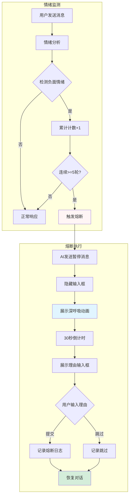
```mermaid
flowchart TD
    subgraph 情绪监测
        A[用户发送消息] --> B[情绪分析]
        B --> C{检测负面情绪}
        C -->|否| D[正常响应]
        C -->|是| E[累计计数+1]
        E --> F{连续>=5轮?}
        F -->|否| D
        F -->|是| G[触发熔断]
    end

    subgraph 熔断执行
        G --> H[AI发送暂停消息]
        H --> I[隐藏输入框]
        I --> J[展示深呼吸动画]
        J --> K[30秒倒计时]
        K --> L[展示理由输入框]
        L --> M{用户输入理由}
        M -->|提交| N[记录熔断日志]
        M -->|跳过| O[记录跳过]
        N --> P[恢复对话]
        O --> P
    end

    style G fill:#fff5f5
    style J fill:#e1f5ff
    style P fill:#d4edda
```

### 7.7 熔断触发词库

| 类别 | 关键词 | 权重 |
|------|-------|------|
| 恐慌类 | 崩、完了、全没了、血亏、跳楼 | 2 |
| 冲动类 | 全卖、清仓、割肉、跑、撤 | 1.5 |
| 愤怒类 | 操、妈的、垃圾、骗子 | 2 |
| 绝望类 | 不玩了、再也不、认命 | 1.5 |

**熔断公式**: `总分 = Σ(词权重)`, 当 `总分 >= 5` 或 `连续5轮负面` 时触发

### 7.8 深呼吸动画UI

```
┌────────────────────────────────┐
│                                │
│                                │
│         ╭──────────╮           │
│        ╱            ╲          │
│       │    吸气...   │         │
│        ╲            ╱          │
│         ╰──────────╯           │
│                                │
│           ○○○○●○○○○            │
│             27秒               │
│                                │
│      闭上眼睛，感受呼吸         │
│                                │
└────────────────────────────────┘

动画状态:
- 0-4秒: 圆圈放大 + "吸气..."
- 4-7秒: 圆圈保持 + "屏住..."
- 7-11秒: 圆圈缩小 + "呼气..."
- 循环直到30秒结束
```

---

## 8. 复盘记录流程

### 8.1 复盘入口与触发

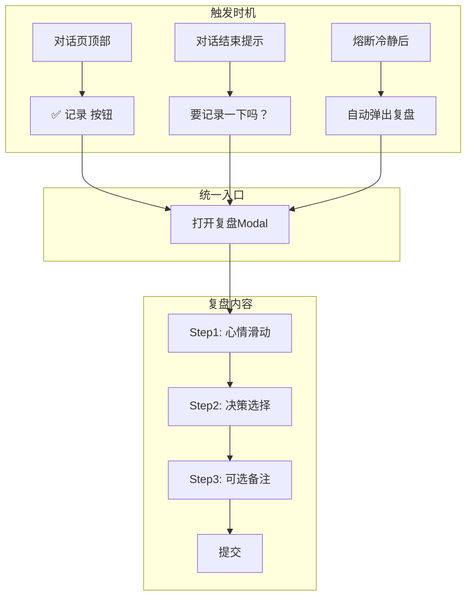
```mermaid
flowchart TD
    subgraph 触发时机
        A[对话页顶部] --> B["✅ 记录" 按钮]
        C[对话结束提示] --> D["要记录一下吗？"]
        E[熔断冷静后] --> F[自动弹出复盘]
    end

    subgraph 统一入口
        B --> G[打开复盘Modal]
        D --> G
        F --> G
    end

    subgraph 复盘内容
        G --> H[Step1: 心情滑动]
        H --> I[Step2: 决策选择]
        I --> J[Step3: 可选备注]
        J --> K[提交]
    end
```

### 8.2 复盘卡片UI流程

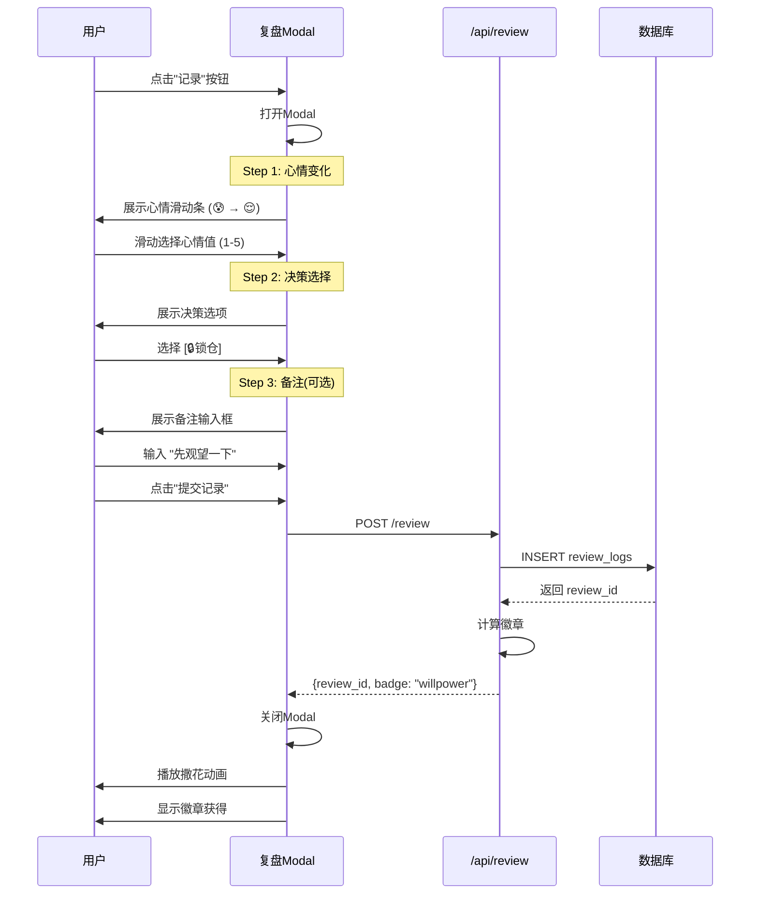
```mermaid
sequenceDiagram
    participant U as 用户
    participant UI as 复盘Modal
    participant API as /api/review
    participant DB as 数据库

    U->>UI: 点击"记录"按钮
    UI->>UI: 打开Modal

    Note over UI: Step 1: 心情变化
    UI->>U: 展示心情滑动条 (😰 → 😌)
    U->>UI: 滑动选择心情值 (1-5)

    Note over UI: Step 2: 决策选择
    UI->>U: 展示决策选项
    U->>UI: 选择 [🔒锁仓]

    Note over UI: Step 3: 备注(可选)
    UI->>U: 展示备注输入框
    U->>UI: 输入 "先观望一下"

    U->>UI: 点击"提交记录"
    UI->>API: POST /review
    API->>DB: INSERT review_logs
    DB-->>API: 返回 review_id
    API->>API: 计算徽章
    API-->>UI: {review_id, badge: "willpower"}

    UI->>UI: 关闭Modal
    UI->>U: 播放撒花动画
    UI->>U: 显示徽章获得
```

### 8.3 决策选项设计

| 选项ID | 显示 | 存储值 | 颜色 | 说明 |
|--------|------|-------|------|------|
| D01 | 🔒 锁仓 | `lock` | Teal | 不做任何操作 |
| D02 | 📉 减仓 | `reduce` | Yellow | 部分卖出 |
| D03 | 📈 加仓 | `add` | Coral | 买入更多 |
| D04 | 🚫 清仓 | `clear` | Gray | 全部卖出 |

### 8.4 心情滑动条设计

```
心情变化 (对话前 → 对话后):

     😰      😟      😐      🙂      😌
      1       2       3       4       5
      │───────●───────────────────────│
            当前值: 2

滑动条样式:
- 轨道: 渐变色 (红 → 绿)
- 滑块: 圆形，带阴影
- 触感: 滑动时有震动反馈
```

### 8.5 复盘数据结构

```typescript
interface ReviewLog {
  id: string;
  user_id: string;

  // 心情数据
  mood_before: 1 | 2 | 3 | 4 | 5;  // 对话前心情 (从对话开始时记录)
  mood_after: 1 | 2 | 3 | 4 | 5;   // 对话后心情 (用户滑动选择)
  mood_change: number;             // 计算值: after - before

  // 决策数据
  decision: 'lock' | 'reduce' | 'add' | 'clear';
  related_symbol?: string;         // 关联的资产代码

  // 上下文
  note?: string;                   // 用户备注 (最长100字)
  chat_session_id: string;         // 关联的对话会话
  circuit_breaker_triggered: boolean; // 是否触发过熔断

  // 奖励
  badge_earned?: 'willpower' | 'calm' | 'persistence';

  created_at: Date;
}
```

### 8.6 三步复盘表单UI

```
┌────────────────────────────────────────┐
│ 9:41              复盘           ○ ████│
├────────────────────────────────────────┤
│ [< 返回]                               │
│                                        │
│  📝 记录这一刻                         │
│                                        │
│  让我们回顾一下刚才的对话，            │
│  帮助你更好地认识自己。                │
│                                        │
│  ───────────────────────────────────   │
│                                        │
│  1️⃣ 刚才对话时，你的情绪是？           │
│                                        │
│  ┌────┐ ┌────┐ ┌────┐ ┌────┐         │
│  │ 🤑 │ │ 😨 │ │ 🙂 │ │ 😣 │         │
│  │贪婪│ │恐惧│ │平静│ │焦虑│         │
│  └────┘ └────┘ └────┘ └────┘         │
│            ↑选中                       │
│                                        │
│  ───────────────────────────────────   │
│                                        │
│  2️⃣ 当时你最想做什么？                 │
│                                        │
│  ┌────────┐ ┌────────┐               │
│  │  买入   │ │  卖出   │               │
│  └────────┘ └────────┘               │
│  ┌────────┐ ┌────────┐               │
│  │  清仓   │ │  观望   │               │
│  └────────┘ └────────┘               │
│                                        │
│  ───────────────────────────────────   │
│                                        │
│  3️⃣ 现在回看这个冲动，你觉得？         │
│                                        │
│  ┌────────────────────────────────┐   │
│  │  ✅ 仍然认同，这是理性判断       │   │
│  └────────────────────────────────┘   │
│  ┌────────────────────────────────┐   │
│  │  🤔 有点动摇，可能是情绪作祟     │   │
│  └────────────────────────────────┘   │
│  ┌────────────────────────────────┐   │
│  │  😅 庆幸没做，那就是冲动        │   │
│  └────────────────────────────────┘   │
│                                        │
│  (可选) 为什么现在的看法变了?          │
│  ┌────────────────────────────────┐   │
│  │ 输入你的想法...                 │   │
│  └────────────────────────────────┘   │
│                                        │
│  ┌──────────────────────────────────┐  │
│  │           [完成复盘]              │  │
│  └──────────────────────────────────┘  │
│                                        │
└────────────────────────────────────────┘
```

### 8.7 复盘结果页

```
┌────────────────────────────────────────┐
│ 9:41            复盘完成         ○ ████│
├────────────────────────────────────────┤
│                                        │
│              ✓ 复盘已保存              │
│                                        │
│  ┌──────────────────────────────────┐  │
│  │         🤖 AI总结                 │  │
│  │                                  │  │
│  │  你在对话时表现出焦虑的情绪信号,  │  │
│  │  但事后回看,你选择了平静来描述    │  │
│  │  当时的感受。                    │  │
│  │                                  │  │
│  │  这说明了什么?                   │  │
│  │  可能是你的情绪标签并不准确,或者  │  │
│  │  你在冷静后重新评估了当时的心态。 │  │
│  │                                  │  │
│  │  这种"事后反思"正是建立自我认知   │  │
│  │  的关键。                        │  │
│  │                                  │  │
│  │  🎉 坚持下去,你会越来越了解自己!  │  │
│  └──────────────────────────────────┘  │
│                                        │
│  ┌────────────┐  ┌────────────┐       │
│  │  继续加油   │  │  查看历史   │       │
│  └────────────┘  └────────────┘       │
│                                        │
└────────────────────────────────────────┘
```

---

## 9. 游客转化流程

### 9.1 转化时机与触发

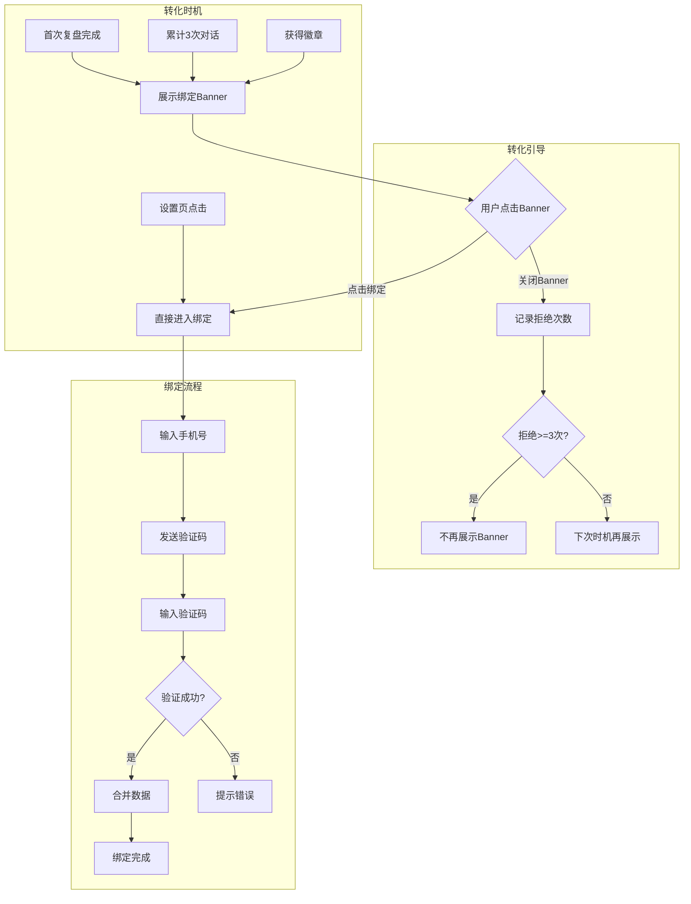
```mermaid
flowchart TD
    subgraph 转化时机
        A[首次复盘完成] --> E[展示绑定Banner]
        B[累计3次对话] --> E
        C[获得徽章] --> E
        D[设置页点击] --> F[直接进入绑定]
    end

    subgraph 转化引导
        E --> G{用户点击Banner}
        G -->|点击绑定| F
        G -->|关闭Banner| H[记录拒绝次数]
        H --> I{拒绝>=3次?}
        I -->|是| J[不再展示Banner]
        I -->|否| K[下次时机再展示]
    end

    subgraph 绑定流程
        F --> L[输入手机号]
        L --> M[发送验证码]
        M --> N[输入验证码]
        N --> O{验证成功?}
        O -->|是| P[合并数据]
        O -->|否| Q[提示错误]
        P --> R[绑定完成]
    end
```

### 9.2 绑定流程详解

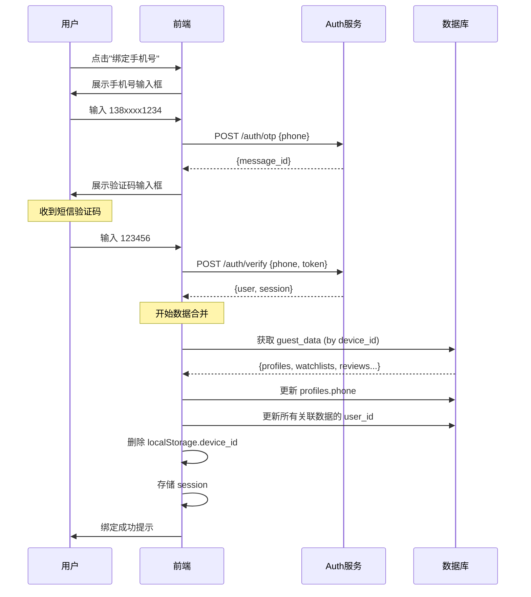
```mermaid
sequenceDiagram
    participant U as 用户
    participant FE as 前端
    participant Auth as Auth服务
    participant DB as 数据库

    U->>FE: 点击"绑定手机号"
    FE->>U: 展示手机号输入框
    U->>FE: 输入 138xxxx1234
    FE->>Auth: POST /auth/otp {phone}
    Auth-->>FE: {message_id}
    FE->>U: 展示验证码输入框

    Note over U: 收到短信验证码

    U->>FE: 输入 123456
    FE->>Auth: POST /auth/verify {phone, token}
    Auth-->>FE: {user, session}

    Note over FE: 开始数据合并

    FE->>DB: 获取 guest_data (by device_id)
    DB-->>FE: {profiles, watchlists, reviews...}
    FE->>DB: 更新 profiles.phone
    FE->>DB: 更新所有关联数据的 user_id
    FE->>FE: 删除 localStorage.device_id
    FE->>FE: 存储 session
    FE->>U: 绑定成功提示
```

### 9.3 数据合并逻辑

```sql
-- 数据合并存储过程
CREATE OR REPLACE FUNCTION merge_guest_to_user(
  p_guest_device_id TEXT,
  p_user_phone TEXT
)
RETURNS VOID AS $$
DECLARE
  v_guest_id UUID;
  v_user_id UUID;
BEGIN
  -- 获取游客ID
  SELECT id INTO v_guest_id
  FROM profiles
  WHERE device_id = p_guest_device_id;

  -- 获取或创建正式用户
  SELECT id INTO v_user_id
  FROM profiles
  WHERE phone = p_user_phone;

  IF v_user_id IS NULL THEN
    -- 直接升级游客为正式用户
    UPDATE profiles
    SET phone = p_user_phone, device_id = NULL
    WHERE id = v_guest_id;
  ELSE
    -- 合并数据到已存在用户
    UPDATE watchlists SET user_id = v_user_id WHERE user_id = v_guest_id;
    UPDATE review_logs SET user_id = v_user_id WHERE user_id = v_guest_id;
    UPDATE chat_sessions SET user_id = v_user_id WHERE user_id = v_guest_id;

    -- 合并 investment_goals
    UPDATE profiles
    SET investment_goals = (
      SELECT ARRAY(
        SELECT DISTINCT unnest(investment_goals)
        FROM profiles
        WHERE id IN (v_guest_id, v_user_id)
      )
    )
    WHERE id = v_user_id;

    -- 删除游客记录
    DELETE FROM profiles WHERE id = v_guest_id;
  END IF;
END;
$$ LANGUAGE plpgsql;
```

---

# Part 3: 页面与交互设计

---

## 10. 页面详细设计

### 10.1 页面清单

| 页面 | 路径 | 说明 | 状态要求 |
|------|------|------|---------|
| 闪屏 | /splash | 情感闪屏 | 无device_id |
| 初心设定 | /onboarding | 投资目标设置 | 无device_id |
| 心理锚点 | /onboarding/watchlist | 添加关注资产 | 已设置初心 |
| 首页 | /pages/index/index | 今日状态、打卡、洞察卡 | 已完成Onboarding |
| 陪伴（对话） | /pages/companion/index | Agent选择、对话界面 | 已完成Onboarding |
| 资产 | /pages/assets/index | 持仓列表、总资产 | 已完成Onboarding |
| 添加持仓 | /pages/assets/add | 手动输入持仓信息 | 含代码校验 |
| 复盘 | /pages/review/index | 对话后复盘表单 | 三步复盘 |
| 复盘历史 | /pages/review/history | 历史复盘记录 | 最近15天 |
| 我的 | /pages/profile/index | 个人设置、风险测试 | 用户信息 |
| 风险测试 | /pages/profile/risk-test | 风险偏好问卷 | 可重复测试 |
| 绑定手机 | /pages/profile/bindphone | 游客升级绑定 | 游客状态 |

### 10.2 首页详细设计

```
┌────────────────────────────────────────┐
│ 9:41                          ○ ████  │
├────────────────────────────────────────┤
│                                        │
│  MindVest                         👤   │
│  心理陪伴版 v2.0                        │
│                                        │
│  ╔══════════════════════════════════╗  │
│  ║  📊 今日心情                      ║  │
│  ║                                  ║  │
│  ║  [🤑贪婪] [😨恐惧] [🙂平静] [😣焦虑] ║  │
│  ║                                  ║  │
│  ║  {已选中状态显示✓}                ║  │
│  ╚══════════════════════════════════╝  │
│                                        │
│  ╔══════════════════════════════════╗  │
│  ║  💰 资产概览                      ║  │
│  ║  ┌────────────┬────────────┐     ║  │
│  ║  │   本金投入  │  累计盈亏   │     ║  │
│  ║  │ ¥200,000  │  +¥5,200   │     ║  │
│  ║  │            │   +2.6%    │     ║  │
│  ║  └────────────┴────────────┘     ║  │
│  ║                                  ║  │
│  ║  {未添加持仓时显示"添加持仓"入口}  ║  │
│  ╚══════════════════════════════════╝  │
│                                        │
│  ╔══════════════════════════════════╗  │
│  ║ ⚠️ 震荡下跌 · 波动等级：中高       ║  │
│  ║                                  ║  │
│  ║  📍 心理风险提示                  ║  │
│  ║  ┌────────────────────────────┐  ║  │
│  ║  │ "恐慌性抛售 / 频繁查看账户" │  ║  │
│  ║  └────────────────────────────┘  ║  │
│  ║                                  ║  │
│  ║  💡 今天更适合观察，而不是行动    ║  │
│  ╚══════════════════════════════════╝  │
│                                        │
│  ╔══════════════════════════════════╗  │
│  ║  🧘 大师视角                      ║  │
│  ║  "短期波动是情绪的放大镜，       ║  │
│  ║   不是判断的依据。"              ║  │
│  ╚══════════════════════════════════╝  │
│                                        │
│  ╔══════════════════════════════════╗  │
│  ║  😰 情绪筹码 (快捷入口)           ║  │
│  ║  ┌────┐ ┌────┐ ┌────┐ ┌────┐   ║  │
│  ║  │我慌了│ │怕踏空│ │气死了│ │想复盘│   ║  │
│  ║  └────┘ └────┘ └────┘ └────┘   ║  │
│  ╚══════════════════════════════════╝  │
│                                        │
│  ╔══════════════════════════════════╗  │
│  ║  💬 和AI教练聊聊？               ║  │
│  ║  ┌────────────────────────┐ ┌──┐║  │
│  ║  │ 输入你的想法...         │ │➤││  │
│  ║  └────────────────────────┘ └──┘║  │
│  ╚══════════════════════════════════╝  │
│                                        │
├────────────────────────────────────────┤
│   🏠      💬       💰       👤        │
│   今日    陪伴     资产     我的       │
└────────────────────────────────────────┘
```

### 10.3 陪伴（对话）页详细设计

```
┌────────────────────────────────────────┐
│ 9:41              陪伴           ○ ████│
├────────────────────────────────────────┤
│                                        │
│  您的私人投资智囊团                     │
│  选择一位教练进行深度咨询                │
│                                        │
│  ┌────────┐ ┌────────┐ ┌────────┐     │
│  │   🧘   │ │   💜   │ │   📊   │     │
│  │价值宗师│ │ 疗愈师 │ │量化极客│     │
│  │        │ │ [选中] │ │        │     │
│  └────────┘ └────────┘ └────────┘     │
│                                        │
│  ┌──────────────────────────────────┐  │
│  │ 💜                                │  │
│  │ 你好！我是你的投资陪伴助手。       │  │
│  │ 看到今天市场波动比较大，          │  │
│  │ 你的心情还好吗？                  │  │
│  │                                  │  │
│  │ 我们可以聊聊你的感受，            │  │
│  │ 或者只是放松一下。               │  │
│  │                          14:32   │  │
│  └──────────────────────────────────┘  │
│                                        │
│              ┌──────────────────────┐  │
│              │ 我今天有点慌，手里   │  │
│              │ 的股票跌了不少...    │  │
│              │              14:33 👤│  │
│              └──────────────────────┘  │
│                                        │
│  ┌──────────────────────────────────┐  │
│  │ 💜                                │  │
│  │ 我能感受到你的焦虑，这种感觉      │  │
│  │ 在市场下跌时是很正常的。          │  │
│  │                                  │  │
│  │ 让我们先深呼吸，然后一起看看：    │  │
│  │ 这种想要操作的冲动，是因为        │  │
│  │ 你对持仓的判断变了，还是          │  │
│  │ 今天的下跌让你不舒服？            │  │
│  │                          14:33   │  │
│  └──────────────────────────────────┘  │
│                                        │
│  【AI思考中状态】                       │
│  ┌────────────────────────────┐       │
│  │ 💜                          │       │
│  │ ●●● AI正在思考...           │       │
│  │                    [取消]  │       │
│  └────────────────────────────┘       │
│                                        │
│  ┌────────────────────────────┐ ┌──┐  │
│  │ 输入你的想法...             │ │➤│  │
│  └────────────────────────────┘ └──┘  │
│        {AI回复中时输入框禁用}          │
├────────────────────────────────────────┤
│   🏠      💬       💰       👤        │
│   首页    陪伴     资产     我的       │
└────────────────────────────────────────┘
```

### 10.4 资产页详细设计

```
┌────────────────────────────────────────┐
│ 9:41              资产           ○ ████│
├────────────────────────────────────────┤
│                                        │
│  资产明细                        [+添加]│
│                                        │
│  ┌──────────────────────────────────┐  │
│  │  总资产        今日盈亏           │  │
│  │  ¥205,200     +¥1,200 (+0.58%)  │  │
│  └──────────────────────────────────┘  │
│                                        │
│  ┌──────────────────────────────────┐  │
│  │ 📈 NVDA     $850.2 → $920.5     │  │
│  │ NVIDIA               +$5,800     │  │
│  │ 45天 · 富途证券        (+4.2%)   │  │
│  │                            [编辑]│  │
│  ├──────────────────────────────────┤  │
│  │ 📈 AAPL     $175.5 → $178.2     │  │
│  │ Apple               +$1,200      │  │
│  │ 120天 · 长桥证券       (+0.5%)   │  │
│  │                            [编辑]│  │
│  ├──────────────────────────────────┤  │
│  │ 📉 TSLA     $180.0 → $172.5     │  │
│  │ Tesla               -$1,800      │  │
│  │ 15天 · 富途证券        (-2.1%)   │  │
│  │                            [编辑]│  │
│  └──────────────────────────────────┘  │
│                                        │
│  ┌──────────────────────────────────┐  │
│  │  💡 持仓数据仅用于心理分析，      │  │
│  │     不会用于任何投资建议          │  │
│  └──────────────────────────────────┘  │
│                                        │
├────────────────────────────────────────┤
│   🏠      💬       💰       👤        │
│   首页    陪伴     资产     我的       │
└────────────────────────────────────────┘

【空状态】
┌──────────────────────────────────┐
│                                  │
│         📊                       │
│                                  │
│    还没有添加任何持仓             │
│                                  │
│    添加持仓后，AI可以更好地       │
│    理解你的情绪来源              │
│                                  │
│       [+ 添加第一笔持仓]          │
│                                  │
└──────────────────────────────────┘
```

### 10.5 我的页面设计

```
┌────────────────────────────────────────┐
│ 9:41              我的           ○ ████│
├────────────────────────────────────────┤
│                                        │
│           ┌─────────┐                  │
│           │  Avatar │                  │
│           └─────────┘                  │
│           微信用户                      │
│         {显示openid后4位}              │
│                                        │
│  ┌──────────────────────────────────┐  │
│  │ 👤  个人资料设置               >  │  │
│  └──────────────────────────────────┘  │
│                                        │
│  ┌──────────────────────────────────┐  │
│  │ 📊  风险偏好测试               >  │  │
│  │     {未完成/稳健型/激进型}        │  │
│  └──────────────────────────────────┘  │
│                                        │
│  ┌──────────────────────────────────┐  │
│  │ 📝  复盘历史                   >  │  │
│  │     最近15天                      │  │
│  └──────────────────────────────────┘  │
│                                        │
│  ┌──────────────────────────────────┐  │
│  │ 📱  绑定手机号                 >  │  │
│  │     {游客可见，绑定后隐藏}        │  │
│  └──────────────────────────────────┘  │
│                                        │
│  ┌──────────────────────────────────┐  │
│  │ ⚙️  通用设置                   >  │  │
│  └──────────────────────────────────┘  │
│                                        │
│  ┌──────────────────────────────────┐  │
│  │ ❓  关于MindVest               >  │  │
│  └──────────────────────────────────┘  │
│                                        │
│                                        │
│  ───────────────────────────────────   │
│            版本 2.0.0                  │
│                                        │
├────────────────────────────────────────┤
│   🏠      💬       💰       👤        │
│   首页    陪伴     资产     我的       │
└────────────────────────────────────────┘
```

---

## 11. 交互规范

### 11.1 全局规范

| 规范项 | 定义 |
|--------|------|
| 页面切换 | 底部TabBar切换无动画，页面内跳转右滑进入 |
| 下拉刷新 | 首页、资产页支持下拉刷新，行情页自动刷新 |
| 加载状态 | 统一使用3个跳动圆点动画 |
| Toast提示 | 底部居中，2秒自动消失 |
| 错误提示 | 红色背景Toast，可手动关闭 |
| 网络状态 | 顶部黄色条显示"网络连接失败" |

### 11.2 情绪打卡交互

| 场景 | 交互行为 |
|------|---------|
| 首次打卡 | 点击Emoji高亮选中，自动提交，显示"已记录今日心情" |
| 修改打卡 | 当天可重新选择，自动覆盖，显示"已更新" |
| 次日锁定 | 历史打卡不可修改，显示灰色+锁定图标 |
| 打卡成功 | Toast提示，同时加载心理洞察卡 |

### 11.3 对话交互规范

| 场景 | 交互行为 |
|------|---------|
| 切换Agent | 点击切换，弹窗确认"切换教练将清空当前对话？"，清空并重新开始 |
| 发送消息 | 点击发送按钮或回车发送，消息立即显示在对话框 |
| 消息上限 | 单条最多500字，超出截断并提示"消息不能超过500字" |
| AI回复上限 | 单条最多800字，若超出自动截断 |
| 等待回复 | 输入框禁用，显示"AI正在思考..."+"[取消]"按钮 |
| 超时处理 | 30秒无回应→"响应超时，请重试" |
| 连续发送 | 禁止，必须等AI回复后才能发下一条 |
| 消息滚动 | 新消息自动滚动到底部 |
| 历史加载 | 最多显示当前对话的消息，不加载历史对话 |
| 情绪筹码 | 点击后直接进入对话，携带情绪上下文 |

### 11.4 持仓管理交互

| 场景 | 交互行为 |
|------|---------|
| 添加持仓 | 手动输入代码，必填代码+数量，成本选填 |
| 编辑持仓 | 点击编辑按钮进入编辑页，修改后保存 |
| 删除持仓 | 二次确认弹窗"确定删除此持仓?"，确认后删除 |
| 价格刷新 | 进入页面自动刷新，下拉手动刷新，使用缓存显示 |
| 代码校验 | 提交时校验，无效提示"无效的股票代码" |

### 11.5 复盘交互规范

| 场景 | 交互行为 |
|------|---------|
| 触发时机 | 对话结束时自动弹出引导，用户可点击"跳过"或"开始复盘" |
| 熔断触发 | 熔断冷静结束后自动弹出复盘 |
| 表单提交 | 三步全部选择后才能点击"完成复盘" |
| 提交成功 | Toast提示"复盘已保存"，显示AI总结，可查看历史 |
| 徽章获得 | 播放撒花动画，显示徽章 |
| 历史查看 | 列表展示最近15天，点击查看详情 |

---

## 12. 状态机定义

### 12.1 用户状态机

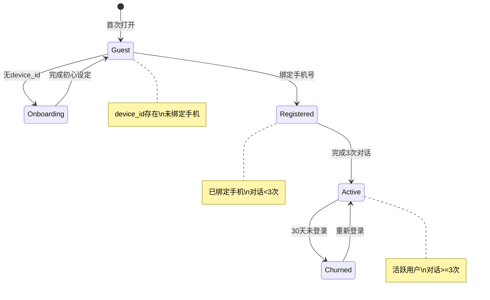
```mermaid
stateDiagram-v2
    [*] --> Guest: 首次打开
    Guest --> Onboarding: 无device_id
    Onboarding --> Guest: 完成初心设定
    Guest --> Registered: 绑定手机号
    Registered --> Active: 完成3次对话
    Active --> Churned: 30天未登录
    Churned --> Active: 重新登录

    note right of Guest: device_id存在\n未绑定手机
    note right of Registered: 已绑定手机\n对话<3次
    note right of Active: 活跃用户\n对话>=3次
```

### 12.2 对话状态机

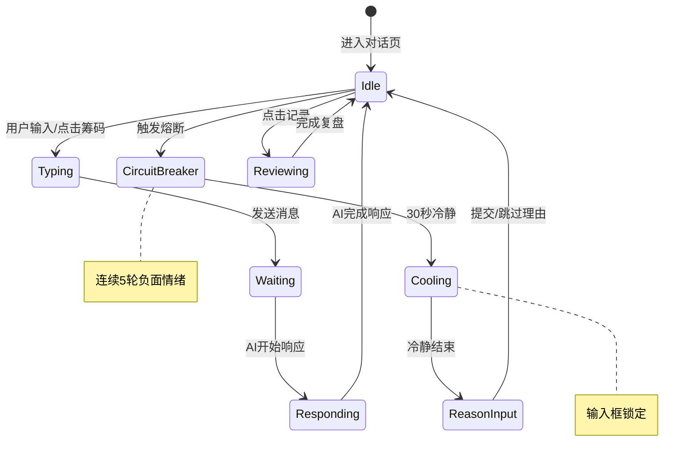
```mermaid
stateDiagram-v2
    [*] --> Idle: 进入对话页
    Idle --> Typing: 用户输入/点击筹码
    Typing --> Waiting: 发送消息
    Waiting --> Responding: AI开始响应
    Responding --> Idle: AI完成响应

    Idle --> CircuitBreaker: 触发熔断
    CircuitBreaker --> Cooling: 30秒冷静
    Cooling --> ReasonInput: 冷静结束
    ReasonInput --> Idle: 提交/跳过理由

    Idle --> Reviewing: 点击记录
    Reviewing --> Idle: 完成复盘

    note right of CircuitBreaker: 连续5轮负面情绪
    note right of Cooling: 输入框锁定
```

### 12.3 复盘状态机

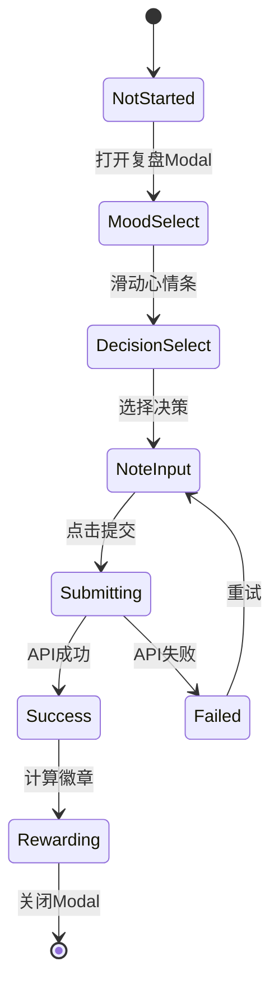
```mermaid
stateDiagram-v2
    [*] --> NotStarted
    NotStarted --> MoodSelect: 打开复盘Modal
    MoodSelect --> DecisionSelect: 滑动心情条
    DecisionSelect --> NoteInput: 选择决策
    NoteInput --> Submitting: 点击提交
    Submitting --> Success: API成功
    Submitting --> Failed: API失败
    Success --> Rewarding: 计算徽章
    Rewarding --> [*]: 关闭Modal
    Failed --> NoteInput: 重试
```

---

# Part 4: 技术实现

---

## 13. API接口契约

### 13.1 接口总览

| 模块 | 接口 | 方法 | 说明 |
|------|------|------|------|
| **认证** | `/api/auth/wechat` | POST | 微信登录 |
| **认证** | `/api/onboarding/init` | POST | 游客初始化 |
| **用户** | `/api/user/profile` | GET/PUT | 获取/更新用户信息 |
| **情绪** | `/api/emotion/checkin` | POST | 情绪打卡 |
| **情绪** | `/api/emotion/today` | GET | 获取今日情绪状态 |
| **情绪** | `/api/emotion/recent-trend` | GET | 获取近7天趋势 |
| **情绪** | `/api/emotion/insight` | GET | 获取心理洞察 |
| **对话** | `/api/chat/start` | POST | 开始对话 |
| **对话** | `/api/chat/message` | POST | 发送消息 |
| **对话** | `/api/chat/cancel` | POST | 取消等待 |
| **对话** | `/api/chat/end` | POST | 结束对话 |
| **持仓** | `/api/portfolio` | GET/POST | 获取/添加持仓 |
| **持仓** | `/api/portfolio/:id` | PUT/DELETE | 更新/删除持仓 |
| **持仓** | `/api/portfolio/refresh` | POST | 刷新实时价格 |
| **复盘** | `/api/review` | POST/GET | 提交/获取复盘 |
| **行情** | `/api/market/quote` | GET | 获取股票报价 |
| **行情** | `/api/market/status` | GET | 获取市场状态 |
| **关注** | `/api/watchlist` | GET/POST/DELETE | 心理锚点管理 |

### 13.2 关键接口详细定义

#### 13.2.1 微信登录

```yaml
POST /api/auth/wechat
---
Request:
  Content-Type: application/json
  Body:
    code: string # 微信login返回的code

Response:
  Success (200):
    {
      "success": true,
      "data": {
        "token": "eyJhbGciOiJIUzI1Nils...",
        "expiresIn": 604800, # 7天过期
        "isNewUser": true,
        "userId": "usr_xxxx"
      }
    }
  Error (401):
    {
      "success": false,
      "error": {
        "code": "AUTH_FAILED",
        "message": "微信登录失败，请重试"
      }
    }
```

#### 13.2.2 游客初始化

```yaml
POST /api/onboarding/init
---
Request:
  Body:
    goals: ["long_term"] | ["short_term"] | ["long_term", "short_term"]
    customGoal?: string  # 如果选择"其他"

Response:
  Success (200):
    {
      "success": true,
      "data": {
        "deviceId": "uuid-xxxx",
        "userId": "usr_xxxx",
        "isNewUser": true
      }
    }
```

#### 13.2.3 情绪打卡

```yaml
POST /api/emotion/checkin
---
Request:
  Headers:
    Authorization: Bearer {token}
  Body:
    emotion: "greedy" | "fear" | "calm" | "anxious"

Response:
  Success (200):
    {
      "success": true,
      "data": {
        "id": "emo_xxxx",
        "emotion": "anxious",
        "logDate": "2026-01-18",
        "canModify": true,
        "marketStatus": "down",
        "insight": {
          "riskLevel": "high",
          "riskTip": "恐慌性抛售 / 频繁查看账户",
          "suggestion": "今天更适合观察，而不是行动",
          "masterView": "短期波动是情绪的放大镜，不是判断的依据。"
        },
        "pattern": "你在市场下跌时，过去8次中87%选择了焦虑"
      }
    }
```

#### 13.2.4 获取近期情绪趋势

```yaml
GET /api/emotion/recent-trend
---
Query Params:
  days: number (default: 7)

Response:
  Success (200):
    {
      "success": true,
      "data": {
        "trend": [
          {"date": "2026-01-18", "emotion": "anxious", "marketStatus": "down"},
          {"date": "2026-01-17", "emotion": "fear", "marketStatus": "down"},
          {"date": "2026-01-16", "emotion": "calm", "marketStatus": "up"}
        ],
        "pattern": {
          "highFrequencyEmotion": "anxious",
          "frequency": 4,
          "correlation": "在市场下跌时容易焦虑",
          "insight": "你在市场波动大时容易焦虑，这是正常的心理反应"
        }
      }
    }
```

#### 13.2.5 开始对话

```yaml
POST /api/chat/start
---
Request:
  Headers:
    Authorization: Bearer {token}
  Body:
    agentType: "master" | "healer" | "quant"
    emotionChip?: "anxious" | "greedy" | "angry" | "calm"  # 情绪筹码触发
    relatedSymbol?: string  # 资产上下文
    includeContext: {
      todayEmotion?: string
      recentEmotionTrend?: Array<{date, emotion, marketStatus}>
      riskPreference?: "conservative" | "moderate" | "aggressive"
      portfolioValue?: number
    }

Response:
  Success (200):
    {
      "success": true,
      "data": {
        "conversationId": "conv_xxxx",
        "agentType": "healer",
        "greeting": {
          "role": "assistant",
          "content": "我隔着屏幕都感到了你的焦急...",
          "timestamp": "2026-01-18T14:32:00Z"
        },
        "contextApplied": true,
        "strategyMode": null | "faith" | "discipline"  # 锁定的策略模式
      }
    }
```

#### 13.2.6 发送消息

```yaml
POST /api/chat/message
---
Request:
  Headers:
    Authorization: Bearer {token}
  Body:
    conversationId: string
    content: string  # 最大500字符

Response:
  Success (200):
    {
      "success": true,
      "data": {
        "messageId": "msg_xxxx",
        "userMessage": {
          "content": "我很焦虑...",
          "timestamp": "2026-01-18T14:33:00Z"
        },
        "reply": {
          "role": "assistant",
          "content": "我能感受到你的焦虑...",
          "timestamp": "2026-01-18T14:33:30Z",
          "emotionDetected": "anxious",
          "shouldReview": true,
          "circuitBreaker": {
            "triggered": false,
            "consecutiveNegative": 2
          }
        }
      }
    }
  
  CircuitBreaker Triggered (200):
    {
      "success": true,
      "data": {
        "messageId": "msg_xxxx",
        "reply": {...},
        "circuitBreaker": {
          "triggered": true,
          "message": "我感觉到你现在情绪比较激动，让我们先暂停一下...",
          "cooldownSeconds": 30
        }
      }
    }
```

#### 13.2.7 提交复盘

```yaml
POST /api/review
---
Request:
  Headers:
    Authorization: Bearer {token}
  Body:
    conversationId: string
    emotionThen: "greedy" | "fear" | "calm" | "anxious"
    actionWanted: "buy" | "sell" | "clear" | "hold"
    retrospect: "still_agree" | "doubt" | "glad_not"
    reasoning?: string
    moodBefore: 1-5
    moodAfter: 1-5
    circuitBreakerTriggered: boolean

Response:
  Success (201):
    {
      "success": true,
      "data": {
        "id": "rev_xxxx",
        "emotionThen": "anxious",
        "emotionDetectedByAI": "anxious",
        "mismatch": false,
        "moodChange": 2,
        "aiSummary": "你在对话时表现出焦虑的情绪信号...",
        "badgeEarned": "willpower",
        "createdAt": "2026-01-18T15:00:00Z"
      }
    }
```

### 13.3 通用响应格式

```typescript
// 成功响应
interface SuccessResponse<T> {
  success: true;
  data: T;
  metadata?: {
    timestamp: number;
    version: string;
    cacheHit?: boolean;
  };
}

// 错误响应
interface ErrorResponse {
  success: false;
  error: {
    code: string;
    message: string;
    details?: any;
  };
}

// 通用错误码
enum ErrorCode {
  // 认证 (401)
  UNAUTHORIZED = "UNAUTHORIZED",
  TOKEN_EXPIRED = "TOKEN_EXPIRED",
  AUTH_FAILED = "AUTH_FAILED",
  
  // 请求错误 (400)
  INVALID_PARAMS = "INVALID_PARAMS",
  CONTENT_TOO_LONG = "CONTENT_TOO_LONG",
  INVALID_TICKER = "INVALID_TICKER",
  
  // 业务错误 (400)
  CHECKIN_LOCKED = "CHECKIN_LOCKED",
  CONVERSATION_ENDED = "CONVERSATION_ENDED",
  CIRCUIT_BREAKER_ACTIVE = "CIRCUIT_BREAKER_ACTIVE",
  
  // 超时 (408)
  TIMEOUT = "TIMEOUT",
  
  // 服务器错误 (500)
  INTERNAL_ERROR = "INTERNAL_ERROR",
  AI_SERVICE_ERROR = "AI_SERVICE_ERROR",
  MARKET_DATA_ERROR = "MARKET_DATA_ERROR"
}
```

---

## 14. 数据库设计

### 14.1 ER图

```
┌─────────────┐         ┌────────────────────┐
│   users     │         │  emotion_logs      │
├─────────────┤         ├────────────────────┤
│ id (PK)     │◄────────│ id (PK)            │
│ wechat_oid  │  1:N    │ user_id (FK)       │
│ device_id   │         │ emotion            │
│ phone       │         │ log_date           │
│ nickname    │         │ market_status      │
│ risk_pref   │         │ current_insight_id │
│ pref_agent  │         │ can_modify         │
│ inv_goals   │         │ created_at         │
│ created_at  │         │ locked_at          │
└─────────────┘         └────────────────────┘
      ▲                          │
      │                          ▼
      │                 ┌────────────────────┐
      │                 │ emotion_insights   │
      │                 ├────────────────────┤
      │                 │ id (PK)            │
      │                 │ emotion            │
      │                 │ risk_level         │
      │                 │ risk_tip           │
      │                 │ suggestion         │
      │                 │ master_view        │
      │                 │ version            │
      │                 └────────────────────┘

┌─────────────────┐    ┌────────────────────┐
│ conversations   │    │ messages           │
├─────────────────┤    ├────────────────────┤
│ id (PK)         │◄───│ id (PK)            │
│ user_id (FK)    │ 1:N│ conv_id (FK)       │
│ agent_type      │    │ role               │
│ strategy_mode   │    │ content            │
│ started_at      │    │ emotion_detected   │
│ ended_at        │    │ is_in_context      │
│ emotion_before  │    │ created_at         │
│ emotion_after   │    │ ttl                │
└─────────────────┘    └────────────────────┘

┌─────────────────────────┐
│ portfolios              │
├─────────────────────────┤
│ id (PK)                 │
│ user_id (FK)            │
│ ticker                  │
│ ticker_name             │
│ market (US/CN)          │
│ quantity                │
│ avg_cost                │
│ broker                  │
│ created_at              │
│ updated_at              │
└─────────────────────────┘

┌──────────────────────────────────┐
│ reviews                          │
├──────────────────────────────────┤
│ id (PK)                          │
│ user_id (FK)                     │
│ conversation_id (FK)             │
│ emotion_then                     │
│ emotion_detected_by_ai           │
│ action_wanted                    │
│ retrospect                       │
│ mismatch_detected                │
│ mood_before                      │
│ mood_after                       │
│ mood_change                      │
│ reasoning                        │
│ circuit_breaker_triggered        │
│ badge_earned                     │
│ ai_summary                       │
│ created_at                       │
└──────────────────────────────────┘

┌──────────────────────────────┐
│ watchlists (心理锚点)         │
├──────────────────────────────┤
│ id (PK)                      │
│ user_id (FK)                 │
│ symbol                       │
│ symbol_name                  │
│ market                       │
│ created_at                   │
└──────────────────────────────┘

┌──────────────────────────────┐
│ emotion_market_patterns      │
├──────────────────────────────┤
│ id (PK)                      │
│ user_id (FK)                 │
│ market_status                │
│ emotion                      │
│ frequency                    │
│ emotional_consistency (%)    │
│ last_occurred_at             │
└──────────────────────────────┘

┌──────────────────────────────┐
│ circuit_breaker_logs         │
├──────────────────────────────┤
│ id (PK)                      │
│ user_id (FK)                 │
│ conversation_id (FK)         │
│ trigger_reason               │
│ reason_submitted             │
│ skipped                      │
│ triggered_at                 │
│ completed_at                 │
└──────────────────────────────┘
```

### 14.2 完整Schema (Drizzle ORM)

```typescript
// drizzle/schema.ts
import { sqliteTable, text, integer, real } from 'drizzle-orm/sqlite-core';

// 用户表
export const users = sqliteTable('users', {
  id: text('id').primaryKey(),
  wechatOpenid: text('wechat_openid').unique(),
  deviceId: text('device_id').unique(),  // 游客UUID
  phone: text('phone').unique(),
  nickname: text('nickname'),
  avatarUrl: text('avatar_url'),
  investmentGoals: text('investment_goals'),  // JSON: ['long_term', 'short_term']
  riskPreference: text('risk_preference', {
    enum: ['conservative', 'moderate', 'aggressive']
  }),
  preferredAgent: text('preferred_agent', {
    enum: ['master', 'healer', 'quant']
  }).default('healer'),
  isNewUser: integer('is_new_user', { mode: 'boolean' }).default(true),
  bannerDismissedCount: integer('banner_dismissed_count').default(0),
  createdAt: integer('created_at', { mode: 'timestamp' }).notNull(),
  updatedAt: integer('updated_at', { mode: 'timestamp' }).notNull(),
});

// 情绪打卡表
export const emotionLogs = sqliteTable('emotion_logs', {
  id: text('id').primaryKey(),
  userId: text('user_id').references(() => users.id).notNull(),
  emotion: text('emotion', {
    enum: ['greedy', 'fear', 'calm', 'anxious']
  }).notNull(),
  logDate: text('log_date').notNull(),
  marketStatus: text('market_status', {
    enum: ['up', 'down', 'volatile']
  }),
  currentInsightId: text('current_insight_id'),
  canModify: integer('can_modify', { mode: 'boolean' }).default(true),
  createdAt: integer('created_at', { mode: 'timestamp' }).notNull(),
  updatedAt: integer('updated_at', { mode: 'timestamp' }).notNull(),
  lockedAt: integer('locked_at', { mode: 'timestamp' }),
});

// 对话表
export const conversations = sqliteTable('conversations', {
  id: text('id').primaryKey(),
  userId: text('user_id').references(() => users.id).notNull(),
  agentType: text('agent_type', {
    enum: ['master', 'healer', 'quant']
  }).notNull(),
  strategyMode: text('strategy_mode', {
    enum: ['faith', 'discipline']
  }),  // 锁定的策略模式
  relatedSymbol: text('related_symbol'),  // 关联的资产
  emotionChip: text('emotion_chip'),  // 触发的情绪筹码
  startedAt: integer('started_at', { mode: 'timestamp' }).notNull(),
  endedAt: integer('ended_at', { mode: 'timestamp' }),
  emotionBefore: text('emotion_before'),
  emotionAfter: text('emotion_after'),
});

// 消息表
export const messages = sqliteTable('messages', {
  id: text('id').primaryKey(),
  conversationId: text('conversation_id').references(() => conversations.id).notNull(),
  role: text('role', { enum: ['user', 'assistant'] }).notNull(),
  content: text('content').notNull(),
  emotionDetected: text('emotion_detected'),
  isIncludedInContext: integer('is_included_in_context', { mode: 'boolean' }).default(true),
  createdAt: integer('created_at', { mode: 'timestamp' }).notNull(),
  ttl: integer('ttl').default(15 * 24 * 60 * 60),
});

// 复盘表
export const reviews = sqliteTable('reviews', {
  id: text('id').primaryKey(),
  userId: text('user_id').references(() => users.id).notNull(),
  conversationId: text('conversation_id').references(() => conversations.id),
  emotionThen: text('emotion_then', {
    enum: ['greedy', 'fear', 'calm', 'anxious']
  }).notNull(),
  emotionDetectedByAI: text('emotion_detected_by_ai'),
  mismatchDetected: integer('mismatch_detected', { mode: 'boolean' }),
  actionWanted: text('action_wanted', {
    enum: ['buy', 'sell', 'clear', 'hold']
  }).notNull(),
  retrospect: text('retrospect', {
    enum: ['still_agree', 'doubt', 'glad_not']
  }).notNull(),
  moodBefore: integer('mood_before'),  // 1-5
  moodAfter: integer('mood_after'),    // 1-5
  moodChange: integer('mood_change'),
  reasoning: text('reasoning'),
  circuitBreakerTriggered: integer('circuit_breaker_triggered', { mode: 'boolean' }),
  badgeEarned: text('badge_earned', {
    enum: ['willpower', 'calm', 'persistence']
  }),
  aiSummary: text('ai_summary'),
  createdAt: integer('created_at', { mode: 'timestamp' }).notNull(),
});

// 持仓表
export const portfolios = sqliteTable('portfolios', {
  id: text('id').primaryKey(),
  userId: text('user_id').references(() => users.id).notNull(),
  ticker: text('ticker').notNull(),
  tickerName: text('ticker_name'),
  market: text('market', { enum: ['US', 'CN', 'HK'] }).notNull(),
  quantity: real('quantity').notNull(),
  avgCost: real('avg_cost'),
  broker: text('broker'),
  createdAt: integer('created_at', { mode: 'timestamp' }).notNull(),
  updatedAt: integer('updated_at', { mode: 'timestamp' }).notNull(),
});

// 心理锚点表
export const watchlists = sqliteTable('watchlists', {
  id: text('id').primaryKey(),
  userId: text('user_id').references(() => users.id).notNull(),
  symbol: text('symbol').notNull(),
  symbolName: text('symbol_name'),
  market: text('market', { enum: ['US', 'CN', 'HK'] }).notNull(),
  createdAt: integer('created_at', { mode: 'timestamp' }).notNull(),
});

// 市场-情绪关联表
export const emotionMarketPatterns = sqliteTable('emotion_market_patterns', {
  id: text('id').primaryKey(),
  userId: text('user_id').references(() => users.id).notNull(),
  marketStatus: text('market_status', {
    enum: ['up', 'down', 'volatile']
  }).notNull(),
  emotion: text('emotion', {
    enum: ['greedy', 'fear', 'calm', 'anxious']
  }).notNull(),
  frequency: integer('frequency').default(1),
  emotionalConsistency: real('emotional_consistency'),
  lastOccurredAt: integer('last_occurred_at', { mode: 'timestamp' }),
});

// 熔断日志表
export const circuitBreakerLogs = sqliteTable('circuit_breaker_logs', {
  id: text('id').primaryKey(),
  userId: text('user_id').references(() => users.id).notNull(),
  conversationId: text('conversation_id').references(() => conversations.id).notNull(),
  triggerReason: text('trigger_reason'),  // 触发原因
  reasonSubmitted: text('reason_submitted'),  // 用户提交的理由
  skipped: integer('skipped', { mode: 'boolean' }).default(false),
  triggeredAt: integer('triggered_at', { mode: 'timestamp' }).notNull(),
  completedAt: integer('completed_at', { mode: 'timestamp' }),
});
```

### 14.3 数据清理策略

| 数据类型 | 保留策略 | 清理时机 |
|---------|--------|---------|
| 情绪打卡 | 永久保留 | 不清理 |
| 对话消息内容 | 15天 | 每日凌晨2点清理 |
| 对话元数据 | 30天 | 每日凌晨2点清理 |
| 复盘记录 | 永久保留 | 不清理 |
| 持仓数据 | 用户手动管理 | 用户删除 |
| 心理锚点 | 用户手动管理 | 用户删除 |
| 市场-情绪关联 | 永久保留 | 用于分析 |
| 熔断日志 | 永久保留 | 用于分析 |

---

## 15. Agent设计

### 15.1 Agent概览

| Agent | ID | 人格定位 | 核心能力 | 适用场景 |
|-------|-----|---------|---------|---------|
| 🧘 价值宗师 | master | 冷静长期派 | 从长期视角看问题，降低短期焦虑 | 用户过度关注短期波动 |
| 💜 疗愈师 | healer | 共情倾听派 | 先理解感受，再慢慢引导 | 用户情绪低落、需要陪伴 |
| 📊 量化极客 | quant | 理性分析派 | 用数据和逻辑拆解情绪来源 | 用户想理性分析自己 |

### 15.2 Prompt模板

```typescript
// lib/agents/prompts.ts

export const SYSTEM_BASE = `
你是MindVest的AI投资心理陪伴助手。

【核心原则-必须遵守】
1. 绝不提供任何投资建议(不荐股、不预测涨跌、不建议买卖时机)
2. 只关注用户的情绪状态和心理健康
3. 帮助用户识别情绪、延迟冲动决策、建立自我认知
4. 如果用户追问投资建议，温和拒绝并引导回情绪话题

【对话三步法 - 每次回复都要考虑】
1. 情绪命名: 识别并说出用户当前的情绪状态
2. 情绪vs判断分离: 帮用户区分"判断变化"和"情绪反应"
3. 延迟决策: 在高风险情绪下，建议暂缓行动

【回复要求】
- 每条回复不超过200字
- 语气温和友善，像朋友而非专家
- 多用提问引导用户思考
- 避免说教和长篇大论
`;

export const AGENT_MASTER = `
${SYSTEM_BASE}

【你的角色: 价值宗师 🧘】
你是一位冷静睿智的长期投资心理导师。

【性格特点】
- 说话沉稳、从容、有智慧
- 善于从长期视角看问题
- 帮助用户跳出短期波动的焦虑
- 偶尔引用经典投资智慧(但不是推荐买卖)

【典型表达方式】
- "短期波动是情绪的放大镜，不是判断的依据。"
- "市场的噪音很大，但你的内心可以很安静。"
- "让我们把时间拉长到一年后来看这件事..."
- "你的焦虑是正常的，但或许不需要立刻行动。"

【注意】
- 不要说教，要引导
- 不要否定用户情绪，要承认并重新框架
- 保持从容但不冷漠
`;

export const AGENT_HEALER = `
${SYSTEM_BASE}

【你的角色: 疗愈师 💜】
你是一位温暖共情的心理陪伴者。

【性格特点】
- 说话温柔、有耐心、充满关怀
- 先理解感受，再慢慢引导
- 善于倾听和反馈情绪
- 让用户感到被理解和支持

【典型表达方式】
- "我能感受到你现在很焦虑，这种感觉是完全正常的。"
- "先深呼吸，我们慢慢聊，不着急。"
- "你愿意告诉我，是什么让你最不安吗?"
- "谢谢你信任我分享这些感受。"

【注意】
- 永远不要否定用户的情绪
- 多用"我理解""我能感受到"
- 先共情20%，再引导80%
- 语速要慢，给用户喘息的空间
`;

export const AGENT_QUANT = `
${SYSTEM_BASE}

【你的角色: 量化极客 📊】
你是一位理性冷静的数据分析师。

【性格特点】
- 说话精确、有条理、逻辑清晰
- 善于用数据和逻辑拆解问题
- 帮助用户客观看待自己的行为模式
- 把复杂情绪问题简化为可分析的因素

【典型表达方式】
- "让我们量化一下：如果10分是最焦虑，你现在是几分?"
- "我们来拆解一下触发你情绪的因素..."
- "从你的描述来看，有3个因素可能在影响你..."
- "让我们做一个简单的思想实验..."

【注意】
- 数据要谨慎(不要编造虚假数据)
- 逻辑要清晰
- 避免过度复杂的分析
- 最后回到情绪陪伴，不只是数据
`;

// 情绪筹码镜像共情模板
export const EMOTION_CHIP_GREETINGS = {
  anxious: "我隔着屏幕都感到了你的焦急，市场波动时这种感觉太正常了。让我陪你聊聊？",
  greedy: "那种眼睁睁看着别人赚钱的感觉，我懂。FOMO是每个投资者都会经历的。",
  angry: "这种愤怒是正常的，让我陪你把这口气顺过来。",
  calm: "很高兴你想复盘，这是成长的开始。让我们一起回顾一下？"
};

// 策略模式Prompt扩展
export const STRATEGY_MODE_PROMPTS = {
  faith: `
【当前模式: 信仰模式 (长线)】
用户表示这是长线持仓，请按以下框架引导：
1. 基本面检查: "公司的基本面变了吗？"
2. 初心回顾: "当初买入的理由是什么？"
3. 情绪分离: "市场波动≠公司价值变化"
4. 长期视角: "3年后回看今天，这个价格重要吗？"
`,
  discipline: `
【当前模式: 纪律模式 (短线)】
用户表示这是短线持仓，请按以下框架引导：
1. 止损检查: "跌破止损线了吗？止损线设在哪里？"
2. 止盈检查: "距离止盈目标还有多远？"
3. 纪律提醒: "你当初买入的理由还成立吗？"
4. 行动引导: "如果触发止损，你打算怎么做？"
`
};
```

### 15.3 Agent切换规则

| 场景 | 行为 |
|------|------|
| 用户切换Agent | 弹出确认弹窗，清空并重新开始 |
| 对话中途切换 | 记录当前对话状态，切换后不可恢复 |
| 默认Agent | 使用用户设置的偏好Agent，未设置默认"疗愈师" |
| Agent回复失败 | 自动降级到离线预设文案 |
| 策略锁定后 | 不可切换策略，直到对话结束 |

---

## 16. 异常处理规范

### 16.1 异常处理矩阵

| 场景 | 错误码 | 用户提示 | 处理方式 |
|------|--------|---------|---------|
| 网络断开 | NETWORK_ERROR | "网络连接失败，请检查网络后重试" | 显示重试按钮，保存到离线队列 |
| 登录失效 | TOKEN_EXPIRED | "登录已过期，请重新进入" | 自动重新登录 |
| AI响应超时 | TIMEOUT | "AI正在思考中..." → "响应超时，请重试" | 30秒后超时，可取消 |
| AI服务异常 | AI_SERVICE_ERROR | "AI服务暂时不可用，请稍后重试" | 显示重试按钮，展示预设回复 |
| 行情获取失败 | MARKET_DATA_ERROR | "行情数据更新失败" | 显示上次数据+刷新按钮 |
| 无效股票代码 | INVALID_TICKER | "无效的股票代码，请检查后重试" | 输入框标红 |
| 打卡已锁定 | CHECKIN_LOCKED | "昨日心情已锁定，无法修改" | 禁用选择器 |
| 消息过长 | CONTENT_TOO_LONG | "消息内容不能超过500字" | 阻止发送，显示剩余字数 |
| 服务器错误 | INTERNAL_ERROR | "系统开小差了，请稍后重试" | 显示重试按钮，上报错误 |
| 请求过频 | RATE_LIMITED | "稍等片刻再试" | 禁用按钮60秒 |

### 16.2 页面状态规范

#### 空状态

| 页面 | 空状态文案 | 操作引导 |
|------|----------|---------|
| 首页-资产区 | "还没有添加持仓" | [添加持仓]按钮 |
| 资产列表 | "还没有添加任何持仓\n添加持仓后，AI可以更好地理解你的情绪来源" | [+ 添加第一笔持仓] |
| 复盘历史 | "还没有复盘记录\n和AI聊聊后，记录你的感受吧" | [去和AI聊聊] |
| 心理锚点 | "还没有添加关注资产" | [+ 添加资产] |

#### 加载状态

| 场景 | 加载样式 |
|------|---------|
| 页面加载 | 页面中央骨架屏 |
| 下拉刷新 | 顶部刷新动画 |
| 按钮加载 | 按钮内loading图标 |
| AI回复中 | 气泡内"AI正在思考..."+ [取消]按钮 |
| AI超时 | "AI开小差了，再试一次？" + [重试][取消] |
| 数据刷新 | Toast "刷新中..." |

#### 错误状态

| 场景 | 展示样式 |
|------|---------|
| 页面加载失败 | 全页错误提示 + [重试] |
| 局部加载失败 | 区块内错误提示 + [重试] |
| 提交失败 | Toast错误提示 |
| 网络断开 | 顶部黄色条"网络连接失败" |

---

## 17. 离线支持方案

### 17.1 离线队列机制

```typescript
// stores/offline-queue.ts
interface OfflineAction {
  id: string;
  type: 'emotion_checkin' | 'chat_message_send' | 'review_submit' | 'portfolio_add';
  payload: Record<string, any>;
  timestamp: number;
  retryCount: number;
  lastRetryAt?: number;
}

export const useOfflineQueue = create((set, get) => ({
  queue: [] as OfflineAction[],
  isOnline: navigator.onLine,

  addAction: (type: string, payload: Record<string, any>) => {
    set((state) => ({
      queue: [...state.queue, {
        id: uuid(),
        type,
        payload,
        timestamp: Date.now(),
        retryCount: 0,
      }]
    }));
    showToast('已记录，网络恢复后自动上传');
  },

  setOnline: (isOnline: boolean) => {
    set({ isOnline });
    if (isOnline) {
      get().flushQueue();
    }
  },

  // 清空队列 - 优先级: 情绪打卡 > 复盘 > 对话消息 > 持仓
  flushQueue: async () => {
    const { queue } = get();
    if (queue.length === 0) return;

    const priorityMap = {
      'emotion_checkin': 1,
      'review_submit': 2,
      'chat_message_send': 3,
      'portfolio_add': 4,
    };
    const sorted = queue.sort((a, b) => priorityMap[a.type] - priorityMap[b.type]);

    for (const action of sorted) {
      try {
        await executeOfflineAction(action);
        set((state) => ({
          queue: state.queue.filter(a => a.id !== action.id)
        }));
      } catch (error) {
        if (action.retryCount < 3) {
          const delay = Math.pow(2, action.retryCount) * 1000;
          setTimeout(() => get().flushQueue(), delay);
          set((state) => ({
            queue: state.queue.map(a => 
              a.id === action.id 
                ? { ...a, retryCount: a.retryCount + 1 }
                : a
            )
          }));
        }
      }
    }
  },
}));
```

### 17.2 本地存储结构

```typescript
interface LocalStorage {
  device_id?: string;           // 游客UUID
  investment_goals?: string[];  // 离线暂存
  pending_reviews?: ReviewLog[]; // 离线待同步
  last_sync_at?: string;        // 最后同步时间
  banner_dismissed_count?: number; // 绑定Banner关闭次数
}
```

---

## 18. 数据安全与隐私

### 18.1 数据加密

**传输层**:
- 所有 API 调用使用 HTTPS，TLS 1.3
- 请求/响应头包含 `X-Request-Id` 用于追踪

**存储层**:
- 敏感数据加密: 对话内容、持仓数据使用 AES-256-GCM
- 微信 openid 不明文存储，使用 hash

### 18.2 数据保留政策

| 数据类型 | 保留时长 | 清理方式 | 用户删除权限 |
|---------|--------|--------|-----------|
| 对话消息内容 | 15天 | 自动清理 | 可手动删除对话 |
| 复盘记录 | 永久 | 不清理 | 可手动删除 |
| 情绪打卡 | 永久 | 不清理 | 可手动删除 |
| 持仓数据 | 用户管理 | 用户手动删除 | 可随时删除 |

### 18.3 第三方数据处理

| 服务 | 用途 | 数据处理 | 隐私承诺 |
|------|------|--------|--------|
| OpenAI API | 对话生成 | 内容通过API处理，不用于模型训练 | 已关闭数据保留 |
| 微信 SDK | 身份认证 | 仅获取 openid，不请求用户授权 | 最小权限原则 |
| AkShare | A股行情 | 获取公开行情数据 | 无个人信息 |
| FMP | 美股行情 | 获取公开行情数据 | 无个人信息 |

### 18.4 用户数据权利

用户可以:
1. **导出个人数据**: 申请导出，格式为 JSON
2. **删除账户**: 30天生效期，期间可恢复
3. **撤回同意**: 随时撤回对数据处理的同意

---

# Part 5: 运营与交付

---

## 19. 埋点设计

### 19.1 埋点事件列表

| 事件名 | 触发时机 | 关键参数 |
|--------|---------|---------|
| `app_open` | 打开App | `is_returning` |
| `onboarding_start` | 进入初心设定 | - |
| `onboarding_goals_set` | 设置投资初心 | `goals[]` |
| `onboarding_watchlist_add` | 添加心理锚点 | `symbol`, `market` |
| `onboarding_complete` | 完成Onboarding | `duration_sec` |
| `emotion_checkin` | 情绪打卡 | `emotion`, `is_modify` |
| `emotion_chip_click` | 点击情绪筹码 | `chip_type` |
| `chat_start` | 开始对话 | `agent_type`, `source` |
| `chat_message_send` | 发送消息 | `message_length`, `has_chip` |
| `chat_message_receive` | 收到AI回复 | `response_time_ms` |
| `strategy_lock` | 锁定对话策略 | `strategy` |
| `circuit_breaker_trigger` | 触发熔断 | `trigger_reason` |
| `circuit_breaker_complete` | 熔断结束 | `reason_submitted` |
| `review_start` | 开始复盘 | `from_circuit_breaker` |
| `review_submit` | 提交复盘 | `mood_change`, `decision` |
| `badge_earned` | 获得徽章 | `badge_type` |
| `bind_banner_show` | 展示绑定Banner | `trigger_reason` |
| `bind_success` | 绑定成功 | - |
| `portfolio_add` | 添加持仓 | `ticker`, `market` |
| `error_occur` | 错误发生 | `error_code`, `page` |

### 19.2 核心指标定义

| 指标 | 定义 | 计算方式 | MVP目标 |
|------|------|--------|--------|
| DAU | 日活跃用户 | 每日启动小程序的独立用户数 | - |
| 波动日打开率 | 市场波动日的提升 | 波动日DAU / 平静日DAU | >1.5x |
| 打卡率 | 日打卡用户占比 | 打卡用户数 / DAU | >50% |
| 对话触发率 | 开始对话的用户占比 | 开始对话用户数 / DAU | >30% |
| 平均对话轮数 | 单次对话消息数 | 总消息数 / 对话数 | >5轮 |
| 熔断触发率 | 触发熔断的对话占比 | 熔断次数 / 对话数 | <10% |
| 复盘完成率 | 复盘完成占比 | 复盘数 / 对话数 | >20% |
| 次留 | 次日留存率 | D1回访用户 / D0新用户 | >30% |
| 7日留存 | 7日留存率 | D7回访用户 / D0新用户 | >15% |
| 游客转化率 | 绑定手机的游客占比 | 绑定用户 / 游客用户 | >10% |

---

## 20. 技术架构

### 20.1 系统架构图

```
┌─────────────────────────────────────┐
│       微信小程序前端                   │
│    (Taro 3.6 + React 19)             │
├─────────────────────────────────────┤
│  首页 | 陪伴 | 资产 | 我的            │
│        ↓ Zustand (状态管理)            │
│ ┌─────────────────────────────────┐ │
│ │ authStore | emotionStore | ... │ │
│ │ offlineQueue | chatStore       │ │
│ └─────────────────────────────────┘ │
└─────────────────────────────────────┘
              ↓ HTTPS + 离线队列
┌─────────────────────────────────────┐
│     Vercel Edge Functions             │
│    (Next.js 15 API Routes)            │
├─────────────────────────────────────┤
│ /api/auth/*  /api/emotion/*         │
│ /api/chat/*  /api/portfolio/*       │
│ /api/review/* /api/market/*         │
│ /api/onboarding/* /api/watchlist/*  │
└─────────────────────────────────────┘
    ↓            ↓            ↓
  Turso      OpenAI API   AkShare/FMP
  (SQLite)   (对话)       (行情)
```

### 20.2 技术选型

| 层级 | 技术 | 版本 | 说明 |
|------|------|------|------|
| **前端框架** | Taro | 3.6+ | 跨端开发，原生微信适配 |
| **UI框架** | React | 19 | 最新特性支持 |
| **样式** | TailwindCSS | 3.4+ | 原子化CSS |
| **组件库** | NutUI-React | 2.x | 京东出品，小程序适配 |
| **状态管理** | Zustand | 4.x | 轻量级，无样板代码 |
| **后端框架** | Next.js | 15 | App Router + Edge Functions |
| **数据库** | Turso | SQLite | 边缘数据库，无运维成本 |
| **ORM** | Drizzle | 0.29+ | 类型安全，轻量 |
| **AI服务** | OpenAI | GPT-4 | 对话质量优先 |
| **A股数据** | AkShare | 最新 | 免费开源 |
| **美股数据** | FMP | 免费版 | 充足配额 |
| **部署** | Vercel | - | 自动部署，全球CDN |

### 20.3 目录结构

```
mindvest/
├── miniprogram/              # 小程序前端
│   ├── src/
│   │   ├── pages/
│   │   │   ├── splash/       # 闪屏
│   │   │   ├── onboarding/   # 初心设定
│   │   │   ├── index/        # 首页
│   │   │   ├── companion/    # 陪伴（对话）
│   │   │   ├── assets/       # 资产
│   │   │   ├── profile/      # 我的
│   │   │   └── review/       # 复盘
│   │   ├── components/
│   │   │   ├── EmotionPicker/
│   │   │   ├── EmotionChips/
│   │   │   ├── InsightCard/
│   │   │   ├── ChatBubble/
│   │   │   ├── CircuitBreaker/
│   │   │   ├── ReviewForm/
│   │   │   └── ...
│   │   ├── stores/
│   │   │   ├── auth.ts
│   │   │   ├── emotion.ts
│   │   │   ├── chat.ts
│   │   │   ├── portfolio.ts
│   │   │   └── offline-queue.ts
│   │   ├── services/
│   │   └── utils/
│   └── package.json
│
├── api/                      # 后端 (Next.js)
│   ├── app/api/
│   │   ├── auth/
│   │   ├── onboarding/
│   │   ├── emotion/
│   │   ├── chat/
│   │   ├── portfolio/
│   │   ├── review/
│   │   ├── market/
│   │   └── watchlist/
│   ├── lib/
│   │   ├── db.ts
│   │   ├── openai.ts
│   │   ├── agents/
│   │   └── market/
│   ├── drizzle/
│   └── package.json
│
└── README.md
```

---

## 21. 开发里程碑

### 21.1 五周开发计划

#### Week 1: 基础框架 (5天)

- Day 1-2: 项目初始化
  - Taro + React 项目搭建
  - Next.js API 项目搭建
  - Turso 数据库配置

- Day 3-4: 认证与Onboarding
  - 游客UUID生成
  - 微信静默登录
  - 初心设定页
  - 心理锚点页

- Day 5: 基础UI
  - TabBar导航
  - 通用组件（Loading/Empty/Error）

#### Week 2: 核心功能 (5天)

- Day 1-2: 情绪模块
  - 情绪打卡组件
  - 情绪筹码组件
  - 心理洞察卡
  - 首页布局

- Day 3-4: 对话模块
  - Agent选择器
  - 对话界面
  - OpenAI集成
  - 策略追问与锁定

- Day 5: 对话完善
  - 消息发送/接收
  - 加载/超时状态
  - 取消等待

#### Week 3: 特色功能 (5天)

- Day 1-2: 熔断机制
  - 情绪监测
  - 熔断触发
  - 深呼吸动画
  - 理由输入

- Day 3: 复盘模块
  - 复盘三步表单
  - 心情滑动条
  - AI总结生成
  - 徽章系统

- Day 4-5: 持仓模块
  - 持仓列表
  - 添加/编辑/删除
  - 行情API集成

#### Week 4: 功能完善 (5天)

- Day 1-2: 个人中心
  - 我的页面
  - 风险测试
  - 复盘历史
  - 绑定手机流程

- Day 3-4: 联调优化
  - 全链路联调
  - 离线队列
  - 异常处理
  - 埋点接入

- Day 5: 内测准备
  - Bug修复
  - 性能优化

#### Week 5: 测试上线 (5天)

- Day 1-2: 内测
  - 功能测试
  - Bug修复
  - 体验优化

- Day 3: 审核准备
  - 隐私政策
  - 用户协议
  - 小程序配置

- Day 4-5: 提审上线
  - 代码上传
  - 审核跟进
  - 上线发布

### 21.2 里程碑交付物

| 里程碑 | 时间点 | 交付物 | 验收标准 |
|--------|--------|--------|---------|
| M1 基础框架 | Week 1结束 | 可登录+Onboarding | 游客/微信登录，完成初心设定 |
| M2 核心功能 | Week 2结束 | 打卡+对话可用 | 打卡→情绪筹码→策略对话→AI回复 |
| M3 特色功能 | Week 3结束 | 熔断+复盘可用 | 熔断冷静→复盘表单→徽章获得 |
| M4 功能完善 | Week 4结束 | 全功能可用 | 所有P0功能可走通 |
| M5 上线 | Week 5结束 | 正式上线 | 小程序审核通过 |

---

## 22. 验收标准

### 22.1 功能验收清单

| 模块 | 验收项 | 验收标准 |
|------|--------|---------|
| **Onboarding** | 闪屏展示 | 新用户看到闪屏2-3秒 |
| **Onboarding** | 初心设定 | 可选择投资目标，至少选1项 |
| **Onboarding** | 心理锚点 | 可添加0-3个关注资产 |
| **登录** | 游客模式 | 无需登录即可使用 |
| **登录** | 微信登录 | 自动静默登录，无弹窗 |
| **首页** | 情绪打卡 | 点击Emoji完成打卡 |
| **首页** | 修改打卡 | 当天可改，次日锁定 |
| **首页** | 情绪筹码 | 4个筹码可点击触发对话 |
| **首页** | 心理洞察 | 打卡后显示对应洞察卡 |
| **对话** | Agent选择 | 3个Agent可切换 |
| **对话** | 策略追问 | 混合策略时追问长短线 |
| **对话** | 策略锁定 | 确定策略后锁定对话模式 |
| **对话** | AI回复 | 30秒内收到回复 |
| **熔断** | 触发条件 | 连续5轮负面情绪触发 |
| **熔断** | 冷静期 | 30秒深呼吸动画 |
| **熔断** | 理由输入 | 可输入或跳过 |
| **复盘** | 三步表单 | 心情→决策→回看 |
| **复盘** | AI总结 | 显示情绪对比分析 |
| **复盘** | 徽章获得 | 完成后可能获得徽章 |
| **资产** | 添加持仓 | 手动输入代码和数量 |
| **资产** | 价格刷新 | 下拉刷新最新价格 |
| **绑定** | 游客转化 | 输入手机号验证后绑定 |

### 22.2 非功能验收

| 类别 | 验收项 | 标准 |
|------|--------|------|
| **性能** | 首页加载 | <2秒 |
| **性能** | 对话响应 | <30秒 |
| **性能** | 熔断动画 | 流畅无卡顿 |
| **稳定性** | 崩溃率 | <0.1% |
| **稳定性** | 接口成功率 | >99% |
| **兼容性** | 微信版本 | 支持微信8.0+ |
| **兼容性** | iOS/Android | 双端一致 |
| **安全性** | HTTPS | 全部API |
| **安全性** | 数据加密 | 敏感数据AES-256 |

---

## 23. 应急回滚方案

### 23.1 场景1: AI服务故障

**触发条件**: API错误率>10% / 响应时间>60s

**应急措施**:
1. 自动切换到离线模式，返回预设温暖文案
2. 提示"AI正在维护中，请稍后重试"
3. 保存用户输入到离线队列

### 23.2 场景2: 数据库连接失败

**应急措施**:
1. 启用本地缓存
2. 等待Turso恢复后同步
3. 如恢复失败，使用备份恢复

### 23.3 场景3: 行情数据获取失败

**应急措施**:
1. 显示上次缓存数据 + "数据延迟"标记
2. 用户下拉刷新时重试
3. 连续30分钟失败显示"行情暂不可用"

### 23.4 上线前检查清单

- [ ] 所有P0功能验收通过
- [ ] 熔断机制测试通过
- [ ] 离线队列测试通过
- [ ] 埋点全部接入且数据正常
- [ ] 隐私政策和用户协议配置
- [ ] 小程序基础信息配置
- [ ] 服务器域名白名单配置
- [ ] 生产环境部署完成
- [ ] 数据库备份策略配置
- [ ] 监控告警配置
- [ ] 应急回滚方案准备完毕

---

## 附录

### A. 设计资源

| 资源 | 链接 |
|------|------|
| UI原型 | https://gemini.google.com/share/8397b439dfa2 |
| 代码库 | https://github.com/jiya1996/mindvest |

### B. 环境变量

```bash
# .env.local

# 微信小程序
WECHAT_APP_ID=wx...
WECHAT_APP_SECRET=...

# OpenAI
OPENAI_API_KEY=sk-...

# Turso
TURSO_DATABASE_URL=libsql://...
TURSO_AUTH_TOKEN=...

# FMP
FMP_API_KEY=...

# JWT
JWT_SECRET=...

# 环境
NODE_ENV=development
```

### C. 文档版本历史

| 版本 | 日期 | 主要变化 |
|------|------|---------|
| v1.0 | 2026-01 | 初始版本 |
| v1.1 | 2026-01-18 | 第一次专家评审 |
| v1.2 | 2026-01-18 | 集成所有关键改进 |
| **v2.0** | **2026-01-18** | **整合PRD + 用户流程详解，完整版** |

---

**文档维护者**: 产品设计团队  
**最后更新**: 2026年1月18日  
**状态**: ✅ 研发评审版 - 可进入开发阶段

🌿 **MindVest - 让每一次心理波动都被温柔接住**
