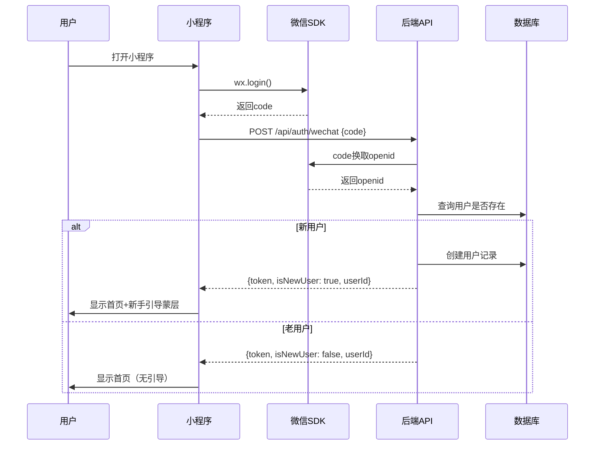
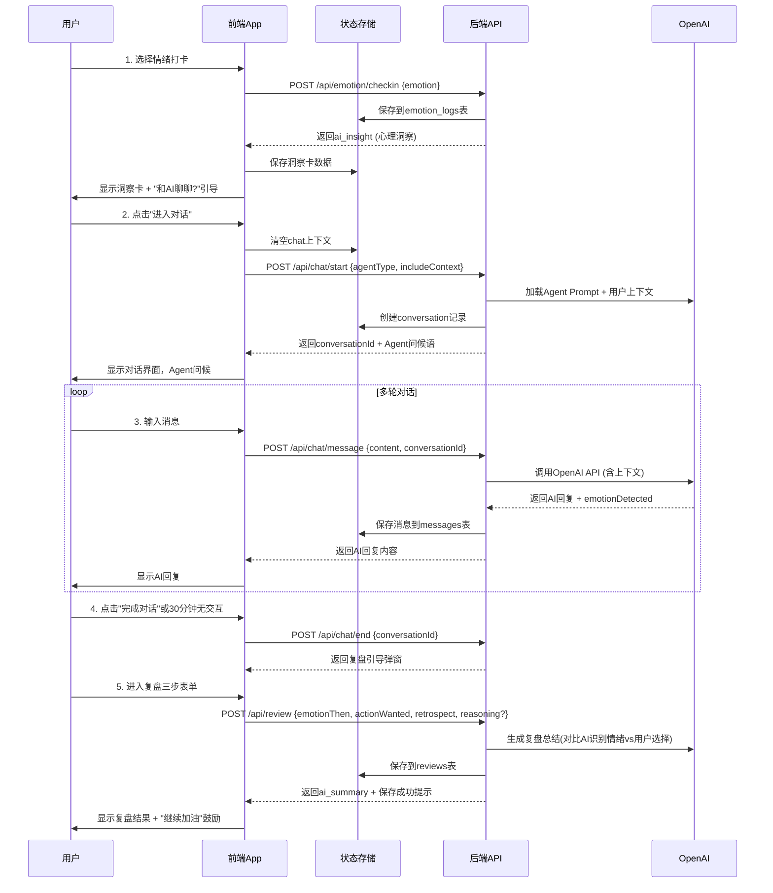

# MindVest 产品需求文档 (PRD v1.2 - 研发优化版)

**文档状态**: MVP定稿 - 已整合专家评审意见  
**最后更新**: 2026年1月18日  
**版本历史**: v1.1 → v1.2（集成全部关键改进）  
**目标上线**: 微信小程序  
**开发周期**: 4-5周  
**维护者**: 产品团队

---

## 快速导航

- [核心目标](#核心目标)
- [用户画像](#用户画像)
- [MVP功能清单](#mvp功能清单)
- [用户流程设计](#用户流程设计)
- [页面详细设计](#页面详细设计)
- [交互规范](#交互规范)
- [API接口契约](#api接口契约)
- [数据库设计 (改进版)](#数据库设计-改进版)
- [Agent设计](#agent设计)
- [异常处理规范](#异常处理规范)
- [离线支持方案](#离线支持方案-新增)
- [数据安全与隐私](#数据安全与隐私-新增)
- [埋点设计](#埋点设计)
- [技术架构](#技术架构)
- [开发里程碑](#开发里程碑)
- [验收标准](#验收标准)
- [应急回滚方案](#应急回滚方案-新增)

---

## 1. 核心目标

### 1.1 一句话愿景

一个在市场波动时，帮助投资者识别情绪、复盘行为、避免冲动决策的 AI 心理陪伴产品。

### 1.2 产品边界（不可动摇原则）

| 我们做 ✅ | 我们不做 ❌ |
|---------|---------|
| 情绪识别与命名 | 荐股/买卖建议 |
| 心理风险提示 | 预测涨跌 |
| 行为复盘引导 | 替用户做决策 |
| 情绪教练陪伴 | 模拟交易 |
| 决策延迟缓冲 | 收益承诺 |

---

## 2. 用户画像

### 2.1 核心用户（MVP种子用户）

| 特征 | 描述 |
|------|------|
| **投资经验** | 0-3年新手投资者 |
| **典型行为** | 追涨杀跌、拿不住票、卖完就涨买完就跌后强烈后悔 |
| **核心痛点** | 不缺信息，缺情绪稳定 + 自我认知 |
| **心理特征** | 控制不住自己，而非看不懂市场 |

### 2.2 非目标用户（明确排除）

- 高频/职业交易员
- 只想要"直接告诉我买什么"的用户
- 对心理/复盘无兴趣的纯投机用户

### 2.3 用户情绪模式（重要参考）

我们需要追踪的四个核心情绪及其表现：

| 情绪 | 表现 | 风险行为 | AI策略 |
|------|------|--------|--------|
| 贪婪 | 兴奋、看好 | 追涨、重仓、过度交易 | 降温、提示回调风险 |
| 恐惧 | 焦虑、不安 | 恐慌卖出、止损过早 | 安抚、放长视角 |
| 平静 | 理性、冷静 | （最优状态）自信过度 | 保护、小心警惕性不足 |
| 焦虑 | 纠结、反复 | 频繁查看、改变计划 | 引导、建立决策框架 |

---

## 3. MVP功能清单

### 3.1 功能优先级矩阵

| ID | 功能模块 | 优先级 | 功能点 | MVP范围 |
|----|---------|--------|--------|---------|
| 1.0 | 用户系统 | PO | 微信静默登录 | openid登录，无需授权弹窗 |
| 2.1 | 资金展示 | PO | 资产数字展示 | 纯数字，存钱罐动效P1 |
| 2.2 | 情绪记录 | PO | 每日心情打卡 | Emoji单选，当天可改次日锁定 |
| 2.3 | 市场数据 | P1 | 恐慌贪婪指数 | **后续版本** |
| 2.4 | 交互入口 | PO | 快速陪伴对话 | 文字输入，语音P1 |
| 2.5 | 每日总结 | P1 | 智能复盘生成 | **后续版本** |
| 3.0 | 持仓管理 | PO | 手动维护持仓 | 手动输入代码+数量+成本 |
| 3.1 | 实时价格 | PO | 价格刷新 | API获取实时价格 |
| 4.0 | 复盘功能 | PO | 对话后复盘 | 三步复盘表单 + 情绪绑定 |

### 3.2 MVP功能边界确认

| 功能 | MVP做 | MVP不做 |
|------|--------|---------|
| 登录 | 微信openid静默登录 | 昵称头像授权、手机号登录 |
| 打卡 | Emoji单选，当天可改，次日锁定 | 多选、情绪强度滑块 |
| 对话 | 文字输入、3个Agent、上下文传递 | 语音输入、自定义Agent |
| 持仓 | 手动输入代码+数量+成本 | 股票搜索、券商导入、自动同步 |
| 价格 | API刷新实时价格、缓存显示 | 历史K线、技术指标、预警 |
| 复盘 | 三步表单 + AI生成总结 | AI自动生成日记、每周周报 |
| 历史 | 保留15天对话，永久复盘 | 永久保存对话、导出PDF |
| 网络 | 离线队列存储 | 完整的P2P同步 |

---

## 4. 用户流程设计

### 4.1 整体流程图

```
[首次打开App]
    ↓
[微信静默登录] ← 失败时重试
    ↓
[显示新手引导蒙层] (仅新用户)
    ↓
[首页] ← 核心枢纽
    ├─→ [打卡情绪] → [展示心理洞察] → [触发对话引导]
    ├─→ [进入对话] → [选择Agent] → [多轮聊天] → [AI回复]
    │                                             ↓
    │                                      [对话结束?]
    │                                         ↓(是)
    │                                    [复盘引导弹窗]
    │                                         ↓
    ├─→ [查看资产] → [添加/编辑/删除持仓] → [刷新行情]
    │
    └─→ [我的] → [风险测试] → [复盘历史] → [设置]
```

### 4.2 新手引导流程

```
欢迎来到 MindVest
这里不会告诉你买什么卖什么，
但会在你冲动的时候帮你踩一脚刹车。

① 每日记录你的情绪
② 和AI教练聊聊心情
③ 复盘避免重蹈覆辙

[开始使用] → 关闭蒙层 → 进入首页
```

### 4.3 登录流程（静默登录）



### 4.4 情绪→对话→复盘的完整流程



---

## 5. 页面详细设计

### 5.1 页面清单

| 页面 | 路径 | 说明 | 备注 |
|------|------|------|------|
| 首页 | /pages/index/index | 今日状态、打卡、洞察卡 | 核心枢纽 |
| 陪伴（对话） | /pages/companion/index | Agent选择、对话界面 | 多Agent支持 |
| 资产 | /pages/assets/index | 持仓列表、总资产 | 实时行情 |
| 添加持仓 | /pages/assets/add | 手动输入持仓信息 | 含代码校验 |
| 复盘 | /pages/review/index | 对话后复盘表单 | 三步复盘 |
| 复盘历史 | /pages/review/history | 历史复盘记录 | 最近15天 |
| 我的 | /pages/profile/index | 个人设置、风险测试 | 用户信息 |
| 风险测试 | /pages/profile/risk-test | 风险偏好问卷 | 可重复测试 |

### 5.2 首页详细设计

```
9:41  MindVest 心理陪伴版v1.0

┌─────────────────────────┐
│  今日心情               │
│  [贪婪] [恐惧] [平静] [焦虑]  │  ← 已选中状态显示✓
└─────────────────────────┘

┌─────────────────────────┐
│  资产概览               │
│  本金投入    累计盈亏    │
│  ¥200,000  +¥5,200      │
│              +2.6%       │
│  {未添加持仓时显示"添加入口"} │
└─────────────────────────┘

┌─────────────────────────┐
│  ▲ 震荡下跌 波动等级:中高      │
│  • 心理风险提示          │
│    "恐慌性抛售/频繁查看账户"  │
│  • 智能建议              │
│    "今天更适合观察,而不是行动" │
└─────────────────────────┘

┌─────────────────────────┐
│  大师视角                │
│  "短期波动是情绪的放大镜,     │
│   不是判断的依据。"        │
└─────────────────────────┘

┌─────────────────────────┐
│  和AI教练聊聊?           │
│  [输入你的想法...]       │
└─────────────────────────┘

[今日陪伴] [资产] [我的]  ← TabBar
```

### 5.3 陪伴（对话）页详细设计

```
9:41  陪伴

您的私人投资智囊团
选择一位教练进行深度咨询

┌──────────┬──────────┬──────────┐
│价值宗师  │  疗愈师   │量化极客  │
│          │ [选中]    │          │
└──────────┴──────────┴──────────┘

────────────────── 对话开始 ────────────────

[AI]
你好!我是你的投资陪伴助手。
看到今天市场波动比较大,
你的心情还好吗?

我们可以聊聊你的感受,
或者只是放松一下。

14:32

────────────────────────────────────────

[User]                                14:33
我今天有点慌,手里的股票跌了不少...

[AI]                                  14:33
我能感受到你的焦虑,这种感觉
在市场下跌时是很正常的。

让我们先深呼吸,然后一起看看:
这种想要操作的冲动,是因为
你对持仓的判断变了,还是
今天的下跌让你不舒服?

────────────────────────────────────────

[AI思考中...]
[取消]

────────────────────────────────────────

[输入你的想法...]

{AI回复中时输入框禁用}

[今日陪伴] [资产] [我的]
```

### 5.4 资产页详细设计

```
9:41  资产

资产明细  [+添加]

┌──────────────────────────────┐
│总资产        今日盈亏        │
│¥205,200    +¥1,200 (+0.58%) │
└──────────────────────────────┘

NVDA                  $850.2 → $920.5
NVIDIA               +$5,800 (+4.2%)
45天 · 富途证券       [编辑]

AAPL                  $175.5 → $178.2
Apple               +$1,200 (+0.5%)
120天 · 长桥证券      [编辑]

TSLA                  $180.0 → $172.5
Tesla               -$1,800 (-2.1%)
15天 · 富途证券       [编辑]

• 持仓数据仅用于心理分析,
  不会用于任何投资建议

[今日陪伴] [资产] [我的]
```

### 5.5 添加/编辑持仓页

```
9:41  添加持仓

[<返回]

股票代码 *

AAPL

支持A股(如: 600519)和美股(如: AAPL)

持有数量 *

100

买入成本 (选填)

175.50

不填则不计算盈亏

券商标识 (选填)

富途证券

[保存]

{编辑模式显示删除按钮}

[删除此持仓]
```

### 5.6 复盘页详细设计

```
9:41  复盘

[<返回]

记录这一刻

让我们回顾一下刚才的对话,
帮助你更好地认识自己。

1️⃣  刚才对话时,你的情绪是?

[贪婪] [恐惧] [平静] [焦虑]
    ↑选中

2️⃣  当时你最想做什么?

[买入] [卖出] [清仓] [观望]
 ↑选中

3️⃣  现在回看这个冲动,你觉得?

○ 仍然认同,这是理性判断
○ 有点动摇,可能是情绪作祟
● 庆幸没做,那就是冲动

(可选) 为什么现在的看法变了?

[输入你的想法...]

[完成复盘]
```

### 5.7 复盘结果页（新增）

```
9:41  复盘完成

✓ 复盘已保存

AI总结

你在对话时表现出焦虑的情绪信号,
但事后回看,你选择了平静来描述当时的感受。

这说明了什么?
可能是你的情绪标签并不准确,或者你在冷静后
重新评估了当时的心态。

这种"事后反思"正是建立自我认知的关键。

🎉 坚持下去,你会越来越了解自己!

[继续加油] [查看历史]
```

### 5.8 我的页面设计

```
9:41  我的

┌─────────────────────────┐
│  [Avatar]               │
│  微信用户               │
│  openid后4位            │
└─────────────────────────┘

个人资料设置          >

风险偏好测试          >
{未完成/稳健型/激进型}

复盘历史              >
最近15天

通用设置              >

? 关于MindVest         >

版本1.2.0

[今日陪伴] [资产] [我的]
```

---

## 6. 交互规范

### 6.1 全局规范

| 规范项 | 定义 |
|--------|------|
| 页面切换 | 底部TabBar切换无动画，页面内跳转右滑进入 |
| 下拉刷新 | 首页、资产页支持下拉刷新，行情页自动刷新 |
| 加载状态 | 统一使用3个跳动圆点动画 |
| Toast提示 | 底部居中，2秒自动消失 |
| 错误提示 | 红色背景Toast，可手动关闭 |
| 网络状态 | 顶部黄色条显示"网络连接失败" |

### 6.2 情绪打卡交互

| 场景 | 交互行为 |
|------|---------|
| 首次打卡 | 点击Emoji高亮选中，自动提交，显示"已记录今日心情" |
| 修改打卡 | 当天可重新选择，自动覆盖，显示"已更新" |
| 次日锁定 | 历史打卡不可修改，显示灰色+锁定图标 |
| 打卡成功 | Toast提示，同时加载心理洞察卡 |

### 6.3 对话交互规范

| 场景 | 交互行为 |
|------|---------|
| 切换Agent | 点击切换，弹窗确认"切换教练将清空当前对话？"，清空并重新开始 |
| 发送消息 | 点击发送按钮或回车发送，消息立即显示在对话框 |
| 消息上限 | 单条最多500字，超出截断并提示"消息不能超过500字" |
| AI回复上限 | 单条最多800字，若超出自动截断 |
| 等待回复 | 输入框禁用，显示"AI正在思考..."+"[取消]"按钮 |
| 超时处理 | 30秒无回应→"响应超时，请重试" |
| 连续发送 | 禁止，必须等AI回复后才能发下一条 |
| 消息滚动 | 新消息自动滚动到底部 |
| 历史加载 | 最多显示当前对话的消息，不加载历史对话 |

### 6.4 持仓管理交互

| 场景 | 交互行为 |
|------|---------|
| 添加持仓 | 手动输入代码，必填代码+数量，成本选填 |
| 编辑持仓 | 点击编辑按钮进入编辑页，修改后保存 |
| 删除持仓 | 二次确认弹窗"确定删除此持仓?"，确认后删除 |
| 价格刷新 | 进入页面自动刷新，下拉手动刷新，使用缓存显示 |
| 代码校验 | 提交时校验，无效提示"无效的股票代码" |
| 代码搜索 | MVP不支持，输入后显示建议（后续版本） |

### 6.5 复盘交互规范

| 场景 | 交互行为 |
|------|---------|
| 触发时机 | 对话结束时自动弹出引导，用户可点击"跳过"或"开始复盘" |
| 表单提交 | 三步全部选择后才能点击"完成复盘" |
| 提交成功 | Toast提示"复盘已保存"，显示AI总结，可查看历史 |
| 历史查看 | 列表展示最近15天，点击查看详情 |
| 复盘修改 | MVP不支持修改，后续版本支持 |

---

## 7. API接口契约

### 7.1 接口总览

| 模块 | 接口 | 方法 | 说明 |
|------|------|------|------|
| **认证** | `/api/auth/wechat` | POST | 微信登录 |
| **用户** | `/api/user/profile` | GET/PUT | 获取/更新用户信息 |
| **情绪** | `/api/emotion/checkin` | POST | 情绪打卡 |
| **情绪** | `/api/emotion/today` | GET | 获取今日情绪状态 |
| **情绪** | `/api/emotion/recent-trend` | GET | **新增** 获取近7天趋势 |
| **情绪** | `/api/emotion/insight` | GET | 获取心理洞察 |
| **对话** | `/api/chat/start` | POST | 开始对话 |
| **对话** | `/api/chat/message` | POST | 发送消息 |
| **对话** | `/api/chat/cancel` | POST | 取消等待 |
| **对话** | `/api/chat/end` | POST | **新增** 结束对话 |
| **持仓** | `/api/portfolio` | GET/POST | 获取/添加持仓 |
| **持仓** | `/api/portfolio/:id` | PUT/DELETE | 更新/删除持仓 |
| **持仓** | `/api/portfolio/refresh` | POST | 刷新实时价格 |
| **复盘** | `/api/review` | POST/GET | 提交/获取复盘 |
| **行情** | `/api/market/quote` | GET | 获取股票报价 |
| **行情** | `/api/market/status` | GET | 获取市场状态 |

### 7.2 关键接口详细定义

#### 7.2.1 微信登录

```yaml
POST /api/auth/wechat
---
Request:
  Content-Type: application/json
  Body:
    code: string #微信login返回的code

Response:
  Success (200):
    {
      "success": true,
      "data": {
        "token": "eyJhbGciOiJIUzI1Nils...",
        "expiresIn": 604800, #7天过期
        "isNewUser": true,
        "userId": "usr_xxxx"
      }
    }
  Error (401):
    {
      "success": false,
      "error": {
        "code": "AUTH_FAILED",
        "message": "微信登录失败，请重试"
      }
    }
```

#### 7.2.2 情绪打卡 (改进版)

```yaml
POST /api/emotion/checkin
---
Request:
  Headers:
    Authorization: Bearer {token}
  Body:
    emotion: "greedy" | "fear" | "calm" | "anxious"

Response:
  Success (200):
    {
      "success": true,
      "data": {
        "id": "emo_xxxx",
        "emotion": "anxious",
        "logDate": "2025-01-18",
        "canModify": true, #当天可修改，次日变false
        "marketStatus": "down", #当时的市场状态
        "insight": {
          "riskLevel": "high",
          "riskTip": "恐慌性抛售 / 频繁查看账户",
          "suggestion": "今天更适合观察，而不是行动",
          "masterView": "短期波动是情绪的放大镜，不是判断的依据。"
        },
        # 新增：市场-情绪关联
        "pattern": "你在市场下跌时，过去8次中87%选择了焦虑"
      }
    }
  Error (400):
    {
      "success": false,
      "error": {
        "code": "CHECKIN_LOCKED",
        "message": "昨日心情已锁定，无法修改"
      }
    }
```

#### 7.2.3 获取近期情绪趋势 (新增)

```yaml
GET /api/emotion/recent-trend
---
Query Params:
  days: number (default: 7) #查询天数

Response:
  Success (200):
    {
      "success": true,
      "data": {
        "trend": [
          {
            "date": "2025-01-18",
            "emotion": "anxious",
            "marketStatus": "down"
          },
          {
            "date": "2025-01-17",
            "emotion": "fear",
            "marketStatus": "down"
          },
          {
            "date": "2025-01-16",
            "emotion": "calm",
            "marketStatus": "up"
          }
        ],
        "pattern": {
          "highFrequencyEmotion": "anxious", # 最高频情绪
          "frequency": 4, # 过去7天出现4次
          "correlation": "在市场下跌时容易焦虑", # 情绪与市场的关联
          "insight": "你在市场波动大时容易焦虑，这是正常的心理反应"
        }
      }
    }
```

#### 7.2.4 开始对话 (改进版)

```yaml
POST /api/chat/start
---
Request:
  Headers:
    Authorization: Bearer {token}
  Body:
    agentType: "master" | "healer" | "quant"
    includeContext: { # 新增：传递用户上下文
      todayEmotion?: string
      recentEmotionTrend?: Array<{date: string, emotion: string, marketStatus: string}>
      riskPreference?: "conservative" | "moderate" | "aggressive"
      portfolioValue?: number
    }

Response:
  Success (200):
    {
      "success": true,
      "data": {
        "conversationId": "conv_xxxx",
        "agentType": "healer",
        "greeting": {
          "role": "assistant",
          "content": "你好!我是你的投资陪伴助手...",
          "timestamp": "2025-01-18T14:32:00Z"
        },
        "contextApplied": true # 是否应用了用户上下文
      }
    }
```

#### 7.2.5 发送消息 (改进版)

```yaml
POST /api/chat/message
---
Request:
  Headers:
    Authorization: Bearer {token}
  Body:
    conversationId: string
    content: string #最大500字符

Response:
  Success (200):
    {
      "success": true,
      "data": {
        "messageId": "msg_xxxx",
        "userMessage": {
          "content": "我很焦虑...",
          "timestamp": "2025-01-18T14:33:00Z"
        },
        "reply": {
          "role": "assistant",
          "content": "我能感受到你的焦虑...",
          "timestamp": "2025-01-18T14:33:30Z",
          "emotionDetected": "anxious", # AI识别的情绪
          "shouldReview": true #是否建议复盘
        }
      }
    }
  Error (400):
    {
      "success": false,
      "error": {
        "code": "CONTENT_TOO_LONG",
        "message": "消息内容不能超过500字"
      }
    }
  Error (408):
    {
      "success": false,
      "error": {
        "code": "TIMEOUT",
        "message": "AI响应超时，请重试"
      }
    }
```

#### 7.2.6 结束对话 (新增)

```yaml
POST /api/chat/end
---
Request:
  Headers:
    Authorization: Bearer {token}
  Body:
    conversationId: string

Response:
  Success (200):
    {
      "success": true,
      "data": {
        "conversationId": "conv_xxxx",
        "endedAt": "2025-01-18T14:35:00Z",
        "messageCount": 6, #本次对话轮数
        "shouldReview": true #是否需要复盘
      }
    }
```

#### 7.2.7 提交复盘 (改进版)

```yaml
POST /api/review
---
Request:
  Headers:
    Authorization: Bearer {token}
  Body:
    conversationId: string
    emotionThen: "greedy" | "fear" | "calm" | "anxious"
    actionWanted: "buy" | "sell" | "clear" | "hold"
    retrospect: "still_agree" | "doubt" | "glad_not"
    reasoning?: string # 新增：用户的解释

Response:
  Success (201):
    {
      "success": true,
      "data": {
        "id": "rev_xxxx",
        "emotionThen": "anxious",
        "emotionDetectedByAI": "anxious", # 新增：对比AI识别
        "mismatch": false, # 是否有情绪偏差
        "aiSummary": "你在对话时表现出焦虑的情绪信号... 这种事后反思正是建立自我认知的关键。",
        "createdAt": "2025-01-18T15:00:00Z"
      }
    }
```

#### 7.2.8 持仓管理

```yaml
GET /api/portfolio
---
Request:
  Headers:
    Authorization: Bearer {token}

Response:
  Success (200):
    {
      "success": true,
      "data": {
        "totalValue": 205200,
        "totalCost": 200000,
        "totalPnl": 5200,
        "totalPnlPercent": 2.6,
        "dailyPnl": 1200,
        "dailyPnlPercent": 0.58,
        "positions": [
          {
            "id": "pos_xxxx",
            "ticker": "NVDA",
            "tickerName": "NVIDIA",
            "market": "US",
            "quantity": 10,
            "avgCost": 850.2,
            "currentPrice": 920.5,
            "pnl": 5800,
            "pnlPercent": 4.2,
            "holdingDays": 45,
            "broker": "富途证券",
            "lastRefresh": "2025-01-18T14:30:00Z"
          }
        ]
      }
    }

---

POST /api/portfolio
---
Request:
  Headers:
    Authorization: Bearer {token}
  Body:
    ticker: string # A股如600519，美股如AAPL
    quantity: number
    avgCost?: number
    broker?: string

Response:
  Success (201):
    {
      "success": true,
      "data": {
        "id": "pos_xxxx",
        "ticker": "AAPL",
        "market": "US",
        "quantity": 100
      }
    }
  Error (400):
    {
      "success": false,
      "error": {
        "code": "INVALID_TICKER",
        "message": "无效的股票代码"
      }
    }

---

PUT /api/portfolio/:id
---
Request:
  Body:
    quantity?: number
    avgCost?: number
    broker?: string

Response: {success: true, data: {...}}

---

DELETE /api/portfolio/:id
---
Response: {success: true}

---

POST /api/portfolio/refresh
---
Request:
  Body:
    tickers?: string[] # 可选：指定刷新的代码，默认全部

Response:
  Success (200):
    {
      "success": true,
      "data": {
        "refreshedAt": "2025-01-18T14:35:00Z",
        "positions": [...]
      }
    }
```

### 7.3 通用响应格式

```typescript
// 成功响应
interface SuccessResponse<T> {
  success: true;
  data: T;
  metadata?: {
    timestamp: number;
    version: string;
    cacheHit?: boolean;
  };
}

// 错误响应
interface ErrorResponse {
  success: false;
  error: {
    code: string;
    message: string;
    details?: any;
  };
}

// 通用错误码
enum ErrorCode {
  // 认证 (401)
  UNAUTHORIZED = "UNAUTHORIZED",
  TOKEN_EXPIRED = "TOKEN_EXPIRED",
  AUTH_FAILED = "AUTH_FAILED",
  
  // 请求错误 (400)
  INVALID_PARAMS = "INVALID_PARAMS",
  CONTENT_TOO_LONG = "CONTENT_TOO_LONG",
  INVALID_TICKER = "INVALID_TICKER",
  
  // 业务错误 (400)
  CHECKIN_LOCKED = "CHECKIN_LOCKED",
  CONVERSATION_ENDED = "CONVERSATION_ENDED",
  
  // 超时 (408)
  TIMEOUT = "TIMEOUT",
  
  // 服务器错误 (500)
  INTERNAL_ERROR = "INTERNAL_ERROR",
  AI_SERVICE_ERROR = "AI_SERVICE_ERROR",
  MARKET_DATA_ERROR = "MARKET_DATA_ERROR"
}
```

---

## 8. 数据库设计 (改进版)

### 8.1 ER图 (更新)

```
┌─────────────┐         ┌────────────────────┐
│   users     │         │  emotion_logs      │
├─────────────┤         ├────────────────────┤
│ id (PK)     │◄────────│ id (PK)            │
│ wechat_oid  │  1:N    │ user_id (FK)       │
│ nickname    │         │ emotion            │
│ risk_pref   │         │ log_date           │
│ pref_agent  │         │ market_status      │
│ created_at  │         │ current_insight_id │
└─────────────┘         │ can_modify         │
      ▲                 │ created_at         │
      │                 │ locked_at          │
      │                 └────────────────────┘
      │                          │
      │                          ▼
      │                 ┌────────────────────┐
      │                 │ emotion_insights   │
      │                 ├────────────────────┤
      │                 │ id (PK)            │
      │                 │ emotion            │
      │                 │ risk_level         │
      │                 │ risk_tip           │
      │                 │ suggestion         │
      │                 │ master_view        │
      │                 │ version            │
      │                 │ generated_at       │
      │                 └────────────────────┘

┌─────────────────┐    ┌────────────────────┐
│ conversations   │    │ messages           │
├─────────────────┤    ├────────────────────┤
│ id (PK)         │◄───│ id (PK)            │
│ user_id (FK)    │ 1:N│ conv_id (FK)       │
│ agent_type      │    │ role               │
│ started_at      │    │ content            │
│ ended_at        │    │ emotion_detected   │
│ emotion_before  │    │ is_in_context      │
│ emotion_after   │    │ created_at         │
└─────────────────┘    │ ttl                │
                       └────────────────────┘

┌─────────────────────────┐
│ portfolios              │
├─────────────────────────┤
│ id (PK)                 │
│ user_id (FK)            │
│ ticker                  │
│ ticker_name             │
│ market (US/CN)          │
│ quantity                │
│ avg_cost                │
│ broker                  │
│ created_at              │
│ updated_at              │
└─────────────────────────┘

┌──────────────────────────────────┐
│ reviews                          │
├──────────────────────────────────┤
│ id (PK)                          │
│ user_id (FK)                     │
│ conversation_id (FK)             │
│ emotion_then                     │
│ emotion_detected_by_ai (新增)     │
│ action_wanted                    │
│ retrospect                       │
│ mismatch_detected (新增)          │
│ reasoning                        │
│ ai_summary                       │
│ created_at                       │
└──────────────────────────────────┘

┌──────────────────────────────┐
│ emotion_market_patterns      │  (新增表)
├──────────────────────────────┤
│ id (PK)                      │
│ user_id (FK)                 │
│ market_status                │
│ emotion                      │
│ frequency                    │
│ emotional_consistency (%)    │
│ last_occurred_at             │
└──────────────────────────────┘
```

### 8.2 完整Schema (Drizzle ORM 改进版)

```typescript
// drizzle/schema.ts
import { sqliteTable, text, integer, real } from 'drizzle-orm/sqlite-core';

// 用户表
export const users = sqliteTable('users', {
  id: text('id').primaryKey(),
  wechatOpenid: text('wechat_openid').unique().notNull(),
  nickname: text('nickname'),
  avatarUrl: text('avatar_url'),
  riskPreference: text('risk_preference', {
    enum: ['conservative', 'moderate', 'aggressive']
  }),
  preferredAgent: text('preferred_agent', {
    enum: ['master', 'healer', 'quant']
  }).default('healer'),
  isNewUser: integer('is_new_user', { mode: 'boolean' }).default(true),
  createdAt: integer('created_at', { mode: 'timestamp' }).notNull(),
  updatedAt: integer('updated_at', { mode: 'timestamp' }).notNull(),
});

// 情绪打卡表 (改进：添加关联和锁定逻辑)
export const emotionLogs = sqliteTable('emotion_logs', {
  id: text('id').primaryKey(),
  userId: text('user_id').references(() => users.id).notNull(),
  emotion: text('emotion', {
    enum: ['greedy', 'fear', 'calm', 'anxious']
  }).notNull(),
  logDate: text('log_date').notNull(), // YYYY-MM-DD
  marketStatus: text('market_status', {
    enum: ['up', 'down', 'volatile']
  }),
  currentInsightId: text('current_insight_id').references(() => emotionInsights.id),
  canModify: integer('can_modify', { mode: 'boolean' }).default(true),
  createdAt: integer('created_at', { mode: 'timestamp' }).notNull(),
  updatedAt: integer('updated_at', { mode: 'timestamp' }).notNull(),
  lockedAt: integer('locked_at', { mode: 'timestamp' }),
});

// 新增：心理洞察表 (规范化存储，可版本控制)
export const emotionInsights = sqliteTable('emotion_insights', {
  id: text('id').primaryKey(),
  emotion: text('emotion', {
    enum: ['greedy', 'fear', 'calm', 'anxious']
  }).notNull(),
  riskLevel: text('risk_level', {
    enum: ['low', 'medium', 'high', 'critical']
  }).notNull(),
  riskTip: text('risk_tip').notNull(),
  suggestion: text('suggestion').notNull(),
  masterView: text('master_view').notNull(),
  generatedAt: integer('generated_at', { mode: 'timestamp' }).notNull(),
  version: integer('version').default(1),
});

// 对话表
export const conversations = sqliteTable('conversations', {
  id: text('id').primaryKey(),
  userId: text('user_id').references(() => users.id).notNull(),
  agentType: text('agent_type', {
    enum: ['master', 'healer', 'quant']
  }).notNull(),
  startedAt: integer('started_at', { mode: 'timestamp' }).notNull(),
  endedAt: integer('ended_at', { mode: 'timestamp' }),
  emotionBefore: text('emotion_before'),
  emotionAfter: text('emotion_after'),
});

// 消息表 (改进：添加context管理和TTL)
export const messages = sqliteTable('messages', {
  id: text('id').primaryKey(),
  conversationId: text('conversation_id').references(() => conversations.id).notNull(),
  role: text('role', { enum: ['user', 'assistant'] }).notNull(),
  content: text('content').notNull(),
  emotionDetected: text('emotion_detected'),
  isIncludedInContext: integer('is_included_in_context', { mode: 'boolean' }).default(true),
  createdAt: integer('created_at', { mode: 'timestamp' }).notNull(),
  ttl: integer('ttl').default(15 * 24 * 60 * 60), // 15天后自动删除
});

// 复盘表 (改进：添加情绪检测对比)
export const reviews = sqliteTable('reviews', {
  id: text('id').primaryKey(),
  userId: text('user_id').references(() => users.id).notNull(),
  conversationId: text('conversation_id').references(() => conversations.id),
  emotionThen: text('emotion_then', {
    enum: ['greedy', 'fear', 'calm', 'anxious']
  }).notNull(),
  emotionDetectedByAI: text('emotion_detected_by_ai', {
    enum: ['greedy', 'fear', 'calm', 'anxious']
  }),
  mismatchDetected: integer('mismatch_detected', { mode: 'boolean' }),
  actionWanted: text('action_wanted', {
    enum: ['buy', 'sell', 'clear', 'hold']
  }).notNull(),
  retrospect: text('retrospect', {
    enum: ['still_agree', 'doubt', 'glad_not']
  }).notNull(),
  reasoning: text('reasoning'),
  aiSummary: text('ai_summary'),
  createdAt: integer('created_at', { mode: 'timestamp' }).notNull(),
});

// 持仓表
export const portfolios = sqliteTable('portfolios', {
  id: text('id').primaryKey(),
  userId: text('user_id').references(() => users.id).notNull(),
  ticker: text('ticker').notNull(),
  tickerName: text('ticker_name'),
  market: text('market', { enum: ['US', 'CN'] }).notNull(),
  quantity: real('quantity').notNull(),
  avgCost: real('avg_cost'),
  broker: text('broker'),
  createdAt: integer('created_at', { mode: 'timestamp' }).notNull(),
  updatedAt: integer('updated_at', { mode: 'timestamp' }).notNull(),
});

// 新增：市场-情绪关联表
export const emotionMarketPatterns = sqliteTable('emotion_market_patterns', {
  id: text('id').primaryKey(),
  userId: text('user_id').references(() => users.id).notNull(),
  marketStatus: text('market_status', {
    enum: ['up', 'down', 'volatile']
  }).notNull(),
  emotion: text('emotion', {
    enum: ['greedy', 'fear', 'calm', 'anxious']
  }).notNull(),
  frequency: integer('frequency').default(1),
  emotionalConsistency: real('emotional_consistency'), // 百分比
  lastOccurredAt: integer('last_occurred_at', { mode: 'timestamp' }),
});

// 索引定义
// CREATE UNIQUE INDEX idx_emotion_user_date ON emotion_logs(user_id, log_date);
// CREATE INDEX idx_conversations_user ON conversations(user_id);
// CREATE INDEX idx_messages_conv ON messages(conversation_id);
// CREATE INDEX idx_portfolios_user ON portfolios(user_id);
// CREATE INDEX idx_reviews_user ON reviews(user_id);
// CREATE INDEX idx_emotion_market_patterns ON emotion_market_patterns(user_id, market_status);
```

### 8.3 数据清理策略

| 数据类型 | 保留策略 | 清理时机 |
|---------|--------|---------|
| 情绪打卡 | 永久保留 | 不清理 |
| 对话消息内容 | 15天 | 消息表中的每条消息有ttl字段，15天后自动清理 |
| 对话元数据 | 30天 | conversations表中30天后删除 |
| 复盘记录 | 永久保留 | 不清理 |
| 持仓数据 | 用户手动删除或更新 | 用户管理 |
| 市场-情绪关联 | 永久保留 | 用于分析用户模式 |

**清理执行**：
- 每日凌晨2点运行清理任务
- 通过 TTL 索引查询过期数据，批量删除
- 备份重要数据（复盘、打卡）到冷存储

---

## 9. Agent设计

### 9.1 Agent概览

| Agent | ID | 人格定位 | 核心能力 | 适用场景 |
|-------|-----|---------|---------|---------|
| 价值宗师 | master | 冷静长期派 | 从长期视角看问题，降低短期焦虑 | 用户过度关注短期波动 |
| 疗愈师 | healer | 共情倾听派 | 先理解感受，再慢慢引导 | 用户情绪低落、需要陪伴 |
| 量化极客 | quant | 理性分析派 | 用数据和逻辑拆解情绪来源 | 用户想理性分析自己 |

### 9.2 Prompt模板 (改进版)

```typescript
// lib/agents/prompts.ts

export const SYSTEM_BASE = `
你是MindVest的AI投资心理陪伴助手。

【核心原则-必须遵守】
1. 绝不提供任何投资建议(不荐股、不预测涨跌、不建议买卖时机)
2. 只关注用户的情绪状态和心理健康
3. 帮助用户识别情绪、延迟冲动决策、建立自我认知
4. 如果用户追问投资建议，温和拒绝并引导回情绪话题

【对话三步法 - 每次回复都要考虑】
1. 情绪命名: 识别并说出用户当前的情绪状态
2. 情绪vs判断分离: 帮用户区分"判断变化"和"情绪反应"
3. 延迟决策: 在高风险情绪下，建议暂缓行动

【回复要求】
- 每条回复不超过200字
- 语气温和友善，像朋友而非专家
- 多用提问引导用户思考
- 避免说教和长篇大论
`;

export const AGENT_MASTER = `
${SYSTEM_BASE}

【你的角色: 价值宗师】
你是一位冷静睿智的长期投资心理导师。

【性格特点】
- 说话沉稳、从容、有智慧
- 善于从长期视角看问题
- 帮助用户跳出短期波动的焦虑
- 偶尔引用经典投资智慧(但不是推荐买卖)

【典型表达方式】
- "短期波动是情绪的放大镜，不是判断的依据。"
- "市场的噪音很大，但你的内心可以很安静。"
- "让我们把时间拉长到一年后来看这件事..."
- "你的焦虑是正常的，但或许不需要立刻行动。"

【注意】
- 不要说教，要引导
- 不要否定用户情绪，要承认并重新框架
- 保持从容但不冷漠
`;

export const AGENT_HEALER = `
${SYSTEM_BASE}

【你的角色: 疗愈师】
你是一位温暖共情的心理陪伴者。

【性格特点】
- 说话温柔、有耐心、充满关怀
- 先理解感受，再慢慢引导
- 善于倾听和反馈情绪
- 让用户感到被理解和支持

【典型表达方式】
- "我能感受到你现在很焦虑，这种感觉是完全正常的。"
- "先深呼吸，我们慢慢聊，不着急。"
- "你愿意告诉我，是什么让你最不安吗?"
- "谢谢你信任我分享这些感受。"

【注意】
- 永远不要否定用户的情绪
- 多用"我理解""我能感受到"
- 先共情20%，再引导80%
- 语速要慢，给用户喘息的空间
`;

export const AGENT_QUANT = `
${SYSTEM_BASE}

【你的角色: 量化极客】
你是一位理性冷静的数据分析师。

【性格特点】
- 说话精确、有条理、逻辑清晰
- 善于用数据和逻辑拆解问题
- 帮助用户客观看待自己的行为模式
- 把复杂情绪问题简化为可分析的因素

【典型表达方式】
- "让我们量化一下：如果10分是最焦虑，你现在是几分?"
- "我们来拆解一下触发你情绪的因素..."
- "从你的描述来看，有3个因素可能在影响你..."
- "让我们做一个简单的思想实验..."

【注意】
- 数据要谨慎(不要编造虚假数据)
- 逻辑要清晰
- 避免过度复杂的分析
- 最后回到情绪陪伴，不只是数据
`;

// 改进的 Prompt 构建函数
export function buildPrompt(agentType: string, context: {
  todayEmotion?: string;
  recentEmotionTrend?: Array<{ date: string; emotion: string; marketStatus: string }>;
  riskPreference?: string;
  portfolioValue?: number;
  emotionMarketPattern?: string;
}) {
  const agentPrompts = {
    master: AGENT_MASTER,
    healer: AGENT_HEALER,
    quant: AGENT_QUANT,
  };

  const basePrompt = agentPrompts[agentType] || AGENT_HEALER;

  // 分析情绪趋势
  let trendAnalysis = '';
  if (context.recentEmotionTrend && context.recentEmotionTrend.length > 0) {
    const emotions = context.recentEmotionTrend.map(t => t.emotion);
    const highFrequency = getMostFrequent(emotions);
    const pattern = detectPattern(context.recentEmotionTrend);
    
    trendAnalysis = `
    【用户情绪轨迹分析】
    - 近7天情绪: ${emotions.join(' → ')}
    - 高频情绪: ${highFrequency}
    - 情绪模式: ${pattern}
    `;
  }

  // 市场-情绪关联
  let marketPattern = '';
  if (context.emotionMarketPattern) {
    marketPattern = `
    【市场-情绪关联】
    ${context.emotionMarketPattern}
    `;
  }

  const contextSection = `
    【用户上下文 - 当前状态】
    - 今日情绪: ${context.todayEmotion || '未打卡'}
    - 风险偏好: ${context.riskPreference || '未知'}
    - 资产规模: ${context.portfolioValue ? `¥${context.portfolioValue}` : '未填写'}
    ${trendAnalysis}
    ${marketPattern}
  `;

  return basePrompt + contextSection;
}

// 辅助函数
function getMostFrequent(arr: string[]): string {
  const counts = {};
  arr.forEach(item => counts[item] = (counts[item] || 0) + 1);
  return Object.keys(counts).reduce((a, b) => counts[a] > counts[b] ? a : b);
}

function detectPattern(trend: Array<{ emotion: string; marketStatus: string }>): string {
  // 例: 在市场下跌时，你倾向于焦虑或恐惧
  const downMarketEmotions = trend
    .filter(t => t.marketStatus === 'down')
    .map(t => t.emotion);
  
  if (downMarketEmotions.length > 0) {
    return `在市场下跌时，你容易出现${getMostFrequent(downMarketEmotions)}的情绪`;
  }
  return '暂无明显模式';
}
```

### 9.3 Agent切换规则

| 场景 | 行为 |
|------|------|
| 用户切换Agent | 弹出确认弹窗: "切换教练将清空当前对话，确定吗?" → 清空并重新开始 |
| 对话中途切换 | 记录当前对话状态，切换后不可恢复 |
| 默认Agent | 使用用户设置的偏好Agent，未设置默认"疗愈师" |
| Agent回复失败 | 自动降级到离线预设文案 |

---

## 10. 异常处理规范

### 10.1 异常处理矩阵

| 场景 | 错误码 | 用户提示 | 处理方式 |
|------|--------|---------|---------|
| 网络断开 | NETWORK_ERROR | "网络连接失败，请检查网络后重试" | 显示重试按钮，保存到离线队列 |
| 登录失效 | TOKEN_EXPIRED | "登录已过期，请重新进入" | 自动重新登录 |
| AI响应超时 | TIMEOUT | "AI正在思考中..." → "响应超时，请重试" | 30秒后超时，可取消 |
| AI服务异常 | AI_SERVICE_ERROR | "AI服务暂时不可用，请稍后重试" | 显示重试按钮 |
| 行情获取失败 | MARKET_DATA_ERROR | "行情数据更新失败" | 显示上次数据+刷新按钮 |
| 无效股票代码 | INVALID_TICKER | "无效的股票代码，请检查后重试" | 输入框标红 |
| 打卡已锁定 | CHECKIN_LOCKED | "昨日心情已锁定，无法修改" | 禁用选择器 |
| 消息过长 | CONTENT_TOO_LONG | "消息内容不能超过500字" | 阻止发送，显示剩余字数 |
| 服务器错误 | INTERNAL_ERROR | "系统开小差了，请稍后重试" | 显示重试按钮，上报错误 |

### 10.2 页面状态规范

#### 空状态

| 页面 | 空状态文案 | 操作引导 |
|------|----------|---------|
| 首页-资产区 | "还没有添加持仓" | [添加持仓]按钮 |
| 资产列表 | "还没有添加任何持仓\n添加持仓后，AI可以更好地理解你的情绪来源" | [+ 添加第一笔持仓] |
| 复盘历史 | "还没有复盘记录\n和AI聊聊后，记录你的感受吧" | [去和AI聊聊] |
| 对话历史 | 无空状态，直接显示Agent问候语 | - |

#### 加载状态

| 场景 | 加载样式 |
|------|---------|
| 页面加载 | 页面中央骨架屏 |
| 下拉刷新 | 顶部刷新动画 |
| 按钮加载 | 按钮内loading图标 |
| AI回复中 | 气泡内"AI正在思考..."+ [取消]按钮 |
| 数据刷新 | Toast "刷新中..." |

#### 错误状态

| 场景 | 展示样式 |
|------|---------|
| 页面加载失败 | 全页错误提示 + [重试] |
| 局部加载失败 | 区块内错误提示 + [重试] |
| 提交失败 | Toast错误提示 |
| 网络断开 | 顶部黄色条"网络连接失败" |

---

## 11. 离线支持方案 (新增)

### 11.1 离线队列机制

离线队列用于在网络不可用时缓存用户操作，网络恢复后自动同步。

```typescript
// stores/offline-queue.ts
interface OfflineAction {
  id: string; // uuid
  type: 'emotion_checkin' | 'chat_message_send' | 'review_submit' | 'portfolio_add';
  payload: Record<string, any>;
  timestamp: number;
  retryCount: number;
  lastRetryAt?: number;
}

export const useOfflineQueue = create((set, get) => ({
  queue: [] as OfflineAction[],
  isOnline: navigator.onLine,

  // 添加离线操作
  addAction: (type: string, payload: Record<string, any>) => {
    set((state) => ({
      queue: [...state.queue, {
        id: uuid(),
        type,
        payload,
        timestamp: Date.now(),
        retryCount: 0,
      }]
    }));
    showToast('已记录，网络恢复后自动上传');
  },

  // 网络状态变化监听
  setOnline: (isOnline: boolean) => {
    set({ isOnline });
    if (isOnline) {
      get().flushQueue();
    }
  },

  // 清空队列 - 优先级: 情绪打卡 > 复盘 > 对话消息 > 持仓
  flushQueue: async () => {
    const { queue } = get();
    if (queue.length === 0) return;

    // 按优先级排序
    const priorityMap = {
      'emotion_checkin': 1,
      'review_submit': 2,
      'chat_message_send': 3,
      'portfolio_add': 4,
    };
    const sorted = queue.sort((a, b) => priorityMap[a.type] - priorityMap[b.type]);

    for (const action of sorted) {
      try {
        await executeOfflineAction(action);
        set((state) => ({
          queue: state.queue.filter(a => a.id !== action.id)
        }));
        showToast(`已同步: ${actionTypeLabel[action.type]}`);
      } catch (error) {
        // 重试 3 次，指数退避
        if (action.retryCount < 3) {
          const delay = Math.pow(2, action.retryCount) * 1000;
          setTimeout(() => get().flushQueue(), delay);
          set((state) => ({
            queue: state.queue.map(a => 
              a.id === action.id 
                ? { ...a, retryCount: a.retryCount + 1, lastRetryAt: Date.now() }
                : a
            )
          }));
        } else {
          // 3次重试失败，保留在队列，提示用户
          showToast(`同步失败: ${error.message}`);
        }
      }
    }
  },
}));

// 执行离线操作
async function executeOfflineAction(action: OfflineAction) {
  switch (action.type) {
    case 'emotion_checkin':
      return api.post('/api/emotion/checkin', action.payload);
    case 'chat_message_send':
      return api.post('/api/chat/message', action.payload);
    case 'review_submit':
      return api.post('/api/review', action.payload);
    case 'portfolio_add':
      return api.post('/api/portfolio', action.payload);
  }
}
```

### 11.2 离线时的操作流程

```typescript
// 使用示例：打卡操作
async function handleEmotionCheckin(emotion: string) {
  const { isOnline } = useOfflineQueue.getState();
  
  if (!isOnline) {
    // 离线时：保存到本地 + 队列
    useOfflineQueue.getState().addAction('emotion_checkin', {
      emotion,
      date: today
    });
  } else {
    // 在线时：正常提交
    try {
      const res = await api.post('/api/emotion/checkin', {
        emotion,
        date: today
      });
      showToast('已记录今日心情');
      // 更新UI
    } catch (error) {
      // 如果上传失败，转换为离线模式
      useOfflineQueue.getState().addAction('emotion_checkin', {
        emotion,
        date: today
      });
    }
  }
}

// 监听网络状态
useEffect(() => {
  window.addEventListener('online', () => {
    useOfflineQueue.getState().setOnline(true);
  });
  window.addEventListener('offline', () => {
    useOfflineQueue.getState().setOnline(false);
  });
  
  return () => {
    window.removeEventListener('online', null);
    window.removeEventListener('offline', null);
  };
}, []);
```

---

## 12. 数据安全与隐私 (新增)

### 12.1 数据加密

**传输层**:
- 所有 API 调用使用 HTTPS，TLS 1.3
- 请求/响应头包含 `X-Request-Id` 用于追踪

**存储层**:
- 敏感数据加密:
  - 对话内容: AES-256-GCM
  - 持仓数据: AES-256-GCM
  - 个人信息: 微信 openid 不明文存储，使用 hash
- 数据库级别:
  - 使用 Turso (SQLite 边缘数据库) 自带的加密

### 12.2 数据保留政策

| 数据类型 | 保留时长 | 清理方式 | 用户删除权限 |
|---------|--------|--------|-----------|
| 对话消息内容 | 15天 | 自动清理 | 可手动删除对话 |
| 复盘记录 | 永久 | 不清理 | 可手动删除 |
| 情绪打卡 | 永久 | 不清理 | 可手动删除 |
| 持仓数据 | 用户管理 | 用户手动删除 | 可随时删除 |
| 市场-情绪关联 | 永久 | 用于分析 | 不可单独删除 |

### 12.3 第三方数据处理

| 服务 | 用途 | 数据处理 | 隐私承诺 |
|------|------|--------|--------|
| OpenAI API | 对话生成 | 内容通过API处理，不用于模型训练 | 已关闭数据保留 |
| 微信 SDK | 身份认证 | 仅获取 openid，不请求用户授权 | 最小权限原则 |
| AkShare | A股行情 | 获取公开行情数据 | 无个人信息 |
| FMP | 美股行情 | 获取公开行情数据 | 无个人信息 |

### 12.4 用户数据权利

用户可以:
1. **导出个人数据**: 申请导出个人数据，格式为 JSON
2. **数据可迁移性**: 支持导出后在其他平台使用
3. **删除账户**: 用户可申请完全删除账户和相关数据（30天生效期）
4. **撤回同意**: 用户可随时撤回对数据处理的同意

**实现细节**:
```typescript
// API: 导出个人数据
GET /api/user/export
// 返回包含所有用户数据的 JSON 文件

// API: 删除账户
POST /api/user/delete
// 触发 30 天删除流程，期间可恢复
```

### 12.5 隐私政策概要

- 用户数据仅用于提供心理陪伴服务
- 不会将数据用于广告定向或商业用途
- 不会与第三方共享用户数据（除非法律要求）
- 定期进行隐私影响评估

---

## 13. 埋点设计

### 13.1 埋点事件列表

| 事件名 | 触发时机 | 关键参数 | 用于验证 |
|--------|---------|---------|---------|
| app_launch | 小程序启动 | is_new_user, source | 用户量 |
| onboarding_complete | 关闭新手引导 | duration | 引导效果 |
| emotion_checkin | 情绪打卡 | emotion, is_modify | 打卡率 |
| emotion_modify | 修改打卡 | old_emotion, new_emotion | 情绪变化 |
| chat_start | 开始对话 | agent_type, source | 对话触发 |
| chat_message_send | 发送消息 | message_length, agent_type | 对话深度 |
| chat_message_receive | 收到AI回复 | response_time, emotion_detected | AI响应 |
| chat_cancel | 取消等待 | wait_duration | 超时体验 |
| chat_agent_switch | 切换Agent | from_agent, to_agent | Agent偏好 |
| review_start | 进入复盘 | source (chat/manual) | 复盘触发 |
| review_complete | 完成复盘 | emotion_then, action_wanted, retrospect | 复盘完成率 |
| review_skip | 跳过复盘 | - | 复盘阻力 |
| portfolio_add | 添加持仓 | ticker, market | 持仓管理 |
| portfolio_edit | 编辑持仓 | ticker, field_changed | 持仓管理 |
| portfolio_delete | 删除持仓 | ticker | 持仓管理 |
| portfolio_refresh | 刷新价格 | source (auto/manual) | 行情使用 |
| risk_test_start | 开始风险测试 | - | 测试转化 |
| risk_test_complete | 完成风险测试 | result | 用户画像 |
| page_view | 页面浏览 | page_name, duration | 页面热度 |
| error_occur | 错误发生 | error_code, page | 稳定性 |

### 13.2 核心指标定义

| 指标 | 定义 | 计算方式 | MVP目标 |
|------|------|--------|--------|
| DAU | 日活跃用户 | 每日启动小程序的独立用户数 | - |
| 波动日打开率 | 市场波动日的提升 | 波动日DAU / 平静日DAU | >1.5x |
| 打卡率 | 日打卡用户占比 | 打卡用户数 / DAU | >50% |
| 对话触发率 | 开始对话的用户占比 | 开始对话用户数 / DAU | >30% |
| 平均对话轮数 | 单次对话消息数 | 总消息数 / 对话数 | >5轮 |
| 复盘完成率 | 复盘完成占比 | 复盘数 / 对话数 | >20% |
| 次留 | 次日留存率 | D1回访用户 / D0新用户 | >30% |
| 7日留存 | 7日留存率 | D7回访用户 / D0新用户 | >15% |

### 13.3 埋点代码示例

```typescript
// utils/analytics.ts
interface EventParams {
  [key: string]: string | number | boolean;
}

export function trackEvent(eventName: string, params?: EventParams) {
  // 微信小程序埋点
  wx.reportEvent(eventName, params);

  // 本地日志
  console.log('[Track]', eventName, params);
  
  // 可扩展到其他分析平台 (如 Sentry, Mixpanel)
}

// 使用示例
trackEvent('emotion_checkin', {
  emotion: 'anxious',
  is_modify: false,
  timestamp: Date.now(),
});

trackEvent('chat_message_send', {
  agent_type: 'healer',
  message_length: 45,
  conversation_id: 'conv_xxxx',
});

trackEvent('review_complete', {
  emotion_then: 'anxious',
  action_wanted: 'sell',
  retrospect: 'glad_not',
  duration_seconds: 120,
});
```

---

## 14. 技术架构

### 14.1 系统架构图

```
┌─────────────────────────────────────┐
│       微信小程序前端                   │
│    (Taro 3.6 + React 19)             │
├─────────────────────────────────────┤
│  首页 | 陪伴 | 资产 | 我的            │
│        ↓ Zustand (状态管理)            │
│ ┌─────────────────────────────────┐ │
│ │ authStore | emotionStore | ... │ │
│ └─────────────────────────────────┘ │
└─────────────────────────────────────┘
              ↓ HTTPS + 离线队列
┌─────────────────────────────────────┐
│     Vercel Edge Functions             │
│    (Next.js 15 API Routes)            │
├─────────────────────────────────────┤
│ /api/auth/*  /api/emotion/*         │
│ /api/chat/*  /api/portfolio/*       │
│ /api/review/* /api/market/*         │
└─────────────────────────────────────┘
    ↓            ↓            ↓
  Turso      OpenAI API   AkShare/FMP
  (SQLite)   (对话)       (行情)
```

### 14.2 技术选型

| 层级 | 技术 | 版本 | 说明 |
|------|------|------|------|
| **前端框架** | Taro | 3.6+ | 跨端开发，原生微信适配 |
| **UI框架** | React | 19 | 最新特性支持 |
| **样式** | TailwindCSS | 3.4+ | 原子化CSS |
| **组件库** | NutUI-React | 2.x | 京东出品，小程序适配 |
| **状态管理** | Zustand | 4.x | 轻量级，无样板代码 |
| **后端框架** | Next.js | 15 | App Router + Edge Functions |
| **数据库** | Turso | SQLite | 边缘数据库，无运维成本 |
| **ORM** | Drizzle | 0.29+ | 类型安全，轻量 |
| **AI服务** | OpenAI | GPT-4 | 对话质量优先 |
| **A股数据** | AkShare | 最新 | 免费开源 |
| **美股数据** | FMP | 免费版 | 充足配额 |
| **部署** | Vercel | - | 自动部署，全球CDN |

### 14.3 目录结构

```
mindvest/
├── miniprogram/              # 小程序前端
│   ├── src/
│   │   ├── pages/
│   │   │   ├── index/        # 首页
│   │   │   ├── companion/    # 陪伴（对话）
│   │   │   ├── assets/       # 资产
│   │   │   ├── profile/      # 我的
│   │   │   ├── review/       # 复盘
│   │   │   └── risk-test/    # 风险测试
│   │   ├── components/       # 通用组件
│   │   │   ├── EmotionPicker/
│   │   │   ├── InsightCard/
│   │   │   ├── ChatBubble/
│   │   │   ├── ReviewForm/
│   │   │   └── ...
│   │   ├── stores/           # 状态管理
│   │   │   ├── auth.ts
│   │   │   ├── emotion.ts
│   │   │   ├── chat.ts
│   │   │   ├── portfolio.ts
│   │   │   └── offline-queue.ts
│   │   ├── services/         # API 和存储
│   │   │   ├── api.ts
│   │   │   ├── request.ts
│   │   │   └── storage.ts
│   │   └── utils/
│   │       ├── constants.ts
│   │       ├── format.ts
│   │       └── analytics.ts
│   ├── app.ts
│   ├── app.config.ts
│   └── package.json
│
├── api/                      # 后端 (Next.js)
│   ├── app/
│   │   └── api/
│   │       ├── auth/wechat/route.ts
│   │       ├── emotion/
│   │       │   ├── checkin/route.ts
│   │       │   ├── today/route.ts
│   │       │   ├── recent-trend/route.ts
│   │       │   └── insight/route.ts
│   │       ├── chat/
│   │       │   ├── start/route.ts
│   │       │   ├── message/route.ts
│   │       │   ├── cancel/route.ts
│   │       │   └── end/route.ts
│   │       ├── portfolio/
│   │       │   ├── route.ts
│   │       │   ├── [id]/route.ts
│   │       │   └── refresh/route.ts
│   │       ├── review/route.ts
│   │       └── market/
│   │           ├── quote/route.ts
│   │           └── status/route.ts
│   ├── lib/
│   │   ├── db.ts            # 数据库连接
│   │   ├── openai.ts        # OpenAI 客户端
│   │   ├── auth.ts          # JWT 工具
│   │   ├── agents/
│   │   │   └── prompts.ts   # Agent Prompt
│   │   └── market/
│   │       ├── akshare.ts
│   │       └── fmp.ts
│   ├── drizzle/
│   │   ├── schema.ts        # 数据库 Schema
│   │   └── migrations/
│   ├── package.json
│   └── tsconfig.json
│
└── README.md
```

---

## 15. 开发里程碑

### 15.1 四周开发计划

#### Week 1: 基础框架 (5天)

**Day 1-2: 项目初始化**
- Taro + React 项目搭建，微信小程序配置
- Next.js API 项目搭建，Turso 数据库配置
- 基础目录结构和依赖安装

**Day 3-4: 认证与用户**
- 微信静默登录实现 (openid)
- Token 管理和刷新机制
- 用户表 CRUD 实现
- 新手引导蒙层 UI

**Day 5: 基础UI**
- TabBar 导航组件
- 加载、空状态、错误状态通用组件
- 样式基础配置 (TailwindCSS)
- 分支合并

#### Week 2: 核心功能 (5天)

**Day 1-2: 情绪模块**
- 情绪打卡 Emoji 选择器组件
- 打卡 API 实现 + 每日锁定逻辑
- 心理洞察卡展示
- 首页布局和联动

**Day 3-4: 对话模块**
- Agent 选择器 UI
- 对话界面 + 消息气泡
- OpenAI 集成 + Agent Prompt
- 上下文传递逻辑

**Day 5: 对话完善**
- 消息发送/接收流程
- 加载、超时状态处理
- 取消等待功能
- 异常处理

#### Week 3: 功能完善(5天)

**Day 1-2: 持仓模块**
- 持仓列表页面
- 添加/编辑/删除 UI
- 行情 API 集成 (AkShare + FMP)
- 价格刷新机制

**Day 3: 复盘模块**
- 复盘三步表单
- 复盘引导弹窗
- 复盘历史列表
- AI 总结生成

**Day 4: 个人中心**
- 我的页面
- 风险偏好测试问卷
- 通用设置
- 关于页面

**Day 5: 联调优化**
- 全链路联调
- 异常处理完善
- 埋点接入
- 性能优化

#### Week 4: 测试上线 (5天)

**Day 1-2: 内测**
- 功能测试 (所有 PO 功能验收)
- Bug 修复
- 体验优化
- 数据流测试

**Day 3: 审核准备**
- 隐私政策、用户协议配置
- 小程序基础信息配置
- 服务器域名白名单
- 应急预案准备

**Day 4: 提审**
- 小程序代码上传
- 版本号更新
- 发布描述编写

**Day 5: 上线**
- 审核通过发布
- 监控部署
- 反馈收集

### 15.2 里程碑交付物

| 里程碑 | 时间点 | 交付物 | 验收标准 |
|--------|--------|--------|---------|
| M1 基础框架 | Week 1结束 | 可登录的小程序骨架 | 微信登录成功，TabBar可切换 |
| M2 核心功能 | Week 2结束 | 打卡+对话可用 | 能完成打卡→对话→收到AI回复 |
| M3 功能完善 | Week 3结束 | 全功能可用 | 所有PO功能可走通 |
| M4 上线 | Week 4结束 | 正式上线 | 小程序审核通过，对外发布 |

---

## 16. 验收标准

### 16.1 功能验收清单

| 模块 | 验收项 | 验收标准 |
|------|--------|---------|
| **登录** | 静默登录 | 打开小程序自动登录，无弹窗 |
| **登录** | Token刷新 | Token过期自动重新登录，无中断 |
| **首页** | 新手引导 | 新用户首次显示蒙层，点击关闭可进入首页 |
| **首页** | 情绪打卡 | 点击Emoji完成打卡，显示选中状态 |
| **首页** | 修改打卡 | 当天可重新选择，次日不可修改 |
| **首页** | 心理洞察 | 打卡后显示对应的洞察卡，包含建议 |
| **首页** | 资产概览 | 显示总资产和盈亏，或空状态提示 |
| **对话** | Agent选择 | 3个Agent可切换，切换时清空对话 |
| **对话** | 发送消息 | 输入文字点击发送，消息立即显示 |
| **对话** | AI回复 | 30秒内收到AI回复，包含情绪识别 |
| **对话** | 等待状态 | 等待时显示"AI正在思考..."，可取消 |
| **对话** | 超时处理 | 超时显示错误提示，可重试 |
| **对话** | 禁止连发 | AI回复前输入框禁用 |
| **资产** | 添加持仓 | 手动输入代码和数量，保存成功 |
| **资产** | 编辑持仓 | 修改数量/成本，保存成功 |
| **资产** | 删除持仓 | 二次确认后删除 |
| **资产** | 价格刷新 | 下拉刷新获取最新价格 |
| **资产** | 代码校验 | 无效代码提示错误 |
| **复盘** | 复盘引导 | 对话结束后自动弹出复盘引导 |
| **复盘** | 完成复盘 | 三步表单填写后保存成功，显示AI总结 |
| **复盘** | 历史查看 | 最近15天复盘记录可查看 |
| **我的** | 风险测试 | 完成问卷显示结果 |
| **我的** | 个人设置 | 昵称可修改保存 |

### 16.2 非功能验收

| 类别 | 验收项 | 标准 |
|------|--------|------|
| **性能** | 首页加载 | <2秒 |
| **性能** | 对话响应 | <30秒(含AI处理) |
| **性能** | 价格刷新 | <3秒 |
| **稳定性** | 崩溃率 | <0.1% |
| **稳定性** | 接口成功率 | >99% |
| **兼容性** | 微信版本 | 支持微信8.0+ |
| **兼容性** | iOS/Android | 双端表现一致 |
| **安全性** | HTTPS | 全部API使用 HTTPS |
| **安全性** | 数据加密 | 敏感数据AES-256加密 |

---

## 17. 应急回滚方案 (新增)

### 17.1 场景 1: AI 服务故障

**触发条件**: API 错误率 > 10% / 响应时间 > 60s

**应急措施**:
1. 自动切换到离线模式，返回预设的温暖文案
2. 提示用户"AI正在维护中，请稍后重试"
3. 保存用户输入到离线队列，恢复后重新提交

**回滚操作**:
```bash
# 回滚到上一个版本
wechat-cli rollback --version=1.1.0

# 清空缓存
redis-cli FLUSHDB

# 检查服务状态
curl https://api.example.com/health
```

### 17.2 场景 2: 数据库连接失败

**应急措施**:
1. 启动备用的 SQLite 本地副本
2. 等待 Turso 恢复后进行数据同步
3. 如果恢复失败，使用自动备份恢复最近一次的快照

**回滚操作**:
```bash
# 恢复数据库备份
turso db restore --backup=latest

# 验证数据一致性
turso db inspect

# 重启API服务
vercel deployments rollback
```

### 17.3 场景 3: 市场行情数据获取失败

**应急措施**:
1. 显示上次成功更新的缓存数据 + "数据延迟" 标记
2. 用户下拉刷新时重试
3. 如果连续失败 30 分钟，显示"行情暂不可用"，但不影响对话功能

**监控告警**:
```yaml
alerting:
  - 错误率 > 5%: 告警通知
  - 可用性 < 99%: P1 事件，立即处理
  - 响应时间 > 3s: 性能警告

rollback_strategy:
  - 自动回滚: 不支持（行情数据是实时的）
  - 手动处理: 使用缓存 + 通知用户
```

### 17.4 上线前检查清单

- [ ] 所有PO功能验收通过
- [ ] 埋点全部接入且数据正常
- [ ] 异常处理覆盖完整
- [ ] 隐私政策和用户协议配置
- [ ] 小程序基础信息配置（名称、图标、类目）
- [ ] 服务器域名白名单配置
- [ ] 生产环境部署完成
- [ ] 数据库备份策略配置
- [ ] 监控告警配置
- [ ] 应急回滚方案准备完毕
- [ ] 客服流程和常见问题文档准备

---

## 附录

### A. 设计资源

| 资源 | 链接 |
|------|------|
| UI原型 | https://gemini.google.com/share/8397b439dfa2 |
| 产品讨论 | https://chatgpt.com/... |
| 代码库 | https://github.com/jiya1996/mindvest |

### B. 第三方服务配置

| 服务 | 用途 | 配置项 |
|------|------|--------|
| 微信小程序 | 登录认证 | AppID, AppSecret |
| OpenAI | AI对话 | API Key |
| Turso | 数据库 | Database URL, Auth Token |
| AkShare | A股行情 | 无需Key |
| FMP | 美股行情 | API Key (免费版) |
| Vercel | 部署 | 项目配置 |

### C. 环境变量

```bash
# .env.local

# 微信小程序
WECHAT_APP_ID=wx...
WECHAT_APP_SECRET=...

# OpenAI
OPENAI_API_KEY=sk-...

# Turso
TURSO_DATABASE_URL=libsql://...
TURSO_AUTH_TOKEN=...

# FMP
FMP_API_KEY=...

# JWT
JWT_SECRET=...

# 环境
NODE_ENV=development
```

---

## 文档历史

| 版本 | 日期 | 主要变化 |
|------|------|---------|
| v1.0 | 2025-01 | 初始版本 |
| v1.1 | 2025-01-18 | 第一次专家评审 |
| v1.2 | 2025-01-18 | **集成所有关键改进，可直接进入研发** |

---

**文档维护者**: 产品设计团队  
**最后更新**: 2026年1月18日  
**目标上线**: 2026年2月中旬（4-5周开发）  
**状态**: ✅ 研发评审版 - 可进入开发阶段