# 伴投 (Budvest) - 产品价值地图

> 通过可视化图表,快速理解产品定位、用户价值和核心策略

---

## 1. 产品定位画布

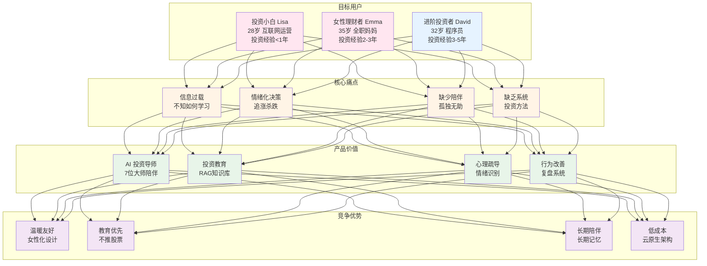

---

## 2. 用户旅程地图

### 2.1 新用户首次体验

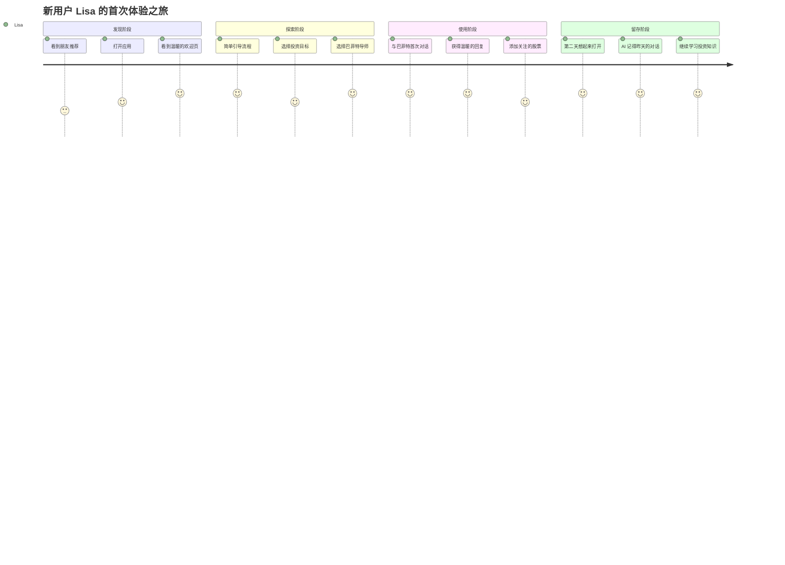

### 2.2 长期用户日常使用

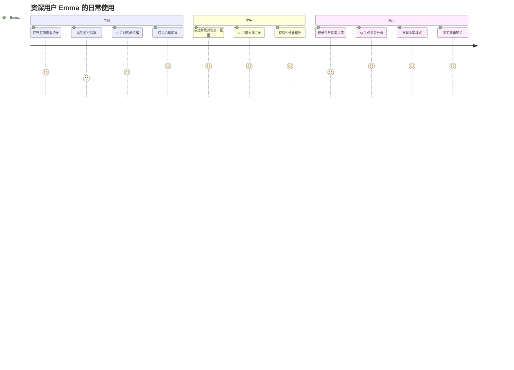

---

## 3. 功能价值矩阵

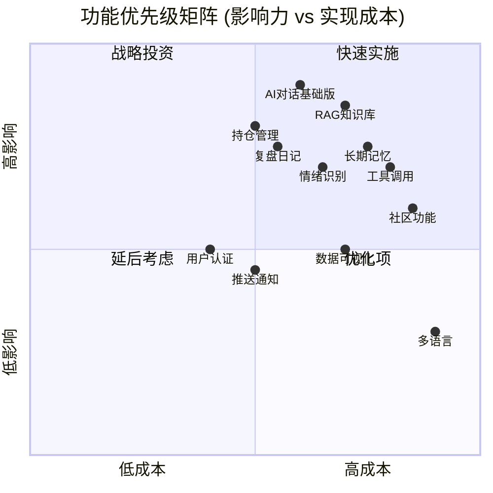

**象限说明**:
- **象限 1 (右上)**: 高影响高成本,需要战略投资
  - RAG 知识库、工具调用
- **象限 2 (左上)**: 高影响低成本,优先快速实施
  - AI 对话基础版、持仓管理、复盘日记、情绪识别
- **象限 3 (左下)**: 低影响低成本,可优化提升体验
  - 用户认证、推送通知
- **象限 4 (右下)**: 低影响高成本,暂时延后
  - 社区功能、多语言

---

## 4. 产品核心指标体系

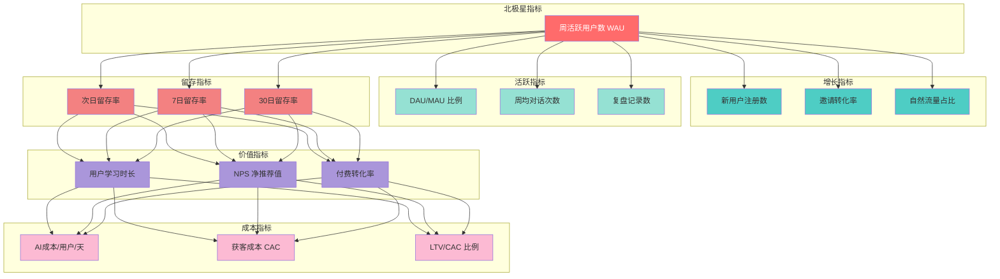

---

## 5. AI 能力进化路径

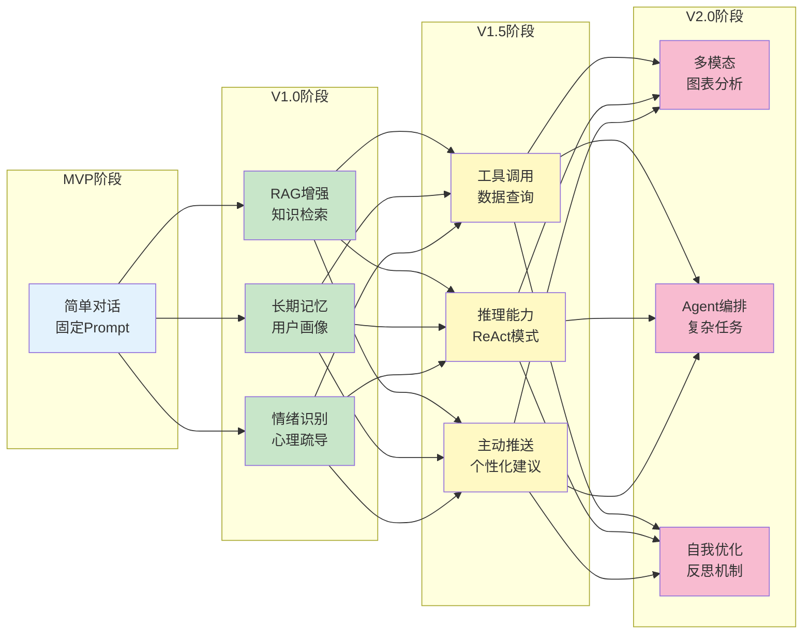

---

## 6. 技术架构战略

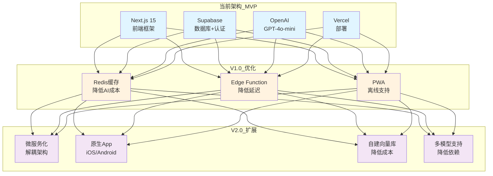

---

## 7. 商业模式画布

### 7.1 价值主张

| 维度 | 内容 |
|------|------|
| **解决的问题** | 投资小白不知如何学习、情绪化决策、缺少专业陪伴 |
| **提供的价值** | AI 投资教育、心理疏导、决策改善、长期陪伴 |
| **独特性** | 女性化设计、教育优先、长期记忆、低门槛 |

### 7.2 收入来源 (未来探索)

1. **免费增值模式**
   - 基础功能免费 (每日 10 次对话)
   - 高级订阅 ¥29/月 (无限对话 + 高级导师 + 优先支持)
   
2. **增值服务**
   - AI 导师定制服务 ¥99/次
   - 一对一投资咨询 ¥299/小时
   - 投资策略报告 ¥199/份

3. **To B 服务**
   - 投资顾问工具授权 ¥999/月/账号
   - 企业培训服务 ¥9999/场
   - API 开放平台 按调用量计费

### 7.3 成本结构

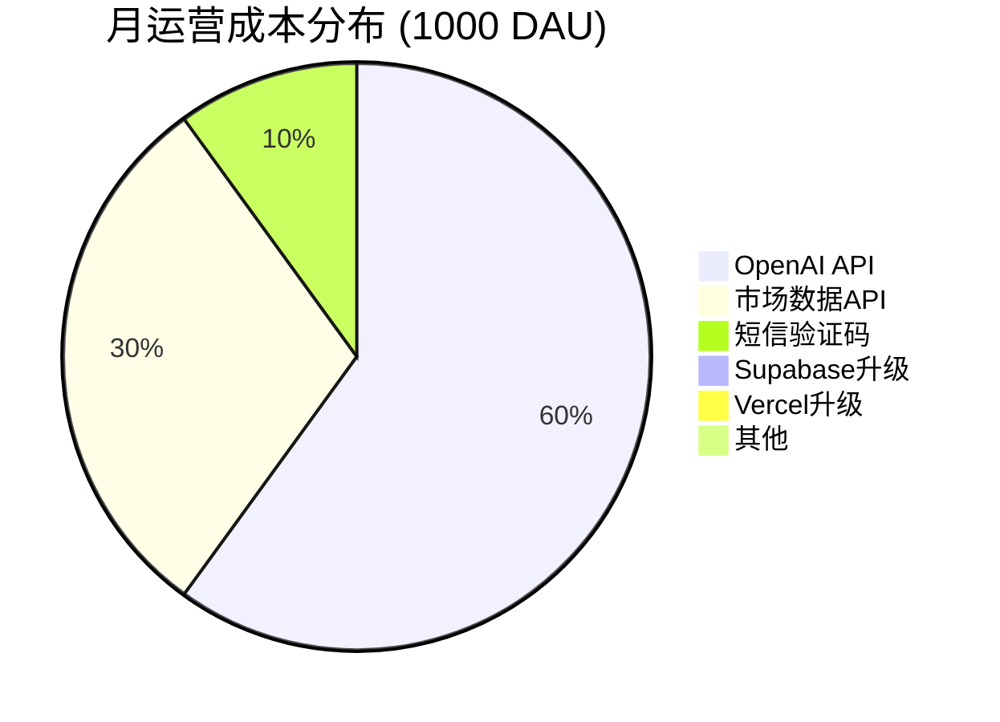

**总成本**: ~$50/月 (MVP 阶段)

---

## 8. 竞争策略地图

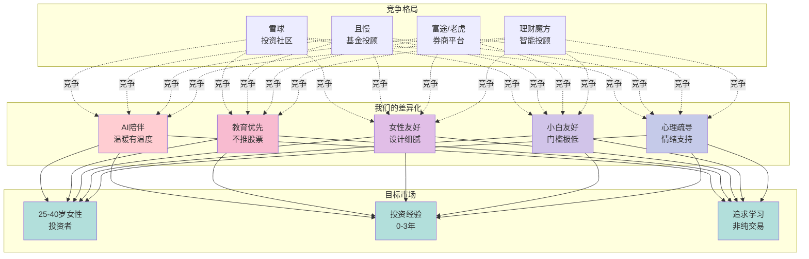

### 差异化优势详解

| 维度 | 雪球 | 且慢 | 富途 | 理财魔方 | **伴投 (我们)** |
|------|------|------|------|----------|----------------|
| **AI 能力** | ❌ | ❌ | ⚠️ 基础 | ⚠️ 算法 | ✅ **GPT-4o 深度对话** |
| **教育内容** | ⚠️ UGC | ✅ 专业 | ⚠️ 一般 | ❌ | ✅ **大师级知识库** |
| **心理陪伴** | ❌ | ❌ | ❌ | ❌ | ✅ **情绪识别+疏导** |
| **女性友好** | ❌ 男性为主 | ⚠️ 中性 | ❌ 交易导向 | ⚠️ 中性 | ✅ **专为女性设计** |
| **小白门槛** | ❌ 高 | ⚠️ 中 | ❌ 高 | ✅ 低 | ✅ **极低** |
| **产品温度** | ⚠️ 社区热闹 | ⚠️ 理性 | ❌ 冷冰冰 | ❌ 工具感强 | ✅ **温暖陪伴** |

---

## 9. 增长飞轮

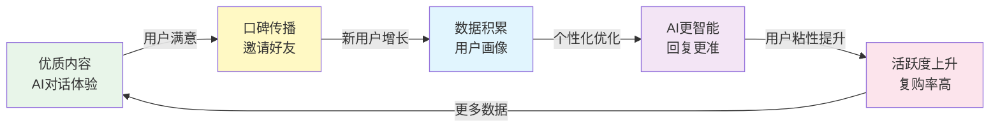

**增长策略**:
1. **产品驱动增长 (PLG)**: 优质体验 → 口碑传播
2. **内容营销**: 小红书、知乎、公众号投放高质量投资教育内容
3. **KOL 合作**: 邀请女性理财 KOL 体验和推荐
4. **裂变机制**: 邀请好友解锁高级导师
5. **社区建设**: 用户间交流分享,形成网络效应

---

## 10. 产品路线图

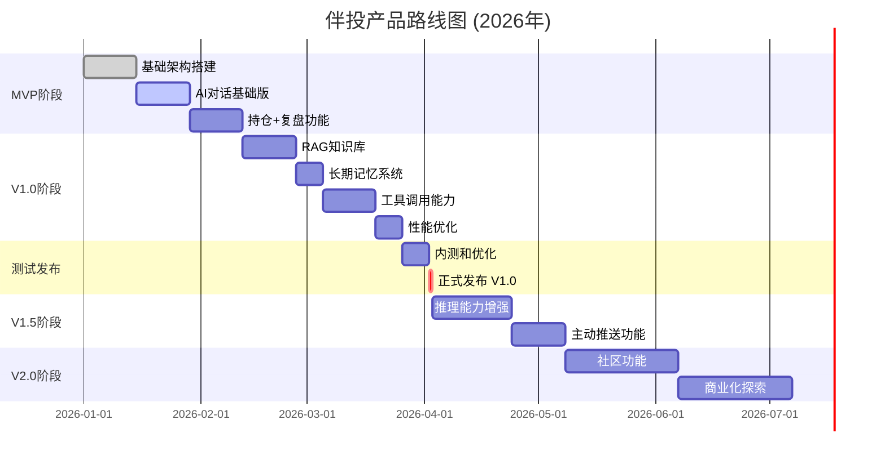

---

## 11. 关键成功因素 (CSF)

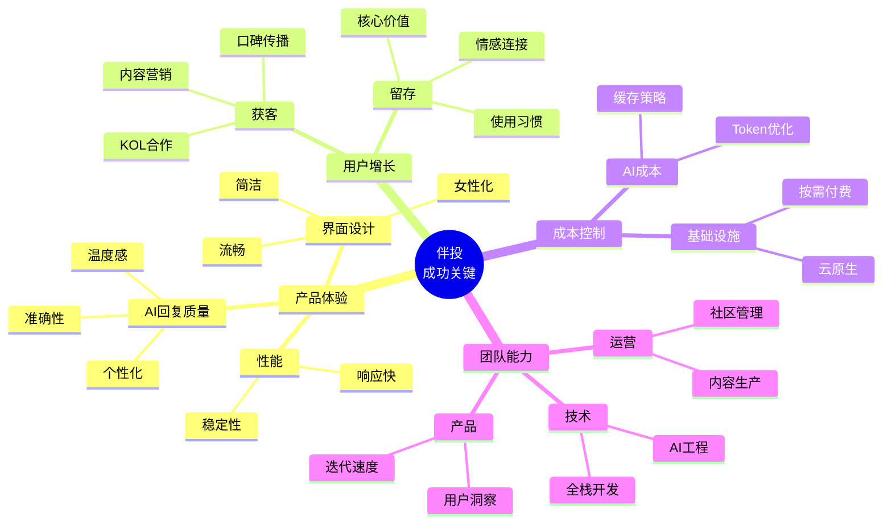

---

## 12. 风险应对矩阵

| 风险类型 | 严重程度 | 发生概率 | 应对策略 | 负责人 |
|---------|---------|---------|---------|--------|
| **AI成本失控** | 🔴 高 | 🟡 中 | 1. 实施缓存<br/>2. Token限制<br/>3. 用户配额 | 技术负责人 |
| **用户留存低** | 🔴 高 | 🟡 中 | 1. 快速迭代<br/>2. 用户访谈<br/>3. 增加粘性功能 | 产品负责人 |
| **OpenAI不稳定** | 🔴 高 | 🟡 中 | 1. 重试机制<br/>2. 降级方案<br/>3. 备用模型 | 技术负责人 |
| **竞品跟进** | 🟡 中 | 🔴 高 | 1. 强化差异化<br/>2. 快速迭代<br/>3. 建立壁垒 | CEO |
| **合规风险** | 🔴 高 | 🟢 低 | 1. 避免买卖建议<br/>2. 免责声明<br/>3. 法律咨询 | CEO |
| **数据安全** | 🟡 中 | 🟢 低 | 1. 加密存储<br/>2. 定期备份<br/>3. 权限控制 | 技术负责人 |

**图例**: 🔴 高  🟡 中  🟢 低

---

## 13. 总结: 产品价值公式

```
伴投的价值 = 
    (AI导师的专业度 × 知识库的丰富度) 
  + (情绪识别的准确度 × 心理疏导的温度)
  + (长期记忆的精准度 × 个性化建议的相关度)
  + (产品设计的友好度 × 使用体验的流畅度)
  - AI成本 - 运营成本 - 用户学习成本
```

### 核心信念

> **让投资不再孤独,让学习充满温暖**

我们相信:
- 🌸 **女性投资者需要更有温度的产品**
- 📚 **投资教育比推荐股票更重要**
- 🤝 **AI 可以成为值得信赖的长期伙伴**
- 🎯 **理性决策源于自我认知和持续学习**

### 愿景

成为**最懂女性投资者的 AI 伴侣**,陪伴百万用户在投资的道路上稳健前行。

---

**🚀 伴你投资,与你同行。**
