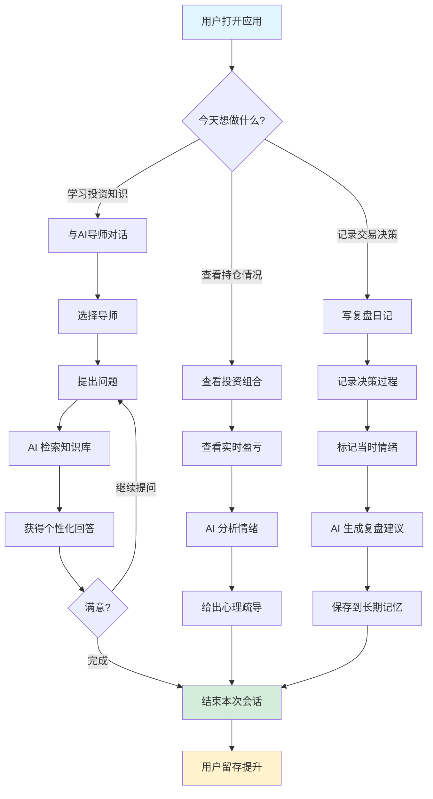
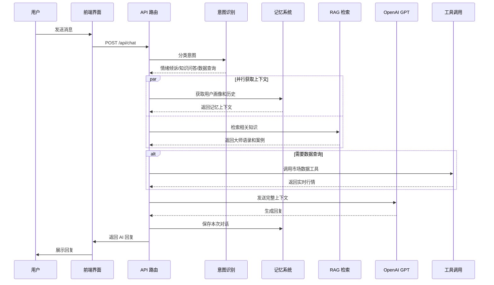
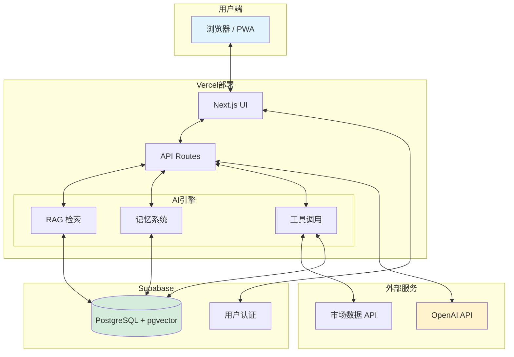

# 伴投 (Budvest) - 产品需求文档 (PRD)

## 文档元数据

| 项目 | 内容 |
|------|------|
| **版本** | V1.0 |
| **日期** | 2026年1月17日 |
| **作者** | Product Team |
| **状态** | Draft |
| **产品名称** | 伴投 Budvest |
| **产品定位** | 投教为主 + 心理陪伴 - 面向小白/女性用户的智能投资助手 |

---

## 1. 项目背景与目标

### 1.1 背景

#### 市场痛点

1. **信息过载，无从下手**
   - 投资小白面对海量信息不知如何筛选和学习
   - 缺乏系统性的投资知识体系
   - 难以找到适合自己的投资风格和策略

2. **情绪化决策，损失惨重**
   - 投资者常在恐慌中割肉、在狂热中追高
   - 缺乏专业的心理疏导和陪伴
   - 没有工具帮助记录和反思自己的决策过程

3. **女性投资者被忽视**
   - 现有投资产品多为男性视角设计
   - 女性用户需要更温暖、更有同理心的产品体验
   - 缺少针对女性投资心理特点的产品

4. **投资教育门槛高**
   - 传统投资书籍晦涩难懂
   - 线下课程成本高昂
   - 缺乏个性化、互动式的学习方式

#### 为什么现在做这个产品?

- **AI 技术成熟**: GPT-4o 等大语言模型使智能对话和个性化教育成为可能
- **云原生架构**: Supabase + Vercel 等无服务器技术大幅降低开发和运营成本
- **市场空白**: 国内尚无真正以"心理陪伴+投教"为核心的 AI 投资产品
- **用户需求明确**: 通过前期调研发现,小白和女性投资者对此类产品有强烈需求

### 1.2 产品目标

#### 商业目标

1. **用户增长**
   - 6个月内获得 10,000 活跃用户
   - 重点覆盖 25-40 岁女性投资者群体
   - 用户月留存率达到 40% 以上

2. **成本控制**
   - 月运营成本控制在 $50 以内 (MVP 阶段)
   - AI 调用成本优化至每用户 $0.02/天以下
   - 使用云原生架构实现近零维护成本

3. **品牌定位**
   - 打造"最懂女性投资者的 AI 伴侣"品牌形象
   - 建立投资心理陪伴领域的专业口碑

#### 用户价值

1. **学习价值**
   - 降低投资学习门槛,让小白也能轻松入门
   - 通过 AI 导师一对一教学,建立系统的投资知识体系
   - 学习大师投资智慧,避免常见投资误区

2. **情绪价值**
   - 在投资决策时获得专业的心理支持
   - 通过记录和复盘培养理性投资习惯
   - 不再孤独,有"懂你"的 AI 伴侣陪伴

3. **决策价值**
   - 基于个人情况获得个性化建议
   - 通过长期记忆系统,AI 越来越懂你
   - 避免情绪化决策,提升投资成功率

### 1.3 成功指标 (KPIs)

| 指标类别 | 核心指标 | 目标值 (3个月) | 备注 |
|---------|---------|---------------|------|
| **用户活跃** | DAU | 500+ | 日活跃用户数 |
| **用户活跃** | WAU/MAU | > 50% | 用户粘性 |
| **用户留存** | 次日留存 | > 60% | 首日体验关键 |
| **用户留存** | 7日留存 | > 40% | 产品价值验证 |
| **功能使用** | AI 对话会话数 | 平均 5次/周 | 核心功能使用频率 |
| **功能使用** | 复盘记录数 | 平均 2次/周 | 养成习惯关键 |
| **用户满意度** | NPS | > 40 | 净推荐值 |
| **成本控制** | AI 成本/用户/天 | < $0.02 | 商业可持续性 |

---

## 2. 用户角色 (Personas)

### 主要用户画像 1: 小白投资者 Lisa

```
👤 基本信息
- 年龄: 28 岁
- 职业: 互联网公司运营专员
- 收入: 年薪 20-30 万
- 投资经验: < 1 年

💭 核心需求
- 想学习投资但不知从何开始
- 害怕亏钱,希望有人指导
- 想了解股票、基金等基础概念

😰 痛点
- 看不懂 K 线图和财务报表
- 被各种"老师"割韭菜
- 追涨杀跌,总是亏钱

🎯 使用场景
- 午休时间学习投资知识
- 买入股票前问问 AI 意见
- 亏钱后找 AI 倾诉和复盘
```

### 主要用户画像 2: 女性理财者 Emma

```
👤 基本信息
- 年龄: 35 岁
- 职业: 全职妈妈 / 自由职业者
- 收入: 家庭年收入 50-80 万
- 投资经验: 2-3 年 (基金为主)

💭 核心需求
- 管理家庭资产,实现保值增值
- 需要温暖、专业的投资陪伴
- 希望学习更系统的投资方法

😰 痛点
- 投资时情绪化,容易焦虑
- 没有人能理解自己的投资压力
- 缺乏系统的投资策略

🎯 使用场景
- 孩子睡后与 AI 导师聊投资
- 市场波动时寻求心理安慰
- 定期记录投资决策和复盘
```

### 次要用户画像 3: 进阶投资者 David

```
👤 基本信息
- 年龄: 32 岁
- 职业: 程序员 / 创业者
- 收入: 年薪 40-60 万
- 投资经验: 3-5 年

💭 核心需求
- 学习大师投资理念和策略
- 通过复盘提升投资水平
- 建立自己的投资系统

😰 痛点
- 投资收益不稳定
- 缺乏系统的投资方法论
- 决策时缺少参考和反思

🎯 使用场景
- 研究个股时与巴菲特对话
- 制定投资策略时咨询达利欧
- 定期复盘交易决策
```

---

## 3. 核心用户流程 (User Flow)

### 3.1 新用户首次体验流程


### 3.2 日常使用核心流程



### 3.3 AI 对话增强流程 (技术视角)



---

## 4. 功能需求 (Functional Requirements)

### 模块 1: 新手引导 (Onboarding)

#### FEAT-01: 个性化引导流程

**描述**: 用户首次使用时,通过简单的问答了解用户背景,为其推荐合适的导师和学习路径。

**前置条件**:
- 用户首次打开应用
- 未完成 onboarding 流程

**用户故事**:
> As a 投资小白用户
> I want to 通过简单的问答了解这个产品能帮我什么
> So that 我能快速找到适合自己的学习方式

**验收标准**:
- [ ] 引导流程不超过 3 步
- [ ] 每一步都有清晰的视觉提示和说明
- [ ] 用户可以随时跳过引导
- [ ] 完成引导后,系统记录用户的投资目标和风险偏好
- [ ] 根据用户选择推荐合适的 AI 导师

**优先级**: Must Have

---

#### FEAT-02: AI 导师选择

**描述**: 提供 7 位不同风格的 AI 投资导师供用户选择,每位导师有独特的投资哲学和说话风格。

**导师列表**:

| 导师名称 | 投资风格 | 适合人群 | 核心理念 |
|---------|---------|---------|---------|
| 巴菲特 | 价值投资 | 长期投资者 | 买入好公司,长期持有 |
| 索罗斯 | 宏观对冲 | 进阶投资者 | 认识市场的错误,抓住机会 |
| 达利欧 | 全天候策略 | 稳健投资者 | 分散风险,平衡配置 |
| 芒格 | 多元思维 | 理性投资者 | 避免愚蠢,逆向思考 |
| 彼得林奇 | 成长股投资 | 积极投资者 | 投资你了解的公司 |
| 约翰博格 | 指数投资 | 小白用户 | 低成本,长期持有指数基金 |
| 格雷厄姆 | 防御型投资 | 保守投资者 | 安全边际第一 |

**验收标准**:
- [ ] 每位导师有独特的头像和简介
- [ ] 导师卡片展示核心投资理念(1-2 句话)
- [ ] 用户可以在设置中随时切换导师
- [ ] 切换导师时保留对话历史
- [ ] 导师的回复风格与其投资哲学一致

**优先级**: Must Have

---

### 模块 2: AI 智能对话

#### FEAT-03: AI 对话核心功能

**描述**: 用户可以与选择的 AI 导师进行自然对话,询问投资问题、倾诉情绪、寻求建议。

**用户故事**:
> As a 投资者
> I want to 随时与 AI 导师对话,询问投资问题
> So that 我能获得专业的建议和心理支持

**核心能力**:
1. **自然对话**: 支持多轮对话,理解上下文
2. **情绪识别**: 自动识别用户的情绪状态(焦虑、贪婪、恐惧等)
3. **个性化回答**: 基于用户画像和历史给出个性化建议
4. **知识引用**: 引用大师语录和经典案例增强可信度
5. **心理疏导**: 在用户情绪不佳时提供心理支持

**验收标准**:
- [ ] 对话响应时间 < 3 秒
- [ ] 支持打字中状态显示
- [ ] 支持流式输出 (逐字显示)
- [ ] AI 回复包含导师人设特色
- [ ] 识别并标记用户情绪(至少 5 种: 焦虑、贪婪、恐惧、兴奋、平静)
- [ ] 在检测到负面情绪时给予心理疏导
- [ ] 回复中引用相关的大师语录(标注来源)

**优先级**: Must Have

---

#### FEAT-04: RAG 知识库增强

**描述**: 基于向量数据库的知识检索,在用户提问时自动检索相关的大师语录、投资案例、基础概念等。

**知识库内容**:

| 知识类型 | 数量目标 | 示例 |
|---------|---------|------|
| 大师语录 | 100+ 条 | "别人贪婪时我恐惧,别人恐惧时我贪婪" - 巴菲特 |
| 投资案例 | 50+ 个 | 巴菲特投资可口可乐的完整案例 |
| 基础概念 | 200+ 个 | PE、PB、ROE、市盈率等概念解释 |
| 常见误区 | 50+ 个 | 追涨杀跌、频繁交易等常见错误 |
| 投资策略 | 30+ 个 | 定投策略、网格交易、价值投资法等 |

**技术实现**:
- 使用 Supabase pgvector 进行向量相似度搜索
- OpenAI text-embedding-3-small 模型生成 1536 维向量
- 余弦相似度匹配,返回 top 3-5 相关知识块
- 缓存高频查询结果降低成本

**验收标准**:
- [ ] 知识检索准确率 > 80%
- [ ] 检索响应时间 < 500ms
- [ ] 每次对话至少引用 1 条相关知识(如果存在)
- [ ] 引用的知识标注来源和分类
- [ ] 支持按导师筛选知识(如只检索巴菲特相关语录)

**优先级**: Must Have

---

#### FEAT-05: 长期记忆系统

**描述**: AI 能记住用户的投资偏好、历史对话、情绪模式等,实现越聊越懂你。

**记忆层次**:

```
工作记忆 (当前会话)
├── 当前对话上下文 (最近 10 条消息)
├── 当前情绪状态
└── 当前讨论主题

短期记忆 (近期会话)
├── 最近 7 天对话摘要
├── 情绪变化轨迹
└── 讨论的股票和话题

长期记忆 (用户画像)
├── 投资风格偏好 (价值/成长/指数等)
├── 风险承受能力 (保守/稳健/激进)
├── 常见情绪模式
├── 决策模式分析
├── 偏好的导师
└── 学习进度追踪
```

**用户故事**:
> As a 长期用户
> I want to AI 能记住我的投资偏好和历史
> So that 它能给我越来越个性化的建议

**验收标准**:
- [ ] 用户画像在每次对话后异步更新
- [ ] AI 能主动提及用户之前讨论过的话题
- [ ] 在回答时考虑用户的风险偏好
- [ ] 识别用户的情绪模式并给出预警
- [ ] 用户可以查看自己的画像数据 (设置页面)
- [ ] 用户可以手动修正画像数据

**优先级**: Should Have

---

#### FEAT-06: 工具调用能力

**描述**: AI 在需要时能自动调用工具获取实时数据,如股票行情、资金流向、新闻等。

**可用工具列表**:

| 工具名称 | 描述 | 参数 | 数据源 |
|---------|------|------|-------|
| get_stock_price | 获取股票实时价格 | symbol | 新浪财经 (A股) / FMP (美股) |
| get_stock_kline | 获取历史 K 线 | symbol, days | 同上 |
| get_fund_flow | 获取资金流向 | symbol | 新浪财经 |
| get_stock_news | 获取股票新闻 | symbol, limit | 第三方 API |
| get_market_overview | 获取大盘行情 | - | 新浪财经 |
| search_user_reviews | 搜索用户复盘记录 | query, limit | Supabase |
| calculate_position_risk | 计算持仓风险 | symbol, shares, cost | 计算函数 |

**对话示例**:
```
用户: 帮我看看招商银行现在的价格
AI: [调用 get_stock_price('600036')]
    招商银行(600036)当前价格 38.52 元,今日上涨 +1.2%。
    从价值投资角度看,招商银行作为优质银行股...
```

**验收标准**:
- [ ] AI 能自动识别需要调用工具的场景
- [ ] 工具调用结果自然融入回复中
- [ ] 支持一次对话中调用多个工具
- [ ] 工具调用失败时有友好的降级处理
- [ ] 调用工具的决策过程可追踪(开发模式)

**优先级**: Should Have

---

### 模块 3: 投资组合管理

#### FEAT-07: 添加和管理持仓

**描述**: 用户可以添加自己的持仓股票,记录买入价格、数量、目标等信息。

**用户故事**:
> As a 投资者
> I want to 记录我的持仓信息
> So that 我能随时查看盈亏情况,并获得 AI 的建议

**字段设计**:
- 股票代码和名称
- 买入价格
- 持仓数量
- 买入日期
- 投资目标 (文本,如"长期持有,获得稳定分红")
- 状态: 持有中 / 已卖出 / 仅关注

**验收标准**:
- [ ] 支持搜索股票并添加
- [ ] 自动获取股票 logo 和基本信息
- [ ] 实时计算盈亏和盈亏比例
- [ ] 支持编辑和删除持仓
- [ ] 支持标记"仅关注"的股票(不计算盈亏)
- [ ] 列表按盈亏排序显示

**优先级**: Must Have

---

#### FEAT-08: 实时盈亏展示

**描述**: 在持仓页面实时展示每只股票和总体的盈亏情况。

**展示内容**:
- 总资产价值
- 总盈亏金额和比例
- 今日盈亏
- 每只股票的盈亏明细
- 盈亏趋势图(可选)

**验收标准**:
- [ ] 数据刷新频率: 5 分钟(交易时间) / 15 分钟(非交易时间)
- [ ] 盈亏用不同颜色标识(红涨绿跌)
- [ ] 点击股票卡片查看详细信息
- [ ] 支持手动刷新
- [ ] 加载失败时显示上次缓存数据

**优先级**: Must Have

---

#### FEAT-09: AI 持仓分析

**描述**: AI 主动分析用户的持仓情况,给出风险提示和建议。

**分析维度**:
1. **集中度分析**: 是否过于集中在某一只股票或行业
2. **风险评估**: 根据用户风险偏好评估当前持仓风险
3. **情绪检测**: 根据用户查看频率和盈亏情况判断情绪状态
4. **建议生成**: 给出分散风险、止盈止损等建议

**用户故事**:
> As a 投资者
> I want to AI 能分析我的持仓情况
> So that 我能及时发现风险,做出更好的决策

**验收标准**:
- [ ] 打开持仓页面时,AI 自动生成分析(异步加载)
- [ ] 分析以卡片形式展示,包含关键指标和建议
- [ ] 高风险情况用醒目颜色标识
- [ ] 用户可以点击"详细分析"与 AI 深入讨论
- [ ] 分析结果关联到用户画像(投资风格、风险偏好)

**优先级**: Could Have

---

### 模块 4: 投资复盘日记

#### FEAT-10: 创建复盘记录

**描述**: 用户在做出买入/卖出决策时,可以记录当时的想法、情绪、原因等。

**字段设计**:
- 关联的股票
- 操作类型: 买入 / 卖出 / 反思
- 决策时间
- 决策原因 (文本)
- 当时情绪 (单选: 焦虑、兴奋、恐惧、贪婪、平静等)
- 标签 (多选: #追涨杀跌 #价值投资 #止损 等)

**用户故事**:
> As a 投资者
> I want to 记录我的每次投资决策
> So that 我能定期复盘,避免重复犯同样的错误

**验收标准**:
- [ ] 创建流程简单,不超过 2 步
- [ ] 支持快捷记录(只输入核心信息)
- [ ] 支持关联持仓股票
- [ ] 支持添加多个标签
- [ ] 保存成功后有明确反馈

**优先级**: Must Have

---

#### FEAT-11: AI 复盘分析

**描述**: AI 自动分析用户的复盘记录,识别决策模式,给出改进建议。

**分析类型**:
1. **情绪模式识别**: 发现用户在哪些情绪下容易做错误决策
2. **决策模式分析**: 识别习惯性行为(如总是追涨、恐慌割肉)
3. **学习进度评估**: 对比用户的决策质量变化
4. **个性化建议**: 基于用户的问题给出针对性改进建议

**验收标准**:
- [ ] 保存复盘后自动生成 AI 分析
- [ ] 分析结果以卡片形式展示
- [ ] 指出本次决策的亮点和不足
- [ ] 引用相关的大师智慧
- [ ] 分析结果保存到长期记忆
- [ ] 积累 10+ 条记录后生成阶段性总结

**优先级**: Should Have

---

#### FEAT-12: 复盘历史查看

**描述**: 用户可以查看历史复盘记录,按时间、股票、情绪等维度筛选。

**功能点**:
- 时间轴展示
- 按股票筛选
- 按情绪筛选
- 按标签筛选
- 搜索关键词

**验收标准**:
- [ ] 默认按时间倒序展示
- [ ] 支持至少 3 种筛选维度
- [ ] 筛选结果实时更新
- [ ] 点击记录查看详情和 AI 分析
- [ ] 空状态有友好的引导

**优先级**: Must Have

---

### 模块 5: 用户系统

#### FEAT-13: 用户注册和登录

**描述**: 提供简单的用户注册和登录功能,支持手机号或第三方登录。

**登录方式** (MVP 阶段):
- 游客模式 (本地存储,功能受限)
- 手机号 + 验证码 (推荐)
- 微信登录 (可选)

**验收标准**:
- [ ] 首次打开可以游客模式体验核心功能
- [ ] 游客模式下提示注册以保存数据
- [ ] 手机号注册流程 < 3 步
- [ ] 支持验证码登录(无需密码)
- [ ] 登录后数据自动同步

**优先级**: Should Have (MVP 可用游客模式)

---

#### FEAT-14: 用户设置

**描述**: 用户可以修改个人信息、偏好设置等。

**设置项**:
- 昵称和头像
- 默认 AI 导师
- 通知设置
- 数据刷新频率
- 查看用户画像
- 清除数据 / 注销账户

**验收标准**:
- [ ] 设置项分组清晰
- [ ] 每项设置都有说明文案
- [ ] 修改立即生效
- [ ] 敏感操作有二次确认

**优先级**: Should Have

---

## 5. 非功能需求 (Non-Functional Requirements)

### 5.1 性能要求

| 指标 | 要求 | 说明 |
|------|------|------|
| **首屏加载** | < 2 秒 | LCP (Largest Contentful Paint) |
| **AI 响应时间** | < 3 秒 | 从发送消息到开始流式输出 |
| **页面切换** | < 300ms | SPA 路由跳转 |
| **数据刷新** | < 1 秒 | 持仓数据刷新 |
| **并发支持** | 1000 DAU | 初期目标 |

### 5.2 可靠性要求

- **可用性**: 99% (允许每月 7.2 小时宕机)
- **数据持久性**: 99.9% (Supabase 保证)
- **错误处理**: 所有 API 调用都有降级方案
- **离线支持**: 核心功能支持离线查看(缓存数据)

### 5.3 安全性要求

- **数据加密**: 敏感数据加密存储(Supabase 自动)
- **API 安全**: 所有 API 使用 HTTPS
- **用户隔离**: 严格的用户数据隔离(RLS)
- **隐私保护**: 不收集用户真实交易数据,仅记录用户主动输入的信息

### 5.4 兼容性要求

| 平台 | 支持范围 |
|------|---------|
| **浏览器** | Chrome 90+, Safari 14+, Edge 90+ |
| **移动端** | iOS 14+, Android 8+ |
| **屏幕尺寸** | 320px - 2560px |
| **PWA** | 支持安装到主屏幕,离线查看 |

### 5.5 可访问性要求

- **色彩对比度**: 符合 WCAG 2.1 AA 标准
- **字体大小**: 最小 14px,支持调节
- **键盘导航**: 核心功能支持键盘操作
- **屏幕阅读器**: 关键元素有 ARIA 标签

### 5.6 成本控制

| 成本项 | 预算 (月) | 说明 |
|-------|----------|------|
| **OpenAI API** | $30 | 假设 1000 DAU, 每用户 $0.03/天 |
| **Supabase** | $0 (免费版) | 500MB 数据库 + 2GB 带宽 |
| **Vercel** | $0 (Hobby) | 100GB 带宽 |
| **其他 API** | $20 | 市场数据、短信验证码等 |
| **总计** | **< $50** | MVP 阶段 |

---

## 6. 技术架构

### 6.1 技术栈选型

| 层级 | 技术 | 理由 |
|------|------|------|
| **前端** | Next.js 15 (App Router) | SSR + SSG,SEO 友好,PWA 支持 |
| **语言** | TypeScript | 类型安全,降低 Bug 率 |
| **样式** | TailwindCSS | 快速开发,一致性好 |
| **数据库** | Supabase (PostgreSQL + pgvector) | 云托管,内置向量搜索,低成本 |
| **缓存** | Upstash Redis (可选) | AI 响应缓存,降低成本 |
| **AI** | OpenAI GPT-4o-mini | 成本效益最优 |
| **部署** | Vercel | 自动 CI/CD,全球 CDN |

### 6.2 系统架构图



### 6.3 数据库设计

详见 `supabase/schema.sql`,核心表:

1. **user_profiles**: 用户资料
2. **portfolio_items**: 持仓和关注列表
3. **chat_sessions**: 对话会话
4. **chat_messages**: 消息记录
5. **review_entries**: 复盘日记
6. **knowledge_chunks**: RAG 知识库 (含向量)
7. **user_memories**: 用户长期记忆

### 6.4 AI 能力实现

#### RAG (检索增强生成)
- **向量化**: OpenAI text-embedding-3-small (1536 维)
- **存储**: Supabase pgvector
- **检索**: 余弦相似度搜索,返回 top 5
- **融合**: 将检索结果注入到 GPT prompt

#### 长期记忆
- **用户画像**: 基于对话和复盘记录,异步更新
- **情绪追踪**: 记录每次对话的情绪标签
- **相似检索**: 基于向量搜索历史相似经历

#### 工具调用
- **实现方式**: OpenAI Function Calling
- **工具列表**: 7 个市场数据和用户数据工具
- **执行模式**: 自动循环,最多 5 次迭代

---

## 7. UI/UX 设计原则

### 7.1 设计语言

- **色彩**: 温暖、女性化为主
  - 主色调: 柔和的蓝色/紫色系
  - 强调色: 温暖的珊瑚橙
  - 背景: 浅灰/白色
  
- **字体**:
  - 标题: PingFang SC / Inter (Sans-serif)
  - 正文: 16px,行高 1.6,确保可读性
  
- **圆角**: 大量使用圆角(8-16px),柔和友好

- **图标**: Lucide Icons,线性风格

### 7.2 交互原则

1. **即时反馈**: 每个操作都有明确的视觉反馈
2. **加载状态**: 使用骨架屏而非转圈
3. **错误提示**: 友好的错误提示,避免技术术语
4. **引导式**: 首次使用每个功能都有引导
5. **手势支持**: 滑动删除、下拉刷新等移动端手势

### 7.3 关键页面

| 页面名称 | 核心元素 | 优先级 |
|---------|---------|-------|
| 对话页 | 消息列表、输入框、导师头像、流式输出 | P0 |
| 持仓页 | 盈亏总览、股票卡片、AI 分析、添加按钮 | P0 |
| 复盘页 | 时间轴、情绪标签、AI 洞察 | P0 |
| 首页/仪表板 | 导师选择、快捷入口、学习进度 | P1 |
| 设置页 | 个人信息、偏好设置、数据管理 | P1 |

---

## 8. 实施计划

### 阶段 1: MVP 基础功能 (4 周)

**Week 1-2: 基础架构**
- [x] Supabase 数据库 schema 设计和部署
- [x] Next.js 项目初始化
- [ ] 用户认证(游客模式 + 手机号登录)
- [ ] 基础 UI 组件库

**Week 3-4: 核心功能**
- [ ] AI 对话基础版 (无 RAG,无记忆)
- [ ] 7 位导师的 System Prompt
- [ ] 持仓管理基础功能
- [ ] 复盘记录创建和查看

**交付物**: 可用的 MVP,支持核心功能

---

### 阶段 2: AI 能力增强 (3 周)

**Week 5-6: RAG 系统**
- [ ] 准备知识库数据(100+ 条)
- [ ] 向量化入库脚本
- [ ] RAG 检索和融合逻辑
- [ ] 知识引用展示

**Week 7: 记忆系统**
- [ ] 用户画像初始化
- [ ] 对话历史存储
- [ ] 情绪追踪和分析
- [ ] 记忆注入到对话上下文

**交付物**: AI 更智能,能引用知识,记住用户

---

### 阶段 3: 工具调用和优化 (3 周)

**Week 8-9: 工具调用**
- [ ] 定义 7 个工具接口
- [ ] OpenAI Function Calling 集成
- [ ] 市场数据 API 对接(A 股 + 美股)
- [ ] 工具调用结果展示优化

**Week 10: 性能和成本优化**
- [ ] API 响应时间优化
- [ ] AI 调用成本监控和优化
- [ ] 缓存策略实施
- [ ] PWA 离线支持

**交付物**: 功能完整,性能达标

---

### 阶段 4: 测试和发布 (2 周)

**Week 11: 测试**
- [ ] 功能测试(覆盖所有核心流程)
- [ ] 性能测试(LCP, API 响应时间)
- [ ] 兼容性测试(主流浏览器和设备)
- [ ] 用户体验测试(邀请 20+ 种子用户)

**Week 12: 发布准备**
- [ ] Bug 修复
- [ ] 文案优化
- [ ] 部署到生产环境
- [ ] 监控和日志配置
- [ ] 营销物料准备

**交付物**: 正式发布 V1.0

---

## 9. 风险与应对

### 9.1 技术风险

| 风险 | 影响 | 概率 | 应对措施 |
|------|------|------|---------|
| OpenAI API 不稳定 | 高 | 中 | 1. 实施重试机制 2. 准备降级方案 3. 考虑备用模型 |
| AI 成本超预算 | 高 | 中 | 1. 实施缓存策略 2. Token 限制 3. 用户配额管理 |
| 数据库性能瓶颈 | 中 | 低 | 1. 索引优化 2. 查询优化 3. 升级 Supabase 套餐 |
| 市场数据 API 失效 | 中 | 中 | 1. 多源数据备份 2. 缓存策略 3. 降级提示 |

### 9.2 产品风险

| 风险 | 影响 | 概率 | 应对措施 |
|------|------|------|---------|
| 用户留存率低 | 高 | 中 | 1. 快速迭代核心功能 2. 用户访谈找痛点 3. 增加粘性功能 |
| AI 回复质量不佳 | 高 | 中 | 1. 优化 Prompt 2. 加强 RAG 3. 人工审核机制 |
| 竞品快速跟进 | 中 | 高 | 1. 强化差异化(女性化、心理陪伴) 2. 快速迭代 3. 建立用户社区 |
| 合规风险(金融咨询) | 高 | 低 | 1. 避免具体买卖建议 2. 免责声明 3. 咨询法律顾问 |

### 9.3 运营风险

| 风险 | 影响 | 概率 | 应对措施 |
|------|------|------|---------|
| 获客成本高 | 高 | 中 | 1. 口碑传播(邀请机制) 2. 内容营销 3. KOL 合作 |
| 用户反馈负面 | 中 | 低 | 1. 快速响应 2. 公开改进计划 3. 补偿措施 |
| 运营成本超预算 | 中 | 中 | 1. 严格监控成本 2. 优化资源使用 3. 适时调整策略 |

---

## 10. 后续迭代方向

### V1.1 增强功能 (3 个月后)

- [ ] 投资学习路径(系统化课程)
- [ ] 社区功能(用户间交流)
- [ ] AI 主动推送(每日投资建议)
- [ ] 更多数据源(财务报表、分析师评级等)
- [ ] 高级工具(估值计算器、回测工具等)

### V2.0 商业化探索 (6 个月后)

- [ ] 付费订阅模式(高级功能)
- [ ] AI 导师定制服务
- [ ] 机构版本(投资顾问使用)
- [ ] API 开放平台
- [ ] 国际化(英文版)

### V3.0 生态建设 (12 个月后)

- [ ] 用户社区和 UGC 内容
- [ ] 投资知识市场(专家入驻)
- [ ] 线下活动和沙龙
- [ ] 与券商/基金平台合作
- [ ] 移动原生应用(iOS/Android)

---

## 11. 附录

### 11.1 参考竞品

| 产品名称 | 定位 | 优势 | 不足 |
|---------|------|------|------|
| 雪球 | 投资社区 + 资讯 | 内容丰富,用户活跃 | 缺少 AI 能力,小白门槛高 |
| 且慢 | 基金投顾 | 专业策略,费率透明 | 仅基金,无心理陪伴 |
| 富途/老虎 | 券商 + 社区 | 交易便捷,数据全 | 偏交易,教育较弱 |
| 理财魔方 | 智能投顾 | 算法驱动,门槛低 | 产品冷冰冰,无温度 |

### 11.2 核心术语表

| 术语 | 解释 |
|------|------|
| **RAG** | Retrieval-Augmented Generation,检索增强生成 |
| **pgvector** | PostgreSQL 的向量扩展,用于向量相似度搜索 |
| **Embedding** | 文本嵌入向量,用于语义搜索 |
| **Function Calling** | OpenAI 的工具调用能力 |
| **PWA** | Progressive Web App,渐进式 Web 应用 |
| **Edge Function** | 边缘计算函数,低延迟 |

### 11.3 数据埋点计划

**关键事件追踪**:

1. **用户行为**
   - 新用户注册
   - 完成 Onboarding
   - 选择 AI 导师
   - 发送消息(按导师统计)
   - 添加持仓
   - 创建复盘记录

2. **功能使用**
   - AI 对话次数和时长
   - RAG 检索触发次数
   - 工具调用次数(按工具类型)
   - 页面停留时长

3. **成本相关**
   - OpenAI API 调用次数和 Token 消耗
   - 数据库查询次数
   - API 调用失败率

4. **用户留存**
   - 次日 / 7日 / 30日留存
   - 活跃天数分布
   - 流失原因调研

---

## 12. 总结

伴投 (Budvest) 是一款**投教为主 + 心理陪伴**的智能投资助手,旨在帮助投资小白和女性投资者建立正确的投资观念,培养理性的投资习惯。

### 核心价值主张

1. **温暖的 AI 陪伴**: 7 位大师级导师,给予专业建议和心理支持
2. **系统的投资教育**: 基于 RAG 的知识库,引用经典智慧
3. **长期的行为改善**: 通过复盘和记忆系统,持续优化决策

### 差异化优势

- **情感化设计**: 专注女性和小白用户,产品设计温暖友好
- **教育优先**: 不推荐具体股票,专注投资教育和心理疏导
- **长期陪伴**: 通过长期记忆和复盘系统,真正帮助用户成长

### 成功关键因素

1. **AI 回复质量**: 准确、有温度、有价值
2. **用户体验**: 流畅、友好、低门槛
3. **成本控制**: 在保证质量的前提下控制 AI 成本
4. **用户留存**: 通过持续价值提升留存率

---

**让我们一起,让投资不再孤独。**

🚀 **伴你投资,与你同行。**
