# 伴投 (Budvest) - 用户全流程详解文档

## 文档元数据

| 项目 | 内容 |
|------|------|
| **版本** | V1.0 |
| **日期** | 2026年1月18日 |
| **关联PRD** | 伴投-产品需求文档-V1.1-心理优先.md |
| **状态** | ✅ 已定稿 |

---

## 目录

1. [全流程概览](#1-全流程概览)
2. [场景A: 用户登录/注册流程](#2-场景a-用户登录注册流程)
3. [场景B: 用户输入流程](#3-场景b-用户输入流程)
4. [场景C: AI对话流程](#4-场景c-ai对话流程)
5. [场景D: 复盘记录流程](#5-场景d-复盘记录流程)
6. [场景E: 异常处理流程](#6-场景e-异常处理流程)
7. [场景F: 游客转化流程](#7-场景f-游客转化流程)
8. [状态机定义](#8-状态机定义)

---

## 1. 全流程概览

### 1.1 用户旅程地图

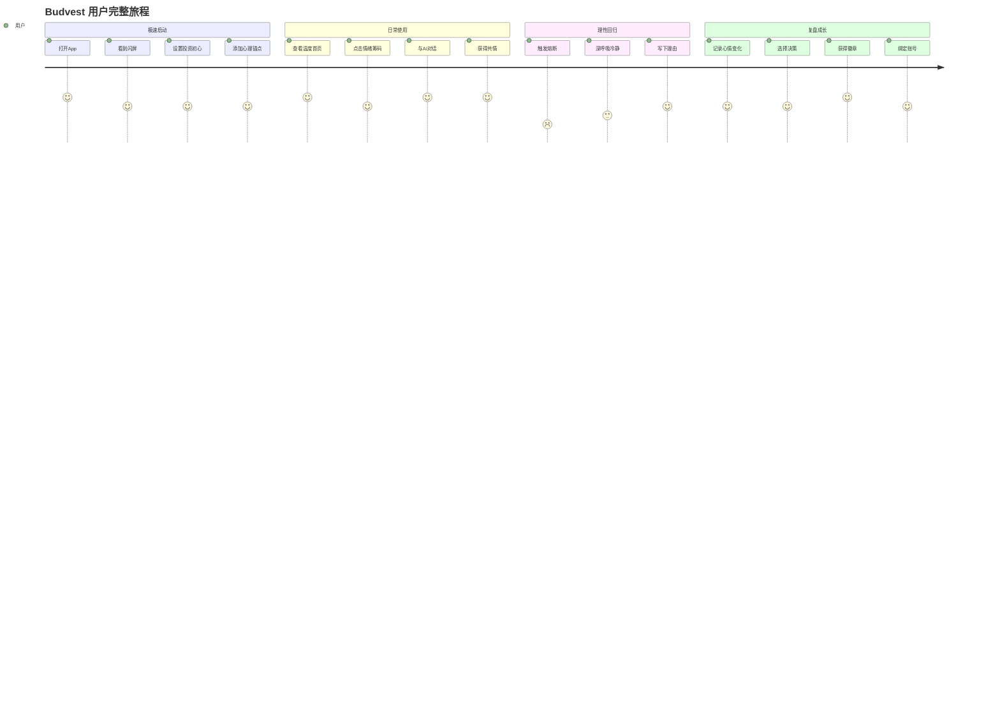
```mermaid
journey
    title Budvest 用户完整旅程
    section 极速启动
      打开App: 5: 用户
      看到闪屏: 4: 用户
      设置投资初心: 4: 用户
      添加心理锚点: 4: 用户
    section 日常使用
      查看温度首页: 5: 用户
      点击情绪筹码: 4: 用户
      与AI对话: 5: 用户
      获得共情: 5: 用户
    section 理性回归
      触发熔断: 2: 用户
      深呼吸冷静: 3: 用户
      写下理由: 4: 用户
    section 复盘成长
      记录心情变化: 4: 用户
      选择决策: 4: 用户
      获得徽章: 5: 用户
      绑定账号: 4: 用户
```

### 1.2 四阶段状态流转

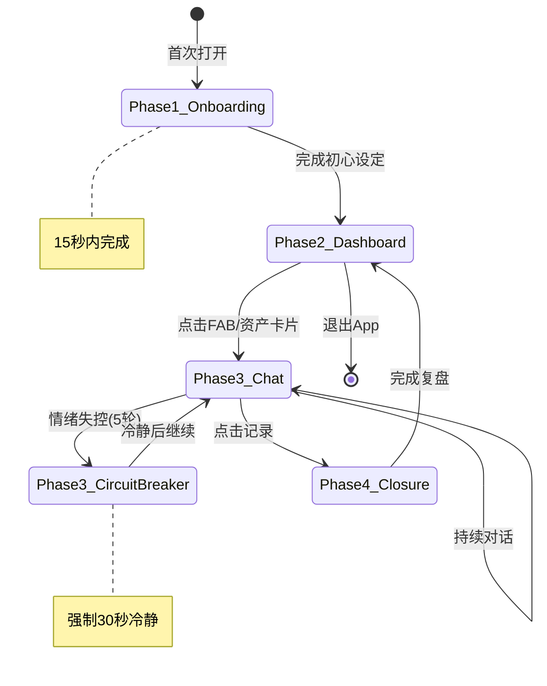
```mermaid
stateDiagram-v2
    [*] --> Phase1_Onboarding: 首次打开
    Phase1_Onboarding --> Phase2_Dashboard: 完成初心设定
    Phase2_Dashboard --> Phase3_Chat: 点击FAB/资产卡片
    Phase3_Chat --> Phase3_Chat: 持续对话
    Phase3_Chat --> Phase3_CircuitBreaker: 情绪失控(5轮)
    Phase3_CircuitBreaker --> Phase3_Chat: 冷静后继续
    Phase3_Chat --> Phase4_Closure: 点击记录
    Phase4_Closure --> Phase2_Dashboard: 完成复盘
    Phase2_Dashboard --> [*]: 退出App

    note right of Phase1_Onboarding: 15秒内完成
    note right of Phase3_CircuitBreaker: 强制30秒冷静
```

---

## 2. 场景A: 用户登录/注册流程

### 2.1 游客模式启动流程

**设计原则**: 零门槛体验，15秒内从陌生人变为契约伙伴

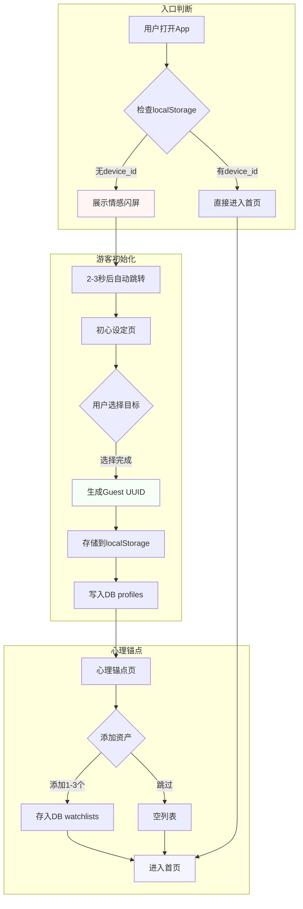
```mermaid
flowchart TD
    subgraph 入口判断
        A[用户打开App] --> B{检查localStorage}
        B -->|有device_id| C[直接进入首页]
        B -->|无device_id| D[展示情感闪屏]
    end

    subgraph 游客初始化
        D --> E[2-3秒后自动跳转]
        E --> F[初心设定页]
        F --> G{用户选择目标}
        G -->|选择完成| H[生成Guest UUID]
        H --> I[存储到localStorage]
        I --> J[写入DB profiles]
    end

    subgraph 心理锚点
        J --> K[心理锚点页]
        K --> L{添加资产}
        L -->|添加1-3个| M[存入DB watchlists]
        L -->|跳过| N[空列表]
        M --> O[进入首页]
        N --> O
    end

    C --> O

    style D fill:#fff5f5
    style H fill:#f5fff5
    style O fill:#f5f5ff
```

### 2.2 步骤详解表

| 步骤ID | 界面 | 用户操作 | 系统逻辑 | 数据变更 |
|--------|------|---------|---------|---------|
| A-01 | 闪屏 | 无 (观看) | 检查 `localStorage.device_id` | 无 |
| A-02 | 闪屏 | 无 (等待) | 计时 2-3 秒 | 无 |
| A-03 | 初心设定 | 多选目标 | 验证至少选 1 项 | 暂存内存 |
| A-04 | 初心设定 | 点击"下一步" | 生成 UUID，调用 API | `profiles.insert()` |
| A-05 | 心理锚点 | 输入代码 | 搜索建议，验证代码 | 暂存内存 |
| A-06 | 心理锚点 | 点击"完成" | 批量写入 | `watchlists.insert()` |

### 2.3 API 调用序列

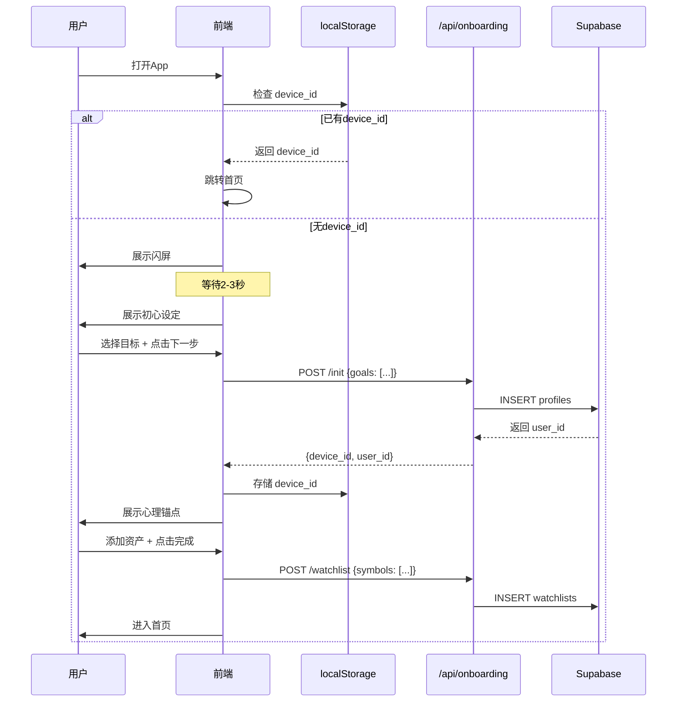
```mermaid
sequenceDiagram
    participant U as 用户
    participant FE as 前端
    participant LS as localStorage
    participant API as /api/onboarding
    participant DB as Supabase

    U->>FE: 打开App
    FE->>LS: 检查 device_id
    alt 已有device_id
        LS-->>FE: 返回 device_id
        FE->>FE: 跳转首页
    else 无device_id
        FE->>U: 展示闪屏
        Note over FE: 等待2-3秒
        FE->>U: 展示初心设定
        U->>FE: 选择目标 + 点击下一步
        FE->>API: POST /init {goals: [...]}
        API->>DB: INSERT profiles
        DB-->>API: 返回 user_id
        API-->>FE: {device_id, user_id}
        FE->>LS: 存储 device_id
        FE->>U: 展示心理锚点
        U->>FE: 添加资产 + 点击完成
        FE->>API: POST /watchlist {symbols: [...]}
        API->>DB: INSERT watchlists
        FE->>U: 进入首页
    end
```

### 2.4 边界条件处理

| 场景 | 处理方式 |
|------|---------|
| 网络断开时完成初心设定 | 本地暂存，恢复后同步 |
| 输入无效股票代码 | 提示"未找到该资产" |
| 添加超过3个资产 | 禁用添加按钮，提示"最多3个" |
| 中途退出App | 下次打开从闪屏重新开始 |
| 清除浏览器数据 | 视为新用户，重新初始化 |

---

## 3. 场景B: 用户输入流程

### 3.1 投资初心输入流程

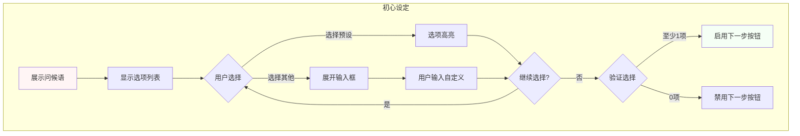
```mermaid
flowchart TD
    subgraph 初心设定
        A[展示问候语] --> B[显示选项列表]
        B --> C{用户选择}
        C -->|选择预设| D[选项高亮]
        C -->|选择其他| E[展开输入框]
        D --> F{继续选择?}
        E --> G[用户输入自定义]
        G --> F
        F -->|是| C
        F -->|否| H{验证选择}
        H -->|至少1项| I[启用下一步按钮]
        H -->|0项| J[禁用下一步按钮]
    end

    style A fill:#fff5f5
    style I fill:#f5fff5
```

### 3.2 投资目标选项设计

| 选项ID | 显示文本 | 存储值 | 图标 | 说明 |
|--------|---------|-------|------|------|
| G01 | 做时间的朋友 | `long_term` | 🌱 | 长线投资者 |
| G02 | 捕捉市场机会 | `short_term` | ⚡️ | 短线交易者 |
| G03 | 其他 | `custom:{text}` | ✏️ | 自定义输入 |

### 3.3 心理锚点输入流程

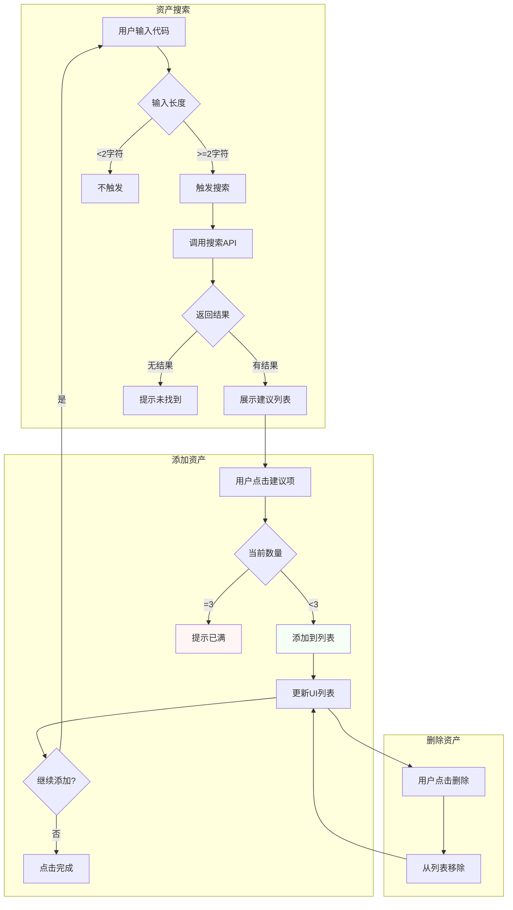
```mermaid
flowchart TD
    subgraph 资产搜索
        A[用户输入代码] --> B{输入长度}
        B -->|>=2字符| C[触发搜索]
        B -->|<2字符| D[不触发]
        C --> E[调用搜索API]
        E --> F{返回结果}
        F -->|有结果| G[展示建议列表]
        F -->|无结果| H[提示未找到]
    end

    subgraph 添加资产
        G --> I[用户点击建议项]
        I --> J{当前数量}
        J -->|<3| K[添加到列表]
        J -->|=3| L[提示已满]
        K --> M[更新UI列表]
        M --> N{继续添加?}
        N -->|是| A
        N -->|否| O[点击完成]
    end

    subgraph 删除资产
        M --> P[用户点击删除]
        P --> Q[从列表移除]
        Q --> M
    end

    style K fill:#f5fff5
    style L fill:#fff5f5
```

### 3.4 股票代码识别规则

| 市场 | 代码格式 | 示例 | 识别规则 |
|------|---------|------|---------|
| A股-沪市 | 6位数字，6开头 | 600519 | `/^6\d{5}$/` |
| A股-深市 | 6位数字，0/3开头 | 000001, 300750 | `/^[03]\d{5}$/` |
| A股-北交所 | 6位数字，8开头 | 830799 | `/^8\d{5}$/` |
| 美股 | 1-5位字母 | NVDA, AAPL | `/^[A-Z]{1,5}$/` |
| 港股 | 5位数字 | 00700 | `/^\d{5}$/` |

### 3.5 搜索建议UI设计

```
┌────────────────────────────────┐
│  🔍 输入代码或名称...           │
├────────────────────────────────┤
│  ┌──────────────────────────┐  │
│  │ NVDA                     │  │
│  │ 英伟达 · NASDAQ · $890   │  │
│  └──────────────────────────┘  │
│  ┌──────────────────────────┐  │
│  │ 600519                   │  │
│  │ 贵州茅台 · 沪A · ¥1650   │  │
│  └──────────────────────────┘  │
└────────────────────────────────┘
```

---

## 4. 场景C: AI对话流程

### 4.1 对话触发入口

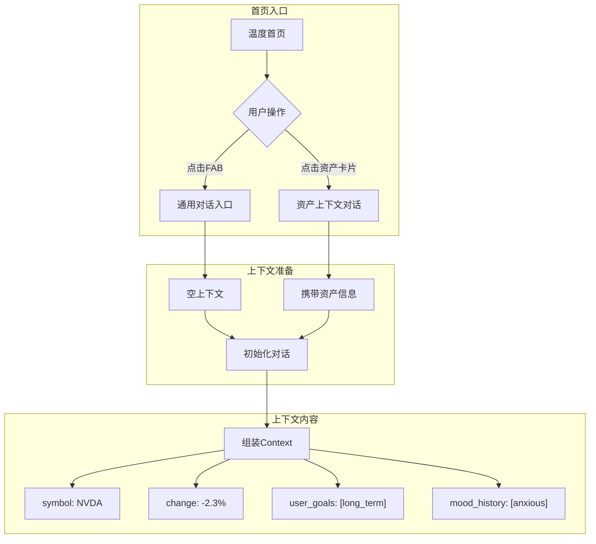
```mermaid
flowchart TD
    subgraph 首页入口
        A[温度首页] --> B{用户操作}
        B -->|点击FAB| C[通用对话入口]
        B -->|点击资产卡片| D[资产上下文对话]
    end

    subgraph 上下文准备
        C --> E[空上下文]
        D --> F[携带资产信息]
        E --> G[初始化对话]
        F --> G
    end

    subgraph 上下文内容
        G --> H[组装Context]
        H --> I["symbol: NVDA"]
        H --> J["change: -2.3%"]
        H --> K["user_goals: [long_term]"]
        H --> L["mood_history: [anxious]"]
    end
```

### 4.2 情绪筹码对话流程

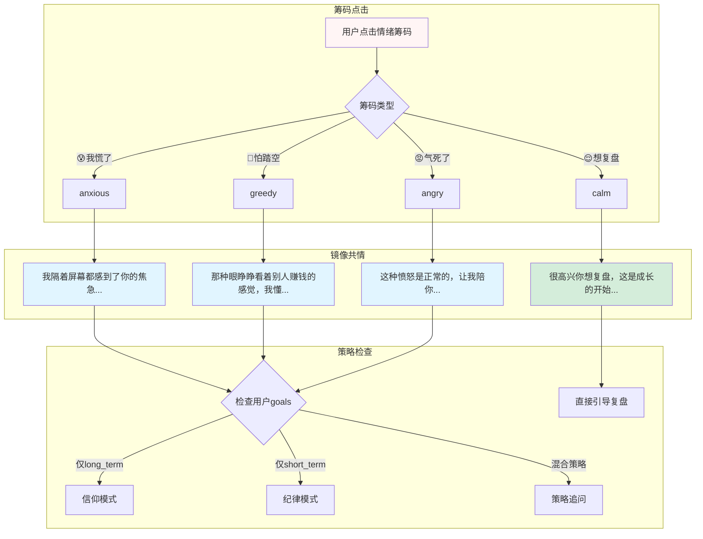
```mermaid
flowchart TD
    subgraph 筹码点击
        A[用户点击情绪筹码] --> B{筹码类型}
        B -->|😰我慌了| C1[anxious]
        B -->|🤑怕踏空| C2[greedy]
        B -->|😡气死了| C3[angry]
        B -->|😌想复盘| C4[calm]
    end

    subgraph 镜像共情
        C1 --> D1["我隔着屏幕都感到了你的焦急..."]
        C2 --> D2["那种眼睁睁看着别人赚钱的感觉，我懂..."]
        C3 --> D3["这种愤怒是正常的，让我陪你..."]
        C4 --> D4["很高兴你想复盘，这是成长的开始..."]
    end

    subgraph 策略检查
        D1 --> E{检查用户goals}
        D2 --> E
        D3 --> E
        D4 --> F[直接引导复盘]
        E -->|仅long_term| G[信仰模式]
        E -->|仅short_term| H[纪律模式]
        E -->|混合策略| I[策略追问]
    end

    style A fill:#fff5f5
    style D1 fill:#e1f5ff
    style D2 fill:#e1f5ff
    style D3 fill:#e1f5ff
    style D4 fill:#d4edda
```

### 4.3 策略追问与锁定流程

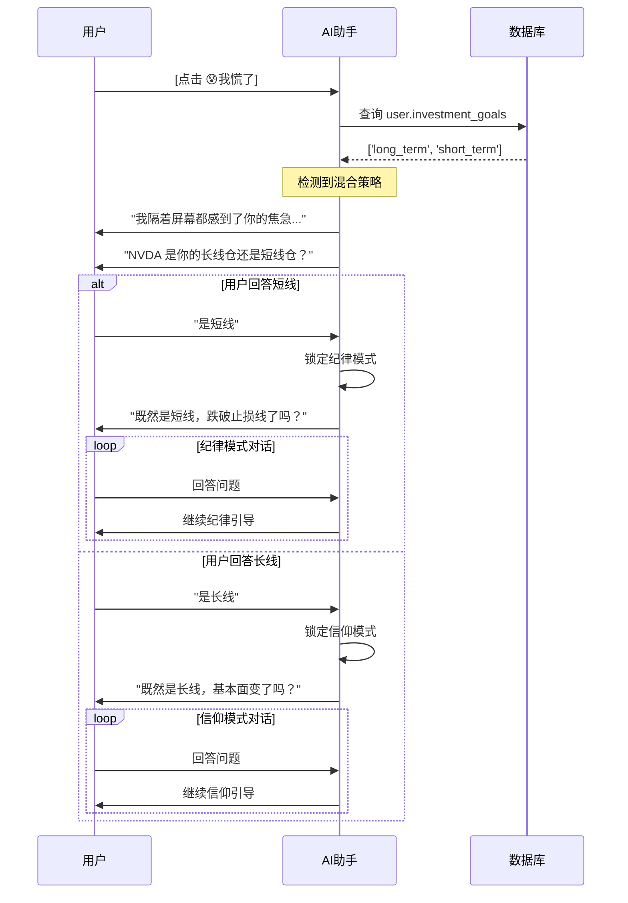
```mermaid
sequenceDiagram
    participant U as 用户
    participant AI as AI助手
    participant DB as 数据库

    U->>AI: [点击 😰我慌了]
    AI->>DB: 查询 user.investment_goals
    DB-->>AI: ['long_term', 'short_term']

    Note over AI: 检测到混合策略

    AI->>U: "我隔着屏幕都感到了你的焦急..."
    AI->>U: "NVDA 是你的长线仓还是短线仓？"

    alt 用户回答短线
        U->>AI: "是短线"
        AI->>AI: 锁定纪律模式
        AI->>U: "既然是短线，跌破止损线了吗？"

        loop 纪律模式对话
            U->>AI: 回答问题
            AI->>U: 继续纪律引导
        end
    else 用户回答长线
        U->>AI: "是长线"
        AI->>AI: 锁定信仰模式
        AI->>U: "既然是长线，基本面变了吗？"

        loop 信仰模式对话
            U->>AI: 回答问题
            AI->>U: 继续信仰引导
        end
    end
```

### 4.4 对话模式详解

#### 4.4.1 纪律模式 (短线)

| 阶段 | AI提问 | 目的 |
|------|-------|------|
| 1. 止损检查 | "跌破止损线了吗？止损线设在哪里？" | 确认是否触发止损 |
| 2. 止盈检查 | "距离止盈目标还有多远？" | 确认盈利空间 |
| 3. 纪律提醒 | "你当初买入的理由还成立吗？" | 回顾交易逻辑 |
| 4. 行动引导 | "如果触发止损，你打算怎么做？" | 引导理性决策 |

#### 4.4.2 信仰模式 (长线)

| 阶段 | AI提问 | 目的 |
|------|-------|------|
| 1. 基本面检查 | "公司的基本面变了吗？" | 聚焦价值而非价格 |
| 2. 初心回顾 | "当初买入的理由是什么？" | 回顾投资逻辑 |
| 3. 情绪分离 | "市场波动≠公司价值变化" | 分离情绪和事实 |
| 4. 长期视角 | "3年后回看今天，这个价格重要吗？" | 建立长期视角 |

### 4.5 熔断机制流程

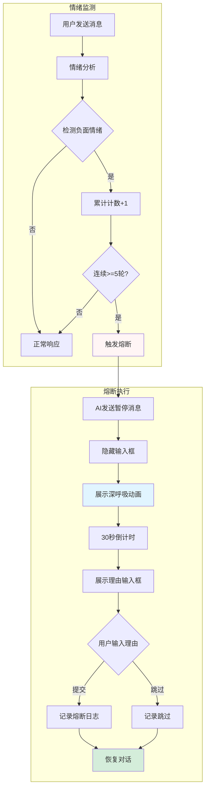
```mermaid
flowchart TD
    subgraph 情绪监测
        A[用户发送消息] --> B[情绪分析]
        B --> C{检测负面情绪}
        C -->|否| D[正常响应]
        C -->|是| E[累计计数+1]
        E --> F{连续>=5轮?}
        F -->|否| D
        F -->|是| G[触发熔断]
    end

    subgraph 熔断执行
        G --> H[AI发送暂停消息]
        H --> I[隐藏输入框]
        I --> J[展示深呼吸动画]
        J --> K[30秒倒计时]
        K --> L[展示理由输入框]
        L --> M{用户输入理由}
        M -->|提交| N[记录熔断日志]
        M -->|跳过| O[记录跳过]
        N --> P[恢复对话]
        O --> P
    end

    style G fill:#fff5f5
    style J fill:#e1f5ff
    style P fill:#d4edda
```

### 4.6 熔断触发词库

| 类别 | 关键词 | 权重 |
|------|-------|------|
| 恐慌类 | 崩、完了、全没了、血亏、跳楼 | 2 |
| 冲动类 | 全卖、清仓、割肉、跑、撤 | 1.5 |
| 愤怒类 | 操、妈的、垃圾、骗子 | 2 |
| 绝望类 | 不玩了、再也不、认命 | 1.5 |

**熔断公式**: `总分 = Σ(词权重)`, 当 `总分 >= 5` 或 `连续5轮负面` 时触发

### 4.7 深呼吸动画UI

```
┌────────────────────────────────┐
│                                │
│                                │
│         ╭──────────╮           │
│        ╱            ╲          │
│       │    吸气...   │         │
│        ╲            ╱          │
│         ╰──────────╯           │
│                                │
│           ○○○○●○○○○            │
│             27秒               │
│                                │
│      闭上眼睛，感受呼吸         │
│                                │
└────────────────────────────────┘

动画状态:
- 0-4秒: 圆圈放大 + "吸气..."
- 4-7秒: 圆圈保持 + "屏住..."
- 7-11秒: 圆圈缩小 + "呼气..."
- 循环直到30秒结束
```

---

## 5. 场景D: 复盘记录流程

### 5.1 复盘入口与触发

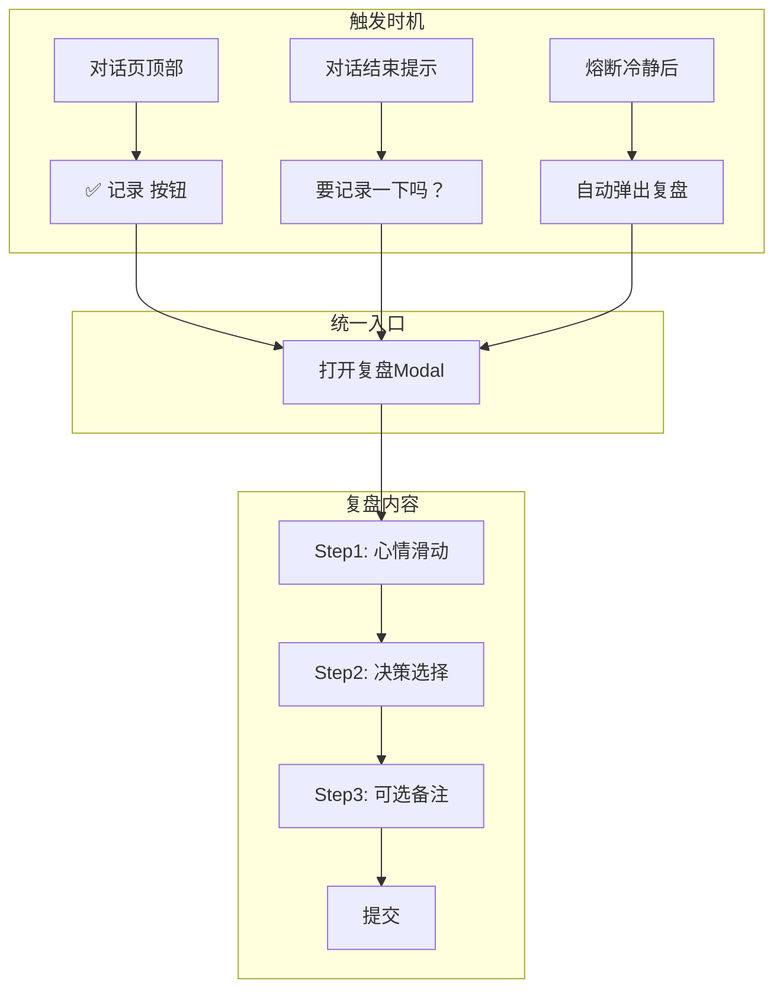
```mermaid
flowchart TD
    subgraph 触发时机
        A[对话页顶部] --> B["✅ 记录" 按钮]
        C[对话结束提示] --> D["要记录一下吗？"]
        E[熔断冷静后] --> F[自动弹出复盘]
    end

    subgraph 统一入口
        B --> G[打开复盘Modal]
        D --> G
        F --> G
    end

    subgraph 复盘内容
        G --> H[Step1: 心情滑动]
        H --> I[Step2: 决策选择]
        I --> J[Step3: 可选备注]
        J --> K[提交]
    end
```

### 5.2 复盘卡片UI流程

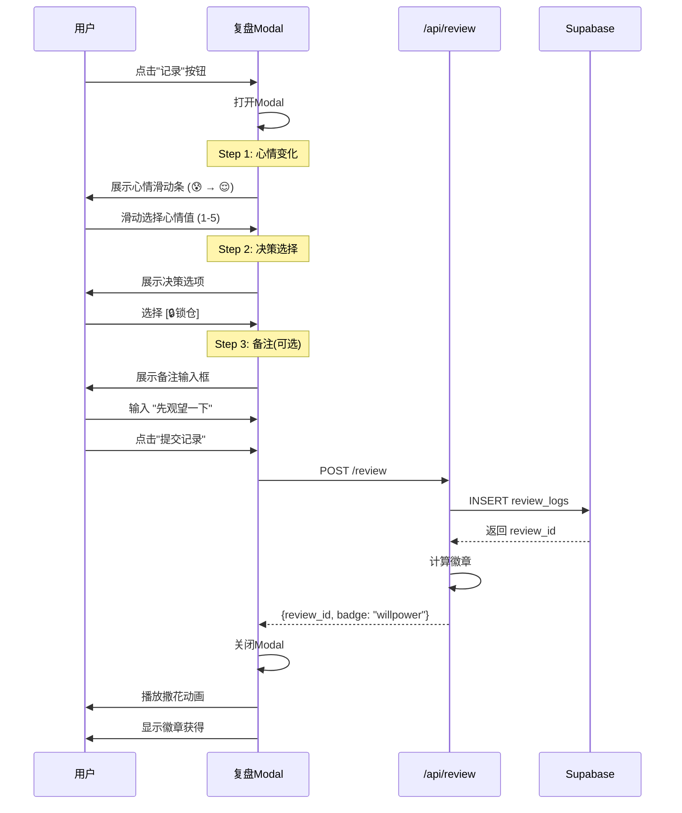
```mermaid
sequenceDiagram
    participant U as 用户
    participant UI as 复盘Modal
    participant API as /api/review
    participant DB as Supabase

    U->>UI: 点击"记录"按钮
    UI->>UI: 打开Modal

    Note over UI: Step 1: 心情变化
    UI->>U: 展示心情滑动条 (😰 → 😌)
    U->>UI: 滑动选择心情值 (1-5)

    Note over UI: Step 2: 决策选择
    UI->>U: 展示决策选项
    U->>UI: 选择 [🔒锁仓]

    Note over UI: Step 3: 备注(可选)
    UI->>U: 展示备注输入框
    U->>UI: 输入 "先观望一下"

    U->>UI: 点击"提交记录"
    UI->>API: POST /review
    API->>DB: INSERT review_logs
    DB-->>API: 返回 review_id
    API->>API: 计算徽章
    API-->>UI: {review_id, badge: "willpower"}

    UI->>UI: 关闭Modal
    UI->>U: 播放撒花动画
    UI->>U: 显示徽章获得
```

### 5.3 决策选项设计

| 选项ID | 显示 | 存储值 | 颜色 | 说明 |
|--------|------|-------|------|------|
| D01 | 🔒 锁仓 | `lock` | Teal | 不做任何操作 |
| D02 | 📉 减仓 | `reduce` | Yellow | 部分卖出 |
| D03 | 📈 加仓 | `add` | Coral | 买入更多 |
| D04 | 🚫 清仓 | `clear` | Gray | 全部卖出 |

### 5.4 心情滑动条设计

```
心情变化 (对话前 → 对话后):

     😰      😟      😐      🙂      😌
      1       2       3       4       5
      │───────●───────────────────────│
            当前值: 2

滑动条样式:
- 轨道: 渐变色 (红 → 绿)
- 滑块: 圆形，带阴影
- 触感: 滑动时有震动反馈
```

### 5.5 复盘数据结构

```typescript
interface ReviewLog {
  id: string;
  user_id: string;

  // 心情数据
  mood_before: 1 | 2 | 3 | 4 | 5;  // 对话前心情 (从对话开始时记录)
  mood_after: 1 | 2 | 3 | 4 | 5;   // 对话后心情 (用户滑动选择)
  mood_change: number;             // 计算值: after - before

  // 决策数据
  decision: 'lock' | 'reduce' | 'add' | 'clear';
  related_symbol?: string;         // 关联的资产代码

  // 上下文
  note?: string;                   // 用户备注 (最长100字)
  chat_session_id: string;         // 关联的对话会话
  circuit_breaker_triggered: boolean; // 是否触发过熔断

  // 奖励
  badge_earned?: 'willpower' | 'calm' | 'persistence';

  created_at: Date;
}
```

---

## 6. 场景E: 异常处理流程

### 6.1 网络异常处理

```mermaid
flowchart TD
    subgraph 网络检测
        A[用户操作] --> B{网络状态}
        B -->|在线| C[正常请求]
        B -->|离线| D[离线处理]
    end

    subgraph 离线处理
        D --> E{操作类型}
        E -->|读取| F[使用本地缓存]
        E -->|写入| G[本地队列暂存]
        F --> H[展示缓存数据+离线标识]
        G --> I[提示"稍后同步"]
    end

    subgraph 恢复同步
        J[网络恢复] --> K[检查本地队列]
        K --> L{有待同步数据?}
        L -->|是| M[后台同步]
        L -->|否| N[正常模式]
        M --> O{同步成功?}
        O -->|是| P[清除队列]
        O -->|否| Q[保留+提示]
    end
```

### 6.2 API 错误处理

| 错误码 | 场景 | 用户提示 | 处理方式 |
|--------|------|---------|---------|
| 400 | 参数错误 | "输入格式有误" | 高亮错误字段 |
| 401 | 未授权 | "请重新登录" | 跳转登录页 |
| 404 | 资源不存在 | "找不到该资产" | 返回搜索页 |
| 429 | 请求过频 | "稍等片刻再试" | 禁用按钮60秒 |
| 500 | 服务器错误 | "系统繁忙，请稍后" | 显示重试按钮 |
| 503 | AI 服务不可用 | "AI 正在休息" | 展示预设回复 |

### 6.3 AI 响应超时处理

```mermaid
flowchart TD
    A[发送消息] --> B[显示加载状态]
    B --> C{3秒内响应?}
    C -->|是| D[正常展示]
    C -->|否| E[显示"思考中..."]
    E --> F{10秒内响应?}
    F -->|是| D
    F -->|否| G[显示超时提示]
    G --> H["AI开小差了，再试一次？"]
    H --> I{用户选择}
    I -->|重试| A
    I -->|取消| J[返回对话]
```

### 6.4 数据冲突处理

| 场景 | 处理策略 |
|------|---------|
| 多设备同时编辑 | 以最后提交为准 |
| 游客绑定已存在手机号 | 提示"该手机号已注册"，引导登录 |
| 复盘重复提交 | 幂等处理，返回已存在记录 |

---

## 7. 场景F: 游客转化流程

### 7.1 转化时机与触发

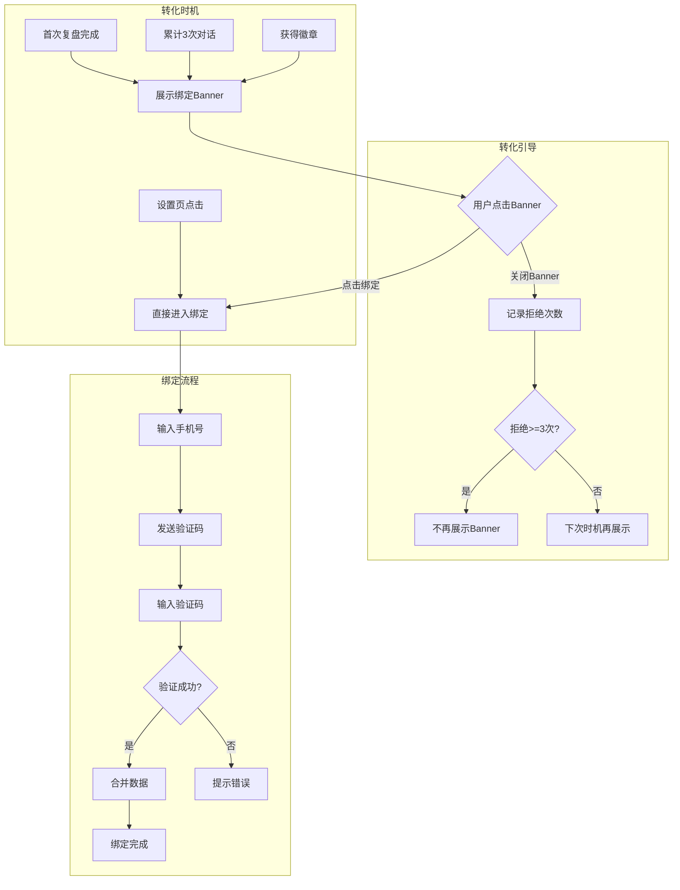
```mermaid
flowchart TD
    subgraph 转化时机
        A[首次复盘完成] --> E[展示绑定Banner]
        B[累计3次对话] --> E
        C[获得徽章] --> E
        D[设置页点击] --> F[直接进入绑定]
    end

    subgraph 转化引导
        E --> G{用户点击Banner}
        G -->|点击绑定| F
        G -->|关闭Banner| H[记录拒绝次数]
        H --> I{拒绝>=3次?}
        I -->|是| J[不再展示Banner]
        I -->|否| K[下次时机再展示]
    end

    subgraph 绑定流程
        F --> L[输入手机号]
        L --> M[发送验证码]
        M --> N[输入验证码]
        N --> O{验证成功?}
        O -->|是| P[合并数据]
        O -->|否| Q[提示错误]
        P --> R[绑定完成]
    end
```

### 7.2 绑定流程详解

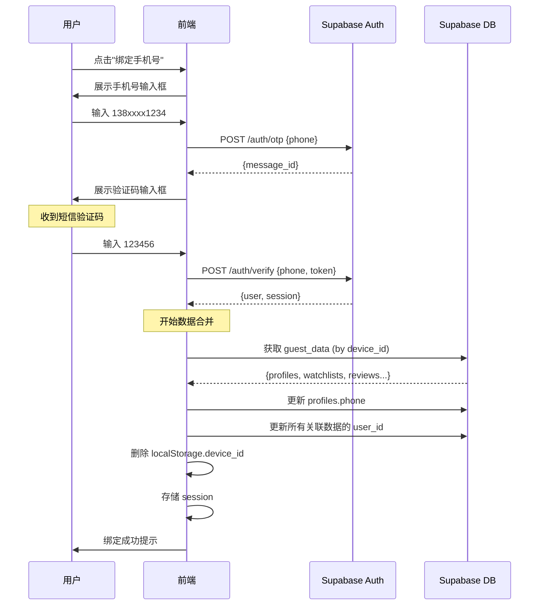
```mermaid
sequenceDiagram
    participant U as 用户
    participant FE as 前端
    participant Auth as Supabase Auth
    participant DB as Supabase DB

    U->>FE: 点击"绑定手机号"
    FE->>U: 展示手机号输入框
    U->>FE: 输入 138xxxx1234
    FE->>Auth: POST /auth/otp {phone}
    Auth-->>FE: {message_id}
    FE->>U: 展示验证码输入框

    Note over U: 收到短信验证码

    U->>FE: 输入 123456
    FE->>Auth: POST /auth/verify {phone, token}
    Auth-->>FE: {user, session}

    Note over FE: 开始数据合并

    FE->>DB: 获取 guest_data (by device_id)
    DB-->>FE: {profiles, watchlists, reviews...}
    FE->>DB: 更新 profiles.phone
    FE->>DB: 更新所有关联数据的 user_id
    FE->>FE: 删除 localStorage.device_id
    FE->>FE: 存储 session
    FE->>U: 绑定成功提示
```

### 7.3 数据合并逻辑

```sql
-- 数据合并存储过程
CREATE OR REPLACE FUNCTION merge_guest_to_user(
  p_guest_device_id TEXT,
  p_user_phone TEXT
)
RETURNS VOID AS $$
DECLARE
  v_guest_id UUID;
  v_user_id UUID;
BEGIN
  -- 获取游客ID
  SELECT id INTO v_guest_id
  FROM profiles
  WHERE device_id = p_guest_device_id;

  -- 获取或创建正式用户
  SELECT id INTO v_user_id
  FROM profiles
  WHERE phone = p_user_phone;

  IF v_user_id IS NULL THEN
    -- 直接升级游客为正式用户
    UPDATE profiles
    SET phone = p_user_phone, device_id = NULL
    WHERE id = v_guest_id;
  ELSE
    -- 合并数据到已存在用户
    UPDATE watchlists SET user_id = v_user_id WHERE user_id = v_guest_id;
    UPDATE review_logs SET user_id = v_user_id WHERE user_id = v_guest_id;
    UPDATE chat_sessions SET user_id = v_user_id WHERE user_id = v_guest_id;

    -- 合并 investment_goals
    UPDATE profiles
    SET investment_goals = (
      SELECT ARRAY(
        SELECT DISTINCT unnest(investment_goals)
        FROM profiles
        WHERE id IN (v_guest_id, v_user_id)
      )
    )
    WHERE id = v_user_id;

    -- 删除游客记录
    DELETE FROM profiles WHERE id = v_guest_id;
  END IF;
END;
$$ LANGUAGE plpgsql;
```

---

## 8. 状态机定义

### 8.1 用户状态机

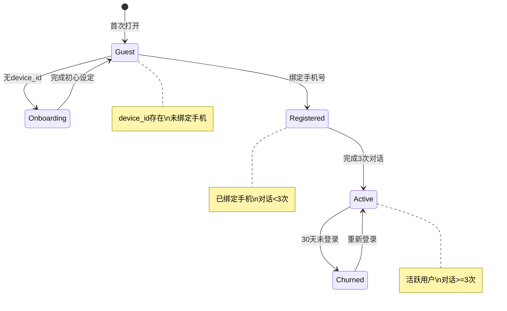
```mermaid
stateDiagram-v2
    [*] --> Guest: 首次打开
    Guest --> Onboarding: 无device_id
    Onboarding --> Guest: 完成初心设定
    Guest --> Registered: 绑定手机号
    Registered --> Active: 完成3次对话
    Active --> Churned: 30天未登录
    Churned --> Active: 重新登录

    note right of Guest: device_id存在\n未绑定手机
    note right of Registered: 已绑定手机\n对话<3次
    note right of Active: 活跃用户\n对话>=3次
```

### 8.2 对话状态机

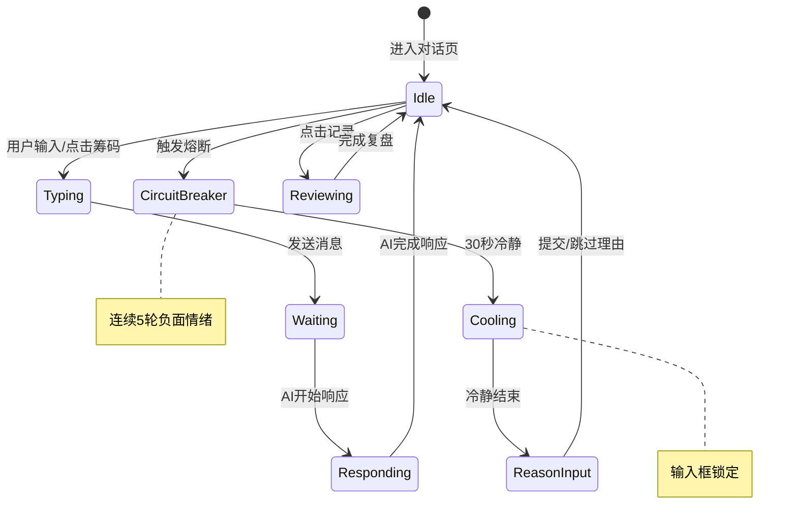
```mermaid
stateDiagram-v2
    [*] --> Idle: 进入对话页
    Idle --> Typing: 用户输入/点击筹码
    Typing --> Waiting: 发送消息
    Waiting --> Responding: AI开始响应
    Responding --> Idle: AI完成响应

    Idle --> CircuitBreaker: 触发熔断
    CircuitBreaker --> Cooling: 30秒冷静
    Cooling --> ReasonInput: 冷静结束
    ReasonInput --> Idle: 提交/跳过理由

    Idle --> Reviewing: 点击记录
    Reviewing --> Idle: 完成复盘

    note right of CircuitBreaker: 连续5轮负面情绪
    note right of Cooling: 输入框锁定
```

### 8.3 复盘状态机

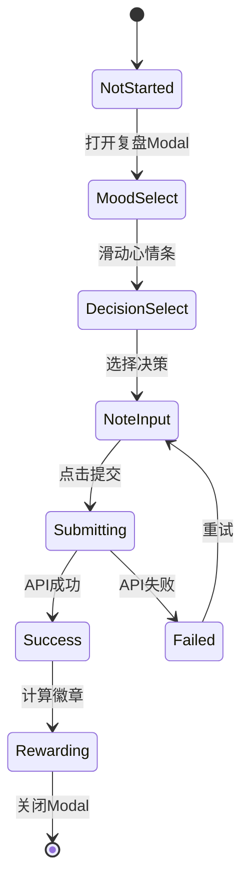
```mermaid
stateDiagram-v2
    [*] --> NotStarted
    NotStarted --> MoodSelect: 打开复盘Modal
    MoodSelect --> DecisionSelect: 滑动心情条
    DecisionSelect --> NoteInput: 选择决策
    NoteInput --> Submitting: 点击提交
    Submitting --> Success: API成功
    Submitting --> Failed: API失败
    Success --> Rewarding: 计算徽章
    Rewarding --> [*]: 关闭Modal
    Failed --> NoteInput: 重试
```

---

## 9. 附录

### 9.1 页面路由表

| 路由 | 页面 | 状态要求 |
|------|------|---------|
| `/` | 温度首页 | 已完成Onboarding |
| `/onboarding` | 初心设定 | 无device_id |
| `/onboarding/watchlist` | 心理锚点 | 已设置初心 |
| `/chat` | 对话页 | 已完成Onboarding |
| `/chat?symbol=NVDA` | 资产对话 | 携带资产上下文 |
| `/settings` | 设置页 | 任意 |
| `/settings/bindphone` | 绑定手机 | 游客状态 |

### 9.2 本地存储结构

```typescript
// localStorage 数据结构
interface LocalStorage {
  device_id?: string;           // 游客UUID
  investment_goals?: string[];  // 离线暂存
  pending_reviews?: ReviewLog[]; // 离线待同步
  last_sync_at?: string;        // 最后同步时间
  banner_dismissed_count?: number; // 绑定Banner关闭次数
}
```

### 9.3 埋点事件完整列表

| 事件名 | 触发时机 | 参数 |
|--------|---------|------|
| `app_open` | 打开App | `is_returning` |
| `onboarding_start` | 进入初心设定 | - |
| `onboarding_goals_set` | 设置投资初心 | `goals[]` |
| `onboarding_watchlist_add` | 添加心理锚点 | `symbol`, `market` |
| `onboarding_complete` | 完成Onboarding | `duration_sec` |
| `home_view` | 查看首页 | `asset_count` |
| `fab_click` | 点击FAB | - |
| `asset_card_click` | 点击资产卡片 | `symbol` |
| `emotion_chip_click` | 点击情绪筹码 | `chip_type` |
| `message_send` | 发送消息 | `has_chip`, `word_count` |
| `ai_response` | AI响应完成 | `response_time_ms` |
| `strategy_lock` | 锁定对话策略 | `strategy` |
| `circuit_breaker_trigger` | 触发熔断 | `trigger_reason` |
| `circuit_breaker_complete` | 熔断结束 | `reason_submitted` |
| `review_start` | 开始复盘 | `from_circuit_breaker` |
| `review_submit` | 提交复盘 | `mood_change`, `decision` |
| `badge_earned` | 获得徽章 | `badge_type` |
| `bind_banner_show` | 展示绑定Banner | `trigger_reason` |
| `bind_banner_click` | 点击绑定Banner | - |
| `bind_banner_dismiss` | 关闭绑定Banner | `dismiss_count` |
| `bind_start` | 开始绑定流程 | - |
| `bind_otp_sent` | 发送验证码 | - |
| `bind_success` | 绑定成功 | - |
| `bind_fail` | 绑定失败 | `error_code` |

---

**文档结束**

🌿 **伴投 Budvest - 让每一次心理波动都被温柔接住**
