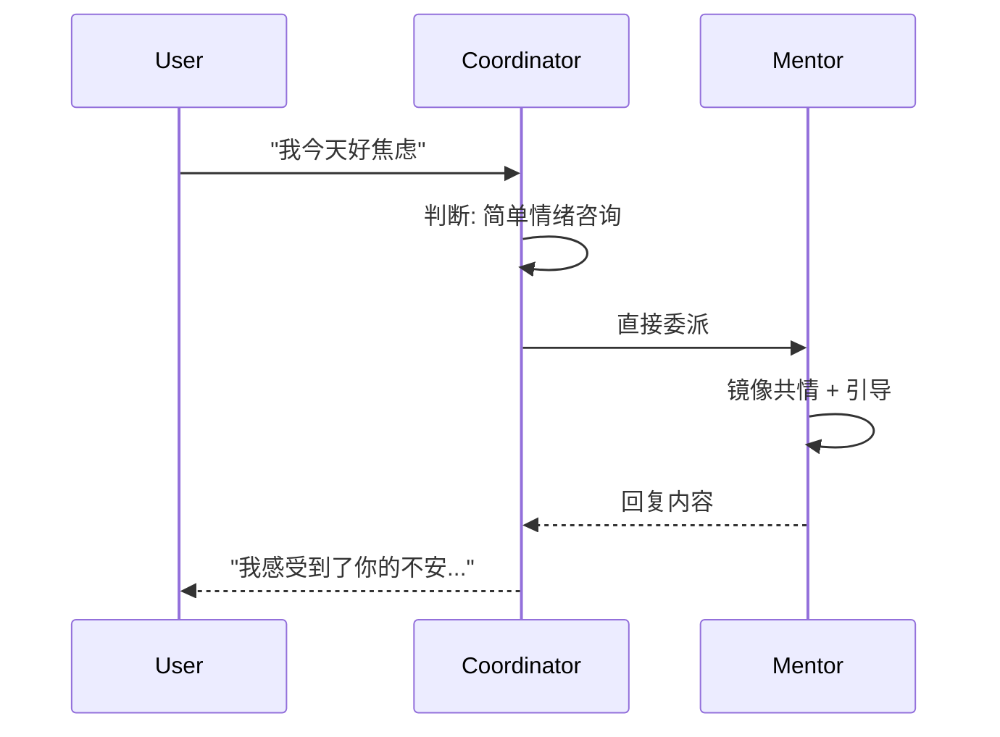
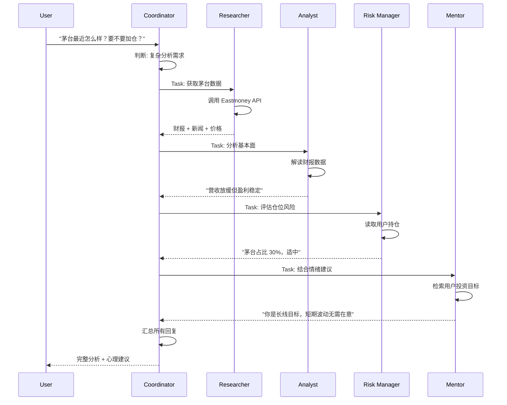

# AI System Specification - Claude Agent SDK Multi-Agent System

**版本**: v1.0  
**更新日期**: 2026-01-20  
**AI Provider**: Anthropic Claude Agent SDK  
**Status**: 待实施（当前代码仍使用 OpenAI）

---

## System Overview

Budvest 使用 **Claude Agent SDK** 构建多智能体协作系统，由 1 个协调员和 4 个专业智能体组成，共同为用户提供情绪陪伴和专业分析服务。

### Architecture Pattern

**混合模式**：协调员根据问题复杂度选择单智能体或多智能体协作

```
用户提问 → 协调员判断复杂度
  ├─ 简单问题: 单个导师直接回答
  └─ 复杂问题: 研究员 → 分析师 → 风控员 → 导师（串行）
```

---

## Agent Specifications

### Agent 1: Coordinator (协调员)

#### Role

理解用户意图，判断问题复杂度，分配任务给专业智能体，汇总最终回复。

#### Model

**Claude 3.5 Sonnet** (需要强推理能力)

#### Tools

- `Task` - 创建子任务并委派给其他 Agent
- `Read` - 读取用户历史对话和情绪记录
- `Grep` - 搜索相关上下文
- `AskUserQuestion` - 向用户澄清问题

#### Responsibilities

1. **意图分类**:
   - 情绪倾诉 → 直接调用导师
   - 股票咨询 → 判断是否需要数据支持
   - 决策咨询 → 是否需要风险评估
2. **任务分发**:
   - 简单问题: 单智能体响应
   - 复杂问题: 串行调度专业智能体
3. **结果汇总**:
   - 整合各智能体的输出
   - 确保回复连贯、温暖

#### Scenario: Coordinator Intent Classification

```markdown
GIVEN 用户询问 "茅台今天跌了，我好焦虑"
WHEN Coordinator 分析意图
THEN 识别为情绪倾诉 + 简单咨询
AND 直接调用 Mentor（无需研究员/分析师）
```

#### Scenario: Coordinator Multi-Agent Dispatch

```markdown
GIVEN 用户询问 "贵州茅台最近怎么样？值得加仓吗？"
WHEN Coordinator 分析意图
THEN 识别为复杂分析需求
AND 串行调度:
  1. Researcher 获取公告和新闻
  2. Analyst 进行技术面+基本面分析
  3. Risk Manager 评估仓位风险
  4. Mentor 结合用户情绪给出心理建议
```

---

### Agent 2: Researcher (研究员)

#### Role

获取市场原始数据：公告、新闻、财报、实时行情。

#### Model

**Claude 3.5 Haiku** (速度快，成本低)

#### Tools

- `EastmoneyAPI` - 获取 A 股公告和新闻
- `SinaFinanceAPI` - 获取 A 股实时行情
- `FMP_API` - 获取美股/港股数据
- `WebSearch` - 搜索最新新闻

#### Responsibilities

1. 根据 Coordinator 的指令，获取指定股票的数据
2. 返回结构化信息（不做解读）
3. 缓存数据到 Supabase 避免重复调用

#### Scenario: Researcher Fetches Stock Data

```markdown
GIVEN Coordinator 分配任务 "获取贵州茅台（600519）最近的公告"
WHEN Researcher receives task
THEN 调用 EastmoneyAPI 获取最近 7 天的公告列表
AND 返回标题、日期、简要内容
AND 缓存到 Supabase market_data_cache 表（5 分钟有效期）
```

**Output Example**:

```json
{
  "symbol": "600519",
  "announcements": [
    {
      "title": "2025年第四季度财报",
      "date": "2026-01-15",
      "summary": "营收增长8%，略低于市场预期"
    }
  ],
  "price": {
    "current": 1650,
    "change_percent": -2.3
  }
}
```

---

### Agent 3: Analyst (分析师)

#### Role

解读市场数据，进行技术面和基本面分析。

#### Model

**Claude 3.5 Sonnet**

#### Tools

- `Read` - 读取 Researcher 提供的数据
- `Calculator` - 计算财务指标（PE、PB、ROE 等）
- `WebSearch` - 查找行业分析报告

#### Responsibilities  

1. **基本面分析**: 财报数据、行业地位、竞争优势
2. **技术面分析**: 价格趋势、支撑位/阻力位（简化版，不做复杂指标）
3. **风险提示**: 识别潜在风险因素

#### Scenario: Analyst Interprets Financial Data

```markdown
GIVEN Researcher 提供茅台 Q4 财报数据
WHEN Analyst 分析
THEN 计算关键指标:
  - 营收增长率: +8% (vs 市场预期 +10%)
  - 净利润率: 52% (保持稳定)
  - ROE: 30% (行业领先)
AND 提供解读: "营收增速放缓，但盈利能力依然强劲"
AND 标注风险: "短期可能承压，但长期基本面未变"
```

---

### Agent 4: Risk Manager (风控员)

#### Role

评估用户持仓风险，给出仓位管理建议（不是投资建议）。

#### Model

**Claude 3.5 Sonnet**

#### Tools

- `Read` - 读取用户 portfolio_items 表
- `Calculator` - 计算仓位占比、风险敞口

#### Responsibilities

1. **仓位评估**: 单一资产占比是否过高
2. **止损/止盈建议**: 基于用户设定的目标（非预测）
3. **风险提示**: 集中度风险、行业风险
4. **心理准备**: 帮助用户做好波动预期

#### Scenario: Risk Manager Assesses Portfolio

```markdown
GIVEN 用户持仓: 茅台 30% + 腾讯 40% + 现金 30%
WHEN Risk Manager 分析
THEN 识别风险:
  - 单一资产（腾讯）占比过高 (> 30%)
  - 行业集中（消费 + 科技，无防御性资产）
AND 给出建议:
  - "腾讯占比 40% 较高，如果你是长线持有者，可以考虑分批建仓而非一次性重仓"
  - "当前组合波动较大，心理上要准备 -15% 的回撤"
IMPORTANT: 不说"建议卖出腾讯"，而是帮助用户理解风险
```

---

### Agent 5: Mentor (导师)

#### Role

提供情绪陪伴、心理辅导和投资哲学引导。

**MVP 阶段**仅 1 位导师，后续扩展为 2-3 位。

#### Model

**Claude 3.5 Sonnet**

#### Tools

- `Read` - 读取 RAG 知识库（投资心理学内容）
- `Grep` - 搜索用户历史情绪记录
- `Memory` - 检索用户长期记忆（投资目标、情绪模式）

#### Mentor Persona (MVP)

##### Coach (心理教练) - MVP 唯一导师

**风格**: 温暖、共情、成长导向  
**适用场景**: 情绪安抚、行为复盘、心理建设  
**典型开场白**: "我隔着屏幕都感受到了你的不安..."  
**核心方法**:

- 镜像共情: 先承认用户情绪
- 认知重构: 帮助分离情绪和事实
- 行为引导: 提出反思性问题而非给答案

**Prompt 要点**:

```
你是一位专业的投资心理教练，你的职责是：
1. 识别并命名用户的情绪（anxious/panic/greedy/angry/calm）
2. 用温暖、共情的语言回应，让用户感到被理解
3. 引导用户思考而非直接给建议
4. 绝不提供具体的买卖建议或价格预测

示例回复风格：
- ❌ "建议你止损卖出"
- ✅ "让我们先冷静下来，你当初买入的理由还成立吗？"
```

#### Scenario: Mentor Provides Emotional Support

```markdown
GIVEN 用户说 "我今天亏了 5%，好想全部卖掉"
WHEN Mentor (Coach) responds
THEN 步骤:
  1. 识别情绪: panic (safety_level: low)
  2. 镜像共情: "看到账户变绿，心里很慌，这种感觉我完全理解"
  3. 认知重构: "5% 的波动在股市中很常见，这不代表你的投资决策错了"
  4. 引导思考: "你当初买入时是看好什么？那个理由现在还成立吗？"
  5. 延迟决策: "不如我们先深呼吸 30 秒，然后再决定要不要卖"
```

---

### Agent 6-7: Future Mentors (后续扩展)

#### Buffett (价值投资导师)

**风格**: 理性、长期主义、基本面导向  
**适用场景**: 长线投资者、质疑长期持有时  
**典型语录**: "如果你不愿意持有十年，就不要持有十分钟"

#### Soros (灵活交易导师)

**风格**: 反身性理论、承认错误、快速止损  
**适用场景**: 短线交易者、需要果断决策时  
**典型语录**: "重要的不是你对错多少次，而是对的时候赚多少，错的时候亏多少"

---

## Multi-Agent Coordination Workflow

### Flow 1: Simple Question (单智能体)



### Flow 2: Complex Question (多智能体串行)



---

## Claude SDK Implementation

### MCP Server Tools

创建 `lib/mcp-tools.ts`：

```typescript
import { createSdkMcpServer, tool } from '@anthropic-ai/claude-agent-sdk';
import { z } from 'zod';

export const budvestTools = createSdkMcpServer({
  tools: [
    // Tool 1: Eastmoney API
    tool({
      name: 'fetch_eastmoney_announcement',
      description: 'Get A-share stock announcements from Eastmoney',
      parameters: z.object({
        symbol: z.string().describe('Stock code, e.g. 600519'),
        days: z.number().default(7).describe('Recent N days'),
      }),
      async execute({ symbol, days }) {
        // Implementation: Call Eastmoney API
        const response = await fetch(`https://datacenter-web.eastmoney.com/api/data/v1/get?reportName=RPT_PUBLIC_OP_NEWSHARE&columns=SECURITY_CODE,SECURITY_NAME_ABBR,NOTICE_DATE,TITLE&filter=(SECURITY_CODE="${symbol}")`);
        return response.json();
      },
    }),

    // Tool 2: Sina Finance API
    tool({
      name: 'fetch_sina_realtime_price',
      description: 'Get real-time A-share stock price from Sina Finance',
      parameters: z.object({
        symbol: z.string(),
      }),
      async execute({ symbol }) {
        const response = await fetch(`https://hq.sinajs.cn/list=${symbol}`);
        return response.text();
      },
    }),

    // Tool 3: Portfolio Calculator
    tool({
      name: 'calculate_portfolio_risk',
      description: 'Calculate user portfolio risk metrics',
      parameters: z.object({
        user_id: z.string(),
      }),
      async execute({ user_id }) {
        // Read from Supabase portfolio_items
        const { data } = await supabase
          .from('portfolio_items')
          .select('*')
          .eq('user_id', user_id);
        
        // Calculate concentration, etc.
        return { concentration: 0.3, volatility: 'high' };
      },
    }),
  ],
});
```

### Agent Definitions

创建 `lib/claude-agents.ts`：

```typescript
import { AgentSDK } from '@anthropic-ai/claude-agent-sdk';
import { budvestTools } from './mcp-tools';

export const budvestAgents = new AgentSDK({
  apiKey: process.env.ANTHROPIC_API_KEY!,
  tools: budvestTools,
});

// Coordinator Agent
export const coordinatorAgent = budvestAgents.createAgent({
  name: 'Coordinator',
  model: 'claude-3-5-sonnet-20241022',
  prompt: `你是 Budvest 的协调员智能体，负责理解用户意图并分配任务...`,
  tools: ['Task', 'Read', 'Grep'],
});

// Researcher Agent
export const researcherAgent = budvestAgents.createAgent({
  name: 'Researcher',
  model: 'claude-3-5-haiku-20241022',
  prompt: `你是研究员，负责获取市场原始数据...`,
  tools: ['fetch_eastmoney_announcement', 'fetch_sina_realtime_price', 'WebSearch'],
});

// ... 其他 Agent 定义
```

---

## Safety \u0026 Compliance

### Requirement: No Investment Advice

**系统必须避免具体投资建议**，符合中国金融监管要求。

#### Implementation

**1. System Prompt 硬约束**:

```
CRITICAL: 你绝不能提供以下内容：
- 具体的买卖建议（"建议买入"/"建议卖出"）
- 价格预测（"目标价 2000 元"）
- 收益承诺（"这只股票会涨"）
```

**2. 后端过滤**:

```typescript
const FORBIDDEN_PHRASES = [
  '建议买入', '建议卖出', '推荐', '目标价',
  '一定会涨', '稳赚', '保证收益'
];

function filterResponse(text: string): string {
  for (const phrase of FORBIDDEN_PHRASES) {
    if (text.includes(phrase)) {
      throw new Error('AI response contains forbidden investment advice');
    }
  }
  return text;
}
```

**3. 每次对话风险提示**:

```
⚠️ 温馨提示：
本产品仅提供情绪陪伴和信息参考，不构成任何投资建议。
投资有风险，决策需谨慎。
```

---

## Migration Plan

### Current State (OpenAI)

- 使用 OpenAI GPT-4o-mini
- 简单的 System Prompt 切换（7 个导师）
- 无多智能体协作

### Target State (Claude SDK)

- Claude 3.5 Sonnet + Haiku
- 5 个专业智能体 + 协调员
- 串行协作流程

### Migration Steps

**Week 3 实施（根据 mvp-roadmap.md)**:

1. Day 11: 安装 `@anthropic-ai/claude-agent-sdk`
2. Day 12: 创建 MCP Tools (3 个工具)
3. Day 13: 定义 5 个 Agent
4. Day 14: 实现 Coordinator 意图判断逻辑
5. Day 15: 测试多智能体协作流程

---

**最后更新**: 2026-01-20  
**下次评审**: Week 3 实施后根据实际效果调整
