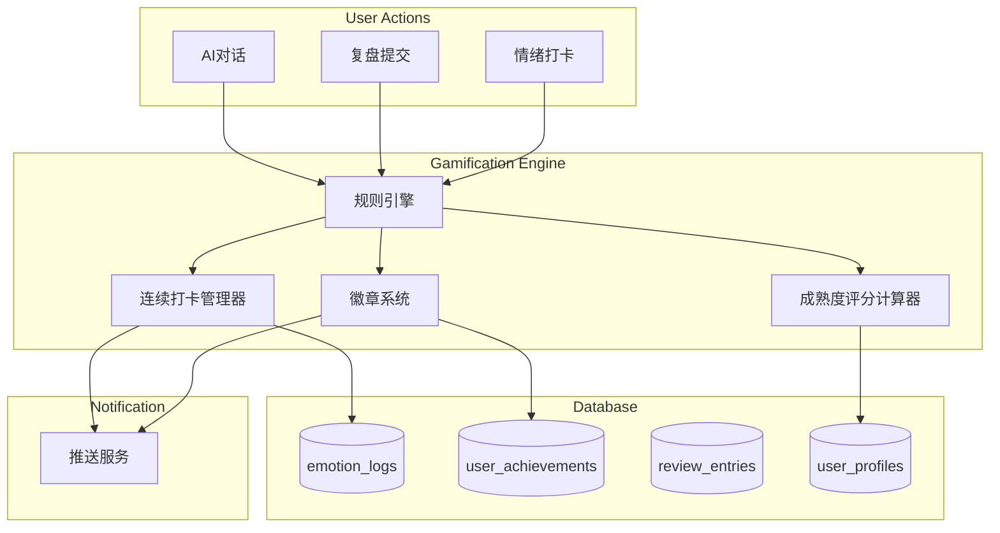

# Gamification Engine - Backend Architecture

**版本**: v1.0  
**更新日期**: 2026-01-20  
**目标**: 提升 30-day retention 34%（基于研究数据）

---

## 1. System Overview

Gamification Engine 负责管理徽章、连续打卡、成就系统和成熟度评分，通过即时正向反馈提升用户粘性。

### 1.1 核心组件



---

## 2. Database Schema

### 2.1 `user_achievements` 表

```sql
CREATE TABLE user_achievements (
  id UUID PRIMARY KEY DEFAULT gen_random_uuid(),
  user_id UUID NOT NULL REFERENCES user_profiles(id) ON DELETE CASCADE,
  
  -- 徽章信息
  badge_id VARCHAR(50) NOT NULL, -- stable_heart, calm_investor, deep_thinker, market_veteran
  badge_name VARCHAR(100) NOT NULL,
  badge_description TEXT,
  
  -- 解锁信息
  unlocked_at TIMESTAMPTZ,
  unlock_trigger VARCHAR(100), -- 触发条件描述
  is_unlocked BOOLEAN DEFAULT false,
  
  -- 进度追踪
  progress_current INTEGER DEFAULT 0,
  progress_required INTEGER,
  progress_percentage DECIMAL(5, 2) GENERATED ALWAYS AS (
    CASE WHEN progress_required > 0 
    THEN (progress_current::DECIMAL / progress_required * 100) 
    ELSE 0 END
  ) STORED,
  
  -- 元数据
  created_at TIMESTAMPTZ DEFAULT NOW(),
  
  UNIQUE(user_id, badge_id)
);

-- 索引
CREATE INDEX idx_user_achievements_user ON user_achievements(user_id, is_unlocked);
CREATE INDEX idx_user_achievements_badge ON user_achievements(badge_id);
```

### 2.2 `daily_briefs` 表

```sql
CREATE TABLE daily_briefs (
  id UUID PRIMARY KEY DEFAULT gen_random_uuid(),
  
  -- 简报内容
  date DATE NOT NULL UNIQUE,
  a_stock_emotion VARCHAR(20), -- panic, neutral, optimistic
  us_stock_emotion VARCHAR(20),
  
  -- 关键事件（JSON 数组）
  key_events JSONB, -- [{ title, impact, source }]
  
  -- 心理建议
  psychological_advice TEXT,
  
  -- 元数据
  generated_at TIMESTAMPTZ DEFAULT NOW()
);

-- 索引
CREATE INDEX idx_daily_briefs_date ON daily_briefs(date DESC);
```

---

## 3. Rule Engine

### 3.1 徽章解锁规则

**规则定义文件**: `lib/gamification/badge-rules.ts`

```typescript
export const BADGE_RULES: Record<string, BadgeRule> = {
  stable_heart: {
    id: 'stable_heart',
    name: '稳定之心',
    description: '连续 7 天情绪平静',
    icon: '💚',
    trigger: 'check_emotion_streak',
    condition: async (user_id: string) => {
      // 查询最近 7 天的情绪记录
      const { data } = await supabase
        .from('emotion_logs')
        .select('emotion')
        .eq('user_id', user_id)
        .gte('date', new Date(Date.now() - 7 * 24 * 60 * 60 * 1000))
        .order('date', { ascending: false })
        .limit(7);

      // 检查是否全部为 "calm"
      return data.length === 7 && data.every(log => log.emotion === 'calm');
    },
    reward: {
      push_notification: true,
      unlock_feature: '7_day_emotion_report',
    },
  },

  calm_investor: {
    id: 'calm_investor',
    name: '冷静投资者',
    description: '30 天无冲动交易记录',
    icon: '🧘',
    trigger: 'check_review_decisions',
    condition: async (user_id: string) => {
      const { data } = await supabase
        .from('review_entries')
        .select('action_taken, created_at')
        .eq('user_id', user_id)
        .gte('created_at', new Date(Date.now() - 30 * 24 * 60 * 60 * 1000));

      // 检查是否无"清仓"或连续3次"加仓"
      const hasImpulsive = data.some((entry, idx) => {
        if (entry.action_taken === 'clear') return true;
        if (idx >= 2 && 
            data[idx].action_taken === 'add' &&
            data[idx - 1].action_taken === 'add' &&
            data[idx - 2].action_taken === 'add') {
          return true;
        }
        return false;
      });

      return !hasImpulsive && data.length >= 5;
    },
  },

  deep_thinker: {
    id: 'deep_thinker',
    name: '深度反思者',
    description: '完成 10 次深度复盘',
    icon: '🧠',
    trigger: 'check_review_count',
    condition: async (user_id: string) => {
      const { data } = await supabase
        .from('review_entries')
        .select('reflection')
        .eq('user_id', user_id)
        .not('reflection', 'is', null);

      // 深度复盘定义：reflection 字段不为空且 > 20 字
      const deepReviews = data.filter(r => r.reflection && r.reflection.length > 20);
      return deepReviews.length >= 10;
    },
  },

  market_veteran: {
    id: 'market_veteran',
    name: '市场老兵',
    description: '经历 1 次暴跌且情绪稳定',
    icon: '⚔️',
    trigger: 'check_market_crash',
    condition: async (user_id: string) => {
      // 查询用户在市场大跌日（跌 > 5%）的情绪记录
      const crashDates = await getMarketCrashDates(); // 从 market_data_cache 获取
      
      for (const date of crashDates) {
        const { data } = await supabase
          .from('emotion_logs')
          .select('emotion')
          .eq('user_id', user_id)
          .eq('date', date)
          .single();

        if (data && data.emotion === 'calm') {
          return true;
        }
      }
      return false;
    },
  },
};
```

### 3.2 规则引擎执行

```typescript
// lib/gamification/rule-engine.ts
export async function evaluateBadges(user_id: string, trigger: string) {
  // 查询所有相关规则
  const relevantRules = Object.values(BADGE_RULES).filter(
    rule => rule.trigger === trigger
  );

  for (const rule of relevantRules) {
    // 检查徽章是否已解锁
    const { data: achievement } = await supabase
      .from('user_achievements')
      .select('*')
      .eq('user_id', user_id)
      .eq('badge_id', rule.id)
      .single();

    if (achievement?.is_unlocked) continue;

    // 评估条件
    const isUnlocked = await rule.condition(user_id);

    if (isUnlocked) {
      // 解锁徽章
      await unlockBadge(user_id, rule);
    } else {
      // 更新进度（如果规则支持）
      if (rule.progress) {
        const progress = await rule.progress(user_id);
        await updateBadgeProgress(user_id, rule.id, progress);
      }
    }
  }
}

async function unlockBadge(user_id: string, rule: BadgeRule) {
  // 更新数据库
  await supabase
    .from('user_achievements')
    .upsert({
      user_id,
      badge_id: rule.id,
      badge_name: rule.name,
      badge_description: rule.description,
      is_unlocked: true,
      unlocked_at: new Date(),
      unlock_trigger: rule.trigger,
    });

  // 发送推送通知
  if (rule.reward.push_notification) {
    await sendPush({
      type: 'milestone_achievement',
      user_id,
      title: `🎉 解锁新徽章：${rule.icon} ${rule.name}`,
      message: rule.description,
      data: { badge_id: rule.id },
    });
  }

  // 埋点
  await trackEvent('badge_unlock', {
    user_id,
    badge_id: rule.id,
    badge_name: rule.name,
    unlock_trigger: rule.trigger,
  });
}
```

---

## 4. Streak Manager（连续打卡管理器）

### 4.1 计算连续天数

```typescript
// lib/gamification/streak-manager.ts
export async function calculateStreak(user_id: string): Promise<number> {
  const { data: logs } = await supabase
    .from('emotion_logs')
    .select('date')
    .eq('user_id', user_id)
    .order('date', { ascending: false });

  if (!logs || logs.length === 0) return 0;

  let streak = 0;
  let currentDate = new Date();
  currentDate.setHours(0, 0, 0, 0);

  for (const log of logs) {
    const logDate = new Date(log.date);
    logDate.setHours(0, 0, 0, 0);

    // 检查是否连续
    if (logDate.getTime() === currentDate.getTime()) {
      streak++;
      currentDate.setDate(currentDate.getDate() - 1);
    } else {
      break;
    }
  }

  return streak;
}
```

### 4.2 连续打卡容错机制

**问题**: 用户偶尔忘记打卡，连续天数清零太残忍

**解决方案**: "续命卡"机制

```typescript
export async function applyStreakFreeze(user_id: string): Promise<boolean> {
  // 查询用户是否有可用的续命卡
  const { data: user } = await supabase
    .from('user_profiles')
    .select('streak_freeze_cards')
    .eq('id', user_id)
    .single();

  if (user.streak_freeze_cards > 0) {
    // 扣除续命卡
    await supabase
      .from('user_profiles')
      .update({ streak_freeze_cards: user.streak_freeze_cards - 1 })
      .eq('id', user_id);

    // 插入"占位"打卡记录
    await supabase
      .from('emotion_logs')
      .insert({
        user_id,
        date: new Date().toISOString().split('T')[0],
        emotion: 'neutral', // 占位情绪
        is_freeze_card: true,
      });

    return true;
  }

  return false;
}

// 用户每 30 天获得 1 张续命卡（上限 3 张）
```

---

## 5. Score Calculator（成熟度评分计算器）

### 5.1 评分算法

```typescript
// lib/gamification/score-calculator.ts
export async function calculateMaturityScore(user_id: string): Promise<number> {
  const weights = {
    emotional_stability: 0.4,
    decision_quality: 0.3,
    learning_progress: 0.2,
    persistence: 0.1,
  };

  // 1. 情绪稳定度 (0-100)
  const emotionalScore = await calculateEmotionalStability(user_id);

  // 2. 决策质量 (0-100)
  const decisionScore = await calculateDecisionQuality(user_id);

  // 3. 学习进度 (0-100)
  const learningScore = await calculateLearningProgress(user_id);

  // 4. 坚持度 (0-100)
  const persistenceScore = await calculatePersistence(user_id);

  // 加权平均
  const totalScore =
    emotionalScore * weights.emotional_stability +
    decisionScore * weights.decision_quality +
    learningScore * weights.learning_progress +
    persistenceScore * weights.persistence;

  return Math.round(totalScore);
}

async function calculateEmotionalStability(user_id: string): Promise<number> {
  const { data } = await supabase
    .from('emotion_logs')
    .select('emotion')
    .eq('user_id', user_id)
    .gte('date', new Date(Date.now() - 30 * 24 * 60 * 60 * 1000));

  if (!data || data.length === 0) return 0;

  const calmRatio = data.filter(log => log.emotion === 'calm').length / data.length;
  const panicRatio = data.filter(log => log.emotion === 'panic').length / data.length;

  // 平静占比高 + 恐慌占比低 = 高分
  return Math.round((calmRatio * 0.7 + (1 - panicRatio) * 0.3) * 100);
}

async function calculateDecisionQuality(user_id: string): Promise<number> {
  const { data } = await supabase
    .from('review_entries')
    .select('emotion_before, emotion_after, action_taken')
    .eq('user_id', user_id)
    .gte('created_at', new Date(Date.now() - 30 * 24 * 60 * 60 * 1000));

  if (!data || data.length === 0) return 0;

  // 情绪改善（before → after）+ 理性决策（非清仓）
  const improvementCount = data.filter(
    entry => entry.emotion_after > entry.emotion_before
  ).length;

  const rationalCount = data.filter(
    entry => entry.action_taken !== 'clear'
  ).length;

  return Math.round(
    ((improvementCount / data.length) * 0.6 + (rationalCount / data.length) * 0.4) * 100
  );
}
```

### 5.2 定时更新

```typescript
// app/api/cron/update-scores/route.ts
export async function GET(request: Request) {
  // 每周日凌晨 2 点更新所有用户的成熟度评分
  const { data: users } = await supabase
    .from('user_profiles')
    .select('id');

  for (const user of users) {
    const score = await calculateMaturityScore(user.id);
    
    await supabase
      .from('user_profiles')
      .update({ maturity_score: score })
      .eq('id', user.id);
  }

  return Response.json({ updated: users.length });
}
```

---

## 6. Performance Optimization

### 6.1 缓存策略

```typescript
// lib/gamification/cache.ts
import { Redis } from '@upstash/redis';

const redis = new Redis({
  url: process.env.REDIS_URL!,
  token: process.env.REDIS_TOKEN!,
});

export async function getCachedStreak(user_id: string): Promise<number | null> {
  const cached = await redis.get(`streak:${user_id}`);
  return cached ? parseInt(cached as string) : null;
}

export async function setCachedStreak(user_id: string, streak: number) {
  // 缓存 24 小时
  await redis.setex(`streak:${user_id}`, 24 * 60 * 60, streak.toString());
}
```

### 6.2 批量处理

```typescript
// 徽章规则评估改为异步批量处理
export async function evaluateBadgesBatch(user_ids: string[], trigger: string) {
  const promises = user_ids.map(user_id => evaluateBadges(user_id, trigger));
  await Promise.all(promises);
}
```

---

## 7. API Endpoints

### 7.1 获取用户徽章

```typescript
// app/api/achievements/list/route.ts
export async function GET(request: Request) {
  const user_id = getUserIdFromRequest(request);

  const { data } = await supabase
    .from('user_achievements')
    .select('*')
    .eq('user_id', user_id)
    .order('unlocked_at', { ascending: false });

  return Response.json({
    achievements: data,
    total_unlocked: data.filter(a => a.is_unlocked).length,
    total_badges: Object.keys(BADGE_RULES).length,
  });
}
```

### 7.2 获取成熟度评分

```typescript
// app/api/maturity-score/route.ts
export async function GET(request: Request) {
  const user_id = getUserIdFromRequest(request);

  const { data: user } = await supabase
    .from('user_profiles')
    .select('maturity_score, created_at')
    .eq('id', user_id)
    .single();

  // 计算排名
  const { count } = await supabase
    .from('user_profiles')
    .select('COUNT(*)')
    .gt('maturity_score', user.maturity_score)
    .single();

  const percentile = 100 - Math.round((count / (await getTotalUsers())) * 100);

  return Response.json({
    score: user.maturity_score,
    percentile, // 击败了 X% 的用户
    dimensions: await getScoreDimensions(user_id),
  });
}
```

---

**最后更新**: 2026-01-20  
**下次评审**: Week 2 根据徽章解锁率调整规则
