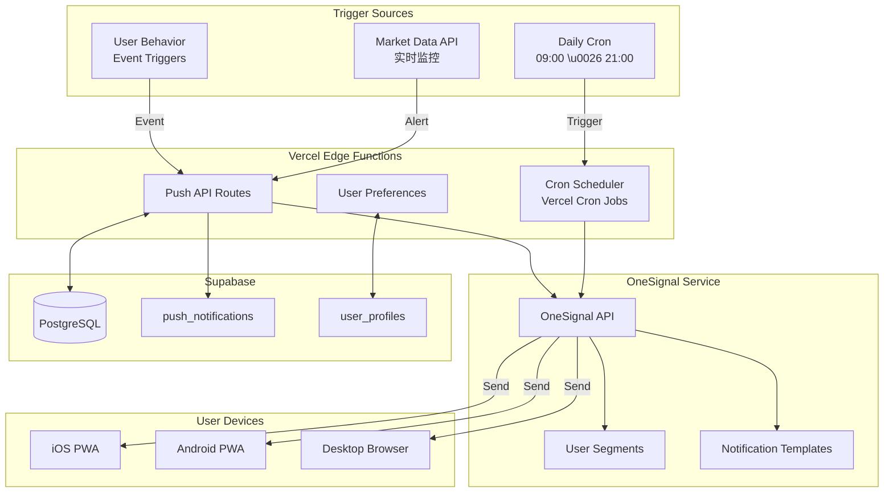

# Push Notification System Architecture

**版本**: v1.0  
**更新日期**: 2026-01-20  
**Service Provider**: OneSignal (免费 10K MAU)

---

## 1. System Overview

Push Notification 系统是 Budvest 用户留存的关键机制，通过智能推送和个性化提醒帮助用户养成每日打开习惯。

### 1.1 设计目标

- ✅ 提升 DAU/MAU Stickiness 至 25%+
- ✅ 推送点击率 > 20%
- ✅ 避免过度推送导致用户厌烦
- ✅ 智能学习用户最佳打开时间

---

## 2. Architecture Diagram



---

## 3. Push Notification Types

### 3.1 每日定时推送

**Type**: `daily_brief`,  `evening_review`

| 推送类型 | 默认时间 | 频率 | 可自定义 | 目标 |
|---------|---------|-----|---------|-----|
| **早间简报** | 09:00 | 每天 | ✅ | 建立打开习惯 |
| **晚间复盘** | 21:00 | 每天 | ✅ | 提醒记录情绪 |

**实现逻辑**:

```typescript
// app/api/cron/daily-brief/route.ts
export async function GET(request: Request) {
  // 验证 Cron Secret
  if (request.headers.get('Authorization') !== `Bearer ${process.env.CRON_SECRET}`) {
    return new Response('Unauthorized', { status: 401 });
  }

  // 查询所有启用早间简报的用户
  const { data: users } = await supabase
    .from('user_profiles')
    .select('id, push_settings')
    .eq('push_settings->>daily_brief_enabled', true);

  for (const user of users) {
    const preferredTime = user.push_settings?.daily_brief_time || '09:00';
    
    // 生成个性化简报内容
    const brief = await generateDailyBrief(user.id);
    
    // 发送推送
    await sendPush({
      type: 'daily_brief',
      user_id: user.id,
      title: '📊 今日市场情绪简报',
      message: brief.summary,
      data: { brief_id: brief.id },
      scheduled_time: preferredTime,
    });
  }

  return Response.json({ sent: users.length });
}
```

**vercel.json 配置**:

```json
{
  "crons": [
    {
      "path": "/api/cron/daily-brief",
      "schedule": "0 9 * * *"
    },
    {
      "path": "/api/cron/evening-review",
      "schedule": "0 21 * * *"
    }
  ]
}
```

---

### 3.2 市场异动推送

**Type**: `market_alert`

**触发条件**:

- A 股大盘跌 > 3%
- 用户持仓股票涨/跌 > 5%

**实现逻辑**:

```typescript
// lib/market-monitor.ts
export async function monitorMarketChanges() {
  // 查询实时市场数据
  const marketData = await fetchMarketData();

  if (marketData.a_stock_change < -3) {
    // 触发大盘下跌推送
    await sendBatchPush({
      type: 'market_alert',
      title: '市场波动提醒',
      message: `今日A股跌${Math.abs(marketData.a_stock_change)}%，要不要和AI聊聊？`,
      segment: 'all_users',
      data: { market_change: marketData.a_stock_change },
    });
  }

  // 查询用户持仓
  const { data: portfolios } = await supabase
    .from('portfolio_items')
    .select('user_id, symbol, ...portfolio_items')
    .eq('status', 'active');

  for (const portfolio of portfolios) {
    const stockData = await fetchStockPrice(portfolio.symbol);
    const changePercent = stockData.change_percent;

    if (Math.abs(changePercent) > 5) {
      await sendPush({
        type: 'market_alert',
        user_id: portfolio.user_id,
        title: `${portfolio.name}${changePercent > 0 ? '大涨' : '大跌'}`,
        message: `${portfolio.name}今天${changPercent > 0 ? '涨' : '跌'}了${Math.abs(changePercent)}%，保持冷静~`,
        data: { symbol: portfolio.symbol, change: changePercent },
      });
    }
  }
}

// 每 5 分钟监控一次（仅交易时段）
setInterval(monitorMarketChanges, 5 * 60 * 1000);
```

---

### 3.3 行为触发推送

**Type**: `streak_reminder`, `milestone_achievement`

**触发场景**:

| 场景 | 触发条件 | 推送时间 | 文案 |
|------|---------|---------|-----|
| 打卡即将中断 | 连续 N 天，今日未打卡且 > 20:00 | 20:30 | \"已连续 {N} 天，明天别忘了哦！\" |
| 里程碑达成 | 连续 7/30/90 天、解锁徽章 | 实时 | \"恭喜！你的心智成熟度突破 70 分！\" |
| 情绪异常 | 连续 3 天负面情绪 | 实时 | \"需要启动情绪熔断机制吗？\" |

**实现逻辑**:

```typescript
// lib/behavior-triggers.ts
export async function checkStreakReminder() {
  const now = new Date();
  if (now.getHours() !== 20 || now.getMinutes() !== 30) return;

  const { data: users } = await supabase
    .from('emotion_logs')
    .select('user_id, COUNT(*) as streak_days')
    .gte('date', new Date(Date.now() - 30 * 24 * 60 * 60 * 1000))
    .groupBy('user_id');

  for (const user of users) {
    // 检查今天是否已打卡
    const todayCheckin = await supabase
      .from('emotion_logs')
      .select('id')
      .eq('user_id', user.user_id)
      .eq('date', new Date().toISOString().split('T')[0])
      .single();

    if (!todayCheckin.data && user.streak_days >= 3) {
      await sendPush({
        type: 'streak_reminder',
        user_id: user.user_id,
        title: '🔥 连续打卡提醒',
        message: `已连续 ${user.streak_days} 天，明天别忘了哦！`,
        data: { streak_days: user.streak_days },
      });
    }
  }
}
```

---

### 3.4 智能学习推送时间

**Feature**: AI 学习用户最佳打开时间

**逻辑**:

```typescript
// lib/push-optimization.ts
export async function learnOptimalPushTime(user_id: string) {
  // 查询用户最近 30 天的打开时间分布
  const { data: sessions } = await supabase
    .from('analytics_events')
    .select('timestamp')
    .eq('user_id', user_id)
    .eq('event', 'page_view')
    .gte('timestamp', new Date(Date.now() - 30 * 24 * 60 * 60 * 1000));

  // 统计小时分布
  const hourCounts: Record<number, number> = {};
  sessions.forEach(session => {
    const hour = new Date(session.timestamp).getHours();
    hourCounts[hour] = (hourCounts[hour] || 0) + 1;
  });

  // 找出最高频的小时
  const optimalHour = Object.keys(hourCounts).reduce((a, b) =>
    hourCounts[a] > hourCounts[b] ? a : b
  );

  // 更新用户偏好
  await supabase
    .from('user_profiles')
    .update({
      push_settings: {
        daily_brief_time: `${optimalHour}:00`,
        learned_optimal_time: true,
      },
    })
    .eq('id', user_id);

  return optimalHour;
}
```

---

## 4. OneSignal Integration

### 4.1 SDK 初始化

**前端（Next.js）**:

```typescript
// app/layout.tsx
import OneSignal from 'react-onesignal';

useEffect(() => {
  OneSignal.init({
    appId: process.env.NEXT_PUBLIC_ONESIGNAL_APP_ID!,
    allowLocalhostAsSecureOrigin: true,
  }).then(() => {
    // 设置用户 ID
    OneSignal.setExternalUserId(user.id);
    
    // 订阅推送
    OneSignal.showSlidedownPrompt();
  });
}, []);
```

### 4.2 服务端 API

```typescript
// lib/onesignal.ts
import axios from 'axios';

const ONESIGNAL_API_KEY = process.env.ONESIGNAL_API_KEY!;
const ONESIGNAL_APP_ID = process.env.ONESIGNAL_APP_ID!;

export async function sendPush(params: {
  type: string;
  user_id: string;
  title: string;
  message: string;
  data?: Record<string, any>;
}) {
  const response = await axios.post(
    'https://onesignal.com/api/v1/notifications',
    {
      app_id: ONESIGNAL_APP_ID,
      include_external_user_ids: [params.user_id],
      headings: { en: params.title },
      contents: { en: params.message },
      data: {
        type: params.type,
        ...params.data,
      },
    },
    {
      headers: {
        'Authorization': `Basic ${ONESIGNAL_API_KEY}`,
        'Content-Type': 'application/json',
      },
    }
  );

  // 记录推送日志
  await supabase.from('push_notifications').insert({
    user_id: params.user_id,
    push_type: params.type,
    title: params.title,
    message: params.message,
    onesignal_id: response.data.id,
    sent_at: new Date(),
  });

  return response.data;
}
```

---

## 5. User Preferences

### 5.1 设置界面

用户可在"我的 → 通知设置"中控制：

| 设置项 | 默认值 | 说明 |
|--------|--------|-----|
| **启用推送** | ON | 总开关 |
| **早间简报** | ON, 09:00 | 可选时间 |
| **晚间复盘** | ON, 21:00 | 可选时间 |
| **市场异动** | ON | 大盘跌 > 3% |
| **持仓提醒** | ON | 个股涨跌 > 5% |
| **连续打卡** | ON | 打卡即将中断 |
| **里程碑** | ON | 成就解锁 |
| **勿扰时段** | 23:00 - 07:00 | 自定义 |

### 5.2 数据结构

```typescript
// user_profiles.push_settings (JSONB)
{
  "enabled": true,
  "daily_brief_enabled": true,
  "daily_brief_time": "09:00",
  "evening_review_enabled": true,
  "evening_review_time": "21:00",
  "market_alert_enabled": true,
  "portfolio_alert_enabled": true,
  "streak_reminder_enabled": true,
  "milestone_enabled": true,
  "quiet_hours": {
    "start": "23:00",
    "end": "07:00"
  },
  "learned_optimal_time": false
}
```

---

## 6. Push Notification Database Schema

```sql
CREATE TABLE push_notifications (
  id UUID PRIMARY KEY DEFAULT gen_random_uuid(),
  user_id UUID REFERENCES user_profiles(id) ON DELETE CASCADE,
  
  -- 推送元数据
  push_type VARCHAR(50) NOT NULL, -- daily_brief, market_alert, streak_reminder, milestone
  title VARCHAR(100) NOT NULL,
  message TEXT NOT NULL,
  data JSONB,
  
  -- OneSignal 集成
  onesignal_id VARCHAR(100),
  
  -- 状态
  sent_at TIMESTAMPTZ,
  clicked_at TIMESTAMPTZ,
  resulting_action VARCHAR(50), -- emotion_checkin, chat_start, none
  
  -- 元数据
  created_at TIMESTAMPTZ DEFAULT NOW()
);

-- 索引
CREATE INDEX idx_push_user_type ON push_notifications(user_id, push_type, created_at DESC);
CREATE INDEX idx_push_sent ON push_notifications(sent_at) WHERE sent_at IS NOT NULL;
```

---

## 7. Performance & Cost

### 7.1 OneSignal 免费额度

- **MAU**: 10,000 免费
- **推送数量**: 无限制
- **Segments**: 无限制

### 7.2 推送频率控制

**规则**:

- 每日最多 4 次推送（早间、市场异动 x2、晚间）
- 连续打卡提醒仅晚上 20:30 发送
- 勿扰时段禁止推送

**实现**:

```typescript
async function canSendPush(user_id: string, type: string): Promise<boolean> {
  // 检查勿扰时段
  const user = await getUser(user_id);
  const now = new Date();
  const hour = now.getHours();
  const quietStart = parseInt(user.push_settings.quiet_hours.start.split(':')[0]);
  const quietEnd = parseInt(user.push_settings.quiet_hours.end.split(':')[0]);
  
  if (hour >= quietStart || hour < quietEnd) {
    return false;
  }

  // 检查今日推送次数
  const todayCount = await supabase
    .from('push_notifications')
    .select('COUNT(*)')
    .eq('user_id', user_id)
    .gte('sent_at', new Date().setHours(0, 0, 0, 0))
    .single();

  if (todayCount.data.count >= 4) {
    return false;
  }

  return true;
}
```

---

## 8. Monitoring & Analytics

### 8.1 关键指标

| 指标 | 计算 | 目标 |
|------|------|-----|
| **Push Click Rate** | clicked / sent | > 20% |
| **Push to Action Rate** | (clicked AND action != 'none') / clicked | > 50% |
| **Daily Push Volume** | COUNT(push_notifications WHERE date=today) | < 4 per user |

### 8.2 Dashboard

在 Vercel Analytics 中创建自定义 Dashboard，实时监控：

- 每小时推送发送量
- 推送类型分布
- 点击率趋势

---

**最后更新**: 2026-01-20  
**下次评审**: Week 2 根据推送效果调整
