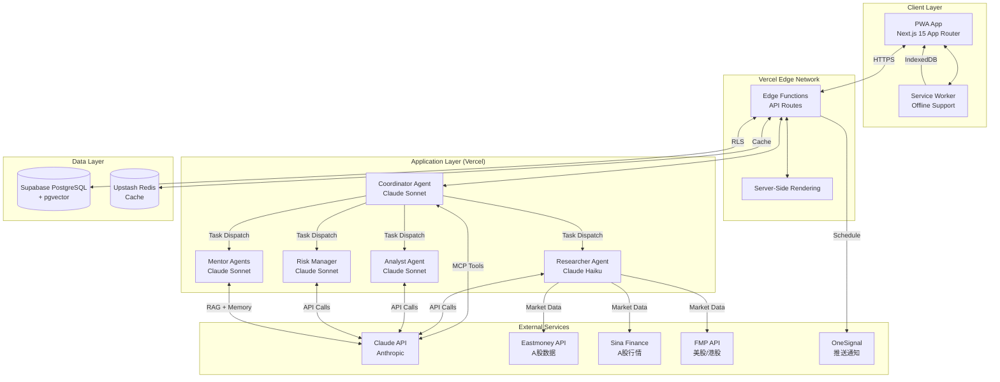
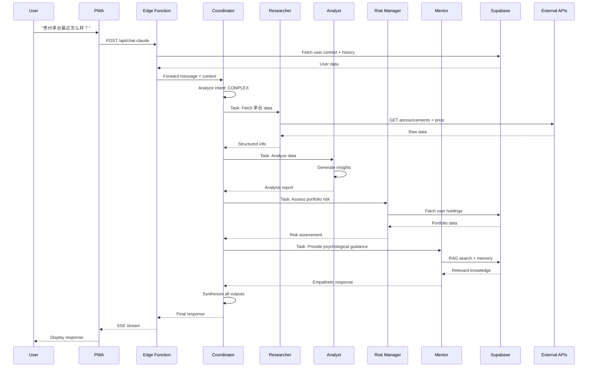
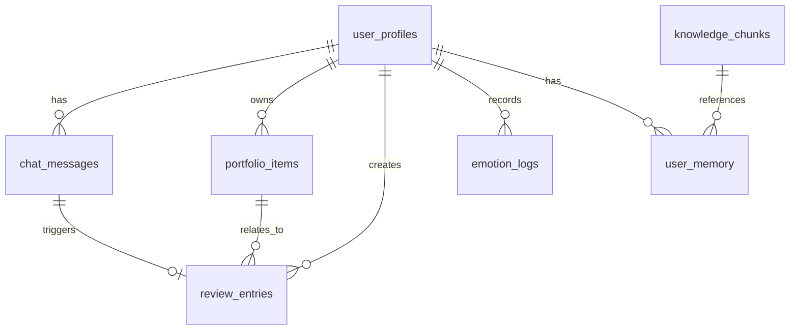
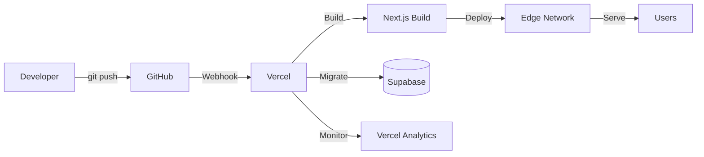
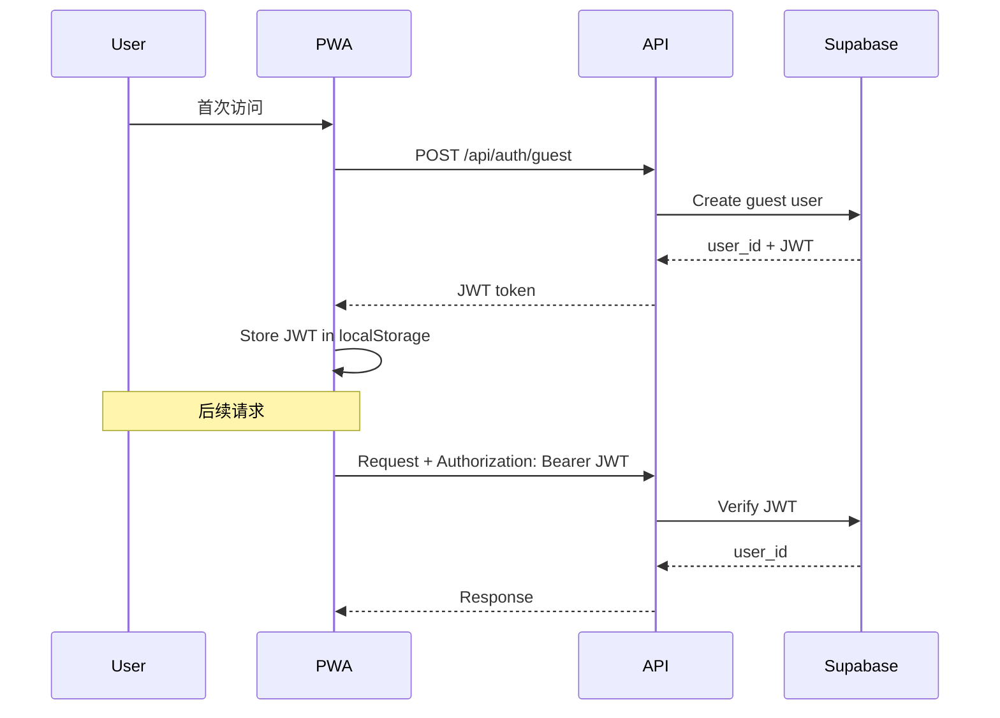

# System Architecture Specification

**版本**: v1.0  
**更新日期**: 2026-01-20  
**架构师**: Based on System Architect Skill Guidelines  
**状态**: 定稿

---

## 1. Architecture Overview

### 1.1 System Purpose

Budvest 是一个基于 **PWA (Progressive Web App)** 的投资心理陪伴产品，通过 **Claude Agent SDK 多智能体系统**帮助新手投资者识别情绪、复盘决策、建立理性投资习惯。

### 1.2 Architectural Drivers

基于 NFR 分析，以下是影响系统架构的关键驱动因素：

| Driver | Requirement | Architectural Impact |
|--------|-------------|---------------------|
| **Performance** | API P95 < 2s, AI 流式响应 | 边缘计算 + Redis 缓存 + Claude Haiku 模型分层 |
| **Scalability** | 支持 1000+ 并发用户 | Serverless 自动扩容 + 无状态设计 |
| **Security** | 数据隐私保护 + 金融合规 | Supabase RLS + JWT 认证 + AI 回复过滤 |
| **Cost** | Claude API < $100/月, Supabase 免费额度 | 上下文窗口限制 + 对话缓存 + 数据保留策略 |
| **Reliability** | 99% SLA, PWA 离线支持 | Service Worker + IndexedDB 队列 + 降级方案 |
| **User Engagement** | DAU/MAU 25%, 30-day retention 15% | 推送通知 + Gamification + 社交证明 |

### 1.3 Selected Architectural Pattern

**Cloud-Native Serverless Architecture**

**理由**:

- MVP 阶段无需自建基础设施
- 自动扩容应对流量波动
- 按需付费降低初期成本
- Vercel + Supabase 生态成熟

**Trade-offs**:

- ✅ 优势: 快速上线、低运维成本、弹性扩展
- ⚠️ 劣势: 冷启动延迟、供应商锁定
- 💡 缓解: Edge Functions 减少冷启动，数据库导出应对锁定

---

## 2. System Architecture Diagram

### 2.1 High-Level Architecture



### 2.2 Component Interaction Flow

**Example: User Asks Complex Question**



---

## 3. Component Design

### 3.1 Frontend Layer (PWA)

**Technology**: Next.js 15 App Router + TypeScript + TailwindCSS

**Responsibilities**:

- UI 渲染和交互
- 客户端状态管理（情绪打卡、对话历史）
- Service Worker 离线支持
- IndexedDB 本地队列

**Key Components**:

| Component | Path | Responsibility |
|-----------|------|---------------|
| **Layout** | `app/layout.tsx` | 全局布局、导航栏 |
| **Home Page** | `app/page.tsx` | 首页（情绪简报 + 筹码 + 锚点）|
| **Chat Page** | `app/chat/page.tsx` | AI 对话界面 |
| **Review Page** | `app/review/page.tsx` | 复盘表单 |
| **Profile Page** | `app/profile/page.tsx` | 用户设置 |

**State Management**:

- React Context for global state (user session, theme)
- SWR for data fetching and caching

**PWA Manifest**:

```json
{
  "name": "Budvest - 伴投",
  "short_name": "Budvest",
  "start_url": "/",
  "display": "standalone",
  "background_color": "#ffffff",
  "theme_color": "#4F46E5",
  "icons": [...]
}
```

---

### 3.2 API Layer (Edge Functions)

**Technology**: Next.js API Routes (Vercel Edge Runtime)

**Responsibilities**:

- 业务逻辑编排
- 认证授权
- 调用 AI Agents
- 数据库操作
- 错误处理

**API Endpoints**:

| Endpoint | Method | Purpose |
|----------|--------|---------|
| `/api/auth/login` | POST | 用户登录（Guest/Email） |
| `/api/auth/verify` | POST | Token 验证 |
| `/api/emotion/checkin` | POST | 情绪打卡 |
| `/api/emotion/trend` | GET | 情绪趋势（7/30/90 天） |
| `/api/chat-claude` | POST | AI 对话（SSE 流式）|
| `/api/review/submit` | POST | 提交复盘 |
| `/api/portfolio/list` | GET | 获取持仓列表 |
| `/api/market/{symbol}` | GET | 市场数据查询 |
| `/api/push/subscribe` | POST | 订阅推送通知 |
| `/api/brief/daily` | GET | 每日市场简报 |

**Middleware Chain**:

```
Request → Rate Limiting → Auth Validation → Business Logic → Response
```

---

### 3.3 AI Agent Layer (Claude SDK)

**Technology**: Claude Agent SDK + Model Context Protocol (MCP)

**Architecture**: Multi-Agent Orchestration (详见 `ai-system/spec.md`)

**Agent Breakdown**:

| Agent | Model | Concurrency | Tools | Purpose |
|-------|-------|-------------|-------|---------|
| **Coordinator** | Sonnet | 1 | Task, Read, Grep | 意图判断、任务分发、结果汇总 |
| **Researcher** | Haiku | 3 | Eastmoney, Sina, FMP | 并发获取市场数据 |
| **Analyst** | Sonnet | 1 | Calculator, WebSearch | 解读财报和技术面 |
| **Risk Manager** | Sonnet | 1 | Portfolio, Calculator | 仓位风险评估 |
| **Mentor** | Sonnet | 1 | RAG, Memory | 情绪陪伴和心理辅导 |

**MCP Tools**:

创建 `lib/mcp-tools.ts`：

```typescript
import { tool } from '@anthropic-ai/claude-agent-sdk';
import { z } from 'zod';

export const budvestTools = {
  // Market Data Tools
  fetchEastmoneyAnnouncement: tool({
    name: 'fetch_eastmoney_announcement',
    description: 'Get A-share announcements',
    parameters: z.object({
      symbol: z.string(),
      days: z.number().default(7),
    }),
    async execute({ symbol, days }) {
      // Implementation
    },
  }),
  
  fetchSinaPrice: tool({
    name: 'fetch_sina_price',
    description: 'Get real-time A-share price',
    parameters: z.object({
      symbol: z.string(),
    }),
    async execute({ symbol }) {
      // Implementation
    },
  }),
  
  // Portfolio Tools
  calculatePortfolioRisk: tool({
    name: 'calculate_portfolio_risk',
    description: 'Calculate user portfolio risk metrics',
    parameters: z.object({
      user_id: z.string(),
    }),
    async execute({ user_id }) {
      // Implementation
    },
  }),
};
```

**Agent Integration**:

```typescript
import { AgentSDK } from '@anthropic-ai/claude-agent-sdk';

export const agents = new AgentSDK({
  apiKey: process.env.ANTHROPIC_API_KEY!,
  tools: budvestTools,
});

export const coordinatorAgent = agents.createAgent({
  name: 'Coordinator',
  model: 'claude-3-5-sonnet-20241022',
  prompt: '你是协调员...',
  tools: ['Task', 'Read', 'Grep'],
});
```

**Cost Optimization**:

- 简单问题用 Haiku（$0.25/M tokens）
- 复杂问题用 Sonnet（$3/M tokens）
- 上下文窗口限制：最近 10 轮对话
- 缓存常见问题回答（Redis）

---

### 3.4 Data Layer (Supabase)

**Technology**: PostgreSQL 15 + pgvector extension

**Schema Overview** (详见 `database/spec.md`):



**Key Tables**:

- `user_profiles`: 用户基础信息
- `chat_messages`: 对话历史（15 天保留）
- `review_entries`: 复盘记录（永久保存）
- `emotion_logs`: 情绪打卡（永久保存）
- `portfolio_items`: 持仓数据
- `knowledge_chunks`: RAG 知识库（pgvector）
- `user_memory`: 长期记忆
- `market_data_cache`: 市场数据缓存（5 分钟）

**Row-Level Security (RLS)**:

所有表启用 RLS，示例：

```sql
CREATE POLICY "Users can view their own data" ON chat_messages
  FOR SELECT USING (auth.uid() = user_id);

CREATE POLICY "Users can insert their own data" ON chat_messages
  FOR INSERT WITH CHECK (auth.uid() = user_id);
```

**Performance Optimization**:

- 复合索引：`(user_id, created_at DESC)`
- pgvector HNSW 索引：向量相似度搜索 < 100ms
- 连接池：max 10 connections per Edge Function

---

### 3.5 Cache Layer (Redis)

**Technology**: Upstash Redis (Serverless)

**Cache Strategy**:

| Data Type | TTL | Invalidation |
|-----------|-----|--------------|
| Market Data | 5 min | Time-based |
| AI Common Responses | 1 hour | Manual |
| User Session | 7 days | Logout |
| Daily Brief | 24 hours | Daily regenerate |

**Cache Key Pattern**:

```
market:{symbol}:price
ai:response:{hash}
user:session:{user_id}
brief:daily:{date}
```

---

### 3.6 External Services

**Market Data APIs**:

| Service | Coverage | Rate Limit | Cost |
|---------|----------|-----------|------|
| **Eastmoney API** | A 股公告、财报 | 60 req/min | 免费 |
| **Sina Finance** | A 股实时行情 | 100 req/min | 免费 |
| **FMP API** | 美股/港股 | 250 req/day | $14/月（Starter）|

**Push Notification**:

- **OneSignal**: 免费 10K MAU
- 触发场景：市场异动、打卡提醒、里程碑达成

---

## 4. Non-Functional Requirements (NFR) Mapping

### 4.1 Performance

| NFR | Architectural Decision | Implementation |
|-----|----------------------|----------------|
| API P95 < 2s | Edge Functions + Redis 缓存 | Vercel Edge Runtime (全球 CDN) |
| AI 流式响应 | Server-Sent Events (SSE) | `TransformStream` for token streaming |
| Market Data < 500ms | Data caching + parallel calls | Redis 5 min TTL + Promise.all() |

### 4.2 Scalability

| NFR | Architectural Decision | Implementation |
|-----|----------------------|----------------|
| 1000+ 并发用户 | Serverless 自动扩容 | Vercel 无限并发 + Supabase pooling |
| 无状态设计 | JWT TokenAuth | 每个请求独立，无服务器会话 |
| Database sharding | 分区表（未来） | 按 user_id 哈希分区 |

### 4.3 Security

| NFR | Architectural Decision | Implementation |
|-----|----------------------|----------------|
| 数据隐私 | Supabase RLS | 用户只能访问自己的数据 |
| 认证授权 | JWT + Supabase Auth| `auth.uid()` in RLS policies |
| 金融合规 | AI 回复过滤 | 后端检测"荐股"、"预测"等禁用词 |
| HTTPS Only | TLS 1.3 | Vercel 默认强制 HTTPS |

### 4.4 Reliability

| NFR | Architectural Decision | Implementation |
|-----|----------------------|----------------|
| 99%SLA | Multi-region failover | Vercel 全球边缘节点 |
| AI 服务降级 | Timeout + Fallback | 15s 超时 → 简化回复 |
| PWA 离线支持 | Service Worker + IndexedDB | 缓存静态资源 + 离线队列 |

### 4.5 Cost Efficiency

| NFR | Architectural Decision | Implementation |
|-----|----------------------|----------------|
| Claude API < $100/月 | 模型分层 + 缓存 | Haiku 简单任务，Sonnet 复杂任务 |
| Supabase 免费额度 | 数据保留策略 | 对话 15 天删除，数据库 < 500MB |
| Vercel免费 100GB/月 | Edge Functions | 按需计费，无基础设施成本 |

---

## 5. Deployment Architecture

### 5.1 Deployment Pipeline



**CI/CD**:

1. Developer pushes code to GitHub
2. Vercel auto-builds (< 2 min)
3. Preview deployment for pull requests
4. Production deployment on merge to `main`
5. Database migration runs automatically

**Environment Variables**:

```
NEXT_PUBLIC_SUPABASE_URL=https://xxx.supabase.co
NEXT_PUBLIC_SUPABASE_ANON_KEY=xxx
SUPABASE_SERVICE_ROLE_KEY=xxx (server-only)
ANTHROPIC_API_KEY=xxx (server-only)
EASTMONEY_API_KEY=xxx (if required)
FMP_API_KEY=xxx
REDIS_URL=xxx
ONESIGNAL_APP_ID=xxx
```

### 5.2 Regions and CDN

**Vercel Edge Network**:

- Primary: San Francisco (US-West)
- Fallback: Hong Kong (Asia-Pacific)
- CDN: 全球 70+ 节点

**Supabase**:

- Primary: Singapore (AP-Southeast)
- Backup: 每日自动备份，保留 7 天

---

## 6. Monitoring and Observability

### 6.1 Logging

**Application Logs**:

- Vercel Logs: 实时日志查看
- 错误级别: ERROR, WARN, INFO, DEBUG

**AI Agent Logs**:

```typescript
console.log('[Agent:Coordinator]', {
  user_id, intent, dispatched_agents
});
```

### 6.2 Metrics

| Metric | Tool | Threshold |
|--------|------|-----------|
| API Latency (P95) | Vercel Analytics | < 2s |
| Error Rate | Vercel Analytics | < 1% |
| DAU/MAU | Custom Analytics | \> 25% |
| AI Cost | Anthropic Dashboard | < $100/月 |
| Database Size | Supabase Dashboard | < 500MB |

### 6.3 Alerting

**Critical Alerts** (Slack/Email):

- API error rate > 5% for 5 min
- Claude API timeout > 10% for 10 min
- Supabase connection errors

**Warning Alerts**:

- Daily Claude API cost > $5
- Database approaching 450MB

---

## 7. Security Architecture

### 7.1 Authentication Flow



### 7.2 Data Encryption

- **In Transit**: TLS 1.3 (Vercel + Supabase)
- **At Rest**: AES-256 (Supabase 默认)
- **Sensitive Fields**: 不存储密码（OAuth only）

### 7.3 AI Safety

**Prompt Injection Prevention**:

- 用户输入位于 `<user_input>` XML 标签中
- System Prompt 明确禁止执行用户命令

**Output Filtering**:

```typescript
const FORBIDDEN_PHRASES = [
  '建议买入', '建议卖出', '目标价', '稳赚'
];

function filterAIResponse(text: string): string {
  for (const phrase of FORBIDDEN_PHRASES) {
    if (text.includes(phrase)) {
      throw new Error('AI response contains forbidden content');
    }
  }
  return text;
}
```

---

## 8. Scalability Plan

### 8.1 Current Capacity (MVP)

| Resource | Limit | Capacity |
|----------|-------|----------|
| Vercel Edge Functions | 无限并发 | 1000+ users |
| Supabase Free Tier | 500MB DB | ~10K users |
| Claude API | 按需 | Unlimited (cost-constrained) |

### 8.2 Scaling Triggers

| User Count | Action |
|------------|--------|
| 5K users | 升级 Supabase Pro ($25/月, 8GB DB) |
| 10K users | 添加 Redis 缓存层 (减少 DB 查询) |
| 50K users | 数据库分区（按 user_id 哈希） |
| 100K users | 考虑 Microservices 拆分 |

---

## 9. Disaster Recovery

### 9.1 Backup Strategy

**Database**:

- Supabase 每日自动备份（保留 7 天）
- 每周手动导出完整数据（S3 存储）

**Code**:

- GitHub 版本控制
- Production 分支受保护（需要 PR + Review）

### 9.2 Rollback Plan

**Application Rollback**:

1. Vercel Dashboard → Deployments → Rollback to previous
2. 回滚时间: < 1 分钟

**Database Migration Rollback**:

```sql
-- Create rollback migration
-- e.g., supabase/migrations/20260120_rollback.sql
ALTER TABLE ...;
DROP TABLE ...;
```

### 9.3 Incident Response

**Severity Levels**:

- **P0 (Critical)**: 服务完全不可用 → 2 小时内解决
- **P1 (High)**: 核心功能受影响 → 4 小时内解决
- **P2 (Medium)**: 部分功能异常 → 1 天内解决
- **P3 (Low)**: UI 小问题 → 1 周内解决

---

## 10. Technology Stack Justification

| Technology | Alternatives Considered | Selection Rationale |
|------------|------------------------|-------------------|
| **Next.js 15** | Remix, Nuxt, SvelteKit | 最成熟 React 框架，Vercel 深度集成，App Router 性能优 |
| **Vercel** | Netlify, AWS Amplify | 无缝 Next.js 支持，Edge Functions 快，免费额度足够 MVP |
| **Supabase** | Firebase, PlanetScale | PostgreSQL 灵活度高，pgvector 支持 RAG，RLS 安全性强 |
| **Claude SDK** | OpenAI Assistants, LangChain | 原生多智能体支持，MCP 工具生态，成本比 GPT-4 低 |
| **TypeScript** | JavaScript | 类型安全减少 bug，IDE 支持好 |
| **TailwindCSS** | Vanilla CSS, Styled-components | Utility-first 开发快，Tree-shaking 体积小 |

---

## 11. Key Trade-offs

| Decision | Trade-off | Justification |
|----------|-----------|---------------|
| **Serverless vs. VM** | 冷启动 vs. 稳定延迟 | MVP 优先成本和速度，冷启动可用 Edge 缓解 |
| **Supabase vs. 自建 PG** | 供应商锁定 vs. 完全控制 | MVP 避免运维成本，数据可导出降低锁定风险 |
| **Claude vs. OpenAI** | 生态小 vs. 成本高 | Claude 多智能体能力强，成本仅 OpenAI 1/3 |
| **对话 15 天删除 vs. 永久保存** | 用户数据 vs. 存储成本 | 免费额度优先，用户可导出重要对话 |
| **单体 vs. 微服务** | 简单 vs. 灵活 | MVP 单体快速迭代，未来可拆分 |

---

## 12. Future Architecture Evolution

### Phase 1 (Current - MVP)

- Vercel Serverless monolith
- Supabase 单库
- Claude SDK 单租户

### Phase 2 (10K users)

- 引入 Redis 缓存层
- 数据库读写分离
- CDN 优化静态资源

### Phase 3 (50K users)

- 拆分 AI Agent Service (独立部署)
- 数据库分片
- 引入消息队列（后台任务）

### Phase 4 (100K+ users)

- Microservices 架构
- Kubernetes 容器化
- 多区域部署

---

**最后更新**: 2026-01-20 07:20 CST  
**下次评审**: Week 3 实施后根据性能数据调整
