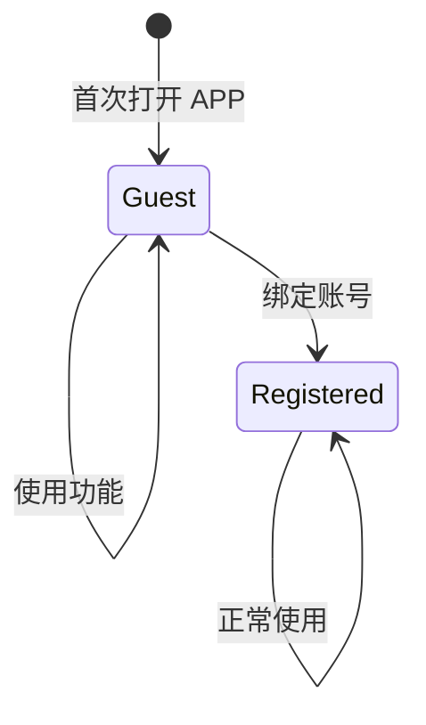
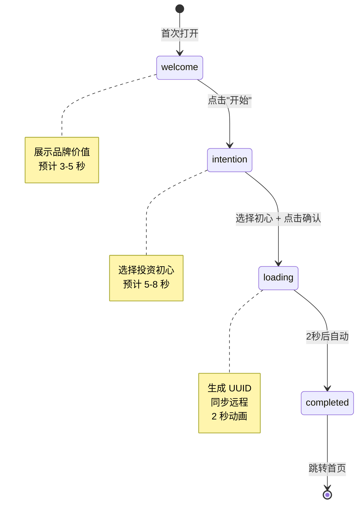

# 状态定义：游客与引导状态

**版本**: v1.0
**更新日期**: 2026-01-21
**关联需求**: FR-001

---

## 概述

定义游客用户的状态枚举、投资初心选项、以及 Onboarding 流程状态。

---

## 投资初心枚举 (InvestmentIntention)

用户在 Onboarding 时选择的投资初心。

### TypeScript 定义

```typescript
// lib/types.ts

export type InvestmentIntention = 'long_term' | 'opportunity' | 'learning';

export interface InvestmentIntentionOption {
  id: InvestmentIntention;
  label: string;
  description: string;
  icon: string;
}

export const INVESTMENT_INTENTIONS: InvestmentIntentionOption[] = [
  {
    id: 'long_term',
    label: '长期持有',
    description: '我相信长期投资，希望在波动中保持定力',
    icon: '🌱',
  },
  {
    id: 'opportunity',
    label: '把握机会',
    description: '我关注市场机会，希望理性判断进出时机',
    icon: '⚡',
  },
  {
    id: 'learning',
    label: '学习成长',
    description: '我是投资新手，想培养健康的投资心态',
    icon: '📚',
  },
];
```

### 数据库存储

```sql
-- user_profiles.investment_goal 字段
-- 类型: VARCHAR(50)
-- 有效值: 'long_term', 'opportunity', 'learning'
```

### 用途

| 初心 | AI 导师调整 | 内容推荐 |
|------|------------|---------|
| long_term | 强调耐心、长期视角、基本面 | 价值投资案例、巴菲特语录 |
| opportunity | 关注风险控制、时机判断 | 技术分析基础、止损策略 |
| learning | 基础概念解释、循序渐进 | 新手入门内容、心理建设 |

---

## 用户类型枚举 (UserType)

区分游客用户和注册用户。

### TypeScript 定义

```typescript
// lib/types.ts

export type UserType = 'guest' | 'registered';

export interface GuestProfile {
  id: string;                          // UUID v4
  type: 'guest';
  investmentIntention: InvestmentIntention;
  createdAt: string;                   // ISO 8601
}

export interface RegisteredProfile extends GuestProfile {
  type: 'registered';
  email?: string;
  phone?: string;
  displayName?: string;
}

export type UserProfile = GuestProfile | RegisteredProfile;
```

### 状态转换



---

## Onboarding 步骤枚举 (OnboardingStep)

引导流程的步骤状态。

### TypeScript 定义

```typescript
// lib/types.ts

export type OnboardingStep = 'welcome' | 'intention' | 'loading' | 'completed';

export interface OnboardingState {
  currentStep: OnboardingStep;
  selectedIntention: InvestmentIntention | null;
  guestId: string | null;
  isCompleted: boolean;
}

export const INITIAL_ONBOARDING_STATE: OnboardingState = {
  currentStep: 'welcome',
  selectedIntention: null,
  guestId: null,
  isCompleted: false,
};
```

### 状态转换图



---

## localStorage 存储结构

### Guest ID

```typescript
// Key: 'bantou_guest_id'
// Value: UUID v4 字符串
"550e8400-e29b-41d4-a716-446655440000"
```

### User Config (更新后)

```typescript
// Key: 'bantou_user_config'
// Value: JSON 字符串
{
  "hasOnboarded": true,
  "investmentIntention": "long_term",  // 新增
  "selectedGuru": "coach",
  "watchlist": [],
  "portfolio": [],
  "totalPrincipal": 0
}
```

---

## 兼容性说明

### 与现有 UserConfig 的关系

```typescript
// 原有 UserConfig (lib/types.ts)
export interface UserConfig {
  userGoal: string;            // 将被 investmentIntention 替代
  selectedGuru: Guru;
  watchlist: string[];
  mainSymbol: string;
  portfolio: PortfolioItem[];
  totalPrincipal: number;
  hasOnboarded: boolean;
  firstLoginTimestamp?: number;
}

// 更新后的 UserConfig
export interface UserConfig {
  investmentIntention: InvestmentIntention;  // 新增
  userGoal?: string;                         // 保留但不再使用
  selectedGuru: Guru;
  watchlist: string[];
  mainSymbol: string;
  portfolio: PortfolioItem[];
  totalPrincipal: number;
  hasOnboarded: boolean;
  firstLoginTimestamp?: number;
}
```

### 迁移策略

老用户 (hasOnboarded=true) 无需迁移，新字段 `investmentIntention` 可为空。

---

## 验证函数

```typescript
// lib/guest.ts

export function isValidIntention(value: string): value is InvestmentIntention {
  return ['long_term', 'opportunity', 'learning'].includes(value);
}

export function isGuest(profile: UserProfile): profile is GuestProfile {
  return profile.type === 'guest';
}

export function hasCompletedOnboarding(): boolean {
  if (typeof window === 'undefined') return false;
  const config = localStorage.getItem('bantou_user_config');
  if (!config) return false;
  try {
    const parsed = JSON.parse(config);
    return parsed.hasOnboarded === true;
  } catch {
    return false;
  }
}
```

---

**最后更新**: 2026-01-21
