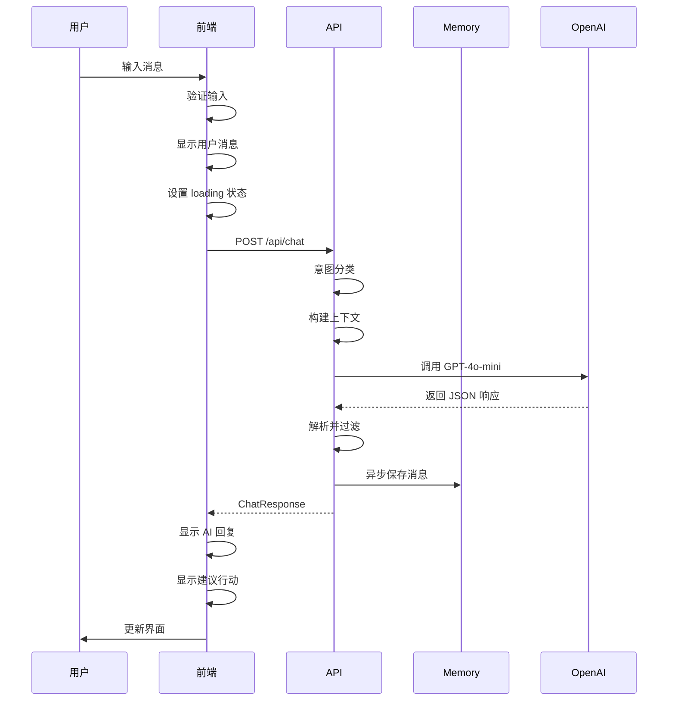
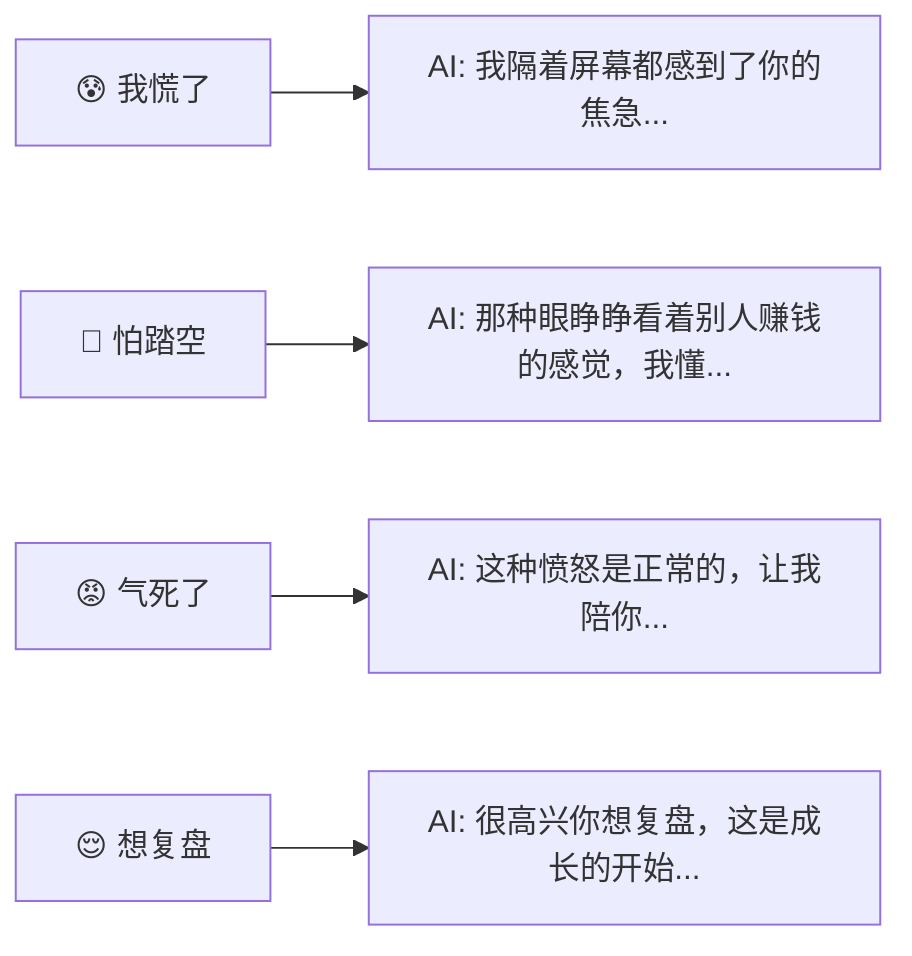
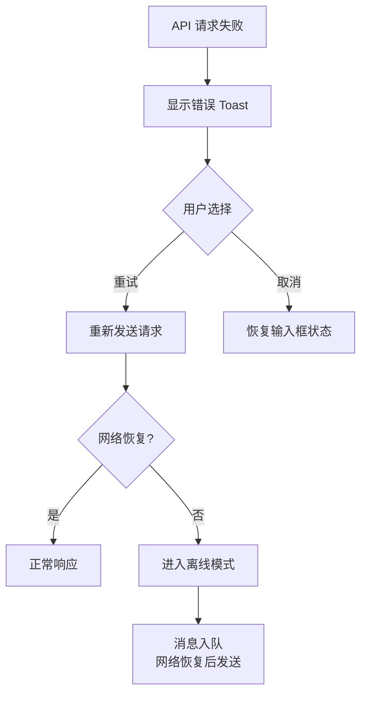

# AI 情绪教练对话流程

**流程ID**: UF-002
**优先级**: P0 - Critical
**涉及页面**: 首页 → 对话页

---

## 流程概述

用户与 AI 情绪教练进行多轮对话，AI 能识别用户情绪并提供温暖、共情的回应。对话结束后可触发复盘流程。

### 设计目标

- ✅ 快速进入对话，降低使用门槛
- ✅ AI 识别情绪并共情回应
- ✅ 严格禁止投资操作建议
- ✅ 对话历史持久化存储

---

## 完整流程图

```mermaid
flowchart TB
    Start([用户点击"开始对话"]) --> CheckAuth{检查用户状态}

    CheckAuth -->|已登录/Guest| LoadChat[加载对话页面]
    CheckAuth -->|未初始化| Redirect[跳转 Onboarding]

    LoadChat --> LoadHistory{{加载历史对话<br/>GET /api/chat/history}}

    LoadHistory --> ShowUI[显示对话界面]

    ShowUI --> WaitInput[等待用户输入]

    WaitInput --> UserType[用户输入消息]

    UserType --> Validate{输入验证}

    Validate -->|空消息| ShowError1[提示"请输入内容"]
    Validate -->|超长| ShowError2[提示"消息过长"]
    Validate -->|正常| SetLoading[设置加载状态]

    ShowError1 --> WaitInput
    ShowError2 --> WaitInput

    SetLoading --> AddUserMsg[添加用户消息到 UI]

    AddUserMsg --> CallAPI{{调用 API<br/>POST /api/chat}}

    CallAPI --> APIResult{API 响应?}

    APIResult -->|成功| ParseResponse[解析响应<br/>ChatResponse]
    APIResult -->|失败| HandleError[显示错误提示]
    APIResult -->|超时| HandleTimeout[显示"请求超时"]

    HandleError --> RetryOption{用户选择}
    HandleTimeout --> RetryOption

    RetryOption -->|重试| CallAPI
    RetryOption -->|取消| RemoveMsg[移除失败消息]

    RemoveMsg --> WaitInput

    ParseResponse --> DisplayReply[显示 AI 回复]

    DisplayReply --> ShowActions[显示建议行动]

    ShowActions --> UpdateEmotion[更新情绪标签]

    UpdateEmotion --> SaveLocal[保存到本地缓存]

    SaveLocal --> CheckReview{对话轮数 >= 3?}

    CheckReview -->|是| ShowReviewHint[显示"记录复盘"提示]
    CheckReview -->|否| WaitInput

    ShowReviewHint --> UserChoice{用户选择}

    UserChoice -->|继续对话| WaitInput
    UserChoice -->|开始复盘| TriggerReview[跳转复盘流程]
    UserChoice -->|关闭提示| WaitInput

    TriggerReview --> End([进入复盘流程])

    style Start fill:#90EE90
    style End fill:#90EE90
    style HandleError fill:#FFB6C1
    style HandleTimeout fill:#FFB6C1
    style CallAPI fill:#87CEEB
    style LoadHistory fill:#87CEEB
```

---

## 场景分解

### 场景 1: 正常对话流程



### 场景 2: 情绪筹码快捷入口



### 场景 3: 网络异常处理



---

## UI 状态说明

### 对话页面布局

```
┌─────────────────────────────────────┐
│ ← 返回    AI 情绪教练    📝 记录    │  Header
├─────────────────────────────────────┤
│                                     │
│  ┌───────────────────────────────┐ │
│  │ 🤖 Coach                      │ │
│  │ 我能感受到你现在的焦虑。      │ │
│  │ 先深呼吸几次...               │ │
│  │ ─────────────────────────     │ │
│  │ 💡 建议: 把当前想法写下来     │ │
│  └───────────────────────────────┘ │
│                                     │
│  ┌───────────────────────────────┐ │
│  │                      👤 用户  │ │
│  │ 我的茅台今天跌了5%，好焦虑    │ │
│  └───────────────────────────────┘ │
│                                     │
│  ┌───────────────────────────────┐ │
│  │ 🤖 Coach         [情绪: 😰]   │ │
│  │ 我隔着屏幕都感受到了...       │ │
│  │ ─────────────────────────     │ │
│  │ 💡 深呼吸 | 记录想法 | 暂离   │ │
│  └───────────────────────────────┘ │
│                                     │
├─────────────────────────────────────┤
│ [输入你的想法...]         [发送 ➤] │  Input
└─────────────────────────────────────┘
```

### 状态变化

| 状态 | 输入框 | 发送按钮 | 消息区域 |
|------|--------|---------|---------|
| 空闲 | 可编辑 | 禁用（灰色） | 显示历史 |
| 输入中 | 可编辑 | 启用（主色） | 显示历史 |
| 发送中 | 禁用 | 显示 loading | 显示用户消息 + 骨架屏 |
| 响应中 | 禁用 | 显示 loading | 逐字显示 AI 回复 |
| 完成 | 可编辑 | 禁用 | 显示完整对话 |
| 错误 | 可编辑 | 显示重试 | 显示错误提示 |

---

## 边界条件处理

| 场景 | 处理方式 |
|------|---------|
| 用户未初始化 | 跳转到 Onboarding 流程 |
| 输入为空 | 禁用发送按钮，点击时提示 |
| 输入超过 500 字 | 提示"消息过长"，截断或拒绝 |
| API 超时 (>10s) | 显示超时提示，允许重试 |
| 网络断开 | 消息入队，网络恢复后自动发送 |
| AI 返回无效 JSON | 使用默认回复，记录错误日志 |
| 连续 5 轮负面情绪 | 触发情绪熔断（P2 功能） |

---

## 埋点事件

| 事件 | 触发时机 | 属性 |
|------|---------|------|
| `page_view` | 进入对话页 | `{ page: 'chat' }` |
| `chat_message_sent` | 用户发送消息 | `{ message_length, session_id }` |
| `chat_response_received` | AI 响应返回 | `{ emotion, intent, latency_ms }` |
| `chat_error` | API 请求失败 | `{ error_type, error_message }` |
| `chat_review_triggered` | 点击复盘按钮 | `{ session_id, message_count }` |

---

## 验收标准映射

| AC ID | 流程节点 | 验证方式 |
|-------|---------|---------|
| AC-002.1 | Start | 首页有明显入口 |
| AC-002.2 | DisplayReply | 流式显示（P1） |
| AC-002.3 | ParseResponse | 响应包含 emotion 字段 |
| AC-002.4 | DisplayReply | 无操作建议词 |
| AC-002.5 | SaveLocal | 数据写入 Supabase |
| AC-002.6 | LoadHistory | 加载 15 天内记录 |
| AC-002.7 | WaitInput | 无轮数限制 |

---

**最后更新**: 2026-01-21
**参考文档**: [Functional Requirements FR-002](../../specs/requirements/functional-requirements.md#fr-002)
