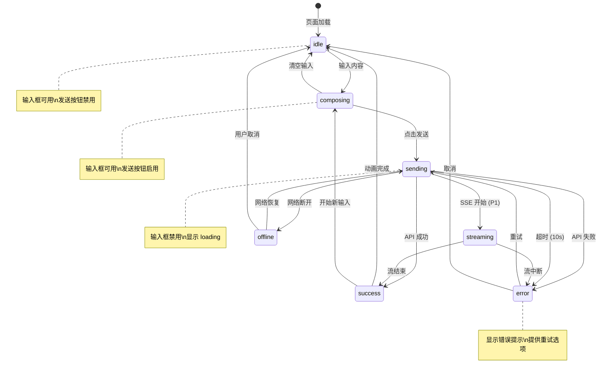

# 对话状态机

**版本**: v1.0
**更新日期**: 2026-01-21
**关联需求**: FR-002 AI 情绪教练对话

---

## 概述

本文档定义 AI 对话功能的前端状态机，用于管理对话页面的 UI 状态和用户交互。

---

## 状态定义

### ChatState 类型

```typescript
type ChatState =
  | 'idle'           // 空闲，等待用户输入
  | 'composing'      // 用户正在输入
  | 'sending'        // 消息发送中
  | 'streaming'      // AI 响应流式返回中（P1）
  | 'success'        // 响应成功，显示完成
  | 'error'          // 发生错误
  | 'offline';       // 离线模式
```

### 状态详情

| 状态 | 描述 | 入口条件 | 出口条件 |
|------|------|---------|---------|
| `idle` | 等待用户输入 | 初始状态 / 响应完成 | 用户开始输入 |
| `composing` | 用户正在编辑 | 输入框获得焦点且有内容 | 点击发送 / 清空输入 |
| `sending` | API 请求中 | 点击发送按钮 | API 响应 / 超时 / 错误 |
| `streaming` | 流式响应中 | SSE 连接建立（P1） | 流结束 / 错误 |
| `success` | 显示 AI 回复 | API 返回成功 | 用户开始新输入 |
| `error` | 显示错误状态 | API 返回错误 / 超时 | 重试 / 取消 |
| `offline` | 离线排队 | 网络断开 | 网络恢复 |

---

## 状态转换图



---

## UI 状态映射

### 组件状态

| 状态 | 输入框 | 发送按钮 | 消息列表 | Toast |
|------|--------|---------|---------|-------|
| `idle` | enabled, empty | disabled | 显示历史 | - |
| `composing` | enabled, has text | enabled | 显示历史 | - |
| `sending` | disabled | loading spinner | + 用户消息 + 骨架屏 | - |
| `streaming` | disabled | loading spinner | + 逐字显示 AI 回复 | - |
| `success` | enabled | disabled | + 完整 AI 回复 | 可选成功提示 |
| `error` | enabled | "重试" 文本 | 错误消息标红 | 错误提示 |
| `offline` | enabled | "排队中" | 用户消息标记待发送 | 离线提示 |

### 动画效果

| 状态转换 | 动画 |
|---------|------|
| idle → composing | 发送按钮淡入高亮 |
| composing → sending | 输入框收缩，消息飞入列表 |
| sending → success | 骨架屏渐变为实际内容 |
| streaming | 光标闪烁 + 逐字出现 |
| → error | 红色闪烁 + 震动 |

---

## 状态机实现

### React Context 定义

```typescript
interface ChatContext {
  state: ChatState;
  messages: ChatMessage[];
  currentSession: string | null;
  error: Error | null;

  // Actions
  send: (message: string) => Promise<void>;
  retry: () => Promise<void>;
  cancel: () => void;
  clear: () => void;
}
```

### 状态管理 (useReducer)

```typescript
type ChatAction =
  | { type: 'START_COMPOSING' }
  | { type: 'STOP_COMPOSING' }
  | { type: 'SEND_MESSAGE'; payload: string }
  | { type: 'RECEIVE_RESPONSE'; payload: ChatResponse }
  | { type: 'RECEIVE_ERROR'; payload: Error }
  | { type: 'RETRY' }
  | { type: 'CANCEL' }
  | { type: 'GO_OFFLINE' }
  | { type: 'GO_ONLINE' };

function chatReducer(state: ChatState, action: ChatAction): ChatState {
  switch (action.type) {
    case 'START_COMPOSING':
      return state === 'idle' ? 'composing' : state;

    case 'STOP_COMPOSING':
      return state === 'composing' ? 'idle' : state;

    case 'SEND_MESSAGE':
      return state === 'composing' ? 'sending' : state;

    case 'RECEIVE_RESPONSE':
      return state === 'sending' || state === 'streaming' ? 'success' : state;

    case 'RECEIVE_ERROR':
      return state === 'sending' || state === 'streaming' ? 'error' : state;

    case 'RETRY':
      return state === 'error' ? 'sending' : state;

    case 'CANCEL':
      return state === 'error' || state === 'offline' ? 'idle' : state;

    case 'GO_OFFLINE':
      return state === 'sending' ? 'offline' : state;

    case 'GO_ONLINE':
      return state === 'offline' ? 'sending' : state;

    default:
      return state;
  }
}
```

---

## 情绪状态追踪

### 会话情绪轨迹

```typescript
interface EmotionTracker {
  trajectory: Emotion[];      // 情绪变化序列
  dominantEmotion: Emotion;   // 主导情绪
  trend: 'improving' | 'stable' | 'declining';

  // 计算方法
  addEmotion(emotion: Emotion): void;
  getTrend(): string;
  shouldTriggerCircuitBreaker(): boolean;  // 连续 5 轮负面
}
```

### 情绪熔断条件 (P2)

```typescript
const NEGATIVE_EMOTIONS: Emotion[] = ['panic', 'angry'];
const CIRCUIT_BREAKER_THRESHOLD = 5;

function shouldTriggerCircuitBreaker(trajectory: Emotion[]): boolean {
  if (trajectory.length < CIRCUIT_BREAKER_THRESHOLD) return false;

  const recent = trajectory.slice(-CIRCUIT_BREAKER_THRESHOLD);
  return recent.every(e => NEGATIVE_EMOTIONS.includes(e));
}
```

---

## 离线队列管理

### 队列数据结构

```typescript
interface OfflineQueue {
  messages: QueuedMessage[];

  enqueue(message: string): void;
  dequeue(): QueuedMessage | null;
  flush(): Promise<void>;  // 网络恢复时批量发送
}

interface QueuedMessage {
  id: string;
  content: string;
  timestamp: number;
  retryCount: number;
}
```

### IndexedDB Schema

```typescript
// 离线消息存储
const offlineStore = {
  name: 'pending-messages',
  keyPath: 'id',
  indexes: [
    { name: 'timestamp', keyPath: 'timestamp' }
  ]
};
```

---

## 超时处理

| 阶段 | 超时时间 | 处理 |
|------|---------|------|
| API 请求 | 10 秒 | 转入 error 状态，允许重试 |
| 流式响应首字节 | 5 秒 | 显示"AI 正在思考" |
| 流式响应总时长 | 30 秒 | 强制结束，显示已接收内容 |
| 重试间隔 | 2^n 秒 | 指数退避，最大 32 秒 |
| 最大重试次数 | 3 次 | 超过后需用户手动重试 |

---

## 测试用例

### 状态转换测试

| 测试场景 | 初始状态 | 动作 | 预期结果 |
|---------|---------|------|---------|
| 开始输入 | idle | 输入文字 | composing |
| 清空输入 | composing | 清空 | idle |
| 发送消息 | composing | 点击发送 | sending |
| 响应成功 | sending | API 返回 200 | success |
| 响应失败 | sending | API 返回 500 | error |
| 请求超时 | sending | 10 秒无响应 | error |
| 重试请求 | error | 点击重试 | sending |
| 网络断开 | sending | 断网事件 | offline |
| 网络恢复 | offline | 联网事件 | sending |

---

**最后更新**: 2026-01-21
