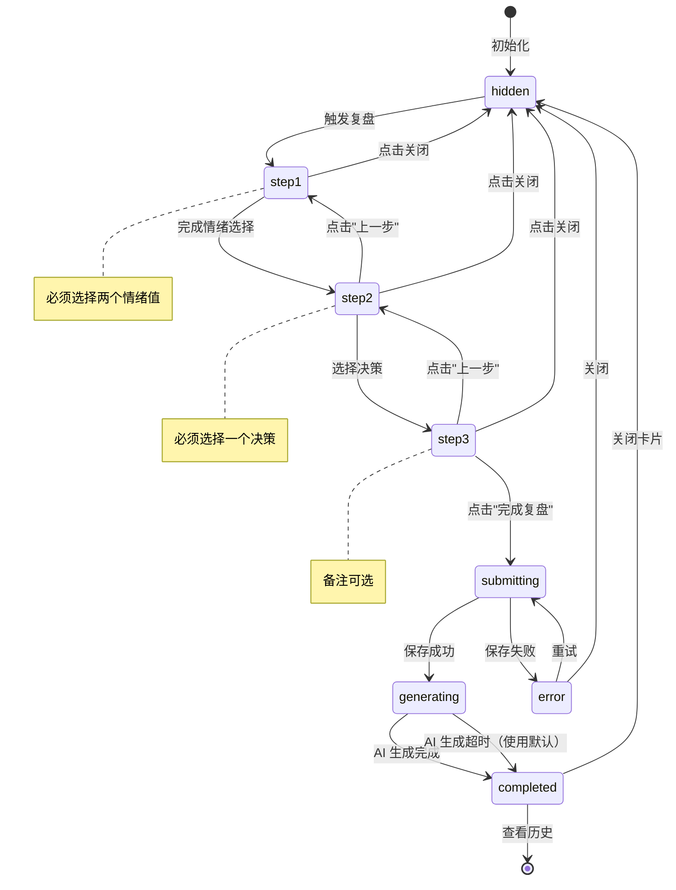

# 复盘状态机

**版本**: v1.0
**更新日期**: 2026-01-21
**关联需求**: FR-003 投资心理复盘

---

## 概述

本文档定义投资心理复盘功能的前端状态机，用于管理 3 步复盘流程的 UI 状态。

---

## 状态定义

### ReviewState 类型

```typescript
type ReviewState =
  | 'hidden'         // 复盘卡片隐藏
  | 'step1'          // Step 1: 情绪选择
  | 'step2'          // Step 2: 决策选择
  | 'step3'          // Step 3: 文字备注
  | 'submitting'     // 提交中
  | 'generating'     // AI 总结生成中
  | 'completed'      // 复盘完成，显示总结
  | 'error';         // 发生错误
```

### 状态详情

| 状态 | 描述 | 入口条件 | 出口条件 |
|------|------|---------|---------|
| `hidden` | 卡片不可见 | 初始状态 / 关闭卡片 | 触发复盘 |
| `step1` | 情绪滑动条 | 打开复盘卡片 | 完成情绪选择 |
| `step2` | 决策选择 | Step 1 完成 | 选择决策 |
| `step3` | 文字备注 | Step 2 完成 | 点击"完成" |
| `submitting` | API 请求中 | 点击"完成复盘" | API 响应 |
| `generating` | AI 生成中 | 保存成功 | AI 响应 |
| `completed` | 显示总结 | AI 生成完成 | 关闭 / 查看历史 |
| `error` | 显示错误 | API 失败 | 重试 / 关闭 |

---

## 状态转换图



---

## 数据流

### ReviewContext 定义

```typescript
interface ReviewContext {
  // 状态
  state: ReviewState;
  currentStep: 1 | 2 | 3;

  // 表单数据
  formData: {
    emotionBefore: number | null;  // 1-5
    emotionAfter: number | null;   // 1-5
    actionTaken: ReviewAction | null;
    reflection: string;
  };

  // 关联数据
  conversationId: string | null;
  tags: string[];

  // 结果
  result: {
    id: string;
    aiSummary: string;
  } | null;

  // 错误
  error: Error | null;

  // Actions
  open: (conversationId?: string) => void;
  close: () => void;
  nextStep: () => void;
  prevStep: () => void;
  setEmotion: (type: 'before' | 'after', value: number) => void;
  setAction: (action: ReviewAction) => void;
  setReflection: (text: string) => void;
  submit: () => Promise<void>;
  retry: () => void;
}

type ReviewAction = 'lock' | 'add' | 'reduce' | 'clear';
```

### useReducer 实现

```typescript
type ReviewFormAction =
  | { type: 'OPEN'; conversationId?: string }
  | { type: 'CLOSE' }
  | { type: 'NEXT_STEP' }
  | { type: 'PREV_STEP' }
  | { type: 'SET_EMOTION_BEFORE'; value: number }
  | { type: 'SET_EMOTION_AFTER'; value: number }
  | { type: 'SET_ACTION'; value: ReviewAction }
  | { type: 'SET_REFLECTION'; value: string }
  | { type: 'SUBMIT_START' }
  | { type: 'SUBMIT_SUCCESS'; result: { id: string; aiSummary: string } }
  | { type: 'SUBMIT_ERROR'; error: Error }
  | { type: 'RETRY' };

function reviewReducer(state: ReviewState, action: ReviewFormAction): ReviewState {
  switch (action.type) {
    case 'OPEN':
      return 'step1';

    case 'CLOSE':
      return 'hidden';

    case 'NEXT_STEP':
      if (state === 'step1') return 'step2';
      if (state === 'step2') return 'step3';
      return state;

    case 'PREV_STEP':
      if (state === 'step2') return 'step1';
      if (state === 'step3') return 'step2';
      return state;

    case 'SUBMIT_START':
      return state === 'step3' ? 'submitting' : state;

    case 'SUBMIT_SUCCESS':
      return 'generating';  // 然后自动转到 completed

    case 'SUBMIT_ERROR':
      return 'error';

    case 'RETRY':
      return state === 'error' ? 'submitting' : state;

    default:
      return state;
  }
}
```

---

## UI 状态映射

### 卡片显示

| 状态 | 可见性 | 标题 | 操作按钮 |
|------|--------|------|---------|
| `hidden` | 不可见 | - | - |
| `step1` | 可见 | "Step 1/3 情绪变化" | 关闭, 下一步 |
| `step2` | 可见 | "Step 2/3 你的决策" | 上一步, 下一步 |
| `step3` | 可见 | "Step 3/3 记录想法" | 上一步, 完成复盘 |
| `submitting` | 可见 | "保存中..." | 禁用所有按钮 |
| `generating` | 可见 | "AI 正在分析..." | 禁用所有按钮 |
| `completed` | 可见 | "复盘完成" | 关闭, 查看历史 |
| `error` | 可见 | "保存失败" | 重试, 关闭 |

### 进度指示器

```
Step 1        Step 2        Step 3
  ●─────────────○─────────────○    (step1)
  ✓─────────────●─────────────○    (step2)
  ✓─────────────✓─────────────●    (step3)
  ✓─────────────✓─────────────✓    (completed)
```

---

## 表单验证

### Step 1 验证

```typescript
function canProceedToStep2(formData: ReviewFormData): boolean {
  return (
    formData.emotionBefore !== null &&
    formData.emotionBefore >= 1 &&
    formData.emotionBefore <= 5 &&
    formData.emotionAfter !== null &&
    formData.emotionAfter >= 1 &&
    formData.emotionAfter <= 5
  );
}
```

### Step 2 验证

```typescript
function canProceedToStep3(formData: ReviewFormData): boolean {
  return (
    canProceedToStep2(formData) &&
    formData.actionTaken !== null &&
    ['lock', 'add', 'reduce', 'clear'].includes(formData.actionTaken)
  );
}
```

### Step 3 验证

```typescript
function canSubmit(formData: ReviewFormData): boolean {
  return (
    canProceedToStep3(formData) &&
    formData.reflection.length <= 200
  );
}
```

---

## 动画效果

| 状态转换 | 动画 |
|---------|------|
| hidden → step1 | 卡片从底部滑入 |
| step1 → step2 | 内容左滑切换 |
| step2 → step3 | 内容左滑切换 |
| step3 → submitting | 按钮变为 spinner |
| submitting → generating | 显示 AI 思考动画 |
| generating → completed | 总结文字淡入 |
| completed → hidden | 卡片向下滑出 |
| → error | 红色闪烁 + 震动 |

---

## 草稿保存

### 自动保存策略

```typescript
// 每次表单变更时保存草稿
useEffect(() => {
  if (state !== 'hidden' && state !== 'completed') {
    storage.saveReviewDraft({
      emotionBefore: formData.emotionBefore,
      emotionAfter: formData.emotionAfter,
      actionTaken: formData.actionTaken,
      reflection: formData.reflection,
      conversationId,
      savedAt: Date.now()
    });
  }
}, [formData, state]);

// 完成后清除草稿
useEffect(() => {
  if (state === 'completed') {
    storage.clearReviewDraft();
  }
}, [state]);
```

### 草稿恢复

```typescript
// 打开卡片时检查草稿
function open(conversationId?: string) {
  const draft = storage.getReviewDraft();

  if (draft && Date.now() - draft.savedAt < 24 * 60 * 60 * 1000) {
    // 24 小时内的草稿，询问是否恢复
    if (confirm('检测到未完成的复盘，是否继续？')) {
      setFormData(draft);
      // 根据草稿数据决定从哪一步开始
      if (draft.actionTaken) setState('step3');
      else if (draft.emotionAfter) setState('step2');
      else setState('step1');
      return;
    }
  }

  // 新建复盘
  resetFormData();
  setState('step1');
}
```

---

## 测试用例

| 测试场景 | 初始状态 | 动作 | 预期结果 |
|---------|---------|------|---------|
| 打开卡片 | hidden | trigger | step1 |
| 完成 Step 1 | step1 | 选择两个情绪值 + 下一步 | step2 |
| 返回 Step 1 | step2 | 上一步 | step1 |
| 跳过验证 | step1 | 未选情绪 + 下一步 | 停留 step1 + 提示 |
| 提交成功 | step3 | 完成复盘 | submitting → completed |
| 提交失败 | submitting | API 500 | error |
| 重试 | error | 重试 | submitting |
| 关闭卡片 | 任意 | 关闭 | hidden |
| 草稿恢复 | hidden | 打开 (有草稿) | 恢复到对应 step |

---

**最后更新**: 2026-01-21
