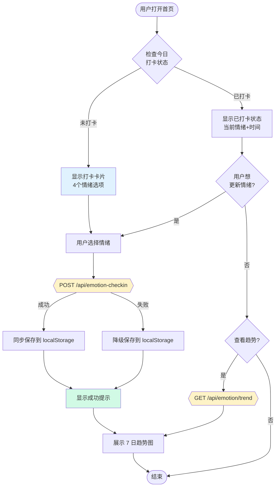

# 每日情绪打卡用户流程

**版本**: v1.0
**更新日期**: 2026-01-21
**关联需求**: FR-004 每日情绪打卡

---

## 概述

本文档描述用户进行每日情绪打卡的完整流程，包括首次打卡、重复打卡、查看趋势等场景。

---

## 流程图

### 主流程



---

## 场景说明

### 场景 1: 首次打卡

**前置条件**: 用户当天未打卡

**流程**:
1. 用户进入首页
2. 系统显示情绪打卡卡片，4 个选项可选
3. 用户点击一个情绪 Emoji
4. 系统调用 API 保存记录
5. 显示"打卡成功"提示
6. 自动展开 7 日趋势图

**UI 状态**:
```
┌─────────────────────────────────┐
│  今日心情                        │
│  选择你现在的情绪状态              │
├─────────────────────────────────┤
│   😰       🤑       😡       🙂  │
│  焦虑     贪婪      愤怒     平静  │
└─────────────────────────────────┘
```

### 场景 2: 重复打卡（更新情绪）

**前置条件**: 用户当天已打卡

**流程**:
1. 用户进入首页
2. 系统显示已打卡状态（当前情绪 + 打卡时间）
3. 用户点击其他情绪 Emoji
4. 系统调用 API 更新记录
5. 显示"情绪已更新"提示

**UI 状态**:
```
┌─────────────────────────────────┐
│  今日心情                  已打卡 │
│  点击可更新今日情绪              │
├─────────────────────────────────┤
│   😰       🤑       😡      [🙂] │
│  焦虑     贪婪      愤怒    ✓平静 │
├─────────────────────────────────┤
│  上次打卡时间：14:32             │
└─────────────────────────────────┘
```

### 场景 3: 查看情绪趋势

**前置条件**: 无

**流程**:
1. 用户点击"查看 7 日情绪趋势"按钮
2. 系统调用 API 获取趋势数据
3. 展示折线图 + 趋势摘要

**UI 状态**:
```
┌─────────────────────────────────┐
│  情绪趋势                        │
│  最近 7 天，已打卡 5 天    情绪好转│
├─────────────────────────────────┤
│     ●                           │
│        ●      ●                 │
│  ●              ●   ●           │
│  周一 周二 周三 周四 周五 周六 今天│
│   😰   😡   🙂   ❓   🙂   🤑   🙂│
├─────────────────────────────────┤
│  😱 负面  ═══════════════  🙂 正面│
└─────────────────────────────────┘
```

### 场景 4: 离线/降级模式

**前置条件**: Supabase 不可用

**流程**:
1. 用户选择情绪
2. API 调用失败
3. 数据保存到 localStorage
4. 显示"打卡成功（离线模式）"提示
5. 趋势图使用本地数据渲染

---

## 交互细节

### 情绪选择

| 操作 | 响应 |
|------|------|
| 点击情绪 | 该情绪高亮，显示 ✓，其他变暗 |
| 选中状态 | 边框变色 + 缩放动画 |
| Loading | 所有按钮禁用，显示加载状态 |

### 趋势图

| 操作 | 响应 |
|------|------|
| 点击数据点 | 显示该天详情（日期 + 情绪） |
| 滑动 | 无（固定 7 天范围） |

### Toast 提示

| 场景 | 消息 | 图标 |
|------|------|------|
| 首次打卡成功 | "打卡成功！" | 所选情绪 Emoji |
| 更新打卡成功 | "情绪已更新" | 所选情绪 Emoji |
| 离线模式 | "打卡成功！（离线模式）" | 所选情绪 Emoji |

---

## 边界条件

| 条件 | 处理方式 |
|------|---------|
| 凌晨 0 点前后打卡 | 按中国时区 UTC+8 判断日期 |
| 无网络 | 降级到 localStorage |
| 首次使用（无历史数据） | 趋势图显示"未打卡"占位 |
| 连续 7 天未打卡 | 趋势图全部显示 ❓ |

---

## AC 验收对照

| AC | 描述 | 流程覆盖 |
|----|------|---------|
| AC-004.1 | 首页顶部显示情绪打卡入口 | 场景 1, 2 |
| AC-004.2 | 4 个 Emoji 单选 | 场景 1, 2 |
| AC-004.3 | 当天可重复打卡，次日锁定 | 场景 2 |
| AC-004.4 | 7 日情绪趋势折线图 | 场景 3 |
| AC-004.5 | 颜色渐变表示情绪变化 | 场景 3 |
| AC-004.6 | 数据持久化 | 场景 1, 2, 4 |

---

**最后更新**: 2026-01-21
