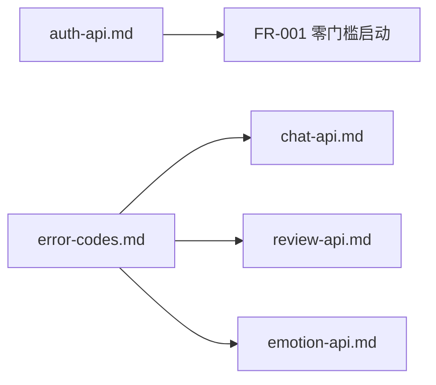

# 变更提案：全局 API 规范补充

**提案ID**: CHANGE-005
**提案人**: Claude Code + 何佳瑶
**提案日期**: 2026-01-21
**状态**: 🟡 待评审 (Pending Review)

---

## 变更概述

补充全局 API 规范文档，包括认证 API 契约和统一错误码定义。这些是所有 API 的基础规范，为 CHANGE-002/003/004 提供支撑。

---

## 为什么要做这个变更？

### 背景

1. **基础设施规范缺失**：认证流程和错误码是所有 API 的基础
2. **跨模块一致性**：统一错误码确保前后端错误处理一致
3. **完善 api-contracts 目录**：补充 README 和全局规范

### 依赖关系

---

## 本次变更需补充的 Spec 文档

| 目标路径 | 来源 | 说明 |
|---------|------|------|
| `specs/api-contracts/README.md` | 本目录 `specs/README.md` | API 规范总览 |
| `specs/api-contracts/auth-api.md` | 本目录 `specs/auth-api.md` | 认证 API 契约 |
| `specs/api-contracts/error-codes.md` | 本目录 `specs/error-codes.md` | 统一错误码定义 |

---

## 影响范围

### 现有代码对照

| 规范内容 | 现有实现 | 状态 |
|---------|---------|------|
| Guest 创建 API | `app/api/auth/guest/route.ts`（待创建） | ⬜ 未实现 |
| 用户档案 API | 通过 localStorage | ⚠️ 需升级到 Supabase |
| 错误码规范 | 各 API 自定义 | ⚠️ 需统一 |

### 需要修改的代码（可选）

| 文件 | 修改内容 |
|------|---------|
| 所有 API routes | 统一错误响应格式 |
| `lib/supabase.ts` | 添加统一错误处理 |

---

## 评审检查清单

请评审人检查以下项目：

- [ ] auth-api.md 是否覆盖 Guest 创建和用户档案操作？
- [ ] error-codes.md 是否覆盖所有已定义的 API 错误？
- [ ] 错误码命名是否一致且易理解？

---

## 下一步

1. **待评审通过** → 合并 specs 到主目录
2. **代码实现**（可选）→ 统一现有 API 错误处理
3. **归档** → 移动到 `archive/`

---

**最后更新**: 2026-01-21
