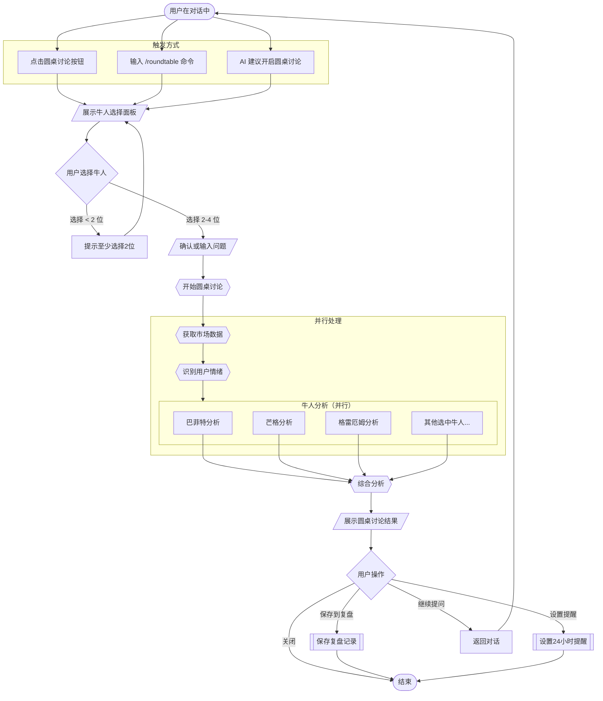
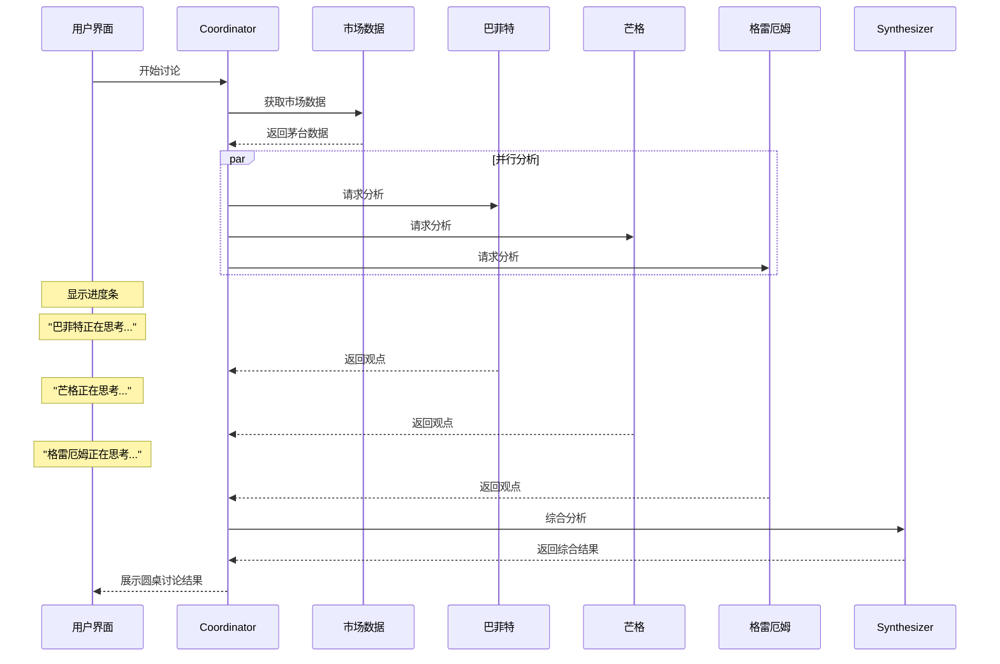
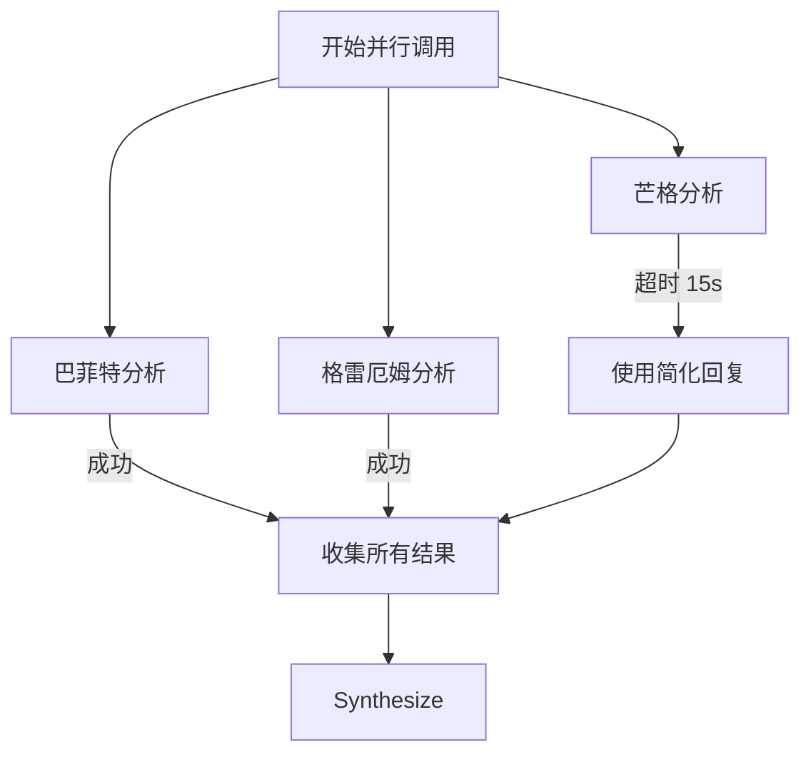
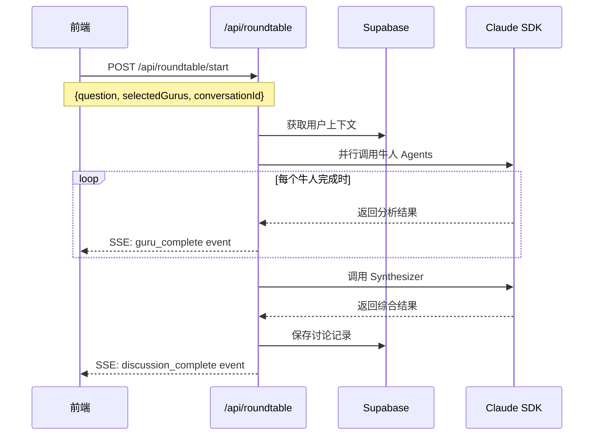

# 投资牛人圆桌讨论流程

**版本**: v1.0
**更新日期**: 2026-01-21
**关联需求**: FR-RT-001, FR-RT-002, FR-RT-003
**关联规格**: [ai-system/guru-roundtable.md](../ai-system/guru-roundtable.md)

---

## 流程概述

用户可以在对话过程中触发圆桌讨论模式，选择 2-4 位投资大师同时参与讨论，获取多视角的思考框架和错误警示。

### 核心价值

- **多视角分析**：不同投资哲学的碰撞
- **错误警示**：指出容易犯的错误，而非给买卖建议
- **思考框架**：提供问题而非答案
- **情绪觉察**：识别并回应用户情绪

---

## 主流程图



---

## 详细步骤说明

### Step 1: 触发圆桌讨论

**触发方式**：

| 方式 | 描述 | 用户操作 |
|------|------|---------|
| 按钮触发 | 对话页面的圆桌讨论按钮 | 点击按钮 |
| 命令触发 | 输入快捷命令 | 输入 `/roundtable` 或 `/圆桌` |
| AI 建议 | 复杂问题时 AI 主动建议 | 点击建议卡片 |

**UI 示例**：

```
┌─────────────────────────────────────────────┐
│  💬 这是一个值得深入思考的问题。              │
│                                             │
│  你想听听多位投资大师的看法吗？              │
│                                             │
│  [ 开启圆桌讨论 ]  [ 继续单独对话 ]          │
└─────────────────────────────────────────────┘
```

---

### Step 2: 选择投资牛人

**选择面板 UI**：

```
┌─────────────────────────────────────────────────┐
│  选择参与讨论的投资大师（2-4位）                  │
├─────────────────────────────────────────────────┤
│                                                 │
│  ┌───────────────┐  ┌───────────────┐          │
│  │  🧓 巴菲特    │  │  👴 格雷厄姆   │          │
│  │     ☑️        │  │      ☑️       │          │
│  │   价值投资    │  │   安全边际    │          │
│  │  "别人贪婪时  │  │  "市场短期是  │          │
│  │   恐惧"      │  │   投票机"     │          │
│  └───────────────┘  └───────────────┘          │
│                                                 │
│  ┌───────────────┐  ┌───────────────┐          │
│  │  🤔 芒格      │  │  📈 达里奥    │          │
│  │     ☑️        │  │      ☐       │          │
│  │   理性思维    │  │   宏观周期    │          │
│  │  "反过来想,   │  │  "痛苦+反思  │          │
│  │   总是反过来" │  │   =进步"     │          │
│  └───────────────┘  └───────────────┘          │
│                                                 │
│  ┌───────────────┐  ┌───────────────┐          │
│  │  🔍 林奇      │  │  🌊 索罗斯    │          │
│  │     ☐        │  │      ☐       │          │
│  │   成长投资    │  │   趋势反转    │          │
│  │  "投资你了解  │  │  "市场永远是  │          │
│  │   的东西"    │  │   错的"      │          │
│  └───────────────┘  └───────────────┘          │
│                                                 │
│  已选择: 巴菲特、格雷厄姆、芒格 (3/4)            │
│                                                 │
│              [ 开始圆桌讨论 ]                    │
└─────────────────────────────────────────────────┘
```

**验证规则**：
- 最少选择 2 位
- 最多选择 4 位
- 少于 2 位时，按钮禁用并提示

---

### Step 3: 确认问题

**场景 A**：从对话中触发

```
┌─────────────────────────────────────────────────┐
│  确认你的问题                                    │
├─────────────────────────────────────────────────┤
│                                                 │
│  你之前问的是：                                  │
│  "茅台跌了10%，我很慌，要不要卖？"               │
│                                                 │
│  [ 用这个问题 ]  [ 修改问题 ]                    │
└─────────────────────────────────────────────────┘
```

**场景 B**：直接触发

```
┌─────────────────────────────────────────────────┐
│  输入你想讨论的问题                              │
├─────────────────────────────────────────────────┤
│                                                 │
│  ┌───────────────────────────────────────┐      │
│  │ 请输入你想和投资大师讨论的问题...       │      │
│  └───────────────────────────────────────┘      │
│                                                 │
│              [ 开始圆桌讨论 ]                    │
└─────────────────────────────────────────────────┘
```

---

### Step 4: 讨论进行中

**加载状态展示**：



**UI 加载状态**：

```
┌─────────────────────────────────────────────────┐
│  🎯 投资牛人圆桌讨论                             │
├─────────────────────────────────────────────────┤
│                                                 │
│  正在邀请大师们参与讨论...                       │
│                                                 │
│  🧓 巴菲特    ✅ 已完成                         │
│  👴 格雷厄姆  ⏳ 正在思考...                     │
│  🤔 芒格      ⏳ 等待中                         │
│                                                 │
│  ━━━━━━━━━━━━━━━━━━━━━━━━ 45%                   │
│                                                 │
└─────────────────────────────────────────────────┘
```

---

### Step 5: 展示讨论结果

**结果页面结构**：

```
┌─────────────────────────────────────────────────┐
│  🎯 投资牛人圆桌讨论                             │
├─────────────────────────────────────────────────┤
│                                                 │
│  📝 你的问题                                    │
│  茅台跌了10%，我很慌，要不要卖？                 │
│                                                 │
├─────────────────────────────────────────────────┤
│  📊 市场背景                                    │
│  • 茅台今日: -3.2% | 周跌幅: -10.5%             │
│  • 白酒板块: -8.3%                              │
│  • 市场情绪: 恐慌偏高                           │
│                                                 │
├─────────────────────────────────────────────────┤
│                                                 │
│  [ 🧓 巴菲特 ] [ 👴 格雷厄姆 ] [ 🤔 芒格 ]       │
│       ↑ 当前选中                                │
│                                                 │
│  ─────────────────────────────────────────────  │
│                                                 │
│  🧓 巴菲特的视角                                │
│                                                 │
│  💡 情境解读                                    │
│  "价格波动是市场先生的情绪，不是公司价值的      │
│   变化。一周跌10%只是报价变了，茅台的酿酒       │
│   能力并没有变。"                               │
│                                                 │
│  ⚠️ 容易犯的错误                                │
│  ┌─────────────────────────────────────────┐   │
│  │ 错误：因为账面亏损而恐慌卖出             │   │
│  │ 原因：人天生厌恶损失，账面亏损会触发     │   │
│  │       "止损"的本能                       │   │
│  │ 避免：问自己"如果今天没买过，以这个     │   │
│  │       价格我愿意买吗？"                   │   │
│  └─────────────────────────────────────────┘   │
│                                                 │
│  💭 思考问题                                    │
│  1. 茅台的护城河有变化吗？                      │
│  2. 我当初买入的理由还成立吗？                  │
│  3. 我的投资期限是多久？                        │
│                                                 │
├─────────────────────────────────────────────────┤
│                                                 │
│  📋 圆桌共识                                    │
│  ✅ 价格波动不等于价值变化                      │
│  ✅ 恐慌情绪下不宜做重大决定                    │
│  ✅ 需要有预设的决策框架                        │
│                                                 │
│  📊 观点分歧                                    │
│  • 格雷厄姆更关注仓位风险                       │
│  • 芒格更强调思维方式                           │
│  • 巴菲特更关注企业本身                         │
│                                                 │
├─────────────────────────────────────────────────┤
│                                                 │
│  🎯 你可能需要问自己的问题                      │
│                                                 │
│  1. 我买茅台的理由是什么？这个理由还成立吗？    │
│  2. 如果继续跌20%，我的生活会受影响吗？         │
│  3. 我需要的是"卖出"还是"冷静"？              │
│                                                 │
├─────────────────────────────────────────────────┤
│                                                 │
│  ⏰ 建议                                        │
│  在做任何决定之前，先冷静24小时。               │
│  明天同一时间，我们可以再聊聊你的想法。         │
│                                                 │
├─────────────────────────────────────────────────┤
│                                                 │
│  [ 📝 保存到复盘 ] [ ⏰ 24小时后提醒 ] [ 💬 继续 ]│
│                                                 │
├─────────────────────────────────────────────────┤
│  ⚠️ 免责声明：以上内容仅为教育性讨论，不构成    │
│  任何投资建议。投资有风险，决策需谨慎。         │
└─────────────────────────────────────────────────┘
```

---

### Step 6: 用户后续操作

**操作选项**：

| 操作 | 描述 | 后续流程 |
|------|------|---------|
| 保存到复盘 | 将讨论结果保存为复盘记录 | 跳转复盘页面，预填信息 |
| 设置提醒 | 24小时后收到推送提醒 | 保存提醒，显示确认 |
| 继续提问 | 返回对话，可追问细节 | 返回对话页面 |
| 关闭 | 结束本次圆桌讨论 | 返回首页或对话列表 |

---

## 错误处理

### 网络错误

```
┌─────────────────────────────────────────────────┐
│  ⚠️ 网络连接异常                                │
│                                                 │
│  部分大师暂时无法参与讨论，已为你展示已完成的   │
│  分析结果。                                     │
│                                                 │
│  [ 重试 ]  [ 查看部分结果 ]                      │
└─────────────────────────────────────────────────┘
```

### 单个牛人超时



**降级策略**：
- 单个牛人超时 15 秒后，使用预设的简化回复
- 不阻塞其他牛人的分析
- 在结果页面标注"简化版回复"

---

## API 调用时序



---

## 状态管理

```typescript
interface RoundtableState {
  // 流程状态
  status: 'idle' | 'selecting' | 'processing' | 'complete' | 'error';

  // 用户选择
  selectedGurus: string[];
  question: string;

  // 进度追踪
  progress: {
    total: number;
    completed: number;
    currentGuru: string | null;
  };

  // 结果
  result: RoundtableResult | null;

  // 错误
  error: string | null;
}
```

---

## 相关文档

- [AI 系统规格 - 圆桌讨论](../ai-system/guru-roundtable.md)
- [数据库设计 - roundtable_discussions 表](../database/spec.md)
- [对话流程](./chat-flow.md)
- [复盘流程](./review-flow.md)

---

**最后更新**: 2026-01-21
**维护者**: 何佳瑶
