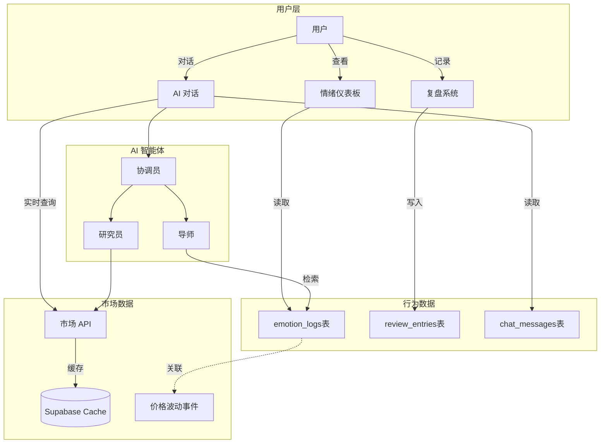

# MVP 功能优先级与渐进式开发排期

**基于用户反馈**: "功能较散，需要聚焦"  
**核心原则**: 先做情绪陪伴价值闭环，再扩展专业分析能力

---

## MoSCoW 优先级重新定义

### Must Have - 核心闭环（Week 1-2）

这些功能构成最小可验证产品，缺一不可：

#### FR-001 (P0): 零门槛启动

**需求**: 游客模式 + 初心设定，15 秒内开始体验  
**验收标准**:

- 首次打开 APP，无需登录即可使用
- 完成 "为什么投资" 的初心选择（2-3 个预设选项）
- 生成唯一 Guest UUID 并存储

**理由**: 降低试用门槛，快速建立信任

---

#### FR-002 (P0): AI 情绪教练对话

**需求**: 用户可以与 1 位核心导师进行情绪陪伴对话  
**验收标准**:

- 支持文字输入（语音输入 P1）
- AI 能识别用户情绪（焦虑/恐慌/贪婪/愤怒/平静）
- AI 回复体现共情和温暖
- 对话历史保存（最近 15 天）

**MVP 简化**:

- 仅 1 位导师（如 "心理教练" Coach）
- 无需复杂的多智能体协作
- 单轮对话即可，无需策略锁定

**理由**: 这是产品核心价值的最小体现，社交媒体展示重点A

---

#### FR-003 (P0): 投资心理复盘

**需求**: 对话结束后，用户可以记录 3 步复盘  
**验收标准**:

- Step 1: 情绪变化滑动条（对话前 → 对话后，1-5 分）
- Step 2: 决策选择（锁仓/加仓/减仓/清仓）
- Step 3: 可选文字备注
- AI 生成复盘总结

**理由**: 完成从"情绪识别"到"反思成长"的闭环，社交媒体展示重点C

---

#### FR-004 (P0): 每日情绪打卡

**需求**: 用户每天可以记录当天情绪  
**验收标准**:

- Emoji 单选（😰焦虑 / 🤑贪婪 / 😡愤怒 / 🙂平静）
- 当天可修改，次日锁定
- 展示 7 日情绪趋势

**理由**: 养成习惯的关键，建立长期粘性

---

### Should Have - 增强体验（Week 3-4）

这些功能显著提升体验，但不阻碍核心价值验证：

#### FR-005 (P1): 多智能体协作分析

**需求**: 复杂问题时，协调员调度专业智能体  
**验收标准**:

- 协调员判断意图（简单 vs 复杂）
- 复杂问题: 研究员 → 分析师 → 导师串行工作
- 用户能看到各智能体的贡献

**Why P1**: 这是技术亮点，但 MVP 阶段单个导师已能提供基础价值

---

#### FR-006 (P1): 心理锚点（关注资产）

**需求**: 用户可以添加 1-3 个关注股票  
**验收标准**:

- 支持 A 股/美股/港股代码搜索
- 显示实时价格和涨跌幅
- 点击资产卡片可触发带上下文的对话

**Why P1**: 增强个性化，但不影响核心情绪陪伴功能

---

#### FR-007 (P1): 情绪筹码快捷入口

**需求**: 首页显示 4 个情绪筹码，点击即进入对话  
**验收标准**:

- 筹码: 😰我慌了 / 🤑怕踏空 / 😡气死了 / 😌想复盘
- 点击后 AI 自动镜像共情开场

**Why P1**: 降低对话门槛，但用户也可以通过主动输入触发

---

### Could Have - 锦上添花（Week 5-6）

这些功能很好，但可以后续迭代添加：

#### FR-008 (P2): 简化持仓管理

**需求**: 用户可以手动记录持仓  
**验收标准**:

- 手动输入: 股票代码 + 数量 + 成本价
- 显示实时盈亏
- 无需自动同步券商（P3）

**Why P2**: 辅助功能，不影响情绪陪伴核心

---

#### FR-009 (P2): 情绪熔断机制

**需求**: 连续 5 轮负面情绪时触发 30 秒冷静期  
**验收标准**:

- 检测连续负面情绪（panic/angry）
- 显示深呼吸动画 + 30 秒倒计时
- 可选: 用户输入冷静后的想法

**Why P2**: 高级保护机制，但单次对话已有情绪识别

---

### Won't Have - MVP 明确不做

#### ❌ 策略锁定（信念/纪律模式，3 小时冷却）

**原因**: 功能复杂，需要额外数据库表，MVP 阶段不必要

#### ❌ 多个导师切换

**原因**: MVP 阶段 1 个核心导师足够，避免用户困惑

#### ❌ 自然语言持仓命令

**原因**: 高级功能，手动输入已满足基本需求

#### ❌ 市场数据深度分析（K 线图、技术指标）

**原因**: 避免产品定位偏移，我们聚焦心理而非技术分析

---

## 数据交互方案设计

**用户关注**: "不知道用户如何与行为数据和市场行情数据交互"

### 数据分层架构



### 场景 1: 用户查看情绪趋势

**交互流程**:

1. 用户打开首页 → 显示 7 日情绪趋势图
2. 数据来源: `emotion_logs` 表（每日打卡记录）
3. 可视化: 折线图，颜色渐变（红 → 绿）

**数据结构**:

```sql
SELECT date, emotion, created_at
FROM emotion_logs
WHERE user_id = $1
ORDER BY created_at DESC
LIMIT 7;
```

---

### 场景 2: 用户与 AI 讨论持仓

**交互流程**:

1. 用户: "我的茅台亏了 10%，好焦虑"
2. 系统动作:
   - 协调员识别 symbol: 600519
   - 研究员调用 `Eastmoney API` 获取实时价格和公告
   - 导师结合用户 `portfolio_items` 表中的持仓数据（成本价、数量）
3. AI 回复: "你在 1800 元买入的茅台，现在 1620 元。基本面没有变化，这是正常波动..."

**市场数据流**:

```typescript
// 研究员智能体调用市场 API
const stockData = await fetchStockPrice('600519'); // Eastmoney API
const announcements = await fetchAnnouncements('600519');

// 缓存到 Supabase（5 分钟有效期）
await supabase.from('market_data_cache').upsert({
  symbol: '600519',
  price: stockData.price,
  change_percent: stockData.change,
  cached_at: new Date(),
});
```

---

### 场景 3: 用户完成复盘

**交互流程**:

1. 对话结束 → 弹出复盘引导
2. 用户填写:
   - 情绪变化: 2（焦虑） → 4（平静）
   - 决策: 锁仓
   - 备注: "决定长期持有，不看短期波动"
3. 系统写入 `review_entries` 表
4. AI 生成总结: "你从焦虑到平静，这是巨大的进步。你的决策更理性了。"

**数据关联**:

```sql
INSERT INTO review_entries (
  user_id,
  conversation_id,
  emotion_before,
  emotion_after,
  action_taken,
  reflection,
  ai_summary,
  created_at
) VALUES (...);
```

---

### 场景 4: 关联市场事件与情绪波动

**高级功能** (MVP 后)

**目标**: 帮助用户发现 "什么市场事件触发了我的情绪波动"

**实现逻辑**:

1. 后台定时任务: 每天分析用户情绪 + 当天市场波动
2. 算法:
   - 如果用户情绪 = "恐慌" AND 持仓股票当天跌幅 > 5%
   - 标记为"市场触发情绪"事件
3. 周报生成: "上周你有 3 次情绪波动，都与贵州茅台的价格下跌相关"

**数据查询**:

```sql
SELECT e.emotion, e.created_at, p.symbol, m.change_percent
FROM emotion_logs e
JOIN portfolio_items p ON e.user_id = p.user_id
JOIN market_data_cache m ON p.symbol = m.symbol
WHERE e.emotion IN ('panic', 'anxious')
  AND m.change_percent < -5
  AND DATE(e.created_at) = DATE(m.cached_at);
```

---

## 渐进式开发排期（4-5 周）

### Week 1: 核心基础设施

**目标**: 搭建技术底座，完成最小对话闭环

| 工作日 | 任务 | 交付物 |
|--------|------|--------|
| Day 1-2 | OpenSpec 框架建立 + 数据库 schema 设计 | `openspec/specs/`, Supabase migrations |
| Day 3-4 | AI 对话基础实现（单导师 + Claude SDK） | `/api/chat-claude` 可用 |
| Day 5 | 情绪识别 + 简单复盘表单 | 对话 → 复盘流程打通 |

**验收**: 用户可以与 AI 进行多轮对话，对话结束后记录复盘

---

### Week 2: 用户流程完善

**目标**: 完成从启动到复盘的完整用户旅程

| 工作日 | 任务 | 交付物 |
|--------|------|--------|
| Day 6-7 | 游客模式 + 初心设定 Onboarding | 首页引导流程 |
| Day 8-9 | 每日情绪打卡 + 7 日趋势展示 | 情绪仪表板 UI |
| Day 10 | PWA 配置 + 离线缓存策略 | 可安装到手机主屏幕 |

**验收**: 新用户从零到完成首次复盘的完整流程 < 5 分钟

---

### Week 3: 多智能体协作（技术亮点）

**目标**: 实现协调员 + 研究员 + 分析师的串行协作

| 工作日 | 任务 | 交付物 |
|--------|------|--------|
| Day 11-12 | 5 个 Agent 定义 + MCP Tools | `lib/claude-agents.ts` 完整实现 |
| Day 13-14 | 市场数据 API 集成（Eastmoney + Sina） | `/api/market/*` 路由 |
| Day 15 | 协调员意图判断 + 任务分发逻辑 | 复杂问题自动调度智能体 |

**验收**: 用户问 "贵州茅台怎么样？" → 研究员获取数据 → 分析师解读 → 导师给建议

---

### Week 4: 增强体验

**目标**: 添加心理锚点、情绪筹码等提升粘性的功能

| 工作日 | 任务 | 交付物 |
|--------|------|--------|
| Day 16-17 | 心理锚点：股票搜索 + 关注列表 | 首页显示关注资产 |
| Day 18-19 | 情绪筹码快捷入口 + 镜像共情 | 4 个情绪筹码UI |
| Day 20 | 简化持仓管理（手动输入） | 持仓页面 |

**验收**: 用户可以添加关注股票，通过情绪筹码快速进入对话

---

### Week 5: 社交媒体展示准备

**目标**: 打磨核心体验，准备 Demo 素材

| 工作日 | 任务 | 交付物 |
|--------|------|--------|
| Day 21-22 | UI 打磨 + 动画效果优化 | 流畅的用户体验 |
| Day 23 | 录制 Demo 视频（情绪教练对话） | 30 秒短视频 |
| Day 24 | 录制 Demo 视频（多智能体协作） | 60 秒长视频 |
| Day 25 | 文案 + 截图 + 落地页 | 社交媒体传播素材包 |

**Demo 重点**:

- **视频 A**: 用户焦虑 → AI 共情 → 复盘成长（展示情绪陪伴价值）
- **视频 B**: 复杂问题 → 多智能体协作 → 专业分析（展示技术亮点）

---

### Week 6: 内测与迭代（可选）

**目标**: 收集早期用户反馈

| 工作日 | 任务 | 交付物 |
|--------|------|--------|
| Day 26-27 | 邀请 20-50 位种子用户内测 | 用户反馈收集表 |
| Day 28-29 | Bug 修复 + 体验优化 | Bugfix 版本 |
| Day 30 | 准备公开发布 | 正式版 v1.0 |

---

## 总结：聚焦策略

### 从"功能较散"到"价值聚焦"

**之前的问题**:

- 策略锁定、情绪熔断、7 个导师、自然语言命令... 功能太多
- 每个功能都想做，导致 MVP 不明确

**现在的策略**:

1. **Week 1-2**: 只做最核心的对话 + 复盘闭环
2. **Week 3**: 加入技术亮点（多智能体）
3. **Week 4**: 补充粘性功能（心理锚点、情绪筹码）
4. **Week 5**: 准备展示，不添加新功能

### 关键取舍

| 功能 | 决策 | 理由 |
|------|------|------|
| 7 个导师 | → 1 个导师 (MVP) | 避免用户困惑，聚焦单一声音 |
| 策略锁定 | → Won't Have | 复杂度高，价值不明显 |
| 情绪熔断 | → Could Have (P2) | 单次对话已有情绪识别 |
| 多智能体 | → Should Have (P1) | 技术亮点，Week 3 加入 |
| 持仓管理 | → Could Have (P2) | 辅助功能，手动输入即可 |

**核心**: 把情绪陪伴对话 + 心理复盘做到极致，其他都是锦上添花。
